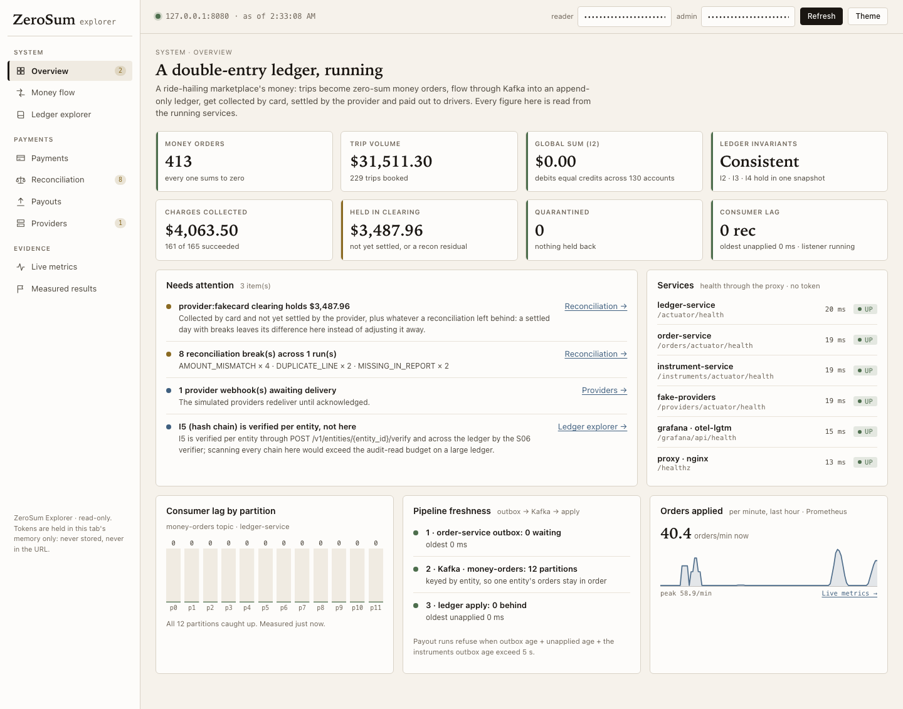
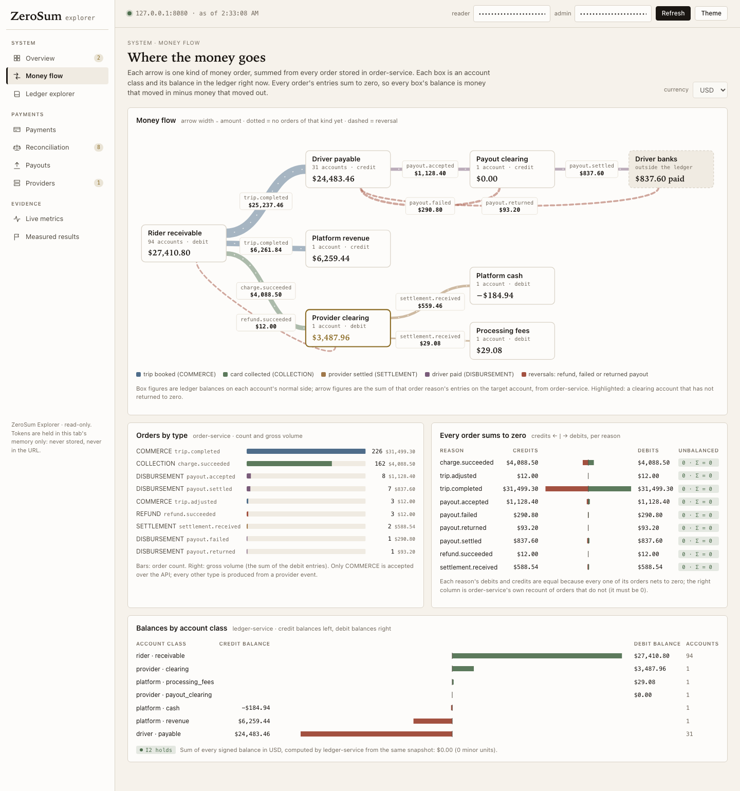

# ZeroSum Ledger

A zero-sum, immutable payments ledger modeled on the principles Uber published for its payments platform: immutable
money orders whose entries sum to zero per currency, a ledger with a per-entity changelog, a transactional outbox and
Kafka between services, and a pluggable payment-instrument interface exercised by two deliberately mismatched fake
providers.

It is a learning and portfolio project. No real money, cards or bank accounts are involved.

## Headline results

Measured, not estimated. Each figure links to a report with its raw data, UTC windows, seeds, git SHA and hardware.
Performance figures come from **an Apple M4 laptop through Docker Desktop, durability on (`fsync` intact), with
nothing else running on the VM** (a first pass under concurrent chaos load gave figures within a few percent,
recorded in [perf-summary.md](docs/results/perf/perf-summary.md)).

| What | Result | Evidence |
|---|---|---|
| API acknowledgement, `POST /v1/money-orders` (k6, constant arrival rate) | **p50 0.94 ms · p95 1.63 ms · p99 2.70 ms at 200 req/s** (gate: p95 ≤ 30 ms); clean to 1,000 req/s (p99 13 ms); 678,829 requests up to 2,000 req/s, every one 201 | [p1-api-ack.md](docs/results/perf/p1-api-ack.md) |
| Order-to-ledger latency at 200 orders/s | **p50 44 ms · p95 73 ms · p99 77 ms**; 36,000 orders over 3 windows, 0 missing | [quiet-rerun.md](docs/results/perf/quiet-rerun.md) |
| Sustained load: 500 orders/s for 10 minutes | **300,000 orders, 0 missing**, p99 76 ms, fully drained 1 s after load stopped | [quiet-rerun.md](docs/results/perf/quiet-rerun.md) |
| Ledger throughput, batched apply | **5,133 orders/s on one hot account** (500-order transactions); **5,671** with 8 writers × 100-order batches over 100 sub-accounts; 100-order batches 5.4× per-order (740 → 4,002) | [five-thousand.md](docs/results/perf/five-thousand.md) |
| Hot account spread over 100 sub-accounts | **2.9×** throughput (568 → 1,647 orders/s at 32 writers), lock-wait p95 **213 → 2.8 ms** | [quiet-rerun.md](docs/results/perf/quiet-rerun.md) |
| `kill -9` of order-service between commit and publish | **100 / 100** orders published after restart and applied **exactly once**, though 1–4 duplicates per run really reached Kafka; last publish ≤ 148 ms after the app started (bound: 5 s) | [m4a-crash-recovery.md](docs/results/s08/m4a-crash-recovery.md) |
| 10,000 card charges with 20 % of provider responses lost after commit | **Exactly one** successful charge for every one of 10,000 attempts; all **1,946** injected timeouts traced one-to-one to a lost response; 0 stray charges | [m8b-card-timeout-volume.md](docs/results/s08/m8b-card-timeout-volume.md) |
| The same, with every provider webhook dropped | 229 of 1,000 attempts went `UNKNOWN`; the resolver settled all 229, one charge each; the slowest was settled 196.6 s after submission (limit: 5 min in `UNKNOWN`) | [m8b-card-timeout-volume.md](docs/results/s08/m8b-card-timeout-volume.md) |
| Reconciliation against the running FakeCard | 20 / 20 report lines matched, the settlement followed into the ledger, provider clearing back to exactly 0; with report corruption injected, 8 typed breaks and the 146 residual **flagged, not adjusted away** | [reconciliation-live.md](docs/results/s06/reconciliation-live.md) |
| Reconciliation under chaos, 2 settlement cycles × 5 runs | **405 of 405 breaks explained** by the injected fault log, **0 unexplained**, 0 duplicate charges, with provider faults, webhook chaos and `kill -9` of two services every cycle | [m11c-recon-under-chaos.md](docs/results/s06/m11c-recon-under-chaos.md) |
| Fresh clone → running system, nothing cached | **4.83 minutes** from `git clone` to a completed seeded scenario, downloading 7.3 GB (Gradle, JDK, images) | [fresh-clone.md](docs/results/m14/fresh-clone.md) |
| Safeguard-removal experiment (M13(b)), 60 runs | Each protection switched off alone produced its predicted failure: **no outbox → orders lost** (up to 32 per broker outage), **fresh payment key → 26–28 duplicate charges per 200 trips**, **no zero-sum checks → 55–70 unbalanced orders**; the **full design made 0 violations in 21 of 21 fault runs**. The ledger's de-duplication failed as predicted under consumer crashes (3/3) but not under broker faults, so that variant is recorded as not valid | [ablation-results.md](docs/results/s08/ablation-results.md) |
| Defects found by measuring, then fixed | Valid orders quarantined under hot-account contention ([CR-S07-01](docs/scope-decisions.md#cr-s07-01--a-statement-timeout-while-queueing-for-entity-locks-quarantined-valid-money-fixed)); order-service killed for memory at 1,000 req/s (fixed by sizing Tomcat threads to the connection pool and bounding malloc arenas: [p1-api-ack.md](docs/results/perf/p1-api-ack.md)). Each fix re-measured | [scope-decisions.md](docs/scope-decisions.md) |
| Test suite, force-executed 2026-09-18 | **372 unit + 313 integration** (real PostgreSQL and Kafka via Testcontainers), **0 failures**, 1 deliberate skip; plus end-to-end and chaos layers run against the live stack | [architecture.md](docs/architecture.md#what-the-tests-actually-cover) |

Order-to-ledger latency covers the outbox → Kafka (12 partitions) → ledger path, timed at both ends on one PostgreSQL
clock; API acknowledgement is the HTTP layer, timed by the client. [perf-summary.md](docs/results/perf/perf-summary.md)
lists every figure that can be quoted, and every one that cannot.

## Operator dashboard

One self-contained page, served through the one-origin proxy at `http://127.0.0.1:8080/explorer.html` (`make up`,
then `make explorer`). Every figure is read live from the running services: invariants, consumer lag, money flow
between account classes, payment attempts and their state transitions, reconciliation runs and breaks, payouts,
provider ground truth, and Prometheus metrics through Grafana. It uses no third-party code: charts are hand-built
SVG under a hash-based Content Security Policy, and tokens are held in memory only.
[What each panel shows and how it was verified](docs/results/s09/dashboard.md).





## What it demonstrates

- **Money that cannot silently go missing.** Every order's entries sum to zero per currency, enforced by application
  validation *and* by a deferred database constraint, so an insert that bypasses the application still fails at
  `COMMIT`. A read-only verifier re-derives every balance from the changelog and names the invariant it finds broken.
- **An append-only, tamper-evident audit trail.** `UPDATE`, `DELETE` and `TRUNCATE` fail for the application role
  *and* the owner role; corrections are compensating orders. Each entity's changelog is hash-chained.
- **Effectively-once processing.** A transactional outbox and an idempotent ledger apply: publishing every order three
  times produces balances identical to publishing once, and a crashed publisher's duplicates are absorbed.
- **Uncertain outcomes as a first-class result.** A provider timeout is neither success nor failure. The attempt goes
  `UNKNOWN` and is resolved by lookup; for a provider without idempotency keys, only after a quiet period. Attempts
  move through state × event transition tables held as data, so an unhandled combination fails the build.
- **Two deliberately mismatched fake providers** (a card network with idempotency keys and webhooks, a bank with
  neither) behind one `PaymentInstrument` interface, with nine seeded fault knobs: timeouts after commit, connection
  resets, dropped, duplicated and reordered webhooks, returned payouts, and missing, duplicated or off-by-one
  settlement-report lines.
- **Payouts and reconciliation.** Payout runs with at most one in-flight payout per driver and currency (a database
  constraint, not a check), refusal when the ledger is more than 5 s stale, and settlement reports matched into typed
  breaks.
- **Signed webhooks** (HMAC-SHA256, 300 s tolerance, secret rotation), **an operator dashboard** served under a strict
  Content Security Policy, **Grafana dashboards and alert rules**, and **CI** that runs the unit, integration and
  container layers.

## Evidence index

Test counts are force-executed (`--rerun-tasks`) and read out of `build/test-results/*/TEST-*.xml`, because this
build sets `failOnNoDiscoveredTests = false` and `BUILD SUCCESSFUL` on its own does not prove a single test ran.

| What | Where |
|---|---|
| Acceptance criteria M1–M14, row by row, with the test behind each | [docs/architecture.md](docs/architecture.md#acceptance-criteria-m1m14) |
| Ledger lock contention study (SP1) | [docs/results/sp1-lock-study.md](docs/results/sp1-lock-study.md) |
| Performance: latency, batching, entity spread | [docs/results/perf/](docs/results/perf/perf-summary.md) |
| Crash recovery and fault volume runs (S08) | [docs/results/s08/](docs/results/s08/) |
| Providers, attempts, transitions, policy, payouts, resolver (S05) | [docs/results/s05/](docs/results/s05/) |
| Reconciliation (S06) | [docs/results/s06/reconciliation.md](docs/results/s06/reconciliation.md) |
| Live money path, proxy and webhook loop (S09) | [docs/results/s09/](docs/results/s09/) |
| Trace across API → outbox → Kafka → apply | [docs/results/s04-trace-propagation.md](docs/results/s04-trace-propagation.md) |

## What is *not* built

Kept explicit on purpose. [docs/scope-decisions.md](docs/scope-decisions.md) records each decision and its cost.

- **Not a production system.** One broker (replication factor 1), one database server, one relay, one ledger
  listener. No real money, cards or bank accounts.
- **Some live runs take shortcuts, and say so.** The charge path, webhooks, payout runs, the `UNKNOWN` resolver,
  reconciliation and the seeded W1 scenario were all exercised against the running stack. But the reconciliation runs
  close their day by backdating that run's own rows, as the integration tests do, rather than waiting for a real
  UTC midnight.
- **One laptop.** Every figure is from one machine: one database server, one broker, one relay, client and server
  sharing the CPUs. On Docker Desktop, `fsync` may be acknowledged from the host's cache, which flatters commit time
  compared with a dedicated server.
- **Open acceptance criteria** are listed in [docs/architecture.md](docs/architecture.md#acceptance-criteria-m1m14) as NOT MET or
  PARTIAL, each with the reason. They include reordered webhook delivery at volume, the one ablation (A1) that no broker fault
  could exercise, and a demo video.

## Quickstart

Everything below has a `make` target; run `make` on its own to list them.

```sh
make env      # generate .env with local throwaway secrets (once)
make up       # build and start the stack, with the fake providers reachable
make demo     # move real money through it, then show the books
make explorer # open the Ledger Explorer
make down     # stop everything and delete all data
```

The long form follows, for when you want to see what those do.

### 1. Prerequisites

- Docker Engine with Compose v2, with the VM memory noted in
  [master §4.6 topology](docs/zerosum_ledger_mvp_plan.md#topology).
- A JDK 17–26 to run the Gradle wrapper. The build compiles with a pinned Java 25 toolchain, which Gradle provisions
  automatically if it is not installed.
- `openssl`, used to generate local secrets.

### 2. Configure `.env`

```sh
tools/dev/generate-env.sh
```

Creates a git-ignored `.env` with generated local secrets. See [docs/secrets.md](docs/secrets.md).

### 3. Start the stack

```sh
./gradlew assemble                 # service jars + the OpenTelemetry agent for the images
docker compose up -d --build --wait
docker compose ps
```

`--wait` returns once every container reports healthy.

> **Timing note:** M14(a) asks for a timed fresh-clone run to a completed W1 scenario in under 10 minutes. That has
> **not been run**, so no timing is claimed here.

### 4. Run the tests

```sh
./gradlew build            # compile + fast untagged tests, no containers
./gradlew integrationTest  # @Tag("integration"), Testcontainers (needs Docker)
./gradlew e2eTest          # @Tag("e2e") — needs the Compose stack running (step 3)
./gradlew :infra:tests:chaosTest --tests '*OrderPublishAfterCrashE2ETest'
                           # @Tag("chaos") — DESTRUCTIVE: kills services and pauses Kafka on the running stack.
                           # Never run by e2eTest or `make demo`. Reset afterwards with `make down`.
```

### 4b. Run the evidence harness

Each of these is a single command, and each writes a JSON file *and* a Markdown report to `docs/results/`, carrying a
provenance block: hardware, pinned versions, the git SHA and whether the working tree was dirty, and every seed.

```sh
# a named scenario, N seeded runs, through the real order API (needs the stack up)
./gradlew :tools:simulator:run --args="--scenario w1-trip-completed --runs 5 --seed 4242"

# the invariants, read as the read-only `verifier` role from all four service databases
./gradlew :tools:verifier:run --args="--jdbc-url jdbc:postgresql://127.0.0.1:5432/ledger \
  --orders-jdbc-url jdbc:postgresql://127.0.0.1:5432/orders \
  --instruments-jdbc-url jdbc:postgresql://127.0.0.1:5432/instruments \
  --providers-jdbc-url jdbc:postgresql://127.0.0.1:5432/fakeproviders --out docs/results/m13"
```

The same seed produces byte-identical orders, so re-running one is a replay rather than a duplicate. The verifier
checks I1, I2, I3, I4, I6, I6b, I7, I10 and I12 (`--checks` narrows it); a check whose database URL is omitted is
reported `SKIPPED`, never passed. It **exits non-zero and names the invariant** when one is violated, and reports
separately when it could not connect at all — "could not connect" is not evidence that the books balance.

### 5. Observability

Grafana (otel-lgtm) is published on `http://127.0.0.1:3000` with provisioned dashboards for flow and money
invariants, and alert rules for invariant violations, outbox backlog, consumer lag and quarantined records. The
signal registry is [infra/otel/registry.yaml](infra/otel/registry.yaml); the alert runbook is
[docs/runbook.md](docs/runbook.md).

### 6. Reset

```sh
docker compose down -v
```

Deletes all data. The PostgreSQL init scripts (`infra/postgres/`) run only on an empty data volume, so reset after
changing them or after regenerating `.env`.

## Further reading

- Architecture decision records: [docs/adr/](docs/adr/) — 10 accepted, including the
  [sign convention](docs/adr/0003-sign-convention.md), the [partition key](docs/adr/0007-partition-key.md) and the
  [payment-instrument abstraction](docs/adr/0010-payment-instrument-abstraction.md).
- Scope decisions and known gaps: [docs/scope-decisions.md](docs/scope-decisions.md)
- Documentation pack index: [docs/README.md](docs/README.md)
- MVP engineering report (the master plan this implements): [docs/zerosum_ledger_mvp_plan.md](docs/zerosum_ledger_mvp_plan.md)
