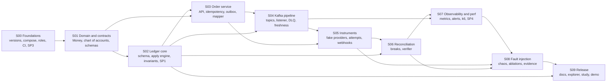

# ZeroSum Ledger — Implementation Document Pack

> **Status (2026-09-15):** Planning documents only. **No implementation exists yet.** Every output named in these documents is *planned* until its owning register records an actual path and evidence ([status legend](#status-legend)).
> **Master report:** [docs/zerosum_ledger_mvp_plan.md](zerosum_ledger_mvp_plan.md) (v1.2)
> **Pack version:** 1.0

**What the pack is for.** It turns the MVP engineering report into ten executable step documents, one per implementation step, so that a coding agent (or a person) can complete the project one step at a time without re-deriving decisions.

<a id="document-index"></a>
## 1. Document index

| # | Document | Purpose | Master section | Planned hours | Gate |
|---|---|---|---|---|---|
| — | [docs/zerosum_ledger_mvp_plan.md](zerosum_ledger_mvp_plan.md) | Product intent, scope, architecture proposal, targets, schedule | — | — | — |
| S00 | [docs/step_00_foundations.md](step_00_foundations.md) | Repository, build, compose, CI, SP3 stack proof, observability wiring | [#step-00](zerosum_ledger_mvp_plan.md#step-00) | 12 | G0 |
| S01 | [docs/step_01_domain_contracts.md](step_01_domain_contracts.md) | Money, chart of accounts, zero-sum rules, JSON contracts, generators | [#step-01](zerosum_ledger_mvp_plan.md#step-01) | 14 | — |
| S02 | [docs/step_02_ledger_core.md](step_02_ledger_core.md) | Ledger schema, apply engine, changelog, invariants, SP1 | [#step-02](zerosum_ledger_mvp_plan.md#step-02) | 24 | G1 |
| S03 | [docs/step_03_order_service_outbox.md](step_03_order_service_outbox.md) | Money-order API, idempotency, immutable store, outbox, event mapper | [#step-03](zerosum_ledger_mvp_plan.md#step-03) | 22 | — |
| S04 | [docs/step_04_kafka_pipeline.md](step_04_kafka_pipeline.md) | Topics, ledger listener, DLQ/quarantine, freshness, pipeline e2e | [#step-04](zerosum_ledger_mvp_plan.md#step-04) | 16 | — |
| S05 | [docs/step_05_instruments_fake_providers.md](step_05_instruments_fake_providers.md) | FakeCard/FakeBank, PaymentInstrument, attempts, policies, webhooks | [#step-05](zerosum_ledger_mvp_plan.md#step-05) | 24 (+2 contingency) | G2 |
| S06 | [docs/step_06_reconciliation_verifier.md](step_06_reconciliation_verifier.md) | Settlement reconciliation, cross-store verifier | [#step-06](zerosum_ledger_mvp_plan.md#step-06) | 12 (+1 contingency) | — |
| S07 | [docs/step_07_observability_performance.md](step_07_observability_performance.md) | Metrics, dashboards, alerts, load tests, SP4 | [#step-07](zerosum_ledger_mvp_plan.md#step-07) | 16 | G3 |
| S08 | [docs/step_08_fault_injection_ablation.md](step_08_fault_injection_ablation.md) | Simulator workloads, fault matrix, ablations, evidence | [#step-08](zerosum_ledger_mvp_plan.md#step-08) | 16 | G4 |
| S09 | [docs/step_09_demo_docs_release.md](step_09_demo_docs_release.md) | Docs, Explorer, human evaluation, demo, release | [#step-09](zerosum_ledger_mvp_plan.md#step-09) | 14 (+2 contingency) | G5 |

Every step document has the same sections and anchors:

| Section | Anchor |
|---|---|
| A. Purpose and outcome | `#purpose-and-outcome` |
| B. Agent prompt | `#agent-prompt` |
| C. Required reading | `#required-reading` |
| D. Ownership | `#ownership-and-requirements` |
| E. Phases and tasks | `#phases-and-tasks`, with `#phase-N` and task anchors such as `#s02-t03` |
| F. Risks | `#risks-and-recovery` |
| G. Acceptance | `#acceptance-checklist` |
| H. Register | `#decisions-and-outputs` |
| I. Execution and change record | `#execution-record`, `#change-record` |
| J. Handoff | `#handoff` |

<a id="execution-order"></a>
## 2. Recommended execution order

Execute strictly in order **S00 → S01 → S02 → S03 → S04 → S05 → S06 → S07 → S08 → S09**. The builder is solo, and each step consumes the registers of earlier steps.

1. **S00 Foundations.** Gate **G0** falls on Day 2: the SP3 stack compatibility decision.
2. **S01 Domain model and contracts.**
3. **S02 Ledger core.** Gate **G1**: ledger invariants, immutability and the SP1 lock study.
4. **S03 Order service and outbox.**
5. **S04 Kafka pipeline.**
6. **S05 Instruments and fake providers.** Gate **G2**: W1–W4 end-to-end.
7. **S06 Reconciliation and verifier.**
8. **S07 Observability and performance.** Gate **G3**: performance baseline and SP4 decision.
9. **S08 Fault injection and ablation.** Gate **G4**: A0 zero violations and valid ablations.
10. **S09 Demo, docs, release.** Gate **G5**: release checklist.

**When a step is blocked.** If an input is missing (e.g., waiting on machine time or study participants), the agent completes the independent preparation tasks named in that step's section C.4 and records the blocker. Work from a later step is not pulled forward. The only allowed overlap is **inviting study participants during S05/S06** (master [#weekly-roadmap](zerosum_ledger_mvp_plan.md#weekly-roadmap)), because it is external waiting time, not engineering work.

<a id="dependency-map"></a>
## 3. Ownership and dependency map



**Key cross-step artifacts** (decision IDs refer to each owner's register, section H):

| Artifact / contract | Owner (decision ID) | Main consumers |
|---|---|---|
| Pinned versions, compose topology, DB roles, CI, observability wiring | S00 (D00-1, D00-3, D00-4, D00-5, D00-6) | All steps |
| `Money`, chart of accounts, zero-sum validator, JSON Schemas, golden payloads, generators | S01 (D01-1…D01-10) | S02, S03, S05, S06, S08 |
| Ledger schema, append-only pattern, apply engine, lock strategy, read APIs, invariant queries, quarantine | S02 (D02-1…D02-9) | S03, S04, S05, S06, S07, S08, S09 |
| Orders schema, money-order API, idempotency, auth module, `libs/outbox`, payment-event mapper | S03 (D03-1…D03-7) | S04, S05, S07, S08 |
| Topics and partition key, client config, listener, error policy, freshness | S04 (D04-1…D04-5) | S05, S07, S08 |
| `PaymentInstrument`, fake-providers API and fault knobs, attempts, state machines, policies, webhooks, scenario catalog | S05 (D05-1…D05-13) | S06, S07, S08, S09 |
| Settlement reports, reconciliation breaks, verifier CLI | S06 (D06-1…D06-6) | S07, S08, S09 |
| Metric registry, dashboards, alerts, k6 runner, perf results, hot-entity mitigation | S07 (D07-1…D07-7) | S08, S09 |
| Simulator workloads, chaos scripts, ablation flags, results | S08 (D08-1…D08-5) | S09 |
| README, architecture doc, Explorer, study results, release | S09 (D09-1…D09-10) | Post-MVP |

<a id="source-of-truth"></a>
## 4. Source-of-truth rules

1. **The master owns intent and targets.** [docs/zerosum_ledger_mvp_plan.md](zerosum_ledger_mvp_plan.md) owns:
   - product intent and supported scope;
   - baseline requirements (M1–M14);
   - acceptance targets and gates;
   - risk and decision-gate definitions;
   - the original schedule.
2. **Step documents own what they introduce.** Each step owns the implementation decisions, contracts and evidence it introduces. Its **register** (section H) is where selected values live, and nowhere else.
3. **Proposed vs selected.**
   - The master's architecture, contracts, DDL and interfaces (§4–§5) are **PROPOSED** starting points.
   - The owning step records the **selected** implementation in its register and in the artifact it points to.
   - Downstream steps always read, in this order: the current register entry, then the referenced artifact, then (for context only) the master proposal.
4. **Executable artifacts hold the concrete values.** Code, migrations, schemas, OpenAPI files and configuration contain the runtime values. Each authoritative value carries a trace comment to its decision, for example `# decision: D04-1 — docs/step_04_kafka_pipeline.md#decisions-and-outputs`, or an ADR reference. If an artifact and its register disagree, see [conflict resolution](#conflict-resolution).
5. **No duplicated mutable details.** Step documents reference versions, schema fields, config values, thresholds, fixture identities and results by owner and anchor. They never restate them as independent definitions.
6. **Dated external facts.** Versions and prices in the master were checked on 2026-09-15. When they are rechecked, record the new values in the owning register or ADR (e.g., D00-1 / ADR-0002). Update the master only if a decision changes.

**Permitted alternatives that downstream work must handle**

| Alternative | Decided in | Affects |
|---|---|---|
| SP3 fallback: Prometheus scraping instead of OTLP metrics, or Boot 4.0.x | S00-T07 (D00-7) | S00-T08, S04-T06, S07 |
| SP1 outcome: batched apply becomes must-have | S02-T07 (D02-10) | S04 listener batching, S07-T06 |
| G1 alternative: account-level optimistic `lock_version` | S02-C01 (D02-4) | S04, S07 |
| SP2: Debezium Outbox Event Router replaces the polling relay | S04-C01 (D04-7 → D03-5) | S03 outbox, S07, S08 F1/F4 |
| G2 alternative to ADR-0006: instrument-service writes orders via shared validation | S05-C01 (D03-6) | S03 mapper, S06, S08 |
| SP4 options (a) batch, (b) shard hot entities, (c) both | S07-T06 (D07-6 → D02-3/D02-4; sharding also touches D01-6, D02-7, D03-6, D06-5) | S08, S09 claims |
| T1 throughput missed: throughput résumé bullet dropped | S07-T05 (D07-5) | S09-T07 |
| S5 hosted demo (optional) | S09-C01 (D09-10) | S09-C02 |

<a id="conflict-resolution"></a>
## 5. Conflict resolution and change requests

**Precedence rules**

1. **Step vs master on intent, scope, requirements, acceptance targets or schedule:** the master wins. The step raises a change request; it does not silently diverge.
2. **Downstream step vs upstream owner on a contract or decision:** the owner wins. The downstream step raises a change request to the owner.
3. **Artifact vs its owning register:** stop and reconcile. Either fix the artifact, or update the register through a change request. Never leave them inconsistent.
4. **Acceptance gates are never weakened silently.** Changing a master target requires a master change-log entry with rationale and impact.
5. **Measured evidence beats estimates.** A measured result may justify a change request against an estimate or target, but the request still goes through the owner.

**Change request procedure** (used whenever a step needs to change something it doesn't own)

1. In the requesting step's I.2 change record, record the need, the evidence and the affected tasks.
2. Update the owning document and its register: the new decision, rationale and date. For the master, add a row to [#changelog](zerosum_ledger_mvp_plan.md#changelog) and, where relevant, to [#constraint-updates](zerosum_ledger_mvp_plan.md#constraint-updates).
3. Write an **impact assessment**: affected steps, task IDs, code, configuration and tests.
4. Mark affected completed tasks **Needs review** in their steps' I.1 tables.
5. Revalidate only the affected tasks, and record the evidence.
6. Keep unaffected work.

<a id="change-detection"></a>
## 6. Change-detection procedure

**This is a manual execution procedure. No automatic watcher is implemented.** Links between documents do not propagate changes; the implementing agent must run these steps.

**When to run it**
- Before starting a step.
- At every phase boundary.
- Before handoff.

**Steps**

1. **Read the latest sources.** Open the upstream documents named in the step's section C, *and* the actual artifacts their registers reference (schemas, migrations, OpenAPI files, compose file, version catalog, ADRs, config files).
2. **Record revisions** in the step's I.2 table:
   - Committed files: `git log -1 --format='%h %cs' -- <path>`
   - Uncommitted or generated files: `shasum -a 256 <path>`
   - Directories of consumed artifacts (e.g., `libs/contracts/`): `find <dir> -type f -print0 | sort -z | xargs -0 shasum -a 256 | shasum -a 256`
3. **Recheck at phase boundaries and before handoff.** Recompute the revisions and compare them with I.2.
4. **Inspect any change** with `git diff <recorded-rev>..HEAD -- <path>`. Identify the affected tasks, code, configuration and tests.
5. **Mark affected completed tasks "Needs review"** in I.1.
6. **Update the owning decision record** if the change requires it ([change request procedure](#conflict-resolution)). Then revalidate the affected tasks.
7. **Preserve unaffected work.** Record the review outcome in I.2 (`No impact`, `Revalidated`, or `Change request raised`).

**Why track artifacts, not just documents.** A document hash doesn't change when a referenced schema or configuration file changes. Always track directly consumed artifacts.

<a id="status-legend"></a>
## 7. Status legend: planned vs completed

| Status | Meaning |
|---|---|
| **Planned** | Defined in the document; no work started. The initial state of every task and output. |
| **In progress** | Work started; the evidence isn't complete. |
| **Done** | Output exists at a recorded actual path, and its verification evidence is recorded in H.4 / I.1. |
| **Needs review** | Previously done, but an upstream source or artifact changed ([change detection](#change-detection)). |
| **Blocked** | Can't proceed. The exact missing dependency is recorded in H.5 and I.1. |
| **Not run** | An evidence item (measurement, study, chaos run) not yet executed. It is never replaced with estimated or invented values. |

**Completion rules**

- An output is **completed** only when its register row has an **actual path** and **evidence**. The "Outputs" lists inside tasks are always planned artifacts.
- Anything labeled planned or pending in this pack is not a completed artifact.

<a id="effort"></a>
## 8. Effort, contingency and scope classes

Step hours come from the master schedule ([#schedule-overview](zerosum_ledger_mvp_plan.md#schedule-overview), [#weekly-roadmap](zerosum_ledger_mvp_plan.md#weekly-roadmap)). The decomposition does **not** add workload. Phase and task estimates in each step sum exactly to the master's step hours.

| Class | Hours | Items |
|---|---|---|
| Required MVP step work | 170 | S00–S09 tasks `Tnn` |
| Pre-allocated contingency (master v1.1, v1.2) | 5 | S05-T13 W1–W4 scenarios + runner (2), S06-T05 W5–W6 scenarios (1), S09-T07 release execution and tag CI workflow (2) |
| Unallocated contingency | 25 | Fixes, reruns, audit-study facilitation (about 5–6 h when sessions run), and conditional work below |
| **Total** | **200** | |

**Conditional work** (triggered by evidence and funded from unallocated contingency; IDs `Snn-Cnn`)

| ID | Work | Trigger |
|---|---|---|
| S02-C01 | Account-level optimistic locking | G1 alternative |
| S04-C01 | SP2 / Debezium, 3 h spike | — |
| S05-C01 | Instrument-service writes orders | G2 alternative |
| S07-C01 | Further hot-entity mitigation | — |
| S08-C01 | Regression-fix loop | Violations found |
| S09-C01 | Hosted demo, 3 h | Optional |
| S09-C02 | Restore drill | Only with S09-C01 |

The master's §10.7 ledger replay tool (about 4 h) is also conditional and has no step assignment unless recovery evidence requires it ([known gaps](#known-gaps)).

**Deferred improvements** are listed in master [#deferred](zerosum_ledger_mvp_plan.md#deferred) and [#should-have](zerosum_ledger_mvp_plan.md#should-have), and are referenced from each step's conditional-and-deferred section. If schedule pressure hits, the [minimum cut](zerosum_ledger_mvp_plan.md#minimum-cut) governs what is removed.

<a id="constraint-updates"></a>
## 9. Constraint updates applied to this pack

| Date | Update | Where recorded | Effect on the pack |
|---|---|---|---|
| 2026-09-15 | Cost is not a decision driver (open source, local, résumé showcase) | Master [#constraint-updates](zerosum_ledger_mvp_plan.md#constraint-updates) v1.1 | No cost-tracking tasks. §7 of the master is informational. S5 hosted demo stays optional and is decided on showcase value (S09-C01). |
| 2026-09-15 | Scenario catalog and release execution assigned | Master [#constraint-updates](zerosum_ledger_mvp_plan.md#constraint-updates) v1.1 | S05-T13, S06-T05, S09-T07 funded from 4 h of pre-allocated contingency |
| 2026-09-15 | Decomposition review clarifications: contracts C1–C25, evidence E1–E11, schedule and operations O1–O13 | Master [#decomposition-clarifications](zerosum_ledger_mvp_plan.md#decomposition-clarifications) v1.2 | Gaps found by the step-document authors are resolved in the master, and step documents are updated to v1.1 of their text. S09-T07 grows to 2 h (unallocated contingency 25 h). No change to scope, architecture direction or acceptance thresholds. |

<a id="agent-prompt-template"></a>
## 10. Reusable prompt for assigning one step to an agent

Replace `NN` and the filename:

```text
You are the implementation agent for Step NN of the ZeroSum Ledger project.

Repository root: zerosum-ledger/
Step document: docs/step_NN_<name>.md

1. Read docs/README.md (source-of-truth, conflict-resolution, change-detection, status-legend),
   then the step document in full, then every source listed in its section C at the linked anchors.
2. Inspect the current repository and the registers (section H) and execution records (section I)
   of all upstream steps. Resolve current definitions from registers and the artifacts they reference,
   not from copies in documents.
3. Run the change-detection procedure and record revisions/hashes in section I.2 before changing code.
4. Complete only this step's remaining authorized tasks, in dependency order. Do not implement scope
   owned by later steps, deferred items, or non-goals.
5. Verify every task exactly as its "Verification and definition of done" field specifies. Record
   evidence paths in H.4 and I.1. Never invent measurements, participant observations or results;
   mark unexecuted evidence "Not run" and blocked work "Blocked" with the exact missing dependency.
6. Record every decision (with rationale and alternatives), actual implementation/configuration paths,
   and produced artifacts in section H. Add trace comments next to authoritative config values.
7. If you need to change anything owned by the master or an upstream step, stop and follow the change
   request procedure in docs/README.md#conflict-resolution. Never weaken acceptance gates.
8. Re-run change detection at each phase boundary and before handoff. Complete section J handoff
   conditions and the section G acceptance checklist, then report: tasks done, evidence, open blockers,
   change requests raised.
```

<a id="pack-validation"></a>
## 11. Pack validation record

Validation performed on 2026-09-15 with a structural script over `docs/*.md`:

**Coverage**
- All ten implementation steps in master [#step-details](zerosum_ledger_mvp_plan.md#step-details) (S00–S09) have exactly one step document.
- In total: 43 phases, 73 tasks and 7 conditional tasks.
- There are 91 decision IDs. Four were added by step authors where no ID existed: D02-12, D04-8, D05-14, D08-6.

**Structure**
- Every step document has the required section anchors, the H.1–H.6 and I.1–I.2 subsections, and the eight task fields in order.
- Every H.1 register lists that step's own decision IDs, and every I.1 table lists all of the step's tasks.

**Identifiers and links**
- Task IDs are unique across the pack.
- Every referenced task ID (`Snn-Tnn`, `Snn-Cnn`) and decision ID (`Dnn-n`) is defined in its owning document.
- Every internal Markdown link and anchor across the 12 files resolves.
- Code fences are balanced, and table column counts are consistent.

**Effort**
- Step task estimates sum exactly to the master's step hours: 12, 14, 24, 22, 16, 24, 12, 16, 16, 14 (170 h).
- The contingency-funded tasks are S05-T13 (2 h), S06-T05 (1 h) and S09-T07 (2 h).
- Every conditional task is estimated at 0 h.

**Duplication**
- A heuristic scan for restated versions, latency thresholds and prices in step documents left one warning. It is in S00: a loopback address, reviewed and found not to be a version.

**Master content**
- All v1.0 sections are retained.
- The v1.1 and v1.2 changes are additive clarifications, marked in place and logged in [#changelog](zerosum_ledger_mvp_plan.md#changelog).
- The master still passes its own structural check.

**Honest labeling**
- All registers are `Pending`, all tasks are `Planned`, and all evidence rows are `Not run`.
- No implementation, measurement or participant result exists.

**How the pack was produced**
- The ten step documents were drafted in parallel from one authoring spec.
- Gaps the authors reported were resolved in master v1.2 (§0.3). Authors then updated their own documents to text version 1.1.
- The S03 and S06 updates, plus the late C25 edit to S05, were applied by the orchestrator as exact-match replacements, then re-validated.

**What it can't catch.** Mermaid diagrams are syntax-reviewed only; the script doesn't render them. Semantic consistency, i.e. whether a later document faithfully references rather than duplicates an owner, was checked by a heuristic scan plus manual review, not proven.

<a id="known-gaps"></a>
## 12. Known gaps and open items

Each step author reported the gaps they found in the master while decomposing it. They were triaged three ways.

**1. Resolved in the master (v1.2).**
- 25 contract items (C1–C25), 11 evidence items (E1–E11) and 13 schedule/operations items (O1–O13) are listed with their detail owners in [docs/zerosum_ledger_mvp_plan.md#decomposition-clarifications](zerosum_ledger_mvp_plan.md#decomposition-clarifications).
- The affected sections are edited in place and marked "v1.2".
- Step documents record the resolution in their I.2 change records.

**2. Resolved as step-level decisions** (recorded in the owning register; no master change):

| Item | Resolution | Owner |
|---|---|---|
| Display rule for contra balances (driver debt, rider credit) | Defined with the sign convention | D01-6 / ADR-0003 (S01-T04) |
| Role passwords can't be read by plain init SQL; the SP3 spike needs the OTLP port on the host | Init runs through an entrypoint wrapper; local-only port exception | D00-4, D00-3 |
| Compose `chaos` profile (toxiproxy) and the Spring `chaos` profile guard share a name | Intentional: S00 owns the Compose profile, S08 the Spring guard | D00-3, D08-3 |
| DLQ topics have fewer partitions than their sources; a paused listener has no resume path | Explicit DLQ partition mapping; automatic resume probe | D04-4 |
| Crash-point test seam (after DB commit, before offset ack) | New decision added by S04 | D04-8 |
| Ledger half of ADR-0004 | New decision added by S02. SP1 uses harness-local timers until D07-1/D07-7 exist. | D02-12 |
| Provider adapter client configuration (timeouts, error mapping, minor units) | New decision added by S05 | D05-14 |
| Run plan: cell split, validity threshold per cell, quiesce maximum wait, run order, whether A5 runs | New decision added by S08, committed before the first evidence run | D08-6 |
| How the verifier reaches fake-providers' ground truth on the internal network | Decided in S06; change request to D00-3 if a port or profile is needed | D06-5 |
| Overlaps D05-2 ↔ D06-1 (fault-knob schema vs discrepancy knobs) and D05-13 ↔ D06-4 (instrument OpenAPI vs reconciliation paths) | S06 extends S05's artifacts additively via change request | D06-1, D06-4 |
| Runbook finalization; provider-integration guide for the H4 test | Folded into S09-T02 and S09-T05 | D09-2, D09-6 |
| Ablation seams A1–A5 and the F3 breakpoint hook in S02/S03/S05 code | Added by S08 via change requests on the owning registers | D08-2, D08-3 |

**3. Open items** (tracked, not resolved):
- **Ledger replay tool.** Master [#recovery](zerosum_ledger_mvp_plan.md#recovery), about 4 h. Conditional, with no step assignment. Build it only if recovery evidence requires it, funded from contingency; the decision belongs in S09's register.
- **Conditional work without fixed hours.** S02-C01, S05-C01, S07-C01 and S08-C01 are estimated from their trigger evidence when triggered. Fixed conditional estimates:

  | Item | Estimate |
  |---|---|
  | SP2 (S04-C01) | 3 h |
  | S09-C01 | 3 h |
  | S09-C02 | ≈ 1 h |
  | Audit-study facilitation | ≈ 5–6 h |

  All of these draw on the 25 h of unallocated contingency. If draws exceed it, the master's [minimum cut](zerosum_ledger_mvp_plan.md#minimum-cut) applies.
- **Document length.** Step documents are about 11–16k words each, well above the authoring guideline of 4–7k. The depth is in the required task fields. If an implementation agent struggles with context, have it read sections B–E and H first.
- **Diagram rendering.** Mermaid diagrams in the master and this README were syntax-reviewed only, not rendered.
- **Dated external facts.** Versions and prices date from 2026-09-15, and some sources couldn't be read (see master [#sources](zerosum_ledger_mvp_plan.md#sources)). Recheck them on S00 execution day and record the results in D00-1 / ADR-0002.
- **Empty registers.** All registers and execution records are intentionally empty. Nothing has been implemented, measured or run.
