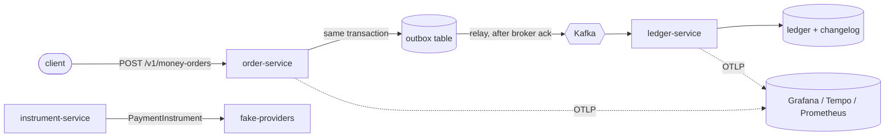

# Architecture

What this system actually is, as built — not as planned. Where the two differ, this document follows the code and the
recorded evidence. The master plan ([docs/zerosum_ledger_mvp_plan.md](zerosum_ledger_mvp_plan.md)) is the proposal;
[docs/scope-decisions.md](scope-decisions.md) records every place the build deliberately diverged from it.

## The problem

A payments ledger has one job that cannot be compromised: money must not appear or disappear. Everything else —
throughput, latency, features — is negotiable. The design follows from that single constraint.

## Shape

Each service owns its database, with a migrating owner role and a restricted runtime role. No service reads another's
tables.

## The decisions that shape it

| Decision | Why | ADR |
|---|---|---|
| Entries are signed; debits positive, credits negative | One convention end to end, so a sign error is a test failure rather than an accounting opinion | [0003](adr/0003-sign-convention.md) |
| Balance policy lives outside the ledger | The ledger records what happened; deciding whether a payout is allowed is a different question with different inputs | [0004](adr/0004-balance-policy-outside-ledger.md) |
| Per-entity locks, taken in sorted order | Two orders touching the same entities cannot deadlock if everyone locks in the same sequence | [0005](adr/0005-ledger-entity-locks.md) |
| order-service is the only writer | One writer means one place where the zero-sum rule is enforced | [0006](adr/0006-order-service-is-the-single-writer.md) |
| Partition key is the order group | Kafka orders within a partition, so an adjustment can never overtake the order it adjusts | [0007](adr/0007-partition-key.md) |
| Polling outbox, single relay | The API accepts orders while the broker is down; the row is marked published only after the broker acknowledges | [0008](adr/0008-polling-outbox-single-relay.md) |
| One `PaymentInstrument` interface, capabilities as data | Core code names operations, never providers, so a third adapter changes no state machine | [0010](adr/0010-payment-instrument-abstraction.md) |

All ten ADRs are Accepted. See [docs/adr/](adr/).

## Properties worth naming

- **Zero-sum is enforced twice**: by the validator, and by a deferred database constraint that fires at `COMMIT`. An
  insert that bypasses the application still cannot leave the books unbalanced.
- **Append-only is enforced against the owner too**, not just the runtime role. Privileges alone would leave the
  migrating role able to mutate history.
- **Idempotency is a database property.** The unique constraint is what makes a concurrent burst produce one row; a
  check-then-insert passes single-threaded tests and duplicates under load.
- **Uncertain outcomes are a first-class result.** A provider timeout is neither success nor failure. `SubmitResult`
  is sealed over Succeeded, Pending, Declined and Unknown, so a `switch` that forgets one stops compiling.
- **Failure reports absence, not zero.** A lag gauge that cannot be computed publishes NaN, because a gauge stuck at
  zero reads as perfect health.

## Acceptance criteria: M1–M14

Compiled from `docs/results/**`, `docs/scope-decisions.md` and test sources. **Plan text is never evidence.** A
criterion is MET only where a named test or recorded run demonstrates it.

**22 MET · 9 PARTIAL · 12 NOT MET · 1 UNKNOWN**, of 44 lettered sub-criteria.

M13(a) moved from NOT MET to PARTIAL when the simulator and verifier stopped being stubs (CR-S09-01). It is
deliberately **not** MET: the command exists and is exercised, but never against the running system, and this table
does not promote a criterion on a stub.

| Criterion | Status | Evidence |
|---|---|---|
| M1(a) 10,000 seeded orders validate | MET | `ValidatorGenerativeTest`; `s01-t06-generative.txt` (5000 valid / 5000 invalid) |
| M1(b) JPY 0 and KWD 3 digits from the ISO table | MET | `CurrencyRulesTest`; `s01-t01-money-table.txt` |
| M1(c) ArchUnit: no float/double; BigDecimal only in fees | MET | `MoneyArchitectureTest` (each rule fires on a canary) |
| M1(d) Worked example O1–O7 and the O8 variant | MET | `WorkedExampleGoldenTest`; `WorkedExampleApplyIT` |
| M2(a) Mutation fails for app *and* owner role | MET | `OrdersImmutabilityIT` (42501 for both) |
| M2(b) Unbalanced insert fails at COMMIT | MET | `OrdersImmutabilityIT` (23514, raw JDBC) |
| M2(c) `adjusts_order_id` must exist | MET | `OrderStoreIT` |
| M3(a) Same key and body replays | MET | `MoneyOrderApiIT` (byte-identical body) |
| M3(b) Same key, different body → 422 | MET | `MoneyOrderApiIT` |
| M3(c) 50 concurrent, one key → one row | MET | `OrderStoreIT` (created=1, replayed=49) — store level; HTTP level used 20 |
| M3(d) Missing key → 400 | MET | `MoneyOrderApiIT` |
| M3(e) Keys never expire | **UNKNOWN** | No test asserts it; only source comments. A design property, not evidence |
| M4(a) `kill -9` → published within 5 s | **NOT MET** | `s03-t05-outbox.txt` says "M4(a) — NOT CLAIMED": the test destroys the relay *object*, not the process |
| M4(b) Only the relay publishes | MET | `PublishPathArchitectureTest` (failed on real code first, forcing a fix) |
| M4(c) Duplicate publishes harmless downstream | PARTIAL | Both halves proven separately; the composite crash case is Blocked (CR-S04-02) |
| M5(a) 3× publish = same balances | MET | `DuplicateDeliveryIT` through a real broker. End-to-end variant not delivered |
| M5(b) No changelog `seq` gaps | MET | `s02-t03-stress.txt` (incl. 32×20,000 at 30% duplicates) |
| M5(c) Per-currency sum is 0 | MET | `InvariantsApiIT`; `sp1-runs.json` (0 violations, 12 windows) |
| M5(d) Balance = sum of deltas | MET | `VerifyApiIT` (a corrupted ledger is reported, not hidden) |
| M6(a) Changelog links order and idempotency key | MET | `ChangelogApiIT`; also asserted by `MoneyPathE2ETest` |
| M6(b) `verify` rebuilds and matches | MET | `VerifyApiIT`, `HashChainTamperIT`, independent Python reference |
| M6(c) Audit walk ≤ 3 calls | MET (manual) | Executed by hand against the live stack. **Not a test**, and not reproducible without re-running it |
| M7(a) Both adapters pass one shared suite | PARTIAL | `PaymentInstrumentContractSuite` passes for both, and its webhook-parsing case now **runs** rather than skipping (S05-T11). Still against a stub, never the real service, which is why this is not MET |
| M7(b) Provider-boundary ArchUnit rule | MET | `InstrumentBoundaryTest`; fires on a canary |
| M8(a) State × event table test | MET | `TransitionTableTest` (S05-T08): the state×event product is **generated, not hand-listed**, so adding a state or event without a table decision fails the build. Illegal transitions are logged and counted, asserted with a captured appender and a meter registry |
| M8(b) 10,000 charges at 0.2 timeout rate | **NOT MET** | Fault knobs (T03) deferred |
| M8(c) Nothing stuck in UNKNOWN > 5 min | **NOT MET** | instrument-service has no persistence; nothing resolves an Unknown |
| M9(a) Bad signature / stale timestamp → 400 | MET | `WebhookSignatureTest` (7) and `WebhookReceiverIT` (9): a forged, tampered, unsigned or stale delivery is **400 and writes nothing**; tampering by one digit fails; the 300 s tolerance is rejected in either direction; both secrets verify during rotation |
| M9(b) 30% duplicates + 30% reordering | PARTIAL | The **dedupe half** is evidenced: one event delivered many times, sequentially and concurrently, is recorded once and applied once (`WebhookReceiverIT`). The criterion asks for 30% duplicates *plus 30% reordering at volume*, and no reorder-rate run exists — the sender's reorder knob (S05-T03) has never been driven |
| M10(a)(b)(c) Payouts and returns | **NOT MET** | T10 deferred. The freshness endpoint exists and is tested, but nothing consumes it, so no 409 |
| M11(a)(b) Reconciliation | **MET** | FakeCard settles a closed day, and a matching report emits `SETTLEMENT_RECEIVED` equal field-by-field to golden O6 (`ReconciliationRunIT`, 6 tests). Each injected discrepancy produces its **own** break type — missing→`MISSING_IN_REPORT`, off-by-one→`AMOUNT_MISMATCH`, duplicate→`DUPLICATE_LINE` (`SettlementMatcherTest` 13, `DiscrepancyKnobIT` 5). Evidence stops at the outbox row: the booking itself is order-service's mapper, covered by its own golden test. [docs/results/s06/reconciliation.md](results/s06/reconciliation.md) |
| M11(c) Reconciliation under chaos | **NOT RUN** | No A0 chaos orchestration, and no scheduler advances settlement cycles, so "0 unexplained breaks after 2 cycles" cannot be evaluated. Neither met nor failed. |
| M12(a) One trace across the pipeline | PARTIAL | `s04-trace-propagation.md`: connected **by links**, deliberately not claimed as one parent-child trace |
| M12(b) Dashboards for flow, invariants, providers | PARTIAL | Flow and invariants load from the repository; the providers dashboard is blocked on S05 |
| M12(c) Alert rules fire in a test | PARTIAL | 6 rules provisioned; **1 of 5 conditions observed firing** (outbox backlog, t+212 s under a real Kafka outage) |
| M13(a) One command runs a named scenario | PARTIAL | Both tools are real CLIs (CR-S09-01). `./gradlew :tools:simulator:run` runs the W1 scenario for N seeded runs and writes JSON + Markdown; `:tools:verifier:run` checks I2–I4 as the read-only role. Proven by `VerifierIT` (6 tests, against a real database) and `SimulatorStubRunTest` (6 tests, against a **stub**). **Never run against the live stack**, so the money-path half is [Not run](results/m13/simulator.md#2-status) |
| M13(b) Ablations A1–A4 | **NOT MET** | S08 not started |
| M13(c) Results record hardware, versions, SHA, seeds | PARTIAL | The convention exists; SP1/SP3 and both M13 results comply. It is now *enforced by code*: `libs/evidence` captures the block — including whether the tree was dirty — and both tools write it, so it cannot be typed in stale. Still a convention, not a check: nothing fails a build for omitting it |
| M14(a) Fresh clone → W1 in ≤ 10 min | **NOT MET** | Never timed; no timing is claimed anywhere |
| M14(b) Architecture doc, ADRs, OpenAPI | PARTIAL | This document, 10 ADRs, and two OpenAPI specs with drift tests. `openapi/instrument-service.yaml` is absent |
| M14(c) Demo video | **NOT MET** | Not recorded |

### Two contradictions worth stating

1. **M12(a).** The S07 register ticks the exit criterion while its own evidence table records the single-trace check as
   "Not run". The executed evidence classifies the result as *connected by links*, which is weaker than the single
   trace M12(a) specifies. Recorded here as PARTIAL.
2. **M7(a).** Both adapters pass the shared suite, which is what the criterion asks for. But the suite drives them
   against a stub whose payloads were written by the same hand as the adapters, so they agree by construction rather
   than by evidence. `docs/results/s05/providers.md` states plainly that M7 is not claimed.

## What the tests actually cover

| Layer | Count | What it runs against |
|---|---|---|
| Unit | 334 (0 failed, 2 skipped) | No containers |
| Integration | 249 (0 failed, 0 skipped) | Real PostgreSQL and Kafka via Testcontainers |
| End-to-end | 1 (0 failed) | Re-measured on the running seven-container stack after all three merges; see [results/s05/deployment-check.md](results/s05/deployment-check.md) |

Counts are from `./gradlew build integrationTest --rerun-tasks` on 2026-09-17, read out of
`build/test-results/*/TEST-*.xml` rather than from `BUILD SUCCESSFUL` — this build sets
`failOnNoDiscoveredTests = false`, so a green build is not by itself evidence that anything ran. The previous figures
here have been stale twice over. 223 / 180 predated S05-T07. The 254 / 198 that briefly replaced them were
measured in a worktree holding neither the S05-T08 transition tables nor the S05-T03 fault knobs, so they were stale
on arrival — parallel work makes a count true only for the tree it was taken on. 309 / 229 were measured on this
tree, after all three merges. Of them, the evidence harness contributes 20 tests — `libs/evidence` 8 unit,
`tools/simulator` 12 unit, `tools/verifier` 6 integration.

The two remaining skips are deliberate: the adapter contract suite aborts its **settlement-report** case on an
assumption naming the missing capability, once per provider, so a gap is reported rather than omitted. It was four
until S05-T11 — the webhook-parsing case now runs on both adapters instead of skipping, which is what a skip is for:
it disappears when the capability arrives.

**The e2e layer is one test.** It covers the money path only. Crash recovery, the provider path, fault injection and
reconciliation have no end-to-end coverage at all, and the e2e job runs only on a schedule or manual dispatch, never
on a pull request.
