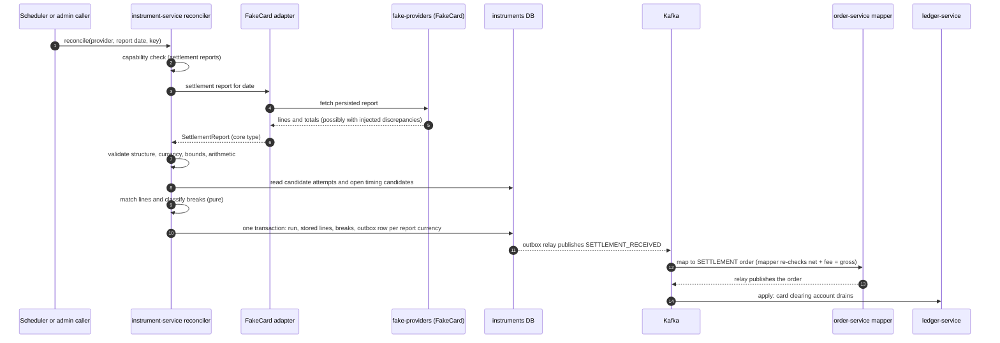
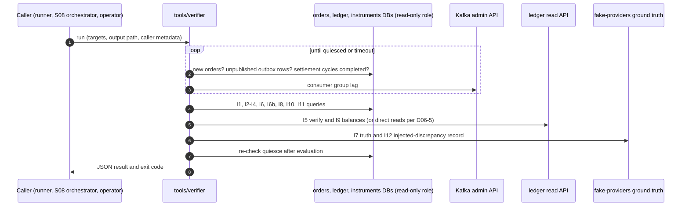

# Step 06 — Reconciliation and verifier

> **Pack:** ZeroSum Ledger implementation docs · **Master:** [docs/zerosum_ledger_mvp_plan.md#step-06](zerosum_ledger_mvp_plan.md#step-06) (v1.2)
> **Doc version:** 1.1 · **Date:** 2026-09-15 · **Step status:** Planned (no implementation exists)
> **Planned effort:** 12 h (master schedule; see [docs/zerosum_ledger_mvp_plan.md#schedule-overview](zerosum_ledger_mvp_plan.md#schedule-overview)), plus 1 h pre-allocated contingency for S06-T05 ([docs/zerosum_ledger_mvp_plan.md#constraint-updates](zerosum_ledger_mvp_plan.md#constraint-updates)) · **Gate:** —
> **Shared procedures:** [docs/README.md#change-detection](README.md#change-detection) · [docs/README.md#source-of-truth](README.md#source-of-truth) · [docs/README.md#status-legend](README.md#status-legend)

<a id="purpose-and-outcome"></a>
## A. Purpose and outcome

**The problem this step solves.** By the end of S05, money moves through FakeCard and FakeBank, and every confirmed provider outcome becomes a money order. Two gaps remain.

1. **Captured card funds never leave the clearing account.** Nothing books the processor's settlement, so the card provider's clearing account only grows. Nothing compares the provider's settlement records with our own attempts, so a missing, duplicated or wrong settlement line goes unnoticed. This is workflow W6 in [docs/zerosum_ledger_mvp_plan.md#workflows](zerosum_ledger_mvp_plan.md#workflows), and it is the healthy-state rule borrowed from Stripe's ledger design ([docs/zerosum_ledger_mvp_plan.md#industry-designs](zerosum_ledger_mvp_plan.md#industry-designs)): clearing accounts must drain to zero.
2. **No tool proves that the books are right across stores.** The per-service invariant endpoints from S02 check the ledger in isolation. Nothing compares the order store, the ledger, the attempts and provider ground truth after a run. Every correctness claim in S08 and the release depends on such a tool, and the master's minimum cut says the verifier can never be cut ([docs/zerosum_ledger_mvp_plan.md#minimum-cut](zerosum_ledger_mvp_plan.md#minimum-cut)).

**Concrete deliverables** (all planned):

| # | Deliverable | Where it lives (planned) | Task |
|---|---|---|---|
| 1 | FakeCard settlement report per closed simulated day, with seeded discrepancy knobs and a record of every injected discrepancy | `services/fake-providers` | S06-T01 |
| 2 | Reconciler: fetch report through `PaymentInstrument`, validate, match lines to charge and refund attempts, persist typed breaks, emit `SETTLEMENT_RECEIVED` through the outbox | `services/instrument-service` | S06-T02 |
| 3 | Reconciliation API (runs and breaks), metrics, and the settlement-cycle grace rule for timing breaks | `services/instrument-service`, the instrument-service OpenAPI file | S06-T03 |
| 4 | `tools/verifier` CLI: I1–I12 (plus the R1 report), JSON output, quiesce detection, read-only access, corrupted-copy negative test | `tools/verifier` | S06-T04 |
| 5 | W5 and W6 scenario files with expected final state (contingency-funded) | Scenario catalog located by D05-12 | S06-T05 |

**Contribution to the MVP.**

- Satisfies **M11** ([docs/zerosum_ledger_mvp_plan.md#must-have](zerosum_ledger_mvp_plan.md#must-have)) at the capability level. The A0 chaos evidence for M11 (c) is produced in S08.
- Makes the **I1–I12** invariant catalog executable ([docs/zerosum_ledger_mvp_plan.md#invariants](zerosum_ledger_mvp_plan.md#invariants)). The master schedule lists "I6–I9 checks available" as this step's completion checkpoint ([docs/zerosum_ledger_mvp_plan.md#schedule-overview](zerosum_ledger_mvp_plan.md#schedule-overview)).
- Provides the primary evidence tool for M13, the G4 gate and the settlement-detection hard gate in [docs/zerosum_ledger_mvp_plan.md#go-no-go](zerosum_ledger_mvp_plan.md#go-no-go).
- Completes the W1–W6 scenario catalog that the release checklist requires ([docs/zerosum_ledger_mvp_plan.md#release-checklist](zerosum_ledger_mvp_plan.md#release-checklist)).

**In scope**

- Settlement reconciliation for providers that declare the settlement-report capability. In the MVP that is FakeCard only; FakeBank has none ([docs/zerosum_ledger_mvp_plan.md#instrument-interface](zerosum_ledger_mvp_plan.md#instrument-interface)).
- Charge and refund lines, typed breaks, one settlement event per settled report and currency, and the grace rule for timing breaks.
- A verifier that evaluates every invariant in the master catalog, reports R1, and never writes.
- W5 and W6 scenario files.

**Explicitly excluded**

| Excluded work | Owner |
|---|---|
| Metric name registry, dashboards and alert rules for reconciliation signals | S07 ([docs/step_07_observability_performance.md#s07-t01](step_07_observability_performance.md#s07-t01), [docs/step_07_observability_performance.md#s07-t02](step_07_observability_performance.md#s07-t02), [docs/step_07_observability_performance.md#s07-t03](step_07_observability_performance.md#s07-t03)) |
| F10 injection schedules, run orchestration, multi-run evidence, ablation flags | S08 ([docs/step_08_fault_injection_ablation.md#s08-t02](step_08_fault_injection_ablation.md#s08-t02), [docs/step_08_fault_injection_ablation.md#s08-t04](step_08_fault_injection_ablation.md#s08-t04)) |
| Ledger Explorer, audit study, architecture traceability table | S09 ([docs/step_09_demo_docs_release.md#phases-and-tasks](step_09_demo_docs_release.md#phases-and-tasks)) |
| Chargebacks, disputes, FX, holds, table partitioning and archival | Master [docs/zerosum_ledger_mvp_plan.md#deferred](zerosum_ledger_mvp_plan.md#deferred) |
| Real processor report formats | Non-goal ([docs/zerosum_ledger_mvp_plan.md#non-goals](zerosum_ledger_mvp_plan.md#non-goals)) |
| Automatic correction of breaks with compensating orders | Operator action per the runbook in [docs/zerosum_ledger_mvp_plan.md#monitoring](zerosum_ledger_mvp_plan.md#monitoring); not automated in the MVP |
| Ledger replay or rebuild tool | Conditional and unassigned ([docs/zerosum_ledger_mvp_plan.md#recovery](zerosum_ledger_mvp_plan.md#recovery), [docs/README.md#known-gaps](README.md#known-gaps)) |
| Bank-statement reconciliation of FakeBank payouts | Not in master scope; payout settlement arrives through webhooks in S05 |

<a id="agent-prompt"></a>
## B. Step-specific agent prompt

```text
You are the implementation agent for Step 06 (Reconciliation and verifier) of the ZeroSum Ledger project.

Repository root: zerosum-ledger/
Step document: docs/step_06_reconciliation_verifier.md

1. Read docs/README.md (source-of-truth, conflict-resolution, change-detection, status-legend), then this
   step document in full, then every source listed in its section C at the linked anchors. Read the master
   sections for intent and proposals only; selected contracts live in the upstream registers. Read the v1.2
   decomposition-clarifications items C6, C13, C23, E1, E2, E3 and O8 first.
2. Inspect the current repository. Read the registers (section H) and execution records (section I) of
   S00-S05, in particular D00-4 (verifier role), D01-8/D01-9 (payment-event schema, golden O6),
   D02-6/D02-7/D02-8/D02-9 (hash chain, read APIs, invariant queries, quarantine), D03-5/D03-6/D03-7
   (outbox, mapper, outbox stats), D04-1/D04-5/D04-7 (topics, freshness, SP2 decision) and
   D05-1/D05-2/D05-4/D05-5/D05-12/D05-13 (instrument interface, fake-providers and fault knobs,
   instruments schema, state machines, scenario catalog, OpenAPI). Resolve every definition from the
   register entry and the artifact it references, never from copies in documents.
3. Before changing any code, run the change-detection procedure in docs/README.md#change-detection.
   Record the revision or hash of every consumed document and artifact in section I.2.
4. Complete only this step's remaining authorized tasks (S06-T01 to S06-T05), in dependency order:
   T01 -> T02 -> T03 -> T04 -> T05. S06-T05 is funded from pre-allocated contingency.
5. Verify each task exactly as its "Verification and definition of done" field specifies. Record
   evidence paths in H.4 and I.1.
6. Record every decision (D06-1 to D06-6) with rationale, alternatives and date in H.1; actual
   implementation and configuration paths in H.2; produced artifacts in H.3; limitations and blockers
   in H.5. Put a trace comment next to every authoritative configuration value.
7. Never invent results. Evidence that was not executed is "Not run"; work that cannot proceed is
   "Blocked" with the exact missing dependency. Never mark blocked evidence as passed. Do not implement
   dashboards, alert rules, chaos scripts, run orchestration, the Explorer or any deferred item.
8. Re-run change detection at every phase boundary and before handoff. Mark affected completed tasks
   "Needs review" when an upstream source changed.
9. If you need to change a contract owned by the master or an upstream step (for example the
   payment-event schema, the fault-knob schema, the scenario catalog format, the verifier role grants,
   or the I9 invariant wording, which v1.2 already settled in decomposition-clarifications E1), stop and
   follow docs/README.md#conflict-resolution. Do not silently
   override an owner and never weaken an acceptance gate.

Finish by completing section J handoff conditions and the section G checklist, then report: tasks done,
evidence, open blockers and change requests raised.
```

<a id="required-reading"></a>
## C. Required reading and prerequisites

### C.1 Master sections

| Link | Why it matters here |
|---|---|
| [docs/zerosum_ledger_mvp_plan.md#step-06](zerosum_ledger_mvp_plan.md#step-06) | Step objective, task split, exit criteria (verifier passes clean, fails on corrupted copy; W5/W6 pass) and the timing-break risk |
| [docs/zerosum_ledger_mvp_plan.md#decomposition-clarifications](zerosum_ledger_mvp_plan.md#decomposition-clarifications) | v1.2 resolutions binding this step: C6 (settlement event per currency), C13 (ledger invariants endpoint without cycles), C23 (settlement extension point from S05), E1 (I9 with open-break residuals), E2 (injected-fault log), E3 (quiesce and scheduled reconciliation), O8 (no gate; completion checkpoint) |
| [docs/zerosum_ledger_mvp_plan.md#must-have](zerosum_ledger_mvp_plan.md#must-have) | M11 (a)–(c) acceptance criteria; M6 (c) audit call budget used by W5 |
| [docs/zerosum_ledger_mvp_plan.md#invariants](zerosum_ledger_mvp_plan.md#invariants) | Quiesce definition, I1–I12 and R1: what the verifier must evaluate and where each check reads |
| [docs/zerosum_ledger_mvp_plan.md#workflows](zerosum_ledger_mvp_plan.md#workflows) | W5 and W6 as user-visible workflows |
| [docs/zerosum_ledger_mvp_plan.md#event-contracts](zerosum_ledger_mvp_plan.md#event-contracts) | Proposed settlement fields and deterministic settlement event ID rule |
| [docs/zerosum_ledger_mvp_plan.md#event-to-order](zerosum_ledger_mvp_plan.md#event-to-order) | SETTLEMENT mapping row and the mapper-side net + fee = gross check |
| [docs/zerosum_ledger_mvp_plan.md#worked-example](zerosum_ledger_mvp_plan.md#worked-example) | O6 as the reference settlement order |
| [docs/zerosum_ledger_mvp_plan.md#chart-of-accounts](zerosum_ledger_mvp_plan.md#chart-of-accounts) | Clearing accounts and their meaning, used by I9 |
| [docs/zerosum_ledger_mvp_plan.md#industry-designs](zerosum_ledger_mvp_plan.md#industry-designs) | Clearing accounts drain to zero (Stripe); why a non-zero clearing account signals a break |
| [docs/zerosum_ledger_mvp_plan.md#instrument-interface](zerosum_ledger_mvp_plan.md#instrument-interface) | Settlement-report operation, capability flag, FakeCard report shape, proposed discrepancy knobs, seeding |
| [docs/zerosum_ledger_mvp_plan.md#rest-apis](zerosum_ledger_mvp_plan.md#rest-apis) | Proposed reconciliation run and breaks endpoints, API conventions, fake-provider report endpoint |
| [docs/zerosum_ledger_mvp_plan.md#components](zerosum_ledger_mvp_plan.md#components) | instrument-service owns reconciliation runs and breaks; services never read each other's databases, except the verifier |
| [docs/zerosum_ledger_mvp_plan.md#schemas](zerosum_ledger_mvp_plan.md#schemas) | Reconciliation tables are listed for the instruments database without a proposed shape |
| [docs/zerosum_ledger_mvp_plan.md#migrations](zerosum_ledger_mvp_plan.md#migrations) | Additive-only migrations; append-only tables need care |
| [docs/zerosum_ledger_mvp_plan.md#trust-boundaries](zerosum_ledger_mvp_plan.md#trust-boundaries) | TB4 admin endpoints, TB5 read-only verifier role |
| [docs/zerosum_ledger_mvp_plan.md#cross-cutting](zerosum_ledger_mvp_plan.md#cross-cutting) | Idempotency for reconciliation runs; the verifier's recovery role |
| [docs/zerosum_ledger_mvp_plan.md#test-layers](zerosum_ledger_mvp_plan.md#test-layers) | Where each test belongs (unit, DB integration, contract, e2e) |
| [docs/zerosum_ledger_mvp_plan.md#fault-matrix](zerosum_ledger_mvp_plan.md#fault-matrix) | F10 settlement discrepancies and the detection expectation |
| [docs/zerosum_ledger_mvp_plan.md#ablation](zerosum_ledger_mvp_plan.md#ablation) | Which invariant each ablation variant is predicted to break; the verifier must detect all of them |
| [docs/zerosum_ledger_mvp_plan.md#sample-sizes](zerosum_ledger_mvp_plan.md#sample-sizes) | Per-run quiesce and verify time budget the verifier must fit |
| [docs/zerosum_ledger_mvp_plan.md#go-no-go](zerosum_ledger_mvp_plan.md#go-no-go) | Hard gates that consume verifier output |
| [docs/zerosum_ledger_mvp_plan.md#demo-app](zerosum_ledger_mvp_plan.md#demo-app) | Scenario catalog purpose and expected-final-state content |
| [docs/zerosum_ledger_mvp_plan.md#monitoring](zerosum_ledger_mvp_plan.md#monitoring) | Reconciliation-break alert and runbook use of the verifier (signals only; S07 builds alerts) |
| [docs/zerosum_ledger_mvp_plan.md#risk-register](zerosum_ledger_mvp_plan.md#risk-register) | R2, R5, R6, R7 |
| [docs/zerosum_ledger_mvp_plan.md#minimum-cut](zerosum_ledger_mvp_plan.md#minimum-cut) | What S06 loses under the cut; the verifier is never cut |
| [docs/zerosum_ledger_mvp_plan.md#constraint-updates](zerosum_ledger_mvp_plan.md#constraint-updates) | Why S06-T05 exists and how it is funded; cost is not a decision driver |

### C.2 Earlier step documents and their registers

| Register | Decision IDs consumed |
|---|---|
| [docs/step_00_foundations.md#decisions-and-outputs](step_00_foundations.md#decisions-and-outputs) | D00-1 pinned versions (Testcontainers, Kafka clients for the admin client) · D00-2 repository layout (the `tools/verifier` module) · D00-3 compose topology and profiles · D00-4 databases and the read-only verifier role · D00-5 CI job structure (nightly e2e) · D00-6 observability wiring · D00-7 SP3 result · D00-8 environment and secret conventions · D00-10 build conventions and test tags |
| [docs/step_01_domain_contracts.md#decisions-and-outputs](step_01_domain_contracts.md#decisions-and-outputs) | D01-1 Money and overflow policy · D01-3 fee rounding · D01-6 chart of accounts and sign convention · D01-7 currency allow-list · D01-8 payment-event JSON Schema · D01-9 golden payloads (O6) · D01-10 seeded generators and seed reporting |
| [docs/step_02_ledger_core.md#decisions-and-outputs](step_02_ledger_core.md#decisions-and-outputs) | D02-1 ledger schema · D02-2 append-only enforcement pattern · D02-4 lock strategy (and the G1 alternative) · D02-5 entity auto-provisioning · D02-6 hash-chain canonical form · D02-7 ledger read API (balances, verify, invariants) · D02-8 invariant query implementations I2–I5 · D02-9 quarantine table |
| [docs/step_03_order_service_outbox.md#decisions-and-outputs](step_03_order_service_outbox.md#decisions-and-outputs) | D03-1 orders schema · D03-3 idempotency semantics · D03-4 auth module and principal-to-source-system mapping · D03-5 `libs/outbox` design · D03-6 payment-event mapper (SETTLEMENT row; G2 alternative) · D03-7 outbox stats endpoint |
| [docs/step_04_kafka_pipeline.md#decisions-and-outputs](step_04_kafka_pipeline.md#decisions-and-outputs) | D04-1 topics and partition key · D04-2 client configuration · D04-4 error-handling policy (DLQ and quarantine) · D04-5 freshness endpoint · D04-6 pipeline e2e suite (harness reuse) · D04-7 SP2 decision |
| [docs/step_05_instruments_fake_providers.md#decisions-and-outputs](step_05_instruments_fake_providers.md#decisions-and-outputs) | D05-1 `PaymentInstrument` and capabilities · D05-2 fake-providers API, persistence, fault-knob schema, ground truth · D05-4 instruments schema · D05-5 attempt state machines · D05-7 payout run (in-flight payouts) · D05-8 sweeper and resolution schedule · D05-10 provider contract suite · D05-12 scenario catalog format and runner · D05-13 instrument-service OpenAPI |

### C.3 Artifacts that must already exist

These are the paths as **planned** by upstream registers. Resolve the actual path from the named register entry, not from this list.

| Planned path | Owner | Used by |
|---|---|---|
| `infra/postgres/init.sql` (verifier role and grants) | D00-4 | S06-T04 |
| `docker-compose.yml` | D00-3 | S06-T02, S06-T04, S06-T05 |
| `.github/workflows/ci.yml` | D00-5 | S06-T05 |
| `.env.example` | D00-8 | S06-T04 |
| `tools/verifier` (empty module) | D00-2 | S06-T04 |
| `libs/contracts` (payment-event schema, golden O6) | D01-8, D01-9 | S06-T01, S06-T02, S06-T05 |
| `libs/money` (Money, FeeCalculator, ChartOfAccounts) | D01-1, D01-3, D01-6 | S06-T01, S06-T02, S06-T04 |
| Ledger invariant query artifacts and hash-chain implementation inside `services/ledger-service` | D02-6, D02-8 | S06-T04 |
| `openapi/ledger-service.yaml` | D02-7 | S06-T04 |
| `libs/outbox` | D03-5 | S06-T02 |
| Payment-event mapper in `services/order-service` | D03-6 | S06-T02 |
| `services/fake-providers` (FakeCard, fault knobs, ground truth) | D05-2 | S06-T01, S06-T04 |
| `services/instrument-service` (adapters, attempts schema, outbox) | D05-1, D05-4 | S06-T02, S06-T03 |
| `openapi/instrument-service.yaml` | D05-13 | S06-T03 |
| Scenario catalog and runner (master proposes a `scenarios/` directory) | D05-12 | S06-T05 |

### C.4 Blocking vs independent work

| Missing input | Blocks | Independent preparation that can proceed |
|---|---|---|
| D05-2 fault-knob schema or ground-truth endpoint not recorded | S06-T01 knob wiring; S06-T04 I7 and I12 | S06-T01 report generation from provider data; S06-T02 matcher unit tests on fixture reports |
| D01-8 payment-event schema lacks the settlement variant | S06-T02 emission | S06-T02 matcher, break persistence, validation; raise the change request to S01 |
| D03-6 mapper does not implement the SETTLEMENT row | S06-T02 pipeline check; S06-T05 W6 | Outbox emission and schema validation up to the outbox row |
| D00-4 verifier role missing grants on a database | S06-T04 read-only role test and the evaluation of invariants on that database | Invariant implementations tested with a local read-only test role; raise the change request to S00 |
| D02-6 or D02-8 implementations not importable from `tools/verifier` | S06-T04 I2–I5 | Other invariants; raise the change request to S02 to expose them |
| D05-12 scenario catalog format or runner not recorded | S06-T05 | S06-T01 to S06-T04 |
| Nightly CI e2e job (D00-5) not yet run on the default branch | S06-T05 CI evidence only | Local runner evidence; mark CI evidence "Not run" |
| D05-2 injected-fault log not yet recorded (§0.3 E2) | S06-T04 I12 evaluation | S06-T01 report generation; S06-T02 and S06-T03 |

<a id="ownership-and-requirements"></a>
## D. Ownership and engineering requirements

### D.1 Decisions and contracts owned by this step

| Decision ID | What is decided | Master's proposed starting point |
|---|---|---|
| D06-1 | **Settlement report format and discrepancy knobs.** Report identity and granularity (provider, simulated day and, if needed, currency); line and totals content; day cutoff and the definition of one settlement cycle; deterministic persistence at day close; discrepancy knob semantics, precedence and seeding; recording each injected discrepancy in the fake-providers fault log that D05-2 owns and I12 compares against (§0.3 E2). | FakeCard settlement row and the report-discrepancy knobs in [docs/zerosum_ledger_mvp_plan.md#instrument-interface](zerosum_ledger_mvp_plan.md#instrument-interface); F10 in [docs/zerosum_ledger_mvp_plan.md#fault-matrix](zerosum_ledger_mvp_plan.md#fault-matrix) |
| D06-2 | **Matching rules and break types.** Match keys and their precedence; exact amount comparison; duplicate detection; report arithmetic checks; timing classification; the typed break taxonomy and the knob-to-break mapping; persistence of runs, stored report lines and append-only break history as additive instruments-database migrations. | W6 in [docs/zerosum_ledger_mvp_plan.md#workflows](zerosum_ledger_mvp_plan.md#workflows); M11 (b) in [docs/zerosum_ledger_mvp_plan.md#must-have](zerosum_ledger_mvp_plan.md#must-have); reconciliation tables listed in [docs/zerosum_ledger_mvp_plan.md#schemas](zerosum_ledger_mvp_plan.md#schemas) |
| D06-3 | **SETTLEMENT_RECEIVED emission.** When an event is emitted; which totals it carries; validation before emission (net + fee = gross, totals = sum of lines); event ID, order group and partition key per §0.3 C6; transactional emission through the outbox; behavior on re-runs and changed reports; the booking path under the G2 alternative. | [docs/zerosum_ledger_mvp_plan.md#event-contracts](zerosum_ledger_mvp_plan.md#event-contracts), [docs/zerosum_ledger_mvp_plan.md#event-to-order](zerosum_ledger_mvp_plan.md#event-to-order), O6 in [docs/zerosum_ledger_mvp_plan.md#worked-example](zerosum_ledger_mvp_plan.md#worked-example) |
| D06-4 | **Reconciliation API and metrics.** Run creation and its idempotency; breaks listing, filters and statuses; problem-detail codes; role checks; run trigger (API plus the scheduler that quiesce requires, §0.3 E3); the settlement-cycle grace rule; the metrics handed to S07. | [docs/zerosum_ledger_mvp_plan.md#rest-apis](zerosum_ledger_mvp_plan.md#rest-apis); M11 (c) in [docs/zerosum_ledger_mvp_plan.md#must-have](zerosum_ledger_mvp_plan.md#must-have); reconciliation alert in [docs/zerosum_ledger_mvp_plan.md#monitoring](zerosum_ledger_mvp_plan.md#monitoring) |
| D06-5 | **Verifier CLI.** Invariant implementations I1–I12 and the R1 report; which store or API each check reads; reuse of D02-6 and D02-8; JSON output format and its schema; exit-code semantics including the not-quiesced outcome; quiesce detection per §0.3 E3; I9 with open-break residuals (§0.3 E1); read-only enforcement; how the tool reaches internal endpoints. | [docs/zerosum_ledger_mvp_plan.md#invariants](zerosum_ledger_mvp_plan.md#invariants); TB5 in [docs/zerosum_ledger_mvp_plan.md#trust-boundaries](zerosum_ledger_mvp_plan.md#trust-boundaries); recovery row in [docs/zerosum_ledger_mvp_plan.md#cross-cutting](zerosum_ledger_mvp_plan.md#cross-cutting); run budget in [docs/zerosum_ledger_mvp_plan.md#sample-sizes](zerosum_ledger_mvp_plan.md#sample-sizes) |
| D06-6 | **W5–W6 scenarios.** Scenario files in the D05-12 catalog format; expected final state (balances, changelog walk, settlement order, breaks); the discrepancy variant of W6; runner and CI integration. | [docs/zerosum_ledger_mvp_plan.md#demo-app](zerosum_ledger_mvp_plan.md#demo-app); W5 and W6 in [docs/zerosum_ledger_mvp_plan.md#workflows](zerosum_ledger_mvp_plan.md#workflows) |

### D.2 Inherited decisions

| Decision | Owner | How this step must use it |
|---|---|---|
| Pinned versions and dependency catalog | D00-1 | Use catalog entries for Testcontainers, the Kafka admin client, the JDBC driver and the JSON Schema validator. Adding a library goes through the catalog, not a local version. |
| Repository layout; compose topology and profiles | D00-2, D00-3 | Put the verifier in the module recorded by D00-2. Add no long-running container. If the verifier must run inside the compose network, a one-shot service or profile is a change request to D00-3. |
| Databases and the read-only verifier role | D00-4 | The verifier connects only with this role. Missing grants are a change request, never a workaround with an application role. |
| CI job structure; build conventions and test tags | D00-5, D00-10 | Tag every new test by layer. W5 and W6 run in the existing nightly e2e job. |
| Observability wiring; SP3 result | D00-6, D00-7 | Reconciliation metrics use Micrometer and reach the backend through whichever export path D00-7 selected. |
| Environment and secret conventions | D00-8 | New variables follow the naming convention; `.env.example` gets placeholders only. |
| Money, overflow policy, fee rounding | D01-1, D01-3 | Report amounts are integer minor units. FakeCard line fees are computed with the shared fee calculator. Overflow while summing a report is a report-level failure, not a wrap-around. |
| Chart of accounts and ADR-0003 sign convention | D01-6 | Identifies which accounts are clearing accounts for I9 and how residuals are signed. |
| Currency allow-list | D01-7 | Report lines in a currency outside the allow-list are rejected as invalid input. |
| Payment-event JSON Schema; golden O6 | D01-8, D01-9 | Every emitted settlement event validates against the schema before the outbox insert. Tests load golden O6 from `libs/contracts` instead of copying its amounts. |
| Seeded generators and seed reporting (ADR-0009) | D01-10 | Discrepancy injection and test fixtures are seeded, and the seed is printed on failure. |
| Ledger schema, hash-chain canonical form, read API, invariant queries, quarantine | D02-1, D02-6, D02-7, D02-8, D02-9 | The verifier reuses these implementations or calls the API. It never forks the SQL or the hash algorithm. |
| Append-only enforcement pattern | D02-2 | Break history and stored report lines are append-only, using the same mechanism. |
| Entity auto-provisioning; lock strategy | D02-5, D02-4 | Settlement orders rely on auto-provisioning for their entities. If the G1 alternative changes changelog sequencing, I3 and I4 follow D02-8. |
| Orders schema; idempotency semantics; auth and source-system mapping | D03-1, D03-3, D03-4 | I1, I6, I6b and I8 read the orders schema. Reconciliation-run idempotency follows the D03-3 replay and reuse rules. Endpoints use the shared auth module roles. I8 identifies mapper-created orders by the D03-4 source system. |
| Outbox library; payment-event mapper; outbox stats | D03-5, D03-6, D03-7 | The settlement event is published only through `libs/outbox`. The mapper, not S06, creates the SETTLEMENT order. Quiesce uses the outbox stats or the D03-5 mechanism. |
| Topics and partition key; client configuration; error policy; freshness; e2e suite; SP2 decision | D04-1, D04-2, D04-4, D04-5, D04-6, D04-7 | Settlement events go to the payment-events topic with the D04-1 key rule. Mapper-side rejects follow D04-4. Quiesce uses D04-5 and consumer-group lag. The pipeline check reuses the D04-6 harness. Outbox emptiness follows D04-7 if Debezium replaced the relay. |
| `PaymentInstrument` and capabilities | D05-1 | Reports are fetched only through the interface after a capability check. Provider-specific parsing stays in adapters. |
| Fake-providers API, persistence, fault-knob schema, ground truth, injected-fault log, redelivery-queue status | D05-2 | Discrepancy knobs use the S05 extension point (§0.3 C23). Injected discrepancies are written to the D05-2 fault log (§0.3 E2). I7 and I12 read ground truth and the log through the D05-2 surface; quiesce reads redelivery status (§0.3 E3). |
| Instruments schema; state machines; payout run; sweeper schedule | D05-4, D05-5, D05-7, D05-8 | Reconciliation migrations are additive after the latest S05 migration. Matching and I8/I10 use the D05-5 states. I9 counts in-flight payouts as D05-7 defines them, plus open breaks (§0.3 E1). |
| Provider contract suite; scenario catalog and runner; instrument-service OpenAPI | D05-10, D05-12, D05-13 | Settlement-report parsing is covered by the contract suite. W5 and W6 use the catalog format. Reconciliation paths are added to the D05-13 file. Any verifier-lite checks from G2 are consolidated into the verifier. |
| Single writer of money orders; partition key | ADR-0006, ADR-0007 in [docs/zerosum_ledger_mvp_plan.md#decisions](zerosum_ledger_mvp_plan.md#decisions) (selected versions in D03-6 and D04-1) | instrument-service emits a fact; order-service writes the order. The settlement event carries an order group consistent with ADR-0007. |

### D.3 Engineering requirements

**Module and package boundaries**

- **fake-providers.** Settlement report generation lives in the FakeCard part of `services/fake-providers`. It reads only the provider's own charges and refunds, never the instruments database. Discrepancy injection uses the provider's seeded randomness from D05-2.
- **instrument-service core.** Reconciliation is a core package. It must not import provider packages; the ArchUnit boundary from D05-10 must stay green. It obtains reports only through `PaymentInstrument`.
- **Matcher.** A pure function with no Spring, database or network dependency: validated report plus candidate attempts in, matches and break candidates out. This keeps the rules table-testable.
- **Persistence and emission.** One transactional service writes the run, stored lines, breaks and the outbox row. Only `libs/outbox` writes the outbox (master module rule in [docs/zerosum_ledger_mvp_plan.md#repo-structure](zerosum_ledger_mvp_plan.md#repo-structure)).
- **tools/verifier.** A plain command-line module. It may depend on `libs/money` (chart of accounts), on `libs/contracts` (schemas), and on the D02-6 and D02-8 artifacts where S02 made them importable. It must not depend on service runtime modules. It uses no Spring context unless D00-2 requires one.

**Interfaces** (proposed here; the selected shape is recorded in the register)

- **Reconcile command.** Input: provider, report date, idempotency key. Output: the run with its status and break counts. It is invoked by the API and, if enabled, by the scheduler.
- **Matcher.** Input: the validated report plus the attempts that can match it, including candidates still open from earlier cycles. Output: matched pairs, break candidates with type, and timing candidates.
- **Invariant check (verifier).** Each check returns its invariant ID, a status (pass, fail or not evaluated), counts, a bounded sample of offending keys, and its duration. One implementation per catalog entry.
- **Verifier output.** One JSON document per invocation, described by a JSON Schema kept in the verifier module. S08 run orchestration consumes it.

**Data flows**





**Lifecycle behavior**

- **No network call inside a database transaction.** Fetch and validate the report first, then open the transaction (the Orpheus phase rule in [docs/zerosum_ledger_mvp_plan.md#industry-designs](zerosum_ledger_mvp_plan.md#industry-designs)).
- **Startup.** If the scheduler is enabled, it starts after migrations and processes closed, unreconciled days oldest first.
- **Shutdown.** Follow the graceful-shutdown contract in [docs/zerosum_ledger_mvp_plan.md#cross-cutting](zerosum_ledger_mvp_plan.md#cross-cutting). An in-flight run either commits completely or rolls back.
- **Crash.** A crash before commit leaves no run, lines, breaks or outbox row. The next trigger with the same identity starts over. A crash after commit is replayed as a stored result.
- **Retry.** Provider fetch failures are not retried inside the run. The caller or the next scheduler tick retries with the same identity, and idempotency makes that safe.
- **Verifier.** One-shot and read-only, so re-running it is always safe. It retries only connection establishment within the quiesce timeout. It never retries an invariant query until the query passes.

**Security and trust boundaries**

- **Report content is untrusted input** even though it comes from the simulated provider. Validate its structure, reject unknown fields, and check currency against D01-7, amounts against D01-1 bounds, and line count against a configured cap ([docs/zerosum_ledger_mvp_plan.md#cross-cutting](zerosum_ledger_mvp_plan.md#cross-cutting)).
- **Roles.** Run creation needs the admin role, and break listing needs the reader role, both through the D03-4 auth module.
- **Ground truth and discrepancy knobs** are admin-only fault surfaces (TB4) and are disabled in the `demo-public` profile. The verifier treats their absence as "not evaluated", never as a pass.
- **Verifier access.** It uses the read-only role (TB5) and additionally sets its sessions read-only as defense in depth. Credentials come from the environment and never appear in logs or the JSON output (redaction guideline from D00-8). Kafka access is limited to describe and offset-listing calls.

**Deployment constraints**

- instrument-service runs as a single instance in the MVP, so the scheduler needs no leader election. That ceiling is recorded as a limitation. More instances would need a lock or leader election ([docs/zerosum_ledger_mvp_plan.md#scaling-triggers](zerosum_ledger_mvp_plan.md#scaling-triggers)).
- fake-providers is internal to the compose network ([docs/zerosum_ledger_mvp_plan.md#topology](zerosum_ledger_mvp_plan.md#topology)). The verifier therefore runs either inside that network as a one-shot container or through an exposure that D00-3 already provides. Record the choice in D06-5.
- No new long-running container and no change to the memory budget.

### D.4 Configuration ownership

Every authoritative value carries a trace comment, for example `# decision: D06-4 — docs/step_06_reconciliation_verifier.md#decisions-and-outputs`. Values that the master owns trace to the master anchor instead and are never given a new number here.

| Value | Planned location | Traced to | Notes |
|---|---|---|---|
| Discrepancy knobs (missing line, off-by-one, duplicate line), disabled by default | fake-providers fault configuration in the D05-2 schema | D06-1 (and D05-2 for the schema) | Seeded through the D05-2 seed field |
| Report granularity, day cutoff, cycle definition | fake-providers FakeCard configuration, next to the simulated banking-day knob | D06-1 | References the D05-2 knob; never a second copy of it |
| Settlement-cycle grace count for timing breaks | instrument-service application configuration | Master M11 (c) at [docs/zerosum_ledger_mvp_plan.md#must-have](zerosum_ledger_mvp_plan.md#must-have), applied by D06-4 | The value is the master's, not a new one |
| Reconciliation schedule enable flag and interval, per profile | instrument-service profile configuration | D06-4 | Enabled for local and CI; `demo-public` behavior recorded in D06-4 |
| Report line-count cap | instrument-service application configuration | D06-2 | Input-size guard |
| Break type names and knob-to-break mapping | Reconciliation core enum plus the H.1 register row | D06-2 | I12 reads the same mapping |
| Settlement event ID and order-group rule | Settlement emitter code | D06-3 and D01-8; rule per §0.3 C6 | The schema owner stays D01-8 |
| Reconciliation paths and problem codes | The OpenAPI file located by D05-13 | D06-4 | Additive extension of an S05 artifact |
| Reconciliation metric names | instrument-service metrics code | D06-4, registered by D07-1 in S07 | S07 owns the registry |
| Invariant thresholds used by the verifier (I10 age, clearing exemptions) | `tools/verifier` configuration | Master [docs/zerosum_ledger_mvp_plan.md#invariants](zerosum_ledger_mvp_plan.md#invariants), or the D05-8 configuration key if S05 made it configurable | Read, never redefined |
| Quiesce poll interval, stability window, timeout | `tools/verifier` defaults | D06-5 | Must fit the per-run budget in [docs/zerosum_ledger_mvp_plan.md#sample-sizes](zerosum_ledger_mvp_plan.md#sample-sizes) |
| Verifier connection targets and credentials | Environment variables; placeholders in `.env.example` | D00-8 | No secrets in the repository |
| Verifier output JSON Schema | `tools/verifier` resources | D06-5 | S08 validates against it |
| W5 and W6 scenario files | Catalog directory recorded by D05-12 | D06-6 | |

**Permitted alternatives that downstream work (and this step) must handle** (from [docs/README.md#source-of-truth](README.md#source-of-truth))

- **G2 alternative to ADR-0006** (S05 conditional work, D03-6). If instrument-service writes orders directly, S06-T02 writes the SETTLEMENT order through the shared validation library instead of emitting an event. It keeps the deterministic idempotency key, and I8 then matches by that key.
- **SP2 / Debezium** (S04 conditional work, D04-7 → D03-5). "Outboxes empty" in quiesce detection must use the mechanism D03-5 selects (for example connector offsets) instead of unpublished outbox rows.
- **SP3 fallback** (D00-7). Reconciliation metrics must be visible under either OTLP export or Prometheus scraping.
- **G1 alternative** (S02 conditional work, D02-4). If account-level optimistic locking changes changelog sequencing, I3 and I4 follow the current D02-8 definitions.
- **SP4 options** (S07-T06, D07-6 → D02-3/D02-4). Sharding hot platform accounts changes which entities a settlement order touches and how I2 and I9 aggregate. S06 runs before S07, so S07's change must mark S06-T02 and S06-T04 "Needs review" through change detection.
- **SP1 outcome** (D02-10). Batched apply has no direct effect, but the verifier must not assume a batch size.
- **Minimum cut** ([docs/zerosum_ledger_mvp_plan.md#minimum-cut](zerosum_ledger_mvp_plan.md#minimum-cut)). If the hash chain (S1) was dropped, I5 is reported "not evaluated" with that reason. It is never reported as passed.

<a id="phases-and-tasks"></a>
## E. Phases and tasks

| Phase | Tasks | Hours |
|---|---|---|
| Phase 1 — Settlement reports | S06-T01 | 2 |
| Phase 2 — Reconciler | S06-T02, S06-T03 | 6 |
| Phase 3 — Verifier | S06-T04 | 4 |
| **Step total** | | **12** |
| Phase 4 — Scenarios (contingency-funded) | S06-T05 | 1 (pre-allocated contingency, not part of the 12 h) |

Run change detection ([docs/README.md#change-detection](README.md#change-detection)) before Phase 1, at every phase boundary and before handoff.

<a id="phase-1"></a>
### Phase 1 — Settlement reports

**Objective:** fake-providers produces a deterministic FakeCard settlement report for every closed simulated day, can corrupt it with seeded discrepancies, and records exactly what it injected.

**Exit checkpoint:** S06-T01 verification passes; D06-1 is recorded in H.1 with rationale, date and its knob-to-field semantics; change detection is re-run and I.2 is current.

<a id="s06-t01"></a>
#### S06-T01 — FakeCard settlement report generator and discrepancy knobs
- **Outcome:** For each closed simulated day, FakeCard serves one persisted settlement report derived from its own charges and refunds. Seeded discrepancy knobs can corrupt that report, and every injected discrepancy is recorded where tests and the verifier can read it.
- **Estimate:** 2 h
- **Inputs:**
  - Master: §0.3 C23 and E2 in [docs/zerosum_ledger_mvp_plan.md#decomposition-clarifications](zerosum_ledger_mvp_plan.md#decomposition-clarifications); FakeCard settlement behavior, discrepancy knobs and seeding in [docs/zerosum_ledger_mvp_plan.md#instrument-interface](zerosum_ledger_mvp_plan.md#instrument-interface); fake-provider report endpoint proposal in [docs/zerosum_ledger_mvp_plan.md#rest-apis](zerosum_ledger_mvp_plan.md#rest-apis); O6 in [docs/zerosum_ledger_mvp_plan.md#worked-example](zerosum_ledger_mvp_plan.md#worked-example); F10 in [docs/zerosum_ledger_mvp_plan.md#fault-matrix](zerosum_ledger_mvp_plan.md#fault-matrix).
  - Registers: D05-2 fake-providers API, persistence, fault-knob schema and ground truth; D05-1 settlement-report operation and capability flag ([docs/step_05_instruments_fake_providers.md#decisions-and-outputs](step_05_instruments_fake_providers.md#decisions-and-outputs)); D01-1, D01-3, D01-9, D01-10 ([docs/step_01_domain_contracts.md#decisions-and-outputs](step_01_domain_contracts.md#decisions-and-outputs)); D00-10 test tags.
  - Upstream tasks: [docs/step_05_instruments_fake_providers.md#s05-t01](step_05_instruments_fake_providers.md#s05-t01) (FakeCard), [docs/step_05_instruments_fake_providers.md#s05-t03](step_05_instruments_fake_providers.md#s05-t03) (fault knobs, ground truth), [docs/step_05_instruments_fake_providers.md#s05-t05](step_05_instruments_fake_providers.md#s05-t05) (adapters).
  - Artifacts: `services/fake-providers` and the FakeCard adapter in `services/instrument-service` (actual paths from D05-1/D05-2).
- **Depends on:** S05-T01, S05-T03, S05-T05
- **Instructions:**
  1. Run change detection. Read the actual D05-2 knob schema, persistence layout and ground-truth surface. Check whether S05 left a settlement-report endpoint stub or an unimplemented adapter method.
  2. **Decide report identity and granularity (D06-1).** Choose either one report per provider, simulated day and currency, or one multi-currency report with per-currency totals. Either way, each report and currency yields exactly one settlement event, whose currency-qualified identity is fixed by §0.3 C6. Record the choice before writing code.
  3. **Define the simulated day and cutoff (D06-1).** A capture or refund belongs to the simulated day in which the provider committed it, using the provider's own timestamp and the simulated banking-day length from D05-2. A day is closed once its cutoff has passed. A request for an open or future day returns a typed "not ready" response, never an empty report. One closed day is one settlement cycle.
  4. **Generate lines from provider records only** (never from instrument-service data): one line per successful capture and one per successful refund, carrying the provider reference, the client reference (attempt ID), currency, gross and fee. Compute capture fees with the shared fee calculator (D01-3) and the FakeCard fee schedule that D05-2 records. Refund lines reduce gross and carry no fee refund, as the master's FakeCard fee rule states. Totals (gross, fee, net) are derived from the lines.
  5. **Persist at day close.** Persist the clean report and, separately, the served report (after discrepancy injection) the first time a closed day is requested or closed by a scheduled job. Enforce uniqueness on report identity so concurrent first requests produce one report. Later fetches return byte-identical content. Store a content hash with the report.
  6. **Add the discrepancy knobs** (missing line, off-by-one, duplicate line) to the provider fault configuration in the D05-2 schema. Use the knob-schema extension point that S05 defines (§0.3 C23). Knob names start from the master proposal; the selected names are recorded in D06-1.
  7. **Define knob semantics (D06-1)** so that each discrepancy is detectable by a provider-agnostic matcher. Proposed starting point: off-by-one changes a line's gross by one minor unit; totals are recomputed from the served lines so the report stays arithmetically consistent, and the discrepancy is visible only against internal attempts. Allow at most one discrepancy per line, with a documented deterministic precedence. Draw every random choice from the seeded generator (D01-10).
  8. **Record injected discrepancies (§0.3 E2).** For every injection, write an entry to the D05-2 injected-fault log with report identity, line reference, discrepancy type, original and served values, and seed. The log is exposed through the admin-only ground-truth surface, disabled in `demo-public`. I12 compares against it.
  9. **Serve the report** through the fake-provider settlement-report endpoint selected in D05-2. Make sure the FakeCard adapter's settlement-report method (D05-1) maps the served report into the core report type with the adapter's minor-unit mapping, and that FakeBank still reports no settlement capability.
- **Edge cases and failure behavior:**
  - A day with no captures or refunds produces a report with zero lines and zero totals, so the cycle still closes.
  - A refund in a later day than its capture appears in the refund's day only.
  - A missing-line injection on the only line leaves a valid empty report plus one injected-discrepancy record.
  - A duplicate-line injection on a refund line is allowed and recorded like any other.
  - Changing a knob after a day is persisted does not change that day's report.
  - A fake-providers restart does not regenerate persisted reports; regeneration from the same seed and data yields the same content hash.
  - Zero-decimal and three-decimal currencies stay in integer minor units; fees round per D01-3.
  - A capture whose webhook was dropped (F8) still appears in the report, because the report follows provider truth.
  - Summation overflow fails report generation loudly and never serves a wrapped total.
- **Outputs:** planned: report generation and persistence (with migration) in `services/fake-providers`; discrepancy knob extension to the D05-2 fault configuration; injected-discrepancy record exposed through ground truth; FakeCard adapter settlement mapping in `services/instrument-service` (if missing); tests listed below; D06-1 entry in H.1 and paths in H.2.
- **Verification and definition of done:**
  - `FakeCardSettlementReportTest` (unit): for fixture provider data mirroring the worked example, lines and totals equal the values in the golden O6 payload loaded from `libs/contracts` (D01-9). No amounts are hard-coded in the test.
  - `SettlementReportDeterminismIT` (Testcontainers PostgreSQL): two generations with the same seed and data, and one fetch after a container restart, return the same content hash.
  - `DiscrepancyKnobIT`: with each knob forced on for a fixture day, exactly one discrepancy of that type is injected and recorded in the fault log with the correct original and served values; with all knobs off, the served report equals the clean report and no record exists.
  - "Not ready" is returned for an open day; an empty closed day returns zero totals.
  - The provider contract suite (D05-10) passes for FakeCard settlement-report parsing and explicitly skips FakeBank.
  - fake-providers and instrument-service test tasks are green under the D00-10 tags. Results are recorded in H.4 and I.1.

<a id="phase-2"></a>
### Phase 2 — Reconciler

**Objective:** instrument-service reconciles a settlement report against its own attempts, records typed breaks, books settlement through the single-writer path, and exposes runs, breaks and metrics under the settlement-cycle grace rule.

**Exit checkpoint:** S06-T02 and S06-T03 verification passes; a settlement event travels through the pipeline and drains the card clearing account in the pipeline check; D06-2, D06-3 and D06-4 are recorded; the OpenAPI extension is committed; change detection is re-run.

<a id="s06-t02"></a>
#### S06-T02 — Settlement matching, typed breaks and SETTLEMENT_RECEIVED emission
- **Outcome:** A reconciliation run fetches a report through `PaymentInstrument`, validates it, matches every line to a charge or refund attempt, and persists typed breaks. In the same transaction it writes one `SETTLEMENT_RECEIVED` payment event per report and currency to the outbox, and only after the net + fee = gross check passes.
- **Estimate:** 4 h
- **Inputs:**
  - Master: §0.3 C6 and E1 in [docs/zerosum_ledger_mvp_plan.md#decomposition-clarifications](zerosum_ledger_mvp_plan.md#decomposition-clarifications); SETTLEMENT mapping row and validation note in [docs/zerosum_ledger_mvp_plan.md#event-to-order](zerosum_ledger_mvp_plan.md#event-to-order); settlement event fields and ID rule in [docs/zerosum_ledger_mvp_plan.md#event-contracts](zerosum_ledger_mvp_plan.md#event-contracts); O6 in [docs/zerosum_ledger_mvp_plan.md#worked-example](zerosum_ledger_mvp_plan.md#worked-example); clearing-account rule in [docs/zerosum_ledger_mvp_plan.md#industry-designs](zerosum_ledger_mvp_plan.md#industry-designs); ownership rules in [docs/zerosum_ledger_mvp_plan.md#components](zerosum_ledger_mvp_plan.md#components); additive migrations in [docs/zerosum_ledger_mvp_plan.md#migrations](zerosum_ledger_mvp_plan.md#migrations).
  - Registers: D05-1, D05-4, D05-5, D05-10 ([docs/step_05_instruments_fake_providers.md#decisions-and-outputs](step_05_instruments_fake_providers.md#decisions-and-outputs)); D03-5, D03-6 ([docs/step_03_order_service_outbox.md#decisions-and-outputs](step_03_order_service_outbox.md#decisions-and-outputs)); D01-7, D01-8, D01-9; D04-1, D04-4, D04-6 ([docs/step_04_kafka_pipeline.md#decisions-and-outputs](step_04_kafka_pipeline.md#decisions-and-outputs)); D02-2, D02-7 ([docs/step_02_ledger_core.md#decisions-and-outputs](step_02_ledger_core.md#decisions-and-outputs)); D06-1 from S06-T01.
  - Upstream tasks: [docs/step_05_instruments_fake_providers.md#s05-t04](step_05_instruments_fake_providers.md#s05-t04), [docs/step_05_instruments_fake_providers.md#s05-t07](step_05_instruments_fake_providers.md#s05-t07), [docs/step_03_order_service_outbox.md#s03-t05](step_03_order_service_outbox.md#s03-t05), [docs/step_03_order_service_outbox.md#s03-t07](step_03_order_service_outbox.md#s03-t07), [docs/step_04_kafka_pipeline.md#s04-t05](step_04_kafka_pipeline.md#s04-t05).
  - Artifacts: `services/instrument-service` (attempts schema and migrations), `libs/outbox`, `libs/contracts`.
- **Depends on:** S06-T01, S05-T04, S05-T07, S03-T05, S03-T07
- **Instructions:**
  1. Run change detection. Read the actual attempts schema and latest migration version (D05-4), the payment-event schema's settlement variant (D01-8) and the mapper's SETTLEMENT implementation (D03-6). The settlement variant (one currency, no attempt or entity fields) is defined by §0.3 C6 and D01-8. If the recorded schema lacks it, raise a change request to S01 before writing emission code, and meanwhile continue with steps 2–4.
  2. **Add additive migrations (D06-2)** for reconciliation runs, stored report lines and break history. The master lists these tables without a shape ([docs/zerosum_ledger_mvp_plan.md#schemas](zerosum_ledger_mvp_plan.md#schemas)). Run identity is unique per the D06-1 report identity. Stored lines and break history are append-only via the D02-2 pattern: a change of break status is a new row, never an update.
  3. **Implement the matcher as a pure function.** Proposed rules (D06-2):
     - Match on the provider reference first, then on the client reference (attempt ID).
     - Then require the same attempt kind (charge or refund), same currency, and an exact minor-unit amount.
     - Candidates are charge and refund attempts for the provider in the report window, plus timing candidates still open from earlier cycles.
  4. **Classify break candidates (D06-2).** Define at least one type for each of the following, using the master's `MISSING_IN_LEDGER` and `AMOUNT_MISMATCH` as naming examples:
     - a line with no matching successful attempt;
     - a successful attempt with no line (a timing candidate, handed to the grace rule in S06-T03);
     - an amount mismatch;
     - a duplicate line, within one report or across earlier reports;
     - a kind or currency mismatch;
     - a report-level arithmetic failure;
     - a changed report.

     Write the knob-to-break mapping table into D06-2; I12 depends on it. Every D06-1 discrepancy type maps to exactly one expected break type.
  5. **Use attempt state (D05-5).** A line whose attempt is still `SUBMITTING` or `UNKNOWN` is a timing candidate, not a mismatch; this is the F7 case. A line whose attempt is terminal-unsuccessful is a real break, because the provider reports money that we think never moved.
  6. **Validate before emission.** Totals must equal the sum of lines, net + fee must equal gross, currencies must be in the allow-list (D01-7), and amounts must stay within D01-1 bounds. If validation fails, persist the run with a report-level break and an explicit failed-validation status, and emit nothing. Never emit a partial or adjusted settlement.
  7. **What the event carries (§0.3 E1).** The report's totals per currency, as reported: the cash the provider says it paid. Line-level disagreements are represented by breaks, never by altering booked amounts, so the clearing residual equals the signed sum of open breaks, which is exactly what I9 checks. Record the details in D06-3.
  8. **Emit transactionally.** In one database transaction write the run completion, stored lines, breaks and one outbox row per report and currency through the `libs/outbox` API (D03-5). Validate the payload against the D01-8 schema before the insert. The event ID, order group and partition key follow §0.3 C6 (the currency-qualified settlement identity), consistent with ADR-0007 as selected in D04-1. Fetch the report before opening the transaction.
  9. **Handle re-runs.** Replay the stored result for the same run identity. If a re-fetched report's content hash differs from the stored hash, append a changed-report break and emit nothing new.
  10. **Check capabilities first.** Reject a provider without the settlement-report capability (D05-1) before any fetch, with a typed error. Core code contains no provider names.
  11. **G2 alternative.** If D03-6 records that the ADR-0006 alternative was adopted, write the SETTLEMENT order through the shared validation library with the same deterministic idempotency key instead of emitting an event. Record the path in D06-3.
- **Edge cases and failure behavior:**
  - Provider fetch times out or returns 5xx: no run is committed; the caller receives a retryable error; nothing is emitted.
  - "Not ready" from the provider: the run is rejected as not ready and nothing is persisted.
  - An empty closed report produces a completed run with zero breaks and no settlement event, unless D06-3 records that zero-total events are emitted. Pick one and test it.
  - Two runs for the same identity race: the unique constraint admits one; the other replays.
  - A crash between break insert and commit rolls back everything, including the outbox row.
  - The same provider reference appears in two different days' reports: the later line is a duplicate break, never a second match.
  - An attempt that matched a line in an earlier run is not matched again.
  - A refund line matching a charge attempt by client reference is a kind-mismatch break.
  - The mapper rejects an emitted event anyway (schema drift): the D04-4 policy sends it to the DLQ with quarantine, and the pipeline check below fails loudly.
- **Outputs:** planned: reconciliation migrations, matcher, run service and settlement emitter in `services/instrument-service`; knob-to-break mapping and break taxonomy in D06-2; emission rules in D06-3; tests listed below.
- **Verification and definition of done:**
  - `SettlementMatcherTest` (unit, table-driven): a clean report produces zero breaks; each D06-1 discrepancy type produces exactly its mapped break type; an `UNKNOWN` attempt produces a timing candidate; duplicates across reports are detected; kind and currency mismatches are typed.
  - `ReconciliationRunIT` (Testcontainers PostgreSQL, plus the fake-providers container or the D05-10 contract fixture): a run over worked-example data persists one run and exactly one outbox row, whose payload validates against D01-8 and whose amounts equal golden O6 (D01-9).
  - Atomicity: a failure injected after the break insert leaves no run, line, break or outbox row.
  - Idempotency: two identical runs produce one run and one outbox row; a changed report adds a changed-report break and no second outbox row.
  - Arithmetic failure fixture: failed-validation status, report-level break, no outbox row.
  - Pipeline check (reusing the D04-6 e2e harness): the emitted event becomes a SETTLEMENT order through the D03-6 mapper and is applied. The card clearing balance read through the D02-7 balances API returns to zero for the scenario.
  - The D05-10 ArchUnit boundary rule still passes. Results are recorded in H.4 and I.1.

<a id="s06-t03"></a>
#### S06-T03 — Reconciliation API, metrics and settlement-cycle grace rule
- **Outcome:** Operators, scenario runners and the S08 orchestrator can start idempotent reconciliation runs and list typed breaks through the instrument-service API. Timing candidates become unexplained breaks only after the master's settlement-cycle grace period, and metrics expose run health and break counts for S07.
- **Estimate:** 2 h
- **Inputs:**
  - Master: reconciliation endpoints and API conventions in [docs/zerosum_ledger_mvp_plan.md#rest-apis](zerosum_ledger_mvp_plan.md#rest-apis); M11 (c) in [docs/zerosum_ledger_mvp_plan.md#must-have](zerosum_ledger_mvp_plan.md#must-have); timing-break risk in [docs/zerosum_ledger_mvp_plan.md#step-06](zerosum_ledger_mvp_plan.md#step-06); reconciliation alert condition in [docs/zerosum_ledger_mvp_plan.md#monitoring](zerosum_ledger_mvp_plan.md#monitoring); metric style in [docs/zerosum_ledger_mvp_plan.md#instrumentation](zerosum_ledger_mvp_plan.md#instrumentation); idempotency and auth in [docs/zerosum_ledger_mvp_plan.md#cross-cutting](zerosum_ledger_mvp_plan.md#cross-cutting).
  - Registers: D03-3, D03-4 ([docs/step_03_order_service_outbox.md#decisions-and-outputs](step_03_order_service_outbox.md#decisions-and-outputs)); D05-13 ([docs/step_05_instruments_fake_providers.md#decisions-and-outputs](step_05_instruments_fake_providers.md#decisions-and-outputs)); D00-6, D00-7 ([docs/step_00_foundations.md#decisions-and-outputs](step_00_foundations.md#decisions-and-outputs)); D06-1, D06-2 and D06-3 from earlier tasks.
  - Artifacts: `services/instrument-service`, `openapi/instrument-service.yaml` (actual path from D05-13).
- **Depends on:** S06-T02
- **Instructions:**
  1. **Run creation (admin role).** Idempotent by the idempotency key and by run identity. Replay and reuse semantics match D03-3: same key and body replays, same key with a different body is a reuse error. Start from the master proposal; record the selected contract in D06-4.
  2. **Breaks listing (reader role).** Filter by run, break type and status. Order stably and cap the page size. Each break exposes its type, status history, report and line references, attempt reference (if any) and the cycle in which it was raised.
  3. **Problem details.** Use RFC 9457 responses with stable codes for: unknown provider, capability unsupported, report not ready, provider unavailable (retryable), validation failure, unknown run. Record the codes in D06-4.
  4. **OpenAPI.** Add the reconciliation paths and schemas to the file located by D05-13. This extends an S05 artifact: record it in H.2 and, if S05's register marks the file complete, record the extension through a change request.
  5. **Grace rule.** Carry each timing candidate across runs. If a later report contains its line, append a resolved row. If it is still unmatched after the number of settlement cycles defined by M11 (c), append an unexplained row. Count cycles as completed runs over closed days (D06-1), not wall-clock time. The cycle count is configuration traced to the master (D.4).
  6. **Status model.** Proposed statuses: open (within grace), unexplained (past grace, or any non-timing break) and resolved. The service must not read fake-providers ground truth to "explain" breaks; ground truth is a test oracle. Comparing breaks with the injected-discrepancy record is the verifier's I12 job (S06-T04).
  7. **Run trigger (D06-4; §0.3 E3).** Quiesce requires settlement cycles to advance without manual calls during scenario and chaos runs, so build a configuration-gated scheduler in instrument-service reconciles each newly closed simulated day, enabled for local and CI profiles, while the API stays available for explicit runs. Record the `demo-public` behavior.
  8. **Metrics (Micrometer).** Expose run count by outcome, run duration, breaks by type and status, oldest unexplained break age, and time since the last completed run per provider. Follow the naming style in the master's instrumentation section. Hand the names to S07 through D06-4 for registration in D07-1. Build no dashboards or alert rules here.
- **Edge cases and failure behavior:**
  - A reader token tries to create a run: role-refusal problem response and no run.
  - Concurrent creation for the same identity with different keys: the unique constraint admits one run; the other request gets the D03-3-consistent replay or conflict response.
  - A run requested for an open day: "report not ready", nothing persisted.
  - Breaks listing for an unknown run: not-found problem response.
  - Scheduler catch-up after downtime reconciles closed days oldest first. A failure on one day stops the catch-up and retries on the next tick, so cycles are never skipped out of order.
  - Shutdown during a scheduled run follows the D.3 lifecycle rules.
  - Metric cardinality: no attempt IDs, report IDs or provider references as labels.
  - A timing candidate whose attempt later becomes terminal-unsuccessful is re-classified as a real break in the next run, not resolved.
- **Outputs:** planned: reconciliation controller, scheduler and metrics in `services/instrument-service`; OpenAPI extension; grace-count and schedule configuration with trace comments; D06-4 entry in H.1; tests listed below.
- **Verification and definition of done:**
  - `ReconciliationApiIT`: admin creates a run, the identical request replays, a changed body with the same key returns the reuse error, and a reader is refused. Breaks listing filters by type and status.
  - `TimingBreakGraceTest`: a timing candidate stays open through the grace cycles, becomes unexplained afterwards, and is resolved instead if its line appears in a later report within grace.
  - `ReconciliationSchedulerIT`: with compressed simulated days, consecutive closed days are reconciled in order without API calls, and restart catch-up processes skipped days.
  - The OpenAPI file validates with the D05-13 tooling, and the generated or hand-written controller matches it.
  - The new metrics are visible through the D00-6/D00-7 export path (local Grafana query or actuator in test), recorded as evidence in H.4.

<a id="phase-3"></a>
### Phase 3 — Verifier

**Objective:** a read-only command-line verifier waits for quiesce, evaluates every invariant in the master catalog across stores, and returns machine-readable evidence. It passes on a clean stack and fails with the correct invariant IDs on a corrupted copy.

**Exit checkpoint:** S06-T04 verification passes, including the corrupted-copy and read-only tests; D06-5 is recorded with the output schema and exit-code semantics; any verifier-lite checks from S05 are consolidated; change detection is re-run.

<a id="s06-t04"></a>
#### S06-T04 — `tools/verifier` CLI: I1–I12, JSON output, quiesce detection, read-only role
- **Outcome:** A one-shot CLI running under the read-only verifier role detects quiesce, evaluates I1–I12, reports R1, and writes one JSON document. Its exit code distinguishes pass, violation, not quiesced, and tool error or not evaluated. A clean stack passes; a hand-corrupted database copy fails on the expected invariant IDs.
- **Estimate:** 4 h
- **Inputs:**
  - Master: §0.3 C13, E1, E2 and E3 in [docs/zerosum_ledger_mvp_plan.md#decomposition-clarifications](zerosum_ledger_mvp_plan.md#decomposition-clarifications); invariant catalog and quiesce definition in [docs/zerosum_ledger_mvp_plan.md#invariants](zerosum_ledger_mvp_plan.md#invariants); TB4/TB5 in [docs/zerosum_ledger_mvp_plan.md#trust-boundaries](zerosum_ledger_mvp_plan.md#trust-boundaries); recovery row in [docs/zerosum_ledger_mvp_plan.md#cross-cutting](zerosum_ledger_mvp_plan.md#cross-cutting); predicted failures per variant in [docs/zerosum_ledger_mvp_plan.md#ablation](zerosum_ledger_mvp_plan.md#ablation); per-run budget in [docs/zerosum_ledger_mvp_plan.md#sample-sizes](zerosum_ledger_mvp_plan.md#sample-sizes); crash points in [docs/zerosum_ledger_mvp_plan.md#data-flows](zerosum_ledger_mvp_plan.md#data-flows); clearing accounts in [docs/zerosum_ledger_mvp_plan.md#chart-of-accounts](zerosum_ledger_mvp_plan.md#chart-of-accounts).
  - Registers: D00-2, D00-3, D00-4, D00-8, D00-10 ([docs/step_00_foundations.md#decisions-and-outputs](step_00_foundations.md#decisions-and-outputs)); D01-6, D01-8 ([docs/step_01_domain_contracts.md#decisions-and-outputs](step_01_domain_contracts.md#decisions-and-outputs)); D02-1, D02-6, D02-7, D02-8, D02-9 ([docs/step_02_ledger_core.md#decisions-and-outputs](step_02_ledger_core.md#decisions-and-outputs)); D03-1, D03-4, D03-5, D03-6, D03-7 ([docs/step_03_order_service_outbox.md#decisions-and-outputs](step_03_order_service_outbox.md#decisions-and-outputs)); D04-2, D04-5, D04-7 ([docs/step_04_kafka_pipeline.md#decisions-and-outputs](step_04_kafka_pipeline.md#decisions-and-outputs)); D05-2, D05-4, D05-5, D05-7, D05-8, D05-12 ([docs/step_05_instruments_fake_providers.md#decisions-and-outputs](step_05_instruments_fake_providers.md#decisions-and-outputs)); D06-1, D06-2, D06-4.
  - Upstream tasks: [docs/step_00_foundations.md#s00-t04](step_00_foundations.md#s00-t04) (verifier role), [docs/step_02_ledger_core.md#s02-t05](step_02_ledger_core.md#s02-t05) (invariants and verify), [docs/step_02_ledger_core.md#s02-t06](step_02_ledger_core.md#s02-t06) (hash chain), [docs/step_03_order_service_outbox.md#s03-t06](step_03_order_service_outbox.md#s03-t06) (outbox stats), [docs/step_04_kafka_pipeline.md#s04-t04](step_04_kafka_pipeline.md#s04-t04) (freshness), [docs/step_05_instruments_fake_providers.md#s05-t03](step_05_instruments_fake_providers.md#s05-t03) (ground truth), [docs/step_05_instruments_fake_providers.md#s05-t13](step_05_instruments_fake_providers.md#s05-t13) (runner).
  - Artifacts: `tools/verifier` module, `infra/postgres/init.sql`, `docker-compose.yml`, `.env.example`, ledger invariant query and hash-chain artifacts (actual locations from D02-6/D02-8).
- **Depends on:** S06-T01, S06-T03, S00-T04, S02-T05, S02-T06, S05-T13
- **Instructions:**
  1. **Check access.** Run change detection. Confirm that the D00-4 verifier role can read the orders, ledger and instruments databases and nothing more. Missing grants are a change request to S00; never substitute an application role.
  2. **Consolidate verifier-lite.** The master's S05 exit criteria mention verifier-lite checks (I7, I8, I10) for G2. If S05 implemented any, move or reuse them in `tools/verifier`, and switch the D05-12 runner to call the full verifier through a change request on D05-12. Do not keep two implementations of one invariant.
  3. **CLI inputs (D06-5).**
     - Database targets, the ledger read API base and reader credential, the ground-truth base and admin credential, and Kafka bootstrap servers.
     - Output path, quiesce timeout, poll interval and stability window.
     - An optional caller-asserted simulator stop time.
     - Caller metadata to pass through unchanged (scenario, seed, run ID, git SHA). The verifier never invents these values.

     Credentials come from environment variables named per D00-8.
  4. **Quiesce detection (D06-5).** Poll until every master quiesce condition holds for the whole stability window:
     - Simulator stopped: no new money orders during the window, or the caller's stop time has passed.
     - Outboxes empty: no unpublished rows in the order-service and instrument-service outboxes, via D03-7 or the mechanism D03-5/D04-7 selected.
     - Consumer lag zero for every consumer group, via read-only Kafka admin calls with D04-2 client settings; ledger freshness (D04-5) as corroboration.
     - The required settlement cycles completed after the stop time, counted from D06-4 scheduled runs.
     - No attempts in `SUBMITTING` or `UNKNOWN`, and no pending webhook redeliveries per the D05-2 redelivery-queue status (§0.3 E3).

     When S08 invokes the verifier, the timeout is the maximum wait recorded in its run plan (D08-6). On timeout, exit with the not-quiesced outcome, which is never a pass, and name each unmet condition. A diagnostic no-wait mode may evaluate invariants anyway, but it marks the output as not quiesced and can never exit as a pass.
  5. **Implement one check per catalog ID.** Each returns status, counts, a bounded sample of offending keys and a duration:
     - **I1:** set-based per-order, per-currency sums on the orders database. Independent SQL.
     - **I2–I4:** reuse the D02-8 query artifacts (import the shared resource or library). If they are not importable, raise a change request to S02 to expose them; do not copy the SQL.
     - **I5:** walk each entity's chain using the D02-6 canonical-form implementation imported from its recorded location. Use the D02-7 verify operation only if S02 recorded that the implementation cannot be shared. Record the choice, because the corrupted-copy test needs I5 to run against a database copy.
     - **I6:** order IDs in the orders database versus applied orders in the ledger (both directions reported), plus unresolved quarantine rows (D02-9).
     - **I6b:** for every entity, account and currency, the sum of entries across all orders in the orders database versus the ledger balance. Aggregate each side in its own database and compare in the verifier; never through a database link. This check is deliberately independent of the changelog.
     - **I7:** ground truth (D05-2) versus attempts. Every provider-side success maps to exactly one attempt, and no attempt claims success without a provider record.
     - **I8:** derive the expected money orders from terminal attempt transitions (D05-5), using the D03-6 mapping (which events create orders) and the D01-8 event ID rule. Compare them with mapper-created orders by idempotency key and D03-4 source system. Report missing and extra orders. Include settlement events emitted by S06-T02.
     - **I9 (§0.3 E1):** for each clearing account identified by D01-6, the balance must equal in-flight amounts (D05-5/D05-7) plus the signed sum of its open reconciliation breaks (D06-4). Report the residual, the in-flight part and the open-break part per account. The ledger invariants endpoint only reports non-zero clearing balances (§0.3 C13); this check judges them.
     - **I10:** attempts in non-terminal submission states older than the master's age threshold, and any needs-review attempts. Read the threshold from configuration traced to master #invariants or to the D05-8 key.
     - **I11:** per order group, refunded amount never exceeds captured amount, from the instruments database.
     - **I12:** every injected discrepancy in the D05-2 fault log (§0.3 E2) has its mapped break (D06-2 mapping), and no unexplained break (D06-4 status) lacks an injected cause.
     - **R1:** count of drivers in debt caused by a payout racing an adjustment. Reported, never a violation.
  6. **JSON output (D06-5).** One document containing: overall outcome and exit code; quiesce conditions with timestamps; per-invariant results; durations; verifier build SHA; targets (hosts and database names only, never credentials); caller metadata. Commit a JSON Schema for this document in the verifier module and validate every output against it in tests.
  7. **Exit-code semantics (D06-5).** Use distinct codes for: all invariants evaluated and passing; at least one violation; not quiesced or a precondition failed; tool error or any invariant not evaluated. Only the first counts as a pass.
  8. **Read-only enforcement.** Connect only as the verifier role, set sessions read-only, and call only read operations on HTTP surfaces. The D02-7 verify operation is a reader-role, non-mutating call even if its method is POST; record that exception.
  9. **Re-check quiesce after evaluation.** If any condition changed during evaluation, return the not-quiesced outcome instead of a pass or a violation.
  10. **Choose the network placement (D06-5).** Run inside the compose network as a one-shot container, or use an exposure D00-3 already provides. A new profile or service is a change request to D00-3.
- **Edge cases and failure behavior:**
  - `demo-public` or any profile without ground truth: I7 and I12 are "not evaluated", and the outcome is tool error or not evaluated. Never a pass.
  - Wrong or empty target database (all stores empty): fail with a precondition error unless an explicit allow-empty flag is given, so an empty copy cannot pass silently.
  - Kafka unreachable: quiesce cannot be established, so return the not-quiesced or tool-error outcome.
  - Large stores after long chaos runs: use set-based SQL and streamed aggregation. Record durations so S08 can confirm the per-run budget in master #sample-sizes.
  - Multi-currency data: I1, I2, I6b and I9 evaluate per currency.
  - Hash chain removed under the minimum cut: I5 is "not evaluated" with that reason.
  - SP2, G1, G2 or SP4 alternatives adopted upstream: follow the current D03-5, D02-8, D03-6 and D02-5/D07-6 definitions, as listed in D.4.
  - One invariant query fails with a SQL error: that invariant is "not evaluated", the others still run, and the overall outcome is not a pass.
  - Offending-key samples are bounded so output size stays small even for mass corruption.
- **Outputs:** planned: `tools/verifier` CLI with one check per invariant, a quiesce detector, the output JSON Schema, configuration defaults with trace comments, `.env.example` placeholders following D00-8, and the tests below; D06-5 entry in H.1; H.2 and H.3 rows.
- **Verification and definition of done:**
  - `VerifierCleanRunIT`: after the D05-12 runner completes W1–W4 on the compose stack and a W6-style settlement completes, the verifier exits with the pass outcome, every I1–I12 check is "pass", and the JSON validates against the committed schema.
  - `VerifierCorruptedCopyIT`: copy the databases into throwaway databases (never the live stack), disable append-only and constraint triggers on the copy only, then apply one scripted corruption per case:
    - an unbalanced entry (I1);
    - an edited account balance (I2, I3, I6b);
    - a deleted changelog row (I4);
    - an altered changelog delta without rehashing (I5);
    - a removed applied-order row (I6);
    - a fabricated successful attempt (I7, I8);
    - a back-dated `UNKNOWN` attempt (I10);
    - a refund larger than the capture (I11);
    - a deleted break (I12, and I9 because the residual is no longer explained).

    Each case asserts the violation outcome and that the targeted invariant ID fails.
  - `VerifierReadOnlyRoleIT`: an insert, update and delete attempted with the verifier credentials fail with a permission error on each database.
  - `VerifierQuiesceIT`: an unpublished outbox row, an attempt left in `UNKNOWN`, or a pending webhook redelivery each yield the not-quiesced outcome naming that condition; unavailable ground truth yields the not-evaluated outcome for I7 and I12.
  - The verifier's documented run command (per D00-2/D00-10) prints the JSON path, and the exit code is recorded in H.4.

<a id="phase-4"></a>
### Phase 4 — Scenarios (contingency-funded, 1 h)

**Objective:** complete the W1–W6 catalog with W5 (audit question) and W6 (settlement reconciliation), each with an expected final state, runnable by the S05 runner and the nightly e2e job. This phase is funded from the 1 h of pre-allocated contingency ([docs/zerosum_ledger_mvp_plan.md#constraint-updates](zerosum_ledger_mvp_plan.md#constraint-updates)) and is not part of the 12 h step total.

**Exit checkpoint:** S06-T05 verification passes locally; nightly CI evidence is recorded or marked "Not run"; D06-6 is recorded; change detection is re-run before handoff.

<a id="s06-t05"></a>
#### S06-T05 — W5 and W6 scenario files
- **Outcome:** W5 and W6 scenario files exist in the D05-12 catalog with expected final states. Both pass under the runner followed by the full verifier, and a W6 discrepancy variant shows every mapped break type.
- **Estimate:** 1 h
- **Inputs:**
  - Master: W5 and W6 in [docs/zerosum_ledger_mvp_plan.md#workflows](zerosum_ledger_mvp_plan.md#workflows); scenario catalog in [docs/zerosum_ledger_mvp_plan.md#demo-app](zerosum_ledger_mvp_plan.md#demo-app); M6 and M11 in [docs/zerosum_ledger_mvp_plan.md#must-have](zerosum_ledger_mvp_plan.md#must-have); O6 in [docs/zerosum_ledger_mvp_plan.md#worked-example](zerosum_ledger_mvp_plan.md#worked-example); funding in [docs/zerosum_ledger_mvp_plan.md#constraint-updates](zerosum_ledger_mvp_plan.md#constraint-updates).
  - Registers: D05-12 ([docs/step_05_instruments_fake_providers.md#decisions-and-outputs](step_05_instruments_fake_providers.md#decisions-and-outputs)); D01-9, D01-10; D00-5; D06-1 to D06-5.
  - Upstream tasks: [docs/step_05_instruments_fake_providers.md#s05-t13](step_05_instruments_fake_providers.md#s05-t13); [docs/step_00_foundations.md#s00-t05](step_00_foundations.md#s00-t05).
  - Artifacts: scenario catalog directory and runner (actual paths from D05-12), `.github/workflows/ci.yml`.
- **Depends on:** S06-T02, S06-T03, S06-T04, S05-T13
- **Instructions:**
  1. Funded from pre-allocated contingency (master #constraint-updates). Run change detection and read the D05-12 catalog format and runner. Use the format as is. If W5 or W6 needs an assertion kind the runner lacks (changelog walk, breaks), add the minimal extension through a change request on D05-12 and record it in I.2.
  2. **W6 clean.** A trip with capture, a fare adjustment with refund (the worked-example shape), day close, then a reconciliation run. Expected final state:
     - the SETTLEMENT order equals golden O6, referenced from `libs/contracts` (D01-9), not copied;
     - card clearing is zero;
     - zero breaks;
     - the verifier passes.
  3. **W6 discrepancy variant.** The same flow over several captures, with each D06-1 knob forced on once under a fixed seed (D01-10). Expected final state: exactly the mapped break types (D06-2), a card clearing residual equal to the signed sum of open breaks, and a full verifier pass including I9 and I12 (§0.3 E1).
  4. **W5.** A driver with W1–W3 activity. Expected final state:
     - every changelog row links to its money order and source idempotency key;
     - the walk from the question to the source order stays within the M6 (c) call budget;
     - the ledger verify operation reports the entity consistent.
  5. Use deterministic seeds and scenario IDs. Put no amounts in the files beyond references to golden payloads or generator outputs.
  6. Confirm that the nightly e2e job (D00-5) discovers the new files from the catalog. If the job lists scenarios explicitly, raise a change request to S00 instead of editing the job silently.
- **Edge cases and failure behavior:**
  - Settlement cycles in CI must advance through compressed simulated days (D06-1 and D05-2 configuration), never through fixed sleeps. The scenario waits on runner conditions with a timeout and fails with the unmet condition named.
  - A refund landing after the cutoff moves to the next day's report. The W6 scenario either waits one more cycle or asserts the timing candidate explicitly; pick one and document it in D06-6.
  - W5 on an entity whose changelog spans more than one page still meets the call budget, or the scenario documents why it cannot. That would be a finding for S02, not a silent pass.
  - Runner timeout or a verifier not-quiesced outcome fails the scenario. It is never retried until it passes ([docs/zerosum_ledger_mvp_plan.md#test-failure-handling](zerosum_ledger_mvp_plan.md#test-failure-handling) applies to money paths).
- **Outputs:** planned: W5 and W6 scenario files (clean and discrepancy variant) in the D05-12 catalog directory (the master proposes `scenarios/`); any runner extension recorded via change request; D06-6 entry in H.1.
- **Verification and definition of done:**
  - The D05-12 runner command passes W5, W6 clean and the W6 discrepancy variant locally against the compose stack, and the verifier JSON for W5 and W6 clean shows the pass outcome. Evidence paths are recorded in H.4.
  - The W6 discrepancy variant lists each mapped break type exactly once, and verifier I12 is "pass".
  - A nightly CI e2e run on the default branch includes W5 and W6 and passes. If no nightly run has happened yet, H.4 records "Not run" with that reason.

<a id="conditional-work"></a>
### Conditional and deferred work

**Conditional tasks.** None are defined for S06 in the pack ([docs/README.md#effort](README.md#effort)). If evidence produced here or in S08 requires more reconciliation or verifier work, handle it as follows:
- Record the evidence in I.2.
- Raise a change request per [docs/README.md#conflict-resolution](README.md#conflict-resolution).
- Fund the work from unallocated contingency.
- Mark affected tasks "Needs review".

Examples: timing breaks appear in clean runs; the verifier exceeds the per-run budget in S08. Acceptance gates are never weakened.

**Minimum cut.** If the master's minimum cut is invoked ([docs/zerosum_ledger_mvp_plan.md#minimum-cut](zerosum_ledger_mvp_plan.md#minimum-cut)), S06 drops reconciliation API polish and keeps the verifier. The re-plan is recorded through a change request against this document, and S06-T04 is never reduced.

**Deferred improvements** (not built in this step)

| Improvement | Where it is deferred |
|---|---|
| Chargebacks and disputes appearing as settlement adjustments | [docs/zerosum_ledger_mvp_plan.md#deferred](zerosum_ledger_mvp_plan.md#deferred) |
| FX settlement and multi-currency netting | [docs/zerosum_ledger_mvp_plan.md#deferred](zerosum_ledger_mvp_plan.md#deferred) |
| Real processor settlement reports through a Stripe test-mode adapter | [docs/zerosum_ledger_mvp_plan.md#deferred](zerosum_ledger_mvp_plan.md#deferred) |
| Partitioning and archival of stored report lines and break history | [docs/zerosum_ledger_mvp_plan.md#deferred](zerosum_ledger_mvp_plan.md#deferred) |
| Break views in the Ledger Explorer (S2) | [docs/zerosum_ledger_mvp_plan.md#should-have](zerosum_ledger_mvp_plan.md#should-have) (built, if at all, in S09) |
| Hash-chain verification (I5) depends on S1 surviving the cut | [docs/zerosum_ledger_mvp_plan.md#should-have](zerosum_ledger_mvp_plan.md#should-have) |

<a id="risks-and-recovery"></a>
## F. Risks and recovery

| Risk | Detection (signal or test) | Recovery / fallback |
|---|---|---|
| **Clearing residuals don't match open breaks** (a break missed or double-counted), so I9 fails in A0 F10 runs although the discrepancy was injected (relates to [docs/zerosum_ledger_mvp_plan.md#risk-register](zerosum_ledger_mvp_plan.md#risk-register) R6) | W6 discrepancy variant; verifier I9 reports residual, in-flight and open-break parts separately | Fix the matcher or break persistence (D06-2), never the invariant. I9's definition is fixed by §0.3 E1. |
| **Timing breaks in clean runs** (a capture committed near the cutoff) create false unexplained breaks ([docs/zerosum_ledger_mvp_plan.md#step-06](zerosum_ledger_mvp_plan.md#step-06) risk). | Unexplained breaks in W6 clean or in A0 runs without F10 | Check cutoff attribution uses the provider timestamp (S06-T01) and cycle counting (S06-T03). The grace count is the master's and is not tuned to hide breaks. |
| **Common-mode bug:** the verifier reuses D02-6/D02-8 code, so a bug there is invisible to I2–I5. | Corrupted-copy cases for I2–I5; I6b disagreeing with I3 | I6b is deliberately independent of the changelog. If a corrupted-copy case passes, fix the shared implementation through a change request to S02. |
| **Verifier false pass** (empty or wrong target database, unreachable ground truth). | Precondition checks; "not evaluated" status; `VerifierQuiesceIT` | Exit with a non-pass outcome; allow empty targets only behind an explicit flag. |
| **Quiesce never reached** (stuck `UNKNOWN`, paused listener, scheduler off). | Not-quiesced outcome naming the condition | The S08 orchestrator treats it as a failed run, never a pass. Diagnose with no-wait mode and the D04-5/D03-7 signals. |
| **Report nondeterminism** makes I12 and scenario results irreproducible. | `SettlementReportDeterminismIT`; content-hash mismatch on re-fetch | Persist reports at day close; changed-report break; seed every choice (D01-10). |
| **Settlement event rejected downstream** (schema drift or missing settlement variant). | Contract validation before the outbox insert; S06-T02 pipeline check; DLQ or quarantine counts (D04-4) | Change request to S01 (D01-8) or S03 (D03-6). Never bypass validation. |
| **Event ID collision for multi-currency reports.** | Unit test with a two-currency report; mapper idempotency replay hiding the second currency | Currency-qualified identity per §0.3 C6; verify that D01-8 implements it. |
| **Verifier too slow** for chaos-run volumes ([docs/zerosum_ledger_mvp_plan.md#sample-sizes](zerosum_ledger_mvp_plan.md#sample-sizes) budget). | Durations in verifier JSON on large fixtures | Set-based SQL and streaming. Index requests to owning steps via change request. Contingency-funded tuning recorded as conditional work. |
| **Read-only role has write grants,** so the tool could mutate evidence. | `VerifierReadOnlyRoleIT` | Change request to S00 (D00-4); block S06-T04 until fixed. |
| **Scope creep** into automatic break correction or bank-statement reconciliation ([docs/zerosum_ledger_mvp_plan.md#risk-register](zerosum_ledger_mvp_plan.md#risk-register) R1). | Review of task outputs against section A exclusions | Stop; defer per [docs/zerosum_ledger_mvp_plan.md#deferred](zerosum_ledger_mvp_plan.md#deferred) or raise a master change request. |
| **Overclaiming detection results** in résumé bullets (R7). | Release checklist honesty items | S06 produces capability evidence only. Detection-rate claims come from S08 results files. |

<a id="acceptance-checklist"></a>
## G. Acceptance checklist

- [ ] M11 (a): a FakeCard settlement report produces a SETTLEMENT order booking net cash and fees through the single-writer path; the pipeline check in S06-T02 is recorded ([docs/zerosum_ledger_mvp_plan.md#must-have](zerosum_ledger_mvp_plan.md#must-have)).
- [ ] M11 (b): each injected discrepancy type (missing line, off by one minor unit, duplicate line) produces its mapped typed break in `SettlementMatcherTest` and in the W6 discrepancy variant.
- [ ] M11 (c) capability: the settlement-cycle grace rule classifies timing breaks, and the API exposes unexplained breaks. The A0 chaos evidence itself is owned by S08 and is not a completion condition here.
- [ ] I9 is evaluated with open-break residuals (§0.3 E1): the W6 discrepancy variant passes the full verifier.
- [ ] The settlement event validates against D01-8 before emission, and the net + fee = gross check blocks invalid reports ([docs/zerosum_ledger_mvp_plan.md#event-to-order](zerosum_ledger_mvp_plan.md#event-to-order)).
- [ ] Reconciliation runs are idempotent (replay, reuse error, concurrent identity) and atomic (no partial run or outbox row).
- [ ] The verifier implements every invariant in [docs/zerosum_ledger_mvp_plan.md#invariants](zerosum_ledger_mvp_plan.md#invariants) (I1–I12) and reports R1. I6–I9 are available, satisfying the master's completion checkpoint in [docs/zerosum_ledger_mvp_plan.md#schedule-overview](zerosum_ledger_mvp_plan.md#schedule-overview).
- [ ] The verifier passes on a clean stack and fails on a hand-corrupted database copy with the expected invariant IDs ([docs/zerosum_ledger_mvp_plan.md#step-06](zerosum_ledger_mvp_plan.md#step-06) exit criteria).
- [ ] The verifier cannot write to any database (TB5), and missing ground truth never yields a pass.
- [ ] Quiesce detection implements every condition of the master's quiesce definition, including the attempt and redelivery conditions (§0.3 E3); a run that doesn't quiesce is never a pass; and the verifier's JSON validates against its committed schema.
- [ ] I12 is evaluable: injected discrepancies are recorded and compared with breaks, enabling the settlement-detection hard gate in [docs/zerosum_ledger_mvp_plan.md#go-no-go](zerosum_ledger_mvp_plan.md#go-no-go) to be measured in S08.
- [ ] W5 and W6 e2e scenarios pass with the verifier ([docs/zerosum_ledger_mvp_plan.md#step-06](zerosum_ledger_mvp_plan.md#step-06) exit criteria; W1–W6 item in [docs/zerosum_ledger_mvp_plan.md#release-checklist](zerosum_ledger_mvp_plan.md#release-checklist)). Nightly CI evidence is recorded or marked "Not run".
- [ ] W5 stays within the M6 (c) call budget ([docs/zerosum_ledger_mvp_plan.md#must-have](zerosum_ledger_mvp_plan.md#must-have)).
- [ ] The instrument-service ArchUnit boundary rule still passes (M7 (b)); reconciliation core contains no provider-specific logic.
- [ ] All new migrations are additive ([docs/zerosum_ledger_mvp_plan.md#migrations](zerosum_ledger_mvp_plan.md#migrations)); break history and stored lines are append-only.
- [ ] Every authoritative configuration value introduced here carries a trace comment (D.4), and `.env.example` contains placeholders only.
- [ ] D06-1 to D06-6 are recorded in H.1; H.2–H.5 are filled; I.1 and I.2 are current; every change request raised is listed in I.2.

<a id="decisions-and-outputs"></a>
## H. Decisions and outputs register

### H.1 Decisions and rationale

| ID | Decision | Rationale | Alternatives considered | Status | Date |
|---|---|---|---|---|---|
| D06-1 | — | — | — | Pending | — |
| D06-2 | — | — | — | Pending | — |
| D06-3 | — | — | — | Pending | — |
| D06-4 | — | — | — | Pending | — |
| D06-5 | — | — | — | Pending | — |
| D06-6 | — | — | — | Pending | — |

### H.2 Implementation and configuration locations

| Item | Planned path | Actual path | Traced to |
|---|---|---|---|
| Settlement report generator and persistence | `services/fake-providers` (FakeCard module) | — | D06-1 |
| Discrepancy knob configuration | fake-providers fault configuration per D05-2 | — | D06-1, D05-2 |
| Injected-discrepancy record (ground-truth exposure) | `services/fake-providers` | — | D06-1 |
| FakeCard adapter settlement mapping (if added) | `services/instrument-service` provider package | — | D05-1, D06-1 |
| Reconciliation migrations | `services/instrument-service` Flyway migrations | — | D06-2 |
| Matcher and break taxonomy | `services/instrument-service` reconciliation core | — | D06-2 |
| Settlement emitter | `services/instrument-service` reconciliation core | — | D06-3 |
| Reconciliation controller, scheduler and metrics | `services/instrument-service` | — | D06-4 |
| Reconciliation OpenAPI paths | `openapi/instrument-service.yaml` | — | D06-4, D05-13 |
| Grace-count and schedule configuration | instrument-service application configuration | — | D06-4, master M11 (c) |
| Verifier CLI and checks | `tools/verifier` | — | D06-5 |
| Verifier thresholds and quiesce defaults | `tools/verifier` configuration | — | D06-5, master #invariants |
| Verifier environment placeholders | `.env.example` | — | D00-8 |
| W5 and W6 scenario files | Catalog directory per D05-12 | — | D06-6 |

### H.3 Produced artifacts

| Artifact | Planned path | Actual path | Revision/hash |
|---|---|---|---|
| Settlement report generator with discrepancy knobs | `services/fake-providers` | — | — |
| Reconciler (matcher, runs, breaks, emission) | `services/instrument-service` | — | — |
| Reconciliation API and OpenAPI extension | `services/instrument-service`, `openapi/instrument-service.yaml` | — | — |
| Verifier CLI | `tools/verifier` | — | — |
| Verifier output JSON Schema | `tools/verifier` resources | — | — |
| W5 scenario file | Catalog directory per D05-12 | — | — |
| W6 scenario files (clean and discrepancy variant) | Catalog directory per D05-12 | — | — |

### H.4 Validation results and evidence

| Check | Method | Result | Evidence path | Date |
|---|---|---|---|---|
| Report lines and totals match golden O6 | `FakeCardSettlementReportTest` | Not run | — | — |
| Report determinism across regeneration and restart | `SettlementReportDeterminismIT` | Not run | — | — |
| Each discrepancy knob injects and records exactly one discrepancy | `DiscrepancyKnobIT` | Not run | — | — |
| Settlement-report contract coverage (FakeCard; FakeBank skipped) | D05-10 provider contract suite | Not run | — | — |
| Matching and break classification table | `SettlementMatcherTest` | Not run | — | — |
| Run persistence, emission, atomicity, idempotency | `ReconciliationRunIT` | Not run | — | — |
| Settlement event drains card clearing through the pipeline | D04-6 harness pipeline check | Not run | — | — |
| API roles, replay, reuse, filters | `ReconciliationApiIT` | Not run | — | — |
| Grace rule for timing breaks | `TimingBreakGraceTest` | Not run | — | — |
| Scheduler ordering and catch-up | `ReconciliationSchedulerIT` | Not run | — | — |
| Reconciliation metrics visible | D00-6/D00-7 export path | Not run | — | — |
| ArchUnit boundary still green | D05-10 ArchUnit rule | Not run | — | — |
| Verifier passes on clean stack | `VerifierCleanRunIT` | Not run | — | — |
| Verifier fails on corrupted copy per invariant | `VerifierCorruptedCopyIT` | Not run | — | — |
| Verifier cannot write | `VerifierReadOnlyRoleIT` | Not run | — | — |
| Quiesce and not-evaluated outcomes | `VerifierQuiesceIT` | Not run | — | — |
| W5, W6 clean and W6 discrepancy variant (local) | D05-12 runner plus verifier | Not run | — | — |
| W5 and W6 in nightly CI e2e | D00-5 nightly job | Not run | — | — |

### H.5 Known limitations and blockers

| Item | Type (limitation/blocker) | Impact | Owner/next action |
|---|---|---|---|
| I9 vs clearing residuals from injected settlement discrepancies | Resolved in master v1.2 (§0.3 E1) | I9 counts open breaks, so the W6 discrepancy variant can show a full-verifier pass | — |
| Reconciliation covers providers with the settlement-report capability only (FakeCard); FakeBank payouts are not statement-reconciled | Limitation | Payout clearing correctness relies on webhooks, lookups and I9 | Inherited from [docs/zerosum_ledger_mvp_plan.md#instrument-interface](zerosum_ledger_mvp_plan.md#instrument-interface); no action in the MVP |
| Scheduler assumes a single instrument-service instance | Limitation | Multiple instances would double-trigger runs (idempotency prevents double booking) | Revisit per [docs/zerosum_ledger_mvp_plan.md#scaling-triggers](zerosum_ledger_mvp_plan.md#scaling-triggers) |
| I7 and I12 need admin-only ground truth, which is disabled in `demo-public` | Limitation | The verifier cannot pass against the public demo profile | Inherited from TB4 ([docs/zerosum_ledger_mvp_plan.md#trust-boundaries](zerosum_ledger_mvp_plan.md#trust-boundaries)) |

### H.6 Completion status

| Field | Value |
|---|---|
| Step status | Planned |
| Gate result | Not evaluated |
| Completed on | — |
| Completed by | — |
| Handoff accepted by next step | — |

<a id="execution-record"></a>
## I. Execution and change record

### I.1 Task execution record

| Task ID | Status | Output paths | Evidence | Blockers |
|---|---|---|---|---|
| S06-T01 | Planned | — | — | — |
| S06-T02 | Planned | — | — | — |
| S06-T03 | Planned | — | — | — |
| S06-T04 | Planned | — | — | — |
| S06-T05 | Planned | — | — | — |

<a id="change-record"></a>
### I.2 Consumed sources and change record

| Source/artifact path | Revision or hash | Recorded at | Affected tasks | Review outcome |
|---|---|---|---|---|
| `docs/zerosum_ledger_mvp_plan.md` (v1.2) | — | 2026-09-15 (doc 1.1) | S06-T01–S06-T05 | Revalidated: document updated to master v1.2 |
| Master §0.3 E1: I9 with open-break residuals | — | 2026-09-15 (doc 1.1) | S06-T02, S06-T04, S06-T05 | Resolved in master v1.2 (§0.3 E1) |
| Master §0.3 C6: settlement event identity per currency | — | 2026-09-15 (doc 1.1) | S06-T01, S06-T02 | Resolved in master v1.2 (§0.3 C6) |
| Master §0.3 C13, C23, E2, E3: ledger invariants scope, knob extension point, fault log, quiesce and scheduler | — | 2026-09-15 (doc 1.1) | S06-T01, S06-T03, S06-T04 | Resolved in master v1.2 |
| Master §0.3 O8: S06 has no gate | — | 2026-09-15 (doc 1.1) | — | Resolved in master v1.2 (§0.3 O8) |
| `docs/README.md` | — | — | S06-T01–S06-T05 | — |
| `docs/step_00_foundations.md` | — | — | S06-T03, S06-T04, S06-T05 | — |
| `docs/step_01_domain_contracts.md` | — | — | S06-T01, S06-T02, S06-T04, S06-T05 | — |
| `docs/step_02_ledger_core.md` | — | — | S06-T02, S06-T04 | — |
| `docs/step_03_order_service_outbox.md` | — | — | S06-T02, S06-T03, S06-T04 | — |
| `docs/step_04_kafka_pipeline.md` | — | — | S06-T02, S06-T04 | — |
| `docs/step_05_instruments_fake_providers.md` | — | — | S06-T01–S06-T05 | — |
| `infra/postgres/init.sql` (verifier role) | — | — | S06-T04 | — |
| `docker-compose.yml` | — | — | S06-T02, S06-T04, S06-T05 | — |
| `.github/workflows/ci.yml` | — | — | S06-T05 | — |
| `.env.example` | — | — | S06-T04 | — |
| `libs/contracts/` (payment-event schema, golden O6) | — | — | S06-T01, S06-T02, S06-T05 | — |
| `libs/money/` (fee calculator, chart of accounts) | — | — | S06-T01, S06-T04 | — |
| `libs/outbox/` | — | — | S06-T02 | — |
| Ledger invariant query and hash-chain artifacts (paths per D02-6/D02-8) | — | — | S06-T04 | — |
| `openapi/ledger-service.yaml` | — | — | S06-T04 | — |
| order-service payment-event mapper (path per D03-6) | — | — | S06-T02, S06-T04 | — |
| `services/fake-providers/` (fault-knob schema, ground truth) | — | — | S06-T01, S06-T04 | — |
| instrument-service migrations and adapters (paths per D05-1/D05-4) | — | — | S06-T02, S06-T03 | — |
| `openapi/instrument-service.yaml` | — | — | S06-T03 | — |
| Scenario catalog and runner (paths per D05-12) | — | — | S06-T04, S06-T05 | — |

<a id="handoff"></a>
## J. Handoff

**Outputs and their consumers**

| Output | Consumer | Where the consumer resolves the current definition |
|---|---|---|
| Reconciliation metric names and meanings | S07 metric registry [docs/step_07_observability_performance.md#s07-t01](step_07_observability_performance.md#s07-t01) | D06-4 and the instrument-service metrics code it references |
| Break and run-health signals for the invariants dashboard | [docs/step_07_observability_performance.md#s07-t02](step_07_observability_performance.md#s07-t02) | D06-4 |
| Signal for the "unexplained breaks after the grace period" alert | [docs/step_07_observability_performance.md#s07-t03](step_07_observability_performance.md#s07-t03) | D06-4 grace rule; alert condition in master #monitoring |
| Discrepancy knobs for F10 schedules | [docs/step_08_fault_injection_ablation.md#s08-t02](step_08_fault_injection_ablation.md#s08-t02) | D06-1 and the D05-2 fault configuration |
| Verifier CLI, JSON schema, exit-code semantics, quiesce detection | [docs/step_08_fault_injection_ablation.md#s08-t04](step_08_fault_injection_ablation.md#s08-t04) | D06-5 and the `tools/verifier` artifacts it references |
| Knob-to-break mapping and invariant results for validity analysis | [docs/step_08_fault_injection_ablation.md#s08-t05](step_08_fault_injection_ablation.md#s08-t05) | D06-2, D06-5 |
| W5 scenario and the breaks API for the audit study | [docs/step_09_demo_docs_release.md#s09-t04](step_09_demo_docs_release.md#s09-t04) | D06-6, D06-4 |
| M11 test names for the traceability table | [docs/step_09_demo_docs_release.md#s09-t02](step_09_demo_docs_release.md#s09-t02) | H.4 of this document |
| W6 flow for the demo video | [docs/step_09_demo_docs_release.md#s09-t06](step_09_demo_docs_release.md#s09-t06) | D06-6 |
| Verifier for the optional restore drill | [docs/step_09_demo_docs_release.md#conditional-work](step_09_demo_docs_release.md#conditional-work) | D06-5 |

**Resolution rule.** Consumers read the register entry (D06-1 to D06-6), then the artifact at the actual path recorded in H.2 and H.3, and only then the master proposal for context. They never copy break type names, exit codes, knob names or output fields from this document ([docs/README.md#source-of-truth](README.md#source-of-truth)).

**Handoff conditions**

1. There is no gate for S06 (§0.3 O8). The completion checkpoint (M11; I6–I9 checks available) is met, and every section G item is checked or explicitly recorded as blocked in H.5.
2. H.1 has D06-1 to D06-6 decided with rationale and date; H.2 and H.3 have actual paths; H.4 has results or "Not run" with reasons.
3. Every change request raised is recorded in I.2 with its status. The I9 qualification is settled in master v1.2 (§0.3 E1), so S08 can rely on full-verifier assertions for F10 runs.
4. Change detection was re-run before handoff, and I.2 is current.
5. The receiving step (S07) records acceptance in H.6 "Handoff accepted by next step".
