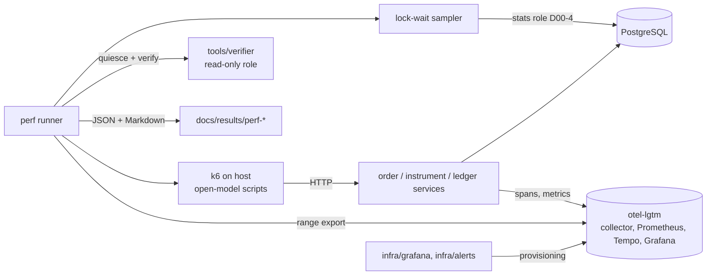

# Step 07 — Observability and performance

> **Pack:** ZeroSum Ledger implementation docs · **Master:** [docs/zerosum_ledger_mvp_plan.md#step-07](zerosum_ledger_mvp_plan.md#step-07) (v1.2)
> **Doc version:** 1.1 · **Date:** 2026-09-15 · **Step status:** Planned (no implementation exists)
> **Planned effort:** 16 h (master schedule; see [docs/zerosum_ledger_mvp_plan.md#schedule-overview](zerosum_ledger_mvp_plan.md#schedule-overview)) · **Gate:** G3
> **Shared procedures:** [docs/README.md#change-detection](README.md#change-detection) · [docs/README.md#source-of-truth](README.md#source-of-truth) · [docs/README.md#status-legend](README.md#status-legend)

<a id="purpose-and-outcome"></a>
## A. Purpose and outcome

**The problem this step solves.** By the end of S06 the system moves money correctly through four services, Kafka and PostgreSQL, but it can't yet be observed or judged as a whole:

- Each upstream step emitted whatever telemetry it needed locally: outbox metrics in S03, lag and pause signals in S04, provider and attempt signals in S05, reconciliation metrics in S06. Nobody has reconciled those names, confirmed they reach the backend, or built views and alerts on top of them.
- Nobody has measured performance under an open-model load. The SP1 lock study (S02) measured the apply engine in isolation. The end-to-end latencies P1–P3, the audit reads P4 and the sustained throughput T1 ([docs/zerosum_ledger_mvp_plan.md#perf-metrics](zerosum_ledger_mvp_plan.md#perf-metrics)) are still targets, not results.
- Hypothesis H2 predicts that hot-entity row locks cap throughput ([docs/zerosum_ledger_mvp_plan.md#bottlenecks](zerosum_ledger_mvp_plan.md#bottlenecks)). Spike SP4 must choose the mitigation from evidence ([docs/zerosum_ledger_mvp_plan.md#spikes](zerosum_ledger_mvp_plan.md#spikes)).

**The concrete deliverable.**

1. A **span and metric name registry** (D07-1), plus the custom spans and metrics that the registry declares but the code doesn't yet emit.
2. **Grafana dashboards** provisioned from the repository (D07-2).
3. **Alert rules**, a recorded **alert-firing test**, and **runbook stubs** with one section per alert (D07-3).
4. **k6 open-model load scripts and a perf runner** that writes reproducible result files (D07-4), plus a **lock-wait sampler** (D07-7).
5. **Performance results** for the test matrix in [docs/zerosum_ledger_mvp_plan.md#perf-tests](zerosum_ledger_mvp_plan.md#perf-tests), with bottleneck analysis (D07-5).
6. The **SP4 decision**, the implemented hot-entity mitigation, a re-measurement, and an ADR-0005 update made through the change procedure (D07-6).

**Contribution to the MVP.**

- Satisfies M12 ([docs/zerosum_ledger_mvp_plan.md#must-have](zerosum_ledger_mvp_plan.md#must-have)).
- Produces the evidence for gate G3 ([docs/zerosum_ledger_mvp_plan.md#decision-gates](zerosum_ledger_mvp_plan.md#decision-gates)) and for the performance hard gates in [docs/zerosum_ledger_mvp_plan.md#go-no-go](zerosum_ledger_mvp_plan.md#go-no-go).
- Supplies the "Performance evidence" and part of the "Operations" sections of the release checklist ([docs/zerosum_ledger_mvp_plan.md#release-checklist](zerosum_ledger_mvp_plan.md#release-checklist)).
- Gives S08 the signals it needs to detect quiescence and measure recovery time, and gives S09 the screenshots and results that the README and résumé bullets may quote.

**In scope**

- Reconciling, naming, and filling gaps in telemetry across `order-service`, `ledger-service`, `instrument-service`, `fake-providers` and `libs/outbox`. Additive instrumentation only; contract changes go through the owner.
- The dashboards and alert rules listed in [docs/zerosum_ledger_mvp_plan.md#monitoring](zerosum_ledger_mvp_plan.md#monitoring), and the M12 alert-firing test.
- Runbook **stubs** only.
- Load scripts for the P1, P2/T1, P3, P4 and SP4 rows of the perf-test matrix. SP1 belongs to S02.
- Executing those runs on the reference laptop, analysing them, and implementing the SP4 mitigation.

**Explicitly excluded**

| Excluded work | Owner |
|---|---|
| Fault injection, chaos runs, ablations, and measuring recovery time under faults | S08 ([docs/step_08_fault_injection_ablation.md#purpose-and-outcome](step_08_fault_injection_ablation.md#purpose-and-outcome)); S07 only defines the signals |
| Final runbook text, dashboard screenshots in the demo video, résumé bullets | S09 ([docs/step_09_demo_docs_release.md#purpose-and-outcome](step_09_demo_docs_release.md#purpose-and-outcome)) |
| SP2 relay tuning and Debezium, even when P2 misses because of relay lag | S04-C01 ([docs/step_04_kafka_pipeline.md#s04-c01](step_04_kafka_pipeline.md#s04-c01)) |
| Hosted-demo quotas, the `demo-public` backend swap, and rate-limit tests (R10) | S09-C01 ([docs/step_09_demo_docs_release.md#s09-c01](step_09_demo_docs_release.md#s09-c01)) |
| Storage-coefficient measurement for the cost formulas | Dropped in master v1.2 under the cost constraint ([docs/zerosum_ledger_mvp_plan.md#decomposition-clarifications](zerosum_ledger_mvp_plan.md#decomposition-clarifications) O13) |
| AOT/CDS startup optimization | Deferred at [docs/zerosum_ledger_mvp_plan.md#cold-warm](zerosum_ledger_mvp_plan.md#cold-warm) |
| Deriving hot-account balances asynchronously (mitigation 4 in [docs/zerosum_ledger_mvp_plan.md#bottlenecks](zerosum_ledger_mvp_plan.md#bottlenecks)) | Not authorized: it changes the invariant model and needs an ADR plus a master change |
| The stretch throughput target in [docs/zerosum_ledger_mvp_plan.md#stage-budgets](zerosum_ledger_mvp_plan.md#stage-budgets) | Reported if reached; never a trigger for work |
| Paging, SLOs, persistent staging | Non-goals ([docs/zerosum_ledger_mvp_plan.md#mvp-vs-production](zerosum_ledger_mvp_plan.md#mvp-vs-production), [docs/zerosum_ledger_mvp_plan.md#environments](zerosum_ledger_mvp_plan.md#environments)) |

**External waiting.** The perf runs need unattended machine time on the reference laptop. The master estimates it at [docs/zerosum_ledger_mvp_plan.md#waiting-time](zerosum_ledger_mvp_plan.md#waiting-time). Machine time is not part of the 16 engineering hours.

<a id="agent-prompt"></a>
## B. Step-specific agent prompt

```text
You are the implementation agent for Step 07 (Observability and performance) of the ZeroSum Ledger project.

Repository root: zerosum-ledger/
Step document: docs/step_07_observability_performance.md

1. Read docs/README.md (source-of-truth, conflict-resolution, change-detection, status-legend), then
   this step document in full, then every source in its section C at the linked anchors. That covers
   the master sections decomposition-clarifications (O9-O13), step-07, performance, perf-metrics, stage-budgets, cold-warm, instrumentation,
   bottlenecks, degraded, perf-tests, monitoring, go-no-go, must-have (M12), decision-gates (G3) and
   spikes (SP4), and the registers (section H) of S00-S06.
2. Inspect the current repository and the registers (section H) and execution records (section I) of
   S00-S06. Resolve every version, metric export mode, apply-engine mode, lock strategy, API contract,
   fault knob and verifier command from the owning register and the artifact it references, never from
   copies in documents. Before anything else, confirm D00-6/D00-7 (telemetry wiring, SP3 outcome),
   D02-3/D02-4/D02-10 (apply engine, ADR-0005, SP1 outcome) and D04-7 (SP2 decision).
3. Run the change-detection procedure (docs/README.md#change-detection) before changing any file.
   Record the revisions and hashes of the documents and directly consumed artifacts in section I.2.
4. Complete only this step's remaining authorized tasks, in dependency order:
   S07-T01 -> S07-T02 -> S07-T03 -> S07-T04 -> S07-T05 -> S07-T06.
   Start S07-C01 only if its evidence trigger holds and unallocated contingency remains.
5. Verify each task exactly as its "Verification and definition of done" field says. A performance
   verdict must come from executed runs that pass the validity checks in S07-T05.
6. Record D07-1...D07-7 with rationale and alternatives in H.1, actual paths in H.2/H.3, evidence in
   H.4, blockers and limitations in H.5, and task status in I.1. Put a trace comment next to every
   authoritative configuration value.
7. Never invent, extrapolate, or round a measurement toward a gate. Mark unexecuted runs "Not run" and
   blocked work "Blocked", naming the exact missing dependency (for example, idle machine time on the
   reference laptop). Never disable durability, instrumentation, or verifier checks to improve a
   result. Do not implement future-step scope: chaos, ablations and recovery-time runs (S08); runbook
   finalization, demo assets and the hosted demo (S09); SP2/Debezium (S04-C01).
8. Re-run change detection at every phase boundary and before handoff.
9. SP4 changes decisions owned by S02 (D02-3, D02-4, ADR-0005). Touching the compose file, database
   roles, or the outbox library changes S00/S03 artifacts. In every such case, stop and follow
   docs/README.md#conflict-resolution: update the owning register, write the impact assessment, and
   mark affected tasks "Needs review". Never weaken an acceptance gate or silently override an owner.

Finish by reporting: tasks done, evidence paths, the G3 result, open blockers, and change requests raised.
```

<a id="required-reading"></a>
## C. Required reading and prerequisites

### C.1 Master sections

| Link | Why |
|---|---|
| [docs/zerosum_ledger_mvp_plan.md#step-07](zerosum_ledger_mvp_plan.md#step-07) | Step objective, task list, outputs, G3 exit criteria, main risk |
| [docs/zerosum_ledger_mvp_plan.md#performance](zerosum_ledger_mvp_plan.md#performance) | Measurement environment; durability must stay on |
| [docs/zerosum_ledger_mvp_plan.md#perf-metrics](zerosum_ledger_mvp_plan.md#perf-metrics) | Definitions of P1–P4 and T1 |
| [docs/zerosum_ledger_mvp_plan.md#stage-budgets](zerosum_ledger_mvp_plan.md#stage-budgets) | Stage allocations, gate and target values, sustained-rate conditions, how p95 budgets compose |
| [docs/zerosum_ledger_mvp_plan.md#cold-warm](zerosum_ledger_mvp_plan.md#cold-warm) | Cold-start reporting, warm-up rule, recovery-time definition |
| [docs/zerosum_ledger_mvp_plan.md#instrumentation](zerosum_ledger_mvp_plan.md#instrumentation) | Proposed spans, metrics, histogram buckets, lock-wait sampler, result-file contents, single-clock assumption |
| [docs/zerosum_ledger_mvp_plan.md#bottlenecks](zerosum_ledger_mvp_plan.md#bottlenecks) | Hot entities, predicted ceiling, mitigation order |
| [docs/zerosum_ledger_mvp_plan.md#degraded](zerosum_ledger_mvp_plan.md#degraded) | Expected behaviour and alert under each dependency failure |
| [docs/zerosum_ledger_mvp_plan.md#perf-tests](zerosum_ledger_mvp_plan.md#perf-tests) | Test matrix, repetitions, max sustainable rate, variance reporting |
| [docs/zerosum_ledger_mvp_plan.md#monitoring](zerosum_ledger_mvp_plan.md#monitoring) | Dashboards, alert table, runbook sections |
| [docs/zerosum_ledger_mvp_plan.md#go-no-go](zerosum_ledger_mvp_plan.md#go-no-go) | Performance hard gates; the T1 soft target and its consequence |
| [docs/zerosum_ledger_mvp_plan.md#must-have](zerosum_ledger_mvp_plan.md#must-have) | M12 (a)–(c) acceptance criteria |
| [docs/zerosum_ledger_mvp_plan.md#decision-gates](zerosum_ledger_mvp_plan.md#decision-gates) | G3: proceed, narrow scope, change architecture |
| [docs/zerosum_ledger_mvp_plan.md#spikes](zerosum_ledger_mvp_plan.md#spikes) | SP4 question, options (a)/(b)/(c), decision criterion |
| [docs/zerosum_ledger_mvp_plan.md#risk-register](zerosum_ledger_mvp_plan.md#risk-register) | R3 hot-entity ceiling, R4 tooling time sink, R9 noisy measurements |
| [docs/zerosum_ledger_mvp_plan.md#waiting-time](zerosum_ledger_mvp_plan.md#waiting-time) | Machine-time estimate for perf runs |
| [docs/zerosum_ledger_mvp_plan.md#topology](zerosum_ledger_mvp_plan.md#topology) | Container budget; k6 runs on the host |
| [docs/zerosum_ledger_mvp_plan.md#decisions](zerosum_ledger_mvp_plan.md#decisions) | ADR-0005 (locks) and ADR-0008 (polling outbox): context for SP4 and relay lag |
| [docs/zerosum_ledger_mvp_plan.md#apply-algorithm](zerosum_ledger_mvp_plan.md#apply-algorithm) | Proposed apply transaction; where lock waits and batching happen |
| [docs/zerosum_ledger_mvp_plan.md#cross-cutting](zerosum_ledger_mvp_plan.md#cross-cutting) | Timeouts, retries and graceful shutdown that bound batch size and alert timing |
| [docs/zerosum_ledger_mvp_plan.md#invariants](zerosum_ledger_mvp_plan.md#invariants) | Invariant IDs and the quiesce definition used after perf runs |
| [docs/zerosum_ledger_mvp_plan.md#scaling-triggers](zerosum_ledger_mvp_plan.md#scaling-triggers) | The ADR-0005 and ADR-0008 trigger rows |
| [docs/zerosum_ledger_mvp_plan.md#minimum-cut](zerosum_ledger_mvp_plan.md#minimum-cut) | What S07 drops under the minimum cut |
| [docs/zerosum_ledger_mvp_plan.md#release-checklist](zerosum_ledger_mvp_plan.md#release-checklist) | Performance and operations evidence the release needs |
| [docs/zerosum_ledger_mvp_plan.md#constraint-updates](zerosum_ledger_mvp_plan.md#constraint-updates) | Cost is not a driver; no cost-tracking work |
| [docs/zerosum_ledger_mvp_plan.md#decomposition-clarifications](zerosum_ledger_mvp_plan.md#decomposition-clarifications) | v1.2 items affecting S07: O9 (DLQ and pending-payout alert rows, new gauges), O10 (machine-time estimate, SP4 *Not run* rule), O11 (platform dashboard optional), O12 (stats role and `pg_stat_statements` provisioned by S00), O13 (storage coefficient dropped) |

### C.2 Earlier step documents and their registers

| Register | Decisions consumed |
|---|---|
| [docs/step_00_foundations.md#decisions-and-outputs](step_00_foundations.md#decisions-and-outputs) | D00-1 pinned versions (k6, OTel agent, observability image, Grafana schema); D00-3 compose topology (memory limits, health checks, profiles, `pg_stat_statements` per O12); D00-4 database roles (including the stats-reading role per O12); D00-5 CI job structure; D00-6 OTel agent attach method and metrics export mode; D00-7 SP3 outcome and fallback; D00-8 `ZS_*` environment and redaction conventions; D00-9 ADR process and results template; D00-10 test-tag conventions |
| [docs/step_01_domain_contracts.md#decisions-and-outputs](step_01_domain_contracts.md#decisions-and-outputs) | D01-4 FareSplitter; D01-6 chart of accounts (hot entity identities); D01-7 currency allow-list (bounded metric label); D01-8 JSON Schemas; D01-10 seeded generators and seed reporting |
| [docs/step_02_ledger_core.md#decisions-and-outputs](step_02_ledger_core.md#decisions-and-outputs) | D02-1 ledger schema (applied-order timestamps); D02-3 apply engine entrypoint; D02-4 lock strategy, retry classification, ADR-0005; D02-5 entity auto-provisioning; D02-7 ledger read API; D02-8 invariant queries I2–I5; D02-9 quarantine; D02-10 SP1 result and the batch-apply must-have decision; D02-11 concurrency stress harness |
| [docs/step_03_order_service_outbox.md#decisions-and-outputs](step_03_order_service_outbox.md#decisions-and-outputs) | D03-2 money-order API; D03-4 auth tokens and principal mapping; D03-5 `libs/outbox` design and metrics; D03-6 payment-event mapper (P3 path); D03-7 outbox stats endpoint |
| [docs/step_04_kafka_pipeline.md#decisions-and-outputs](step_04_kafka_pipeline.md#decisions-and-outputs) | D04-1 topics and partition key; D04-2 client configuration (lag metrics); D04-3 listener design (batching); D04-4 error policy (pause signal, DLQ naming, quarantine); D04-5 freshness computation; D04-6 pipeline e2e suite; D04-7 relay lag measurement and SP2 decision |
| [docs/step_05_instruments_fake_providers.md#decisions-and-outputs](step_05_instruments_fake_providers.md#decisions-and-outputs) | D05-2 fake-provider fault knobs (latency for P3); D05-4 instruments schema (attempt timestamps); D05-5 attempt state machines; D05-8 sweeper and `UNKNOWN` schedule; D05-11 kill switches (runbook); D05-12 scenario catalog and runner (smoke traffic); D05-13 instrument API (instrument registration for P3) |
| [docs/step_06_reconciliation_verifier.md#decisions-and-outputs](step_06_reconciliation_verifier.md#decisions-and-outputs) | D06-4 reconciliation API and metrics; D06-5 verifier CLI (post-run invariant check, quiesce detection) |

### C.3 Artifacts that must already exist

These are the paths **as planned** by upstream documents. Always resolve the actual path from the upstream register (section H.2/H.3 of the owning step), not from this list.

- **S00:** `docker-compose.yml` with PostgreSQL, Kafka and the `otel-lgtm` container (D00-3); OTel agent attachment and metrics export for all four services (D00-6, D00-7); `gradle/libs.versions.toml` and recorded tool versions (D00-1); `infra/postgres/init.sql` roles (D00-4); `docs/results/TEMPLATE.md` (D00-9); `.github/workflows/ci.yml` (D00-5, D00-10).
- **S01:** `libs/money` seeded generators and `FareSplitter` (D01-10, D01-4); `libs/contracts` JSON Schemas (D01-8).
- **S02:** `services/ledger-service` apply engine, invariants and read API (D02-3, D02-7, D02-8); `docs/adr/0005-*.md` (D02-4); `docs/results/sp1-lock-study.md` (D02-10); the concurrency stress harness (D02-11).
- **S03:** `services/order-service` and `openapi/order-service.yaml` (D03-2); `libs/outbox` with metrics and trace-context handling (D03-5).
- **S04:** batch listener, error handling, freshness endpoint and pipeline e2e suite (D04-3…D04-6); relay lag result and SP2 decision (D04-7).
- **S05:** `services/fake-providers` with fault knobs and `services/instrument-service` (D05-2, D05-5, D05-8); scenario catalog and runner (D05-12); `openapi/instrument-service.yaml` (D05-13).
- **S06:** reconciliation metrics (D06-4); `tools/verifier` (D06-5).

### C.4 Blocking vs independent work

| Missing input | Blocks | Can proceed with independent preparation |
|---|---|---|
| D00-6 / D00-7 (telemetry wiring, SP3 outcome) | S07-T01 verification; S07-T02 and S07-T03 live checks | S07-T01 registry draft from [docs/zerosum_ledger_mvp_plan.md#instrumentation](zerosum_ledger_mvp_plan.md#instrumentation) and upstream registers; S07-T02 dashboard JSON written against registry names; S07-T03 rule files and offline rule tests |
| D02-3 / D02-4 / D02-10 (apply engine, locks, SP1) | S07-T05 pipeline rows; S07-T06 | S07-T04 scripts and runner; P1-only smoke runs against order-service |
| D03-2 / D03-4 (order API, tokens) | S07-T04 smoke verification; S07-T05 | S07-T04 lock-wait sampler; runner pre-flight and result writer |
| D03-5 / D03-7 (outbox metrics, stats) | S07-T01 outbox entries; S07-T03 outbox-backlog live test | Every other registry entry and rule |
| D04-4 / D04-5 / D04-7 (pause signal, freshness, SP2 result) | Consumer-lag, paused-listener and DLQ alert tests; the time-based lag gauge; attributing a P2 miss to relay lag | Remaining dashboards and rules |
| D05-2 / D05-5 / D05-8 / D05-12 / D05-13 | Providers dashboard data; `UNKNOWN`-age alert test; P3 runs; smoke traffic | Registry entries, panel layout, P1/P2/P4 scripts |
| D06-4 / D06-5 (reconciliation metrics, verifier) | Reconciliation panels and alert; the zero-violation half of T1 in S07-T05 | Latency measurements may run, but the T1 verdict stays "Not evaluated" until the verifier exists |
| Stats-reading role and `pg_stat_statements` (D00-4/D00-3, provisioned by S00 per O12) | S07-T04 sampler verification; statement statistics in S07-T05 | Sampler script; if the S00 register lacks them, raise a change request to the owner |
| Unattended machine time on the reference laptop (external) | S07-T05 runs; S07-T06 re-measurement | S07-T04 short smoke runs, labelled "smoke, not evidence" and kept out of `docs/results/` |

<a id="ownership-and-requirements"></a>
## D. Ownership and engineering requirements

### D.1 Decisions and contracts owned by this step

| Decision ID | What is decided | Master's proposed starting point |
|---|---|---|
| D07-1 | **Span and metric name registry.** For every span and metric: name in code, series name in the backend under the selected export mode, type, unit, bounded labels, emitting module, owning decision, consumers (panel, alert, perf metric, S08 signal). Also: histogram bucket configuration, invariant-gauge evaluation interval, counter initialization, and the recovery-time query S08 uses. | [docs/zerosum_ledger_mvp_plan.md#instrumentation](zerosum_ledger_mvp_plan.md#instrumentation) |
| D07-2 | **Dashboards.** Set, panels, provisioning method, stable UIDs, datasource binding, screenshot procedure. | [docs/zerosum_ledger_mvp_plan.md#monitoring](zerosum_ledger_mvp_plan.md#monitoring) (dashboards list); M12(b) at [docs/zerosum_ledger_mvp_plan.md#must-have](zerosum_ledger_mvp_plan.md#must-have); required vs optional set per O11 at [docs/zerosum_ledger_mvp_plan.md#decomposition-clarifications](zerosum_ledger_mvp_plan.md#decomposition-clarifications) |
| D07-3 | **Alert rules and firing test.** Rule engine and format, one rule per alert, offline rule tests, live firing test, runbook stub structure. | [docs/zerosum_ledger_mvp_plan.md#monitoring](zerosum_ledger_mvp_plan.md#monitoring) (alert table, including the v1.2 rows); [docs/zerosum_ledger_mvp_plan.md#degraded](zerosum_ledger_mvp_plan.md#degraded); M12(c); O9 at [docs/zerosum_ledger_mvp_plan.md#decomposition-clarifications](zerosum_ledger_mvp_plan.md#decomposition-clarifications) |
| D07-4 | **k6 scripts and perf runner.** Scripts per test row, payload corpus, run matrix file, stack reset policy, pre-flight and validity checks, result writer. | [docs/zerosum_ledger_mvp_plan.md#perf-tests](zerosum_ledger_mvp_plan.md#perf-tests); [docs/zerosum_ledger_mvp_plan.md#cold-warm](zerosum_ledger_mvp_plan.md#cold-warm); k6 open model at [docs/zerosum_ledger_mvp_plan.md#stack](zerosum_ledger_mvp_plan.md#stack) |
| D07-5 | **Perf results.** Result files, gate verdicts, max sustainable rate, T1 outcome, bottleneck analysis, invalid-run log. | [docs/zerosum_ledger_mvp_plan.md#go-no-go](zerosum_ledger_mvp_plan.md#go-no-go); [docs/zerosum_ledger_mvp_plan.md#stage-budgets](zerosum_ledger_mvp_plan.md#stage-budgets) |
| D07-6 | **SP4 decision and hot-entity mitigation.** Option chosen, configuration, measured alternatives. Changes D02-3/D02-4 and ADR-0005 via the change procedure. | [docs/zerosum_ledger_mvp_plan.md#spikes](zerosum_ledger_mvp_plan.md#spikes); [docs/zerosum_ledger_mvp_plan.md#bottlenecks](zerosum_ledger_mvp_plan.md#bottlenecks) |
| D07-7 | **Lock-wait sampler.** Sampling method, database role, output format, and how samples join to run windows. | [docs/zerosum_ledger_mvp_plan.md#instrumentation](zerosum_ledger_mvp_plan.md#instrumentation) (Database bullet) |

### D.2 Inherited decisions

| Decision | Owner | How this step must use it |
|---|---|---|
| Tool and image versions (k6, OTel agent, observability container, Grafana) | D00-1 | Pin scripts, dashboard schema and rule format to the recorded versions. Record them in every result file. |
| Compose topology, memory limits, health checks | D00-3 | Measure only with the recorded limits. `pg_stat_statements` is enabled by D00-3 (O12). Any mount added for dashboards or rules is a change request to D00-3. |
| Database roles | D00-4 | Analysis queries use the read-only `verifier` role. The sampler uses the stats-reading role that D00-4 provisions (O12). |
| CI job structure and test tags | D00-5, D00-10 | Offline rule tests and registry checks run in the fast job. The live firing test is tagged for the e2e/nightly job. |
| Telemetry wiring and export mode | D00-6, D00-7 | The registry records backend series names for the export mode actually selected. The SP3 fallback (scraping instead of OTLP metrics) changes series naming and must be handled. |
| Secrets and redaction | D00-8 | Tokens come from `ZS_*` variables. Span attributes, k6 output and result files must never contain them. |
| Results template and ADR process | D00-9 | Every result file uses the template. ADR-0005 is revised following the ADR process. |
| Seeded generators, FareSplitter, chart of accounts | D01-10, D01-4, D01-6 | The k6 payload corpus comes from the S01 generators, not from a second money implementation in JavaScript. Seeds are reported per D01-10. |
| Apply engine, lock strategy, SP1 outcome | D02-3, D02-4, D02-10 | Determine the engine mode in use before measuring. SP4 changes these only through the change procedure. |
| Ledger schema and invariant queries | D02-1, D02-8 | P2 is computed from the applied-order timestamps. The invariant gauge reuses the D02-8 queries. |
| Stress harness | D02-11 | Mandatory regression after any SP4 change |
| Order API, auth, outbox, mapper, stats | D03-2, D03-4, D03-5, D03-6, D03-7 | k6 targets the selected API contract. The outbox metrics and trace-context propagation come from D03-5. Renaming an outbox metric is a change request. |
| Topics, client config, listener, error policy, freshness, e2e suite, SP2 | D04-1…D04-7 | Lag and paused-listener signals come from D04-2/D04-4. The time-based lag gauge reuses the D04-5 computation. The e2e suite is mandatory regression after SP4. A P2 miss caused by relay lag is routed to S04-C01 via D04-7. |
| Fault knobs, state machines, sweeper schedule, kill switches, scenario runner, instrument API | D05-2, D05-5, D05-8, D05-11, D05-12, D05-13 | P3 sets provider latency through the knobs. Alerts on `UNKNOWN` age follow the D05-8 schedule. Runbook stubs link the kill switches. Smoke traffic uses the scenario runner. |
| Reconciliation metrics, verifier | D06-4, D06-5 | Reconciliation panels and alert use D06-4. Every measured run ends with quiesce detection and a verifier pass per D06-5. |

### D.3 Engineering requirements

**Module and package boundaries**

- **Instrumentation lives in the module that owns the behaviour.**
  - Validation and persistence spans: `order-service`.
  - Relay spans and publish-lag metrics: `libs/outbox`.
  - Apply, lock-wait and order-to-apply metrics: the `ledger-service` apply engine.
  - Attempt-transition and provider-call spans: the provider-agnostic instrument core.
  - No new service or shared "metrics" library is introduced. Micrometer and the OpenTelemetry API come from the dependencies recorded in D00-1/D00-6; a missing artifact is a change request to D00-1.
- **The provider-call span wraps the `PaymentInstrument` call in the core**, not inside `instrument.providers.*`. The provider label comes from the instrument's provider identity. This keeps the module boundary and ArchUnit rules intact ([docs/zerosum_ledger_mvp_plan.md#repo-structure](zerosum_ledger_mvp_plan.md#repo-structure)).
- **Load tooling stays out of the runtime.** k6 scripts, the runner and the sampler live under `tools/k6/` (planned) and run on the host ([docs/zerosum_ledger_mvp_plan.md#topology](zerosum_ledger_mvp_plan.md#topology)). No service depends on them.
- **Telemetry never changes money behaviour.**
  - No metric or span call may throw into, or roll back, a money transaction.
  - Success-path latency metrics are recorded after `COMMIT` succeeds.
  - An exporter or backend outage degrades only telemetry.

**Interfaces**

- **Telemetry export** (OTLP or scrape, per D00-7) from the services to the observability container, and **file provisioning** of dashboards and rules from the repository.
- **Read-only backend query APIs** (Prometheus range queries, Tempo trace lookup, Grafana alert state), used only by tools and tests.
- **Service APIs** used by k6 and tests: the money-order API (D03-2), the instrument API (D05-13), the ledger read API (D02-7) and the fake-provider admin knobs (D05-2).
- **SQL** through the read-only `verifier` role (analysis) and the stats-reading role from D00-4 (sampler).

**Data flows**



**Lifecycle behaviour**

- **Startup.**
  - Counters with known, bounded label sets are registered at zero at startup. Otherwise an "increase" alert can miss the first event, because no earlier sample exists.
  - Gauges report a value once the dependency they observe is reachable.
  - The invariant evaluator starts only after migrations have run and the first database connection succeeds.
- **Shutdown.** Metric and span exporters flush during the graceful-shutdown window defined in [docs/zerosum_ledger_mvp_plan.md#cross-cutting](zerosum_ledger_mvp_plan.md#cross-cutting). Losing telemetry on a hard kill is acceptable, because telemetry is never evidence of money state; the verifier is.
- **Crash of tooling.**
  - The runner marks an interrupted run `incomplete` and never overwrites an earlier result.
  - The sampler exits when the runner exits.
  - The firing test always restores the containers it stopped.
- **Retries.**
  - Tests poll the backend with a bounded timeout, derived from the export interval, the rule evaluation interval and the rule's pending duration.
  - A measured run is never repeated automatically to chase a pass. A rerun is allowed only for a run that failed a validity check, and the reason is recorded.

**Security and trust boundaries**

- **Telemetry content.** Span attributes and log fields must not carry bearer tokens, HMAC signatures, `Authorization` headers or request bodies (D00-8). Identifiers such as order or entity IDs are allowed on spans (synthetic data), never as metric labels.
- **Admin endpoints.** Fault knobs used for P3 are admin endpoints under TB4 ([docs/zerosum_ledger_mvp_plan.md#trust-boundaries](zerosum_ledger_mvp_plan.md#trust-boundaries)). The admin token comes from the environment. S07 doesn't need the `chaos` profile; if a task seems to need it, that work belongs to S08.
- **Stats-reading role.** The sampler uses the role D00-4 provisions for statistics access (O12) and needs no table grants. If that role also holds table grants, record it in H.5 rather than widening its use (TB5's read-only principle).
- **Result files** are checked for token patterns before commit, the same hygiene as the release secret scan ([docs/zerosum_ledger_mvp_plan.md#secrets](zerosum_ledger_mvp_plan.md#secrets)).
- **Grafana** stays bound to the local interface per D00-3.

**Deployment constraints**

- **Machine.** Every measured run uses the reference laptop and the environment rules in [docs/zerosum_ledger_mvp_plan.md#performance](zerosum_ledger_mvp_plan.md#performance). Laptop numbers are that environment's baseline, never cloud numbers.
- **Durability.** PostgreSQL durability settings are read and recorded at the start of each run. A run with durability disabled is invalid.
- **Resources.** Container memory limits and the Docker Desktop CPU and memory allocation are recorded per run. Changing either between compared runs invalidates the comparison.
- **Instrumentation.** Configuration, including trace sampling, is identical across runs that are compared (baseline vs SP4 option).
- **Clock.** All services share one clock ([docs/zerosum_ledger_mvp_plan.md#instrumentation](zerosum_ledger_mvp_plan.md#instrumentation)). k6 on the host uses the host clock, so the runner records the host-to-VM clock offset at the start and end of each run.

### D.4 Configuration ownership

| Authoritative value | Planned location | Trace |
|---|---|---|
| Registry entries, series names, label bounds, counter-initialization list | `infra/otel/registry.yaml` | `# decision: D07-1 — docs/step_07_observability_performance.md#decisions-and-outputs` |
| Histogram bucket boundaries, invariant-gauge interval | Each service's `application.yaml` (module paths per D00-2) | Same D07-1 trace comment |
| Dashboard provisioning provider | `infra/grafana/provisioning/dashboards.yaml` | D07-2 trace comment |
| Dashboard JSON | `infra/grafana/dashboards/*.json` | JSON has no comments. Each dashboard's `description` field names D07-2 and this document's register anchor. |
| Alert conditions, pending durations, severities, runbook links | `infra/alerts/*.yaml` | `# target: docs/zerosum_ledger_mvp_plan.md#monitoring` plus `# decision: D07-3 — …` |
| Rates, durations, warm-up, repetitions per test | `tools/k6/matrix.yaml` | `# target: docs/zerosum_ledger_mvp_plan.md#perf-tests` plus `# decision: D07-4 — …` |
| Stack reset policy, validity tolerances (clock offset, error rate) | `tools/k6/run-perf.sh` header or `tools/k6/matrix.yaml` | D07-4 |
| Sampler interval and output format | `tools/k6/lock-wait-sampler.sh` | `# target: docs/zerosum_ledger_mvp_plan.md#instrumentation` plus D07-7 |
| Batch size, shard count, or other mitigation settings | `ledger-service` `application.yaml` | `# decision: D07-6 — docs/step_07_observability_performance.md#decisions-and-outputs; owner D02-3/D02-4 — docs/step_02_ledger_core.md#decisions-and-outputs` |
| Monitoring role and `pg_stat_statements` | `infra/postgres/init.sql`, `docker-compose.yml` | Owned by D00-4/D00-3 (provisioned per O12); consumed, not changed |
| Hot-entity lock rationale | `docs/adr/0005-*.md` | Owned by D02-4; revised through D07-6 |

**Permitted alternatives downstream work must handle**

| Alternative | Decided in | What changes |
|---|---|---|
| SP4 option (a) batched apply, (b) sharded hot entities, or (c) both | S07-T06 (D07-6) | S08 apply-engine seams and verifier aggregation; S09 architecture doc and throughput claim |
| T1 missed | S07-T05/S07-T06 (D07-5) | The throughput résumé bullet is dropped ([docs/zerosum_ledger_mvp_plan.md#go-no-go](zerosum_ledger_mvp_plan.md#go-no-go)). S09 reports the measured ceiling. |
| SP3 fallback: scraping instead of OTLP metrics, or Boot 4.0.x | D00-7 | Series names and unit suffixes in D07-1; the range-export source |
| SP1 outcome: batched apply already must-have | D02-10 | The S07-T05 baseline is batched; S07-T06 starts from option (a) already in place |
| G1 alternative: account-level optimistic locking | S02-C01 (D02-4) | Lock-wait sampling shows few lock waits. S07-T06 measures conflict-retry rate instead, and the mitigation options are re-evaluated. |
| SP2: Debezium replaces the polling relay | S04-C01 (D04-7 → D03-5) | Outbox publish-lag metrics come from the connector. Outbox-backlog alert source changes. |
| G2 alternative: instrument-service writes orders | S05-C01 (D03-6) | The P3 stage path loses the mapper hop, so the P3 computation must follow the selected path |

<a id="phases-and-tasks"></a>
## E. Phases and tasks

| Phase | Tasks | Hours |
|---|---|---|
| Phase 1 — Instrumentation | S07-T01 (3) | 3 |
| Phase 2 — Dashboards and alerts | S07-T02 (2), S07-T03 (2) | 4 |
| Phase 3 — Load tooling | S07-T04 (3) | 3 |
| Phase 4 — Measurement and mitigation | S07-T05 (3), S07-T06 (3) | 6 |
| **Total** | | **16** |

Conditional task S07-C01 carries 0 planned hours. It is funded from unallocated contingency only if its trigger holds.

<a id="phase-1"></a>
### Phase 1 — Instrumentation

**Objective:** every signal needed by dashboards, alerts, the perf analysis and S08 is named once in a registry, is emitted by the owning module, and is visible in the backend.

**Exit checkpoint:**
- The registry check passes against a live stack after smoke traffic.
- One trace covering the M12(a) path is recorded.
- Change detection has been re-run, and I.2 is updated.

<a id="s07-t01"></a>
#### S07-T01 — Custom spans and metric name registry
- **Outcome:** a single registry (D07-1) lists every span and metric the project relies on. The spans and metrics it declares but the code doesn't yet emit are added in their owning modules. A check proves each registered series reaches the backend, and a single trace covers the M12(a) path.
- **Estimate:** 3 h
- **Inputs:**
  - Proposed names, buckets and boundaries: [docs/zerosum_ledger_mvp_plan.md#instrumentation](zerosum_ledger_mvp_plan.md#instrumentation). Stages to measure: [docs/zerosum_ledger_mvp_plan.md#stage-budgets](zerosum_ledger_mvp_plan.md#stage-budgets). Alert signals: [docs/zerosum_ledger_mvp_plan.md#monitoring](zerosum_ledger_mvp_plan.md#monitoring) and [docs/zerosum_ledger_mvp_plan.md#degraded](zerosum_ledger_mvp_plan.md#degraded). M12(a): [docs/zerosum_ledger_mvp_plan.md#must-have](zerosum_ledger_mvp_plan.md#must-have).
  - Telemetry wiring and export mode: D00-6, D00-7 ([docs/step_00_foundations.md#s00-t08](step_00_foundations.md#s00-t08), [docs/step_00_foundations.md#s00-t07](step_00_foundations.md#s00-t07)).
  - Existing signals: D03-5 outbox metrics ([docs/step_03_order_service_outbox.md#s03-t05](step_03_order_service_outbox.md#s03-t05)); D04-2/D04-4/D04-5 lag, pause and DLQ signals; trace propagation evidence ([docs/step_04_kafka_pipeline.md#s04-t06](step_04_kafka_pipeline.md#s04-t06)); provider and attempt metrics in the S05 register; D06-4 reconciliation metrics ([docs/step_06_reconciliation_verifier.md#s06-t03](step_06_reconciliation_verifier.md#s06-t03)); D02-8 invariant queries.
  - Artifacts: service modules per D00-2, `libs/outbox`, the scenario runner (D05-12).
- **Depends on:** S00-T08, S03-T05, S04-T06, S05-T13, S06-T03
- **Instructions:**
  1. **Inventory what exists.** Start the stack per D00-3, run one W1 scenario with the D05-12 runner, list every series and span name the backend now holds, and find each one's owning decision in the upstream registers.
  2. **Create the registry** at `infra/otel/registry.yaml` (planned). Each entry holds:
     - signal kind (span, histogram, counter, gauge);
     - name in code;
     - series name in the backend under the selected export mode (D00-7), including any unit or `_total` suffix the export path adds;
     - unit;
     - labels, with their allowed value sets;
     - emitting module;
     - owning decision (upstream ID or D07-1);
     - consumers (dashboard panel, alert rule, perf metric P1–P4/T1, S08 signal);
     - status: `existing`, `added`, or `rename requested`.
  3. **Reconcile names** against the proposals at [docs/zerosum_ledger_mvp_plan.md#instrumentation](zerosum_ledger_mvp_plan.md#instrumentation). Where an upstream step already emits a signal under another name, register the existing name rather than adding a duplicate; request a rename from the owner only if the name is misleading (for example, a wrong unit). Master v1.2 adds proposed gauges for the alert signals that previously had none: time-based consumer lag, paused listener, oldest `UNKNOWN` attempt age and oldest pending payout age ([docs/zerosum_ledger_mvp_plan.md#decomposition-clarifications](zerosum_ledger_mvp_plan.md#decomposition-clarifications) O9). Register them under the proposed names unless an upstream name already exists.
  4. **Add the missing custom spans** at the stage boundaries used by the stage budgets:
     - order validation and order persistence (`order-service`);
     - relay batch (`libs/outbox`);
     - ledger apply batch, carrying batch size, entity count and lock-wait time as attributes (`ledger-service`);
     - attempt transition and provider call (instrument core).
     Use the OpenTelemetry API artifact recorded in D00-1. If it's absent, raise a change request to D00-1 rather than adding an unpinned dependency.
  5. **Add the missing metrics in their owning modules:**
     - **Latency histograms:** order-to-apply, outbox publish lag, apply duration, lock wait, provider call.
     - **Counters:** attempt state transitions, quarantined orders, DLQ publications, invariant violations by invariant ID, apply retries by retry class (from D02-4's classification).
     - **Gauges:** oldest unpublished outbox age, consumer lag in records, consumer lag in time (reusing the D04-5 freshness computation, not a second implementation), oldest `UNKNOWN` attempt age, oldest pending payout age, `NEEDS_REVIEW` count, listener paused state, non-zero clearing accounts. The v1.2 gauges are proposed at [docs/zerosum_ledger_mvp_plan.md#instrumentation](zerosum_ledger_mvp_plan.md#instrumentation) (O9).
  6. **Configure histograms** as bucket histograms with the SLO boundaries proposed at [docs/zerosum_ledger_mvp_plan.md#instrumentation](zerosum_ledger_mvp_plan.md#instrumentation). Record the selected boundaries in D07-1. Don't use client-side computed percentiles: they can't be aggregated across instances or time windows.
  7. **Measure lock wait precisely.** Time only the statement that acquires the sorted entity locks inside the D02-3 apply transaction. Record order-to-apply latency after `COMMIT` succeeds, one observation per applied order. Redelivered orders that the dedupe step drops don't produce an observation.
  8. **Add the invariant gauge.** It evaluates the D02-8 queries (I2 per currency, quarantine count, clearing accounts) at the interval recorded in D07-1. It exports the count of violations per invariant ID. Keep the evaluation cheap enough to leave on during measured runs, and never turn it off to improve a result.
  9. **Initialize counters at zero** at startup for every known label combination (bounded sets only). Record the list in the registry.
  10. **Bound labels.**
      - Allowed: service, provider, operation, outcome, attempt kind, status, invariant ID, currency (bounded by D01-7), topic, retry class.
      - Forbidden as metric labels: entity, order, attempt, group or idempotency-key identifiers.
  11. **Confirm M12(a) trace continuity.**
      - Submit one order and fetch its trace from Tempo by trace ID.
      - It must contain the HTTP server span, the relay publish span for that record, the Kafka consume span, and an apply span for that record.
      - Batch-level spans (relay batch, apply batch) carry span links to the per-record contexts.
      - If the outbox doesn't persist and restore the originating trace context, raise a change request to D03-5. Don't patch it silently.
  12. **Write the registry check**, planned `infra/otel/check-registry.sh`. It reads the registry, queries the backend for each series, and fails when a registered series is absent after smoke traffic. It also reports series that exist in the backend but aren't registered, as warnings. S07-T02 and S07-T03 reuse it to lint dashboards and rules.
- **Edge cases and failure behavior:**
  - **SP3 fallback (scraping) selected.** Series names and suffixes differ from OTLP translation. The registry holds the names actually observed, and the check runs against the selected mode only.
  - **Double-counted spans.** The agent's auto-instrumentation already creates JDBC, HTTP and Kafka spans. Custom spans wrap stages; they don't duplicate those spans. Check the trace for duplicate nested spans with identical boundaries.
  - **Rolled-back or retried apply transactions** must not record order-to-apply or apply-duration success observations. Retries are counted in the retry counter.
  - **Batch apply** (per D02-10/D04-3): one apply-duration observation per batch, one order-to-apply observation per applied order. The registry states this explicitly, so S07-T05 doesn't misread per-batch counts as throughput.
  - **Gauges without a data source** (the backend is down, or the lag can't be computed while Kafka is down) report absence, not zero. S07-T03's rules handle absence explicitly.
  - **Telemetry export failure** must not affect request handling or apply. Verify it by stopping the observability container during smoke traffic.
  - **Sensitive data:** no tokens, signatures or request bodies in span attributes (D00-8).
- **Outputs:** planned `infra/otel/registry.yaml`; planned `infra/otel/check-registry.sh`; instrumentation changes in the owning modules (paths per D00-2); planned `docs/results/img/m12a-trace.png`; change requests (if any) recorded in I.2.
- **Verification and definition of done:**
  - Planned `ApplyMetricsTest` (ledger-service, integration tag per D00-10) passes. It forces a rollback and a redelivery in the apply engine and asserts that neither produces a success observation, and that a committed batch records one order-to-apply observation per applied order.
  - Planned `TelemetryIsolationTest` (or a scripted smoke step) passes: with the observability container stopped, orders are still accepted and applied.
  - After W1 smoke traffic, `infra/otel/check-registry.sh` exits 0, with every registered series present.
  - The number of series per metric stays within the bound recorded in D07-1.
  - The M12(a) trace ID and screenshot are recorded in H.4. The trace contains the four stages listed in instruction 11.

<a id="phase-2"></a>
### Phase 2 — Dashboards and alerts

**Objective:** operators and reviewers can see flow, invariants, providers and platform health from repository-provisioned dashboards. Every alert in the master's alert table exists as a tested rule with a runbook stub.

**Exit checkpoint:**
- A fresh `docker compose down -v && docker compose up -d` shows the dashboards and rules with no manual import.
- The offline rule tests pass.
- The live firing test is recorded in H.4.
- Change detection has been re-run.

<a id="s07-t02"></a>
#### S07-T02 — Dashboards provisioned from the repository
- **Outcome:** the dashboards listed in [docs/zerosum_ledger_mvp_plan.md#monitoring](zerosum_ledger_mvp_plan.md#monitoring) are provisioned from files in the repository, use only registered series, and include the stage-breakdown and recovery-time views that S07-T05 and S08 need (D07-2).
- **Estimate:** 2 h
- **Inputs:**
  - Dashboard list: [docs/zerosum_ledger_mvp_plan.md#monitoring](zerosum_ledger_mvp_plan.md#monitoring). M12(b): [docs/zerosum_ledger_mvp_plan.md#must-have](zerosum_ledger_mvp_plan.md#must-have). Stage rows: [docs/zerosum_ledger_mvp_plan.md#stage-budgets](zerosum_ledger_mvp_plan.md#stage-budgets). Recovery-time definition: [docs/zerosum_ledger_mvp_plan.md#cold-warm](zerosum_ledger_mvp_plan.md#cold-warm).
  - D07-1 registry (S07-T01). D00-1 Grafana version. D00-3 compose topology.
  - D06-4 reconciliation metrics. D05-5 attempt states.
  - Artifacts: `infra/otel/registry.yaml`, `docker-compose.yml`.
- **Depends on:** S07-T01
- **Instructions:**
  1. **Add Grafana file provisioning:** a dashboards provider file at planned `infra/grafana/provisioning/dashboards.yaml`, and dashboard JSON files at planned `infra/grafana/dashboards/*.json`. If D00-3's compose file doesn't already mount these paths into the observability container, raise a change request to D00-3 for the additive mount.
  2. **Build the dashboards** named in the master's monitoring section.
     - **Money invariants:** I2 per currency, quarantined orders, reconciliation breaks, non-zero clearing accounts, hash-chain verification failures.
     - **Flow:** order rate, apply rate, order-to-apply latency, outbox oldest age and publish lag, consumer lag in records and in time, paused state, DLQ publications.
     - **Providers:** call latency and outcome by provider and operation, attempts by state, oldest `UNKNOWN` age, oldest pending payout age, `NEEDS_REVIEW`, returns.
     - **Platform:** JVM and GC pauses, thread counts, Hikari pool usage and pending requests, PostgreSQL lock waits, apply retries by class, disk (where a source exists).
     Flow, invariants and providers are required; platform is optional (O11 at [docs/zerosum_ledger_mvp_plan.md#decomposition-clarifications](zerosum_ledger_mvp_plan.md#decomposition-clarifications)). Build platform if time allows, because it serves the S07-T05 bottleneck analysis; otherwise take the same data from range exports and record the omission in D07-2.
  3. **Add a "stage breakdown" row** to the flow dashboard, with one panel per stage row in [docs/zerosum_ledger_mvp_plan.md#stage-budgets](zerosum_ledger_mvp_plan.md#stage-budgets). Label panels with the P-ID and stage name. Gate and target lines in panels are allowed as executable values, traced in the dashboard description to the master anchor.
  4. **Add a recovery-time panel and a saved query.** The query computes the time from a service restart to consumer lag returning to zero, following [docs/zerosum_ledger_mvp_plan.md#cold-warm](zerosum_ledger_mvp_plan.md#cold-warm). Record the query text in D07-1 as the signal S08 consumes.
  5. **Bind panels to the datasource through a dashboard variable or provisioned UID,** never a display name. This keeps dashboards importable into another backend, which S09-C01 may need.
  6. **Keep the JSON stable.** Fixed dashboard UIDs; no instance-specific `id` or `version` fields; the schema version supported by the pinned Grafana. UI edits are not persisted: export them back to the repository.
  7. **Extend the registry check** to extract the series names each panel queries and fail on any name that isn't in the registry.
  8. **Define the screenshot procedure** for S07-T05 and S09: the dashboard, time range and panels to capture, and the planned path `docs/results/img/`.
- **Edge cases and failure behavior:**
  - **A registered series with no samples yet** (for example, returns before any payout ran) shows "No data". Panels whose data needs a fault or a later scenario are listed in D07-2, so reviewers don't treat them as broken.
  - **Counter resets after a service restart** must not show negative rates. Use rate or increase functions that handle resets.
  - **A Grafana version change in D00-1** can alter the JSON schema. Re-provision and re-run the check after any version change detected in I.2.
  - **No disk metric available in the local stack.** Record a limitation in H.5 rather than inventing a source. The disk alert matters mainly for the optional hosted demo (S09-C01).
  - **Provisioning failure** (for example, a malformed file) is logged by Grafana and the dashboard is missing. The verification below catches it.
- **Outputs:** planned `infra/grafana/provisioning/dashboards.yaml`; planned `infra/grafana/dashboards/*.json`; extended registry check; D07-2 entry with dashboard UIDs and the recovery-time query.
- **Verification and definition of done:**
  - After `docker compose down -v && docker compose up -d` and W1 smoke traffic, a Grafana search by UID returns every dashboard, with no manual import.
  - Every panel that needs only normal traffic returns data. Fault-dependent panels are listed in D07-2.
  - The extended registry check exits 0: no unregistered series is referenced.
  - Stopping and restarting `ledger-service` during smoke traffic produces a numeric result from the recovery-time query, recorded in H.4 as a query validation, not as a recovery-time measurement.

<a id="s07-t03"></a>
#### S07-T03 — Alert rules, alert-firing test and runbook stubs
- **Outcome:** every alert in [docs/zerosum_ledger_mvp_plan.md#monitoring](zerosum_ledger_mvp_plan.md#monitoring) exists as a provisioned rule with a runbook link. Deterministic offline tests prove each rule's firing logic. A live firing test in the compose stack records evidence for the M12(c) conditions. `docs/runbook.md` holds one stub per alert (D07-3).
- **Estimate:** 2 h
- **Inputs:**
  - Alert table and runbook procedure: [docs/zerosum_ledger_mvp_plan.md#monitoring](zerosum_ledger_mvp_plan.md#monitoring). Dependency behaviour: [docs/zerosum_ledger_mvp_plan.md#degraded](zerosum_ledger_mvp_plan.md#degraded). M12(c): [docs/zerosum_ledger_mvp_plan.md#must-have](zerosum_ledger_mvp_plan.md#must-have).
  - D07-1 registry; D07-2 dashboards.
  - D04-4 poison handling and DLQ naming ([docs/step_04_kafka_pipeline.md#s04-t03](step_04_kafka_pipeline.md#s04-t03)); D05-2 fault knobs; D05-8 `UNKNOWN` schedule ([docs/step_05_instruments_fake_providers.md#s05-t12](step_05_instruments_fake_providers.md#s05-t12)); D05-11 kill switches; D00-5/D00-10 CI placement and test tags.
- **Depends on:** S07-T01, S07-T02
- **Instructions:**
  1. **Select the rule engine and format (D07-3).** Check the observability image pinned in D00-1 and choose between:
     - (a) Prometheus-format rule files evaluated by the bundled Prometheus, unit-tested with `promtool test rules`;
     - (b) Grafana-managed alert rules provisioned from files, tested through the Grafana alerting API.
     Prefer the option that supports both repository provisioning and a deterministic offline test. Record the rejected option.
  2. **Write one rule per row of the master's alert table** in planned `infra/alerts/*.yaml`.
     - Conditions, pending durations and severities are taken from the master row and traced to it with a comment.
     - Annotations carry the runbook section link and the dashboard UID.
     - Rules reference only registered series; the registry check lints them.
  3. **Cover the v1.2 alert rows.** Master v1.2 adds the DLQ-messages and pending-payouts rows to the alert table, plus the gauges they need ([docs/zerosum_ledger_mvp_plan.md#decomposition-clarifications](zerosum_ledger_mvp_plan.md#decomposition-clarifications) O9). The DLQ rule satisfies M12(c). The consumer-lag rule uses the time-based lag gauge from S07-T01.
  4. **Handle absence explicitly.** A rule whose source series disappears (for example, the lag gauge while Kafka is down) must not silently stay green. Add an absence condition, or a companion "signal missing" rule, for each critical and high alert.
  5. **Write offline rule tests** (planned `infra/alerts/tests/`). For each rule, assert that:
     - it fires when the condition holds longer than the pending duration;
     - it doesn't fire when the condition holds for less than that duration;
     - it doesn't fire just inside the threshold;
     - it handles a counter reset and an absent series as designed.
  6. **Write the live firing test** (planned `infra/alerts/firing-test.sh`, e2e tag per D00-10) against a disposable compose stack.
     - **Outbox backlog:** stop the Kafka container while submitting orders; expect firing; restart Kafka; expect resolution.
     - **Consumer lag / paused listener:** stop `ledger-service` while orders flow; expect firing; restart; expect resolution. Record the recovery-time query result as a second validation for S07-T02.
     - **Quarantine and DLQ:** publish one structurally invalid record to the money-orders topic, per the D04-4 poison path; expect both rules to fire.
     - **Oldest `UNKNOWN` age:** set the FakeCard response-withholding knob through the D05-2 admin API so that attempts go to `UNKNOWN`; wait past the rule's pending window; expect firing. If the D05-8 schedule resolves attempts before the condition holds, record this condition as covered by the offline test only.
     - **Pending payouts:** covered by the offline rule test. Live induction (dropping FakeBank webhooks through D05-2) is optional, because the condition waits for the webhook redelivery window.
     - **Invariant violation:** don't corrupt the ledger. The live evidence is that the invariant gauge series exists with a zero value and the rule is loaded and evaluating. Firing logic is proven offline.
  7. **Poll for alert state** through the backend API. Derive the timeout from the export interval, the rule evaluation interval and the pending duration, plus a margin recorded in D07-3; never a guessed sleep. Tear the stack down with `docker compose down -v` at the end, whether the test passed or failed.
  8. **Write `docs/runbook.md` stubs:** one section per rule, using the section names from the master's alert table. Each stub gives:
     - what the alert means;
     - the dashboard and panel to open;
     - the first diagnostic checks;
     - the owning decisions (for example, D05-11 kill switches for the invariant-violation freeze, D04-4 for quarantine);
     - a "Stub — finalized in S09" marker.
     Link the master's invariant-violation procedure; don't copy it.
  9. **Place the tests in CI** per D00-5: offline rule tests and the registry check in the fast job; the live firing test in the nightly or e2e job.
- **Edge cases and failure behavior:**
  - **Stopping Kafka also stops the lag signal.** The outbox test must assert the outbox rule specifically, not "any alert".
  - **A poison record stays in the DLQ,** so the DLQ rule keeps firing until the stack is torn down. The test must not run against a shared, long-lived stack.
  - **Alert flapping during restarts:** pending durations prevent it. The offline tests include a short spike that must not fire.
  - **Rule evaluation paused** (Grafana or Prometheus restarting) gives no evidence. The live test fails if the rule's last evaluation timestamp doesn't advance.
  - **No contact point is configured** (local alerts only, per [docs/zerosum_ledger_mvp_plan.md#mvp-vs-production](zerosum_ledger_mvp_plan.md#mvp-vs-production)). Firing is evidenced by alert state, not by notifications.
- **Outputs:** planned `infra/alerts/*.yaml`; planned `infra/alerts/tests/`; planned `infra/alerts/firing-test.sh`; planned `docs/runbook.md` (stubs); planned `docs/results/alert-firing-test.md` (evidence record); D07-3 entry.
- **Verification and definition of done:**
  - The offline rule tests pass, with every rule covered by fire, no-fire and absence cases.
  - `infra/alerts/firing-test.sh` exits 0 on a fresh stack, and `docs/results/alert-firing-test.md` records for each M12(c) condition the evidence type (live or offline), the timestamps and the alert state.
  - Every rule's runbook link resolves to a section in `docs/runbook.md`.
  - The registry check lints all rule expressions with no unregistered names.

<a id="phase-3"></a>
### Phase 3 — Load tooling

**Objective:** one command runs any row of the perf matrix reproducibly and writes a complete, template-conformant result, including lock-wait samples.

**Exit checkpoint:**
- A smoke run of each script at the lowest matrix rate completes with zero dropped iterations.
- The runner writes a complete result file to a scratch directory.
- The sampler records an induced lock wait.
- Change detection has been re-run.

<a id="s07-t04"></a>
#### S07-T04 — k6 open-model scripts, perf runner, lock-wait sampler and results template
- **Outcome:** scripts, a run matrix, a runner and a sampler (D07-4, D07-7). Together they execute the P1/P2/T1, P3, P4 and SP4 rows of [docs/zerosum_ledger_mvp_plan.md#perf-tests](zerosum_ledger_mvp_plan.md#perf-tests) and record everything [docs/zerosum_ledger_mvp_plan.md#instrumentation](zerosum_ledger_mvp_plan.md#instrumentation) requires in a result file.
- **Estimate:** 3 h
- **Inputs:**
  - Matrix: [docs/zerosum_ledger_mvp_plan.md#perf-tests](zerosum_ledger_mvp_plan.md#perf-tests). Warm-up and cold start: [docs/zerosum_ledger_mvp_plan.md#cold-warm](zerosum_ledger_mvp_plan.md#cold-warm). Open-model executor: [docs/zerosum_ledger_mvp_plan.md#stack](zerosum_ledger_mvp_plan.md#stack). Hot entities: [docs/zerosum_ledger_mvp_plan.md#bottlenecks](zerosum_ledger_mvp_plan.md#bottlenecks).
  - D00-1 k6 version; D00-9 results template ([docs/step_00_foundations.md#s00-t06](step_00_foundations.md#s00-t06)); D00-4 roles; D00-8 token variables.
  - D01-10 generators and D01-4 FareSplitter ([docs/step_01_domain_contracts.md#s01-t06](step_01_domain_contracts.md#s01-t06)); D03-2 API and D03-4 tokens; D05-13 instrument registration and D05-2 latency knobs; D02-7 read API; D06-5 quiesce detection and verifier ([docs/step_06_reconciliation_verifier.md#s06-t04](step_06_reconciliation_verifier.md#s06-t04)).
- **Depends on:** S07-T01
- **Instructions:**
  1. **Generate a payload corpus with the S01 generators** (D01-10, D01-4) through a small Gradle task, into planned `tools/k6/corpus/`. The corpus holds seeded, balanced COMMERCE order templates. Every template touches the platform hot entity from D01-6. k6 loads the corpus once (shared array) and gives each iteration a unique idempotency key and group identifier derived from run ID, repetition and iteration number. Record the seed per D01-10. Don't reimplement money arithmetic in JavaScript.
  2. **Add a shard-emulation option** for S07-T06: templates spread the platform side of each order across N platform entities, allowed by D02-5 auto-provisioning. This measures option (b)'s lock-contention effect without first implementing sharding. Results label it "workload-level emulation".
  3. **Write the scripts** (planned `tools/k6/`), all using the constant-arrival-rate executor.
     - `pipeline.js`: P1 and P2/T1 share runs.
     - `collection.js`: P3. Setup registers rider instruments through D05-13 and sets FakeCard latency through D05-2.
     - `audit-reads.js`: P4. A separate, unmeasured seeding phase first builds entities with the changelog sizes named in the matrix.
     Size pre-allocated and maximum VUs from the rate and the expected latency. Record them in D07-4.
  4. **Keep k6 from aborting or filtering runs.** No k6 thresholds may abort a run. Checks record status-code correctness. The summary export includes the p50, p95 and p99 trend statistics and the dropped-iteration count.
  5. **Encode the matrix** in planned `tools/k6/matrix.yaml`: test, rates, warm-up, window, repetitions and data preconditions, each traced to [docs/zerosum_ledger_mvp_plan.md#perf-tests](zerosum_ledger_mvp_plan.md#perf-tests) or [docs/zerosum_ledger_mvp_plan.md#cold-warm](zerosum_ledger_mvp_plan.md#cold-warm). Add a `--plan` mode that prints the total machine time for a selection before anything starts.
  6. **Write the runner** (planned `tools/k6/run-perf.sh`). For each (test, rate, repetition):
     1. **Pre-flight.** Record the git SHA (and whether the tree is dirty), versions per D00-1, hardware, the Docker Desktop allocation, container limits, trace sampling configuration, host-to-VM clock offset and the corpus seed. Read the PostgreSQL durability settings and abort if they are disabled.
     2. **Stack.** Apply the reset policy recorded in D07-4 (default: a fresh stack with volumes removed per (test, rate) block). Time compose-up to all-healthy as the cold-start figure.
     3. **Warm up** at the test rate. Report first-iteration timings separately.
     4. **Measure.** Start the sampler, run the measured window, stop the sampler.
     5. **Export** k6 summary JSON and range queries for every registry series used in analysis, choosing a step that stays under the backend's points-per-series limit. Snapshot `pg_stat_statements`, reset at window start.
     6. **Quiesce and verify** with D06-5; record the verifier JSON.
     7. **Write** JSON and Markdown from `docs/results/TEMPLATE.md` into a new run directory (planned `docs/results/raw/perf-<date>-<test>-<rate>-r<rep>/` plus a summary row). Never overwrite an existing run.
  7. **Write the lock-wait sampler** (planned `tools/k6/lock-wait-sampler.sh`, D07-7).
     - **Role and sampling.** It connects with the stats-reading role from D00-4 (O12). At the interval proposed in [docs/zerosum_ledger_mvp_plan.md#instrumentation](zerosum_ledger_mvp_plan.md#instrumentation) it records the backends waiting on locks, with timestamp, wait duration, database and query identifier.
     - **Output.** Timestamped JSON lines.
     - **Lifecycle.** It exits when its parent runner exits.
     - **Prerequisite.** Resolve the role and the `pg_stat_statements` setting from the D00-4/D00-3 register entries (O12). Raise a change request only if they are missing there.
  8. **Add a smoke mode** (short windows, lowest rate) that writes only to a scratch directory outside `docs/results/` and labels its output "smoke, not evidence".
- **Edge cases and failure behavior:**
  - **Dropped iterations above zero** mean the load generator couldn't hold the arrival rate. The run is marked invalid, never reported as a latency result.
  - **Idempotency collisions** across repetitions (replay or key-reuse responses per D03-2 instead of creates) invalidate a P1 run. Keys include run and repetition IDs, and checks count every non-create response.
  - **A missing writer or admin token** makes the runner fail before starting the stack. Tokens never appear in exported summaries.
  - **An unhealthy stack, or a container restart during the window** (detected by comparing container restart counts), invalidates the run.
  - **A clock-offset change beyond the tolerance recorded in D07-4**, for example after laptop sleep, invalidates the run.
  - **Interrupted runs** leave a directory marked `incomplete`, and the runner exits non-zero.
  - **If the SP3 fallback is in effect,** range exports target the scrape-backed series names from the registry.
- **Outputs:** planned `tools/k6/corpus/` (generator task and seed record), `tools/k6/pipeline.js`, `tools/k6/collection.js`, `tools/k6/audit-reads.js`, `tools/k6/matrix.yaml`, `tools/k6/run-perf.sh`, `tools/k6/lock-wait-sampler.sh`.
- **Verification and definition of done:**
  - `tools/k6/run-perf.sh --smoke` runs each script at the lowest matrix rate. Every smoke run reports zero dropped iterations, all checks passing, and a result file with no unfilled template placeholder, which a small check in the runner enforces.
  - `run-perf.sh --plan` prints the machine-time total for the full matrix. The figure is recorded in H.4.
  - **Durability guard:** pointing the pre-flight at a disposable PostgreSQL container started with durability off aborts the run.
  - **Sampler:** with two `psql` sessions on a scratch table in a disposable database, one holding a row lock and one waiting, the sampler records the waiting backend in its output.

<a id="phase-4"></a>
### Phase 4 — Measurement and mitigation

**Objective:** measured, validated results decide the G3 performance verdicts, and SP4 selects and implements the hot-entity mitigation on evidence.

**Exit checkpoint:**
- Result files exist for every executed matrix row, and unexecuted rows are marked "Not run" with the reason.
- D07-5 and D07-6 are recorded.
- The ADR-0005 change request is complete.
- G3 is evaluated in H.6.
- Change detection has been re-run.

<a id="s07-t05"></a>
#### S07-T05 — Perf runs and analysis
- **Outcome:** the perf matrix runs on the reference laptop. Each run passes or fails validity checks. P1–P4 and T1 are computed from authoritative sources, and the bottlenecks are analysed. The results are written to `docs/results/perf-*` (D07-5).
- **Estimate:** 3 h
- **Inputs:**
  - Gates and soft targets: [docs/zerosum_ledger_mvp_plan.md#go-no-go](zerosum_ledger_mvp_plan.md#go-no-go). Stage budgets and sustained-rate conditions: [docs/zerosum_ledger_mvp_plan.md#stage-budgets](zerosum_ledger_mvp_plan.md#stage-budgets). Max sustainable rate and variance: [docs/zerosum_ledger_mvp_plan.md#perf-tests](zerosum_ledger_mvp_plan.md#perf-tests). Bottleneck order: [docs/zerosum_ledger_mvp_plan.md#bottlenecks](zerosum_ledger_mvp_plan.md#bottlenecks). Noise mitigation: [docs/zerosum_ledger_mvp_plan.md#step-07](zerosum_ledger_mvp_plan.md#step-07) and R9 at [docs/zerosum_ledger_mvp_plan.md#risk-register](zerosum_ledger_mvp_plan.md#risk-register).
  - D07-1…D07-4, D07-7.
  - Upstream: D02-10 SP1 baseline ([docs/step_02_ledger_core.md#s02-t07](step_02_ledger_core.md#s02-t07)); D04-3 listener mode; D04-7 relay lag and SP2 decision ([docs/step_04_kafka_pipeline.md#s04-t07](step_04_kafka_pipeline.md#s04-t07)); D02-1 applied-order timestamps; D05-4 attempt transitions; D06-5 verifier.
- **Depends on:** S07-T02, S07-T03, S07-T04
- **Instructions:**
  1. **Prepare.** Run change detection. Record the apply-engine mode (per-order or batched, per D02-10/D04-3) and the trace sampling configuration in the result header. Close other applications and disable laptop sleep for the session.
  2. **Execute rows in priority order**, so that a machine-time shortfall costs the least important data:
     1. P1/P2 at the gate rates in [docs/zerosum_ledger_mvp_plan.md#go-no-go](zerosum_ledger_mvp_plan.md#go-no-go);
     2. P3 at its gate rate;
     3. the remaining pipeline rates, ascending, for T1 and the max sustainable rate;
     4. P4;
     5. the remaining P3 rates.
     Run unattended; the corrected machine-time estimate is at [docs/zerosum_ledger_mvp_plan.md#waiting-time](zerosum_ledger_mvp_plan.md#waiting-time) (O10). Engineering hours cover setup, validity review and analysis.
  3. **Review validity per run:** dropped iterations, non-2xx rate, durability, clock offset, container restarts, and a verifier pass after quiesce. Log invalid runs with the reason in D07-5. A rerun replaces an invalid run only. Every valid repetition is reported, including misses.
  4. **Compute each metric from its authoritative source:**
     - **P1** from k6's per-request durations.
     - **P2** from the ledger's applied-order creation and application timestamps (D02-1), read through the `verifier` role, for orders created inside the measured window. Cross-check against the histogram and record any discrepancy; the raw timestamps win because bucket interpolation is imprecise near a gate.
     - **P3** per trip: from COMMERCE order creation to COLLECTION order application, minus that attempt's provider-call duration (D05-4 transition timestamps), following [docs/zerosum_ledger_mvp_plan.md#perf-metrics](zerosum_ledger_mvp_plan.md#perf-metrics). If the G2 alternative (S05-C01) is in effect, follow the selected order-writing path instead.
     - **P4** from k6's per-request durations for each read type.
     - **T1** and the **max sustainable rate** using the conditions in [docs/zerosum_ledger_mvp_plan.md#stage-budgets](zerosum_ledger_mvp_plan.md#stage-budgets) and [docs/zerosum_ledger_mvp_plan.md#perf-tests](zerosum_ledger_mvp_plan.md#perf-tests). This includes lag trajectory and the zero-violation verifier result.
     - **Cold start**, reported separately from warm percentiles, per [docs/zerosum_ledger_mvp_plan.md#cold-warm](zerosum_ledger_mvp_plan.md#cold-warm).
     - Report median-of-repetitions and min–max range as [docs/zerosum_ledger_mvp_plan.md#perf-tests](zerosum_ledger_mvp_plan.md#perf-tests) requires.
  5. **Analyse bottlenecks.** Compare stage-span percentiles with the stage allocations (remembering that p95s don't add). Correlate lock-wait samples and the lock-wait histogram with apply duration. Look at the top statements by total time from `pg_stat_statements`, Hikari pending requests, GC pauses and CPU. Profile with Pyroscope only if the evidence points to CPU-bound serialization or logging ([docs/zerosum_ledger_mvp_plan.md#bottlenecks](zerosum_ledger_mvp_plan.md#bottlenecks), item 5).
  6. **Attribute any P2 miss.**
     - If outbox wait or relay send dominates, record the evidence and follow the G3 "change architecture" path: request S04-C01 through the change procedure against D04-7. S07 doesn't tune the relay.
     - If lock wait or apply dominates, S07-T06 handles it.
  7. **Write** `docs/results/perf-baseline-<date>.md` and `.json` (planned) from the template, linking every number to its raw run directory. Capture dashboard screenshots per the D07-2 procedure during one representative valid run.
  8. **Record verdicts** in D07-5 (pass, miss, or not run) for the P1, P2 and P3 gates, the P4 targets and T1. Enter an interim G3 note in H.6. The final G3 evaluation waits for S07-T06.
- **Edge cases and failure behavior:**
  - **No machine time.** Rows not executed are marked "Not run" with the reason; H.5 names the exact dependency (idle reference laptop for the planned duration). Never extrapolate from smoke runs or from lower rates.
  - **Histogram and raw percentiles disagree.** Report both and use the raw value for the verdict.
  - **A verifier failure after a perf run** is a correctness defect, not a performance result. Stop measuring, record it, and follow [docs/zerosum_ledger_mvp_plan.md#test-failure-handling](zerosum_ledger_mvp_plan.md#test-failure-handling) through the owning step.
  - **Wide variance** (a min–max range straddling a gate) is reported as such. The verdict uses the median-of-repetitions rule, and the straddle is noted.
  - **P4 seeding changes the data shape of later rows.** P4 runs on its own stack block.
- **Outputs:** planned `docs/results/perf-baseline-<date>.md` and `.json`; raw run directories; screenshots under `docs/results/img/`; D07-5 entry; invalid-run log.
- **Verification and definition of done:**
  - For every matrix row, the result file shows either valid repetitions or "Not run" with a reason.
  - Every reported number links to a raw run directory holding a k6 summary, range exports, sampler output and verifier JSON.
  - Gate verdicts cite the anchor they are judged against.
  - A reviewer can regenerate any P2 percentile from the recorded query and raw data.
  - H.4 rows for P1–P4, T1, max sustainable rate and cold start are filled, with "Not run" where applicable.

<a id="s07-t06"></a>
#### S07-T06 — SP4: implement the chosen hot-entity mitigation, re-measure, update ADR-0005
- **Outcome:** the SP4 decision (D07-6) is taken with the criterion in [docs/zerosum_ledger_mvp_plan.md#spikes](zerosum_ledger_mvp_plan.md#spikes). The chosen option is implemented, or confirmed if it is already in place, and re-measured. Regression suites pass. ADR-0005 and the S02 register are updated through the change procedure.
- **Estimate:** 3 h
- **Inputs:**
  - SP4 question and criterion: [docs/zerosum_ledger_mvp_plan.md#spikes](zerosum_ledger_mvp_plan.md#spikes). Mitigation order and sharding proposal: [docs/zerosum_ledger_mvp_plan.md#bottlenecks](zerosum_ledger_mvp_plan.md#bottlenecks). Proposed apply transaction: [docs/zerosum_ledger_mvp_plan.md#apply-algorithm](zerosum_ledger_mvp_plan.md#apply-algorithm). Lock and statement timeouts: [docs/zerosum_ledger_mvp_plan.md#cross-cutting](zerosum_ledger_mvp_plan.md#cross-cutting). ADR-0005: [docs/zerosum_ledger_mvp_plan.md#decisions](zerosum_ledger_mvp_plan.md#decisions). Scaling trigger: [docs/zerosum_ledger_mvp_plan.md#scaling-triggers](zerosum_ledger_mvp_plan.md#scaling-triggers).
  - D07-5 baseline (S07-T05); the D07-4 shard-emulation option.
  - Owners being changed: D02-3, D02-4 ([docs/step_02_ledger_core.md#decisions-and-outputs](step_02_ledger_core.md#decisions-and-outputs), [docs/step_02_ledger_core.md#s02-t02](step_02_ledger_core.md#s02-t02)); D04-3 listener batching ([docs/step_04_kafka_pipeline.md#s04-t02](step_04_kafka_pipeline.md#s04-t02)).
  - Regression suites: D02-11 ([docs/step_02_ledger_core.md#s02-t03](step_02_ledger_core.md#s02-t03)), D04-6 ([docs/step_04_kafka_pipeline.md#s04-t05](step_04_kafka_pipeline.md#s04-t05)), D06-5.
- **Depends on:** S07-T05
- **Instructions:**
  1. **Establish the starting point.** From D02-10, D04-3 and the S07-T05 baseline, decide whether option (a) (batched apply per poll) is already active, and whether the SP4 criterion is already met. If G1's optimistic-locking alternative (S02-C01) was selected, re-express the options in terms of conflict retries, and record that in D07-6.
  2. **Evaluate options in order of simplicity: (a), then (b), then (c).**
     - **(a) Batched apply.** If it isn't active, enable it through the batch-capable D02-3 entrypoint and the D04-3 listener. Tune batch size within the lock and statement timeouts. Measure at the best pipeline rate from the baseline, with the matrix repetitions.
     - **(b) Sharding.** Measure the lock-contention effect first with the shard-emulation workload. Implement real sharding only if (b) or (c) is the chosen option.
     - **(c) Both.** Measure only if (a) and (b) individually miss the criterion.
     Stop at the first option that meets the criterion, and measure that option fully. Record options not measured as "Not run" with the reason (a simpler option met the criterion, or the timebox ended), as [docs/zerosum_ledger_mvp_plan.md#spikes](zerosum_ledger_mvp_plan.md#spikes) allows since v1.2 (O10); never as measured.
  3. **Raise the change request before editing S02-owned code or configuration** ([docs/README.md#conflict-resolution](README.md#conflict-resolution)).
     - Record the need and the evidence in I.2.
     - Update D02-3/D02-4 in the S02 register, and revise ADR-0005 with the SP4 evidence and the chosen option.
     - Write the impact assessment.
     - Mark S02-T02, S02-T03, S04-T02 and S04-T05 "Needs review" if they are complete.
     - **If (b) or (c) is chosen** (see the SP4 row of the permitted-alternatives table at [docs/README.md#source-of-truth](README.md#source-of-truth)), the impact assessment must also cover D01-6 (hot entity identities), D02-7 (balance aggregation for reads), D03-6 (mapper-built orders touching provider hot entities), D06-5 (verifier aggregation for I2/I6b/I9), and S08's simulator and A1 seam.
     - If implementing (b) exceeds this task's remaining hours, record the decision and change requests here; the implementation becomes S07-C01 work under its funding rule.
  4. **Implement the chosen option** behind a configuration value in `ledger-service` (see D.4), traced to D07-6 and D02-3.
  5. **Run the regression suites:** the D02-11 stress harness, the D04-6 pipeline e2e suite, and a verifier pass after a perf run. Add or confirm these batch-specific tests:
     - duplicate order IDs within one batch;
     - a poison record inside a batch, quarantined without blocking valid records (per D04-4);
     - deadlock retry on a batch spanning many entities;
     - changelog sequence and hash-chain continuity across batch boundaries;
     - a crash mid-batch followed by redelivery.
  6. **Re-measure** the pipeline rows "before and after" as [docs/zerosum_ledger_mvp_plan.md#perf-tests](zerosum_ledger_mvp_plan.md#perf-tests) requires, with instrumentation and sampling identical to the baseline. Re-check P2 at its gate rate, because batching can raise latency at low rates. Write planned `docs/results/perf-sp4-<date>.md` and `.json`.
  7. **Record D07-6** in H.1: the chosen option, the configuration, the measured alternatives and their status, and the rationale. Update D07-5 with the post-mitigation T1 outcome.
  8. **Evaluate G3 in H.6** per [docs/zerosum_ledger_mvp_plan.md#decision-gates](zerosum_ledger_mvp_plan.md#decision-gates).
     - **P1–P3 met:** proceed.
     - **T1 missed after SP4:** narrow scope. Document the ceiling, and record that the throughput bullet is dropped for S09-T07. S07-C01 is evaluated only under its own trigger.
     - **P2 missed because of relay lag:** follow the S04-C01 path from S07-T05.
- **Edge cases and failure behavior:**
  - **Larger batches** hold entity locks longer and approach the lock timeout. Cap the batch size where the retry counter shows lock timeouts, and record the cap.
  - **A regression suite fails after the change.** Revert to the previous engine configuration, keep the measured evidence, and record the failure in H.5. Never loosen an invariant or test to pass.
  - **Batched apply lowers throughput or raises P2 at the gate rate.** Record it as a measured outcome. The criterion decides the option, not the expectation.
  - **The emulation result differs from real sharding** (for example, aggregation queries add cost). The decision record states which evidence was emulated.
  - **The criterion still isn't met after (c).** D07-6 records the best option measured, and the S07-C01 trigger is evaluated.
- **Outputs:** mitigation implementation and configuration in `ledger-service` (paths per D00-2); planned `docs/results/perf-sp4-<date>.md` and `.json`; revised `docs/adr/0005-*.md` (owner D02-4); S02 register updates; D07-5/D07-6 entries; I.2 change record.
- **Verification and definition of done:**
  - The D02-11 stress harness, the D04-6 e2e suite and the batch-specific tests pass on the changed engine.
  - The verifier reports zero violations after the post-mitigation perf runs.
  - The SP4 results file contains before-and-after numbers with repetitions and ranges for each measured option.
  - D07-6 names the chosen option and cites the criterion anchor.
  - The ADR-0005 revision and the S02 register entries carry the change date and reference D07-6.
  - H.6 records the G3 result.

<a id="conditional-work"></a>
### Conditional and deferred work

<a id="s07-c01"></a>
#### S07-C01 — Further hot-entity mitigation beyond the SP4 choice
- **Outcome:** only if T1 is still missed after S07-T06, one further mitigation is implemented and measured: either a single-round-trip PL/pgSQL apply, or entity sharding beyond the SP4 choice. Otherwise the measured ceiling stands and the throughput bullet stays dropped.
- **Estimate:** 0 h
- **Inputs:**
  - Mitigations 2 and 3 at [docs/zerosum_ledger_mvp_plan.md#bottlenecks](zerosum_ledger_mvp_plan.md#bottlenecks); S4 at [docs/zerosum_ledger_mvp_plan.md#should-have](zerosum_ledger_mvp_plan.md#should-have); T1 consequence at [docs/zerosum_ledger_mvp_plan.md#go-no-go](zerosum_ledger_mvp_plan.md#go-no-go); contingency accounting at [docs/README.md#effort](README.md#effort).
  - D07-5, D07-6; owners D02-3, D02-4 (and, for sharding, the owners listed in S07-T06 instruction 3).
- **Depends on:** S07-T06
- **Instructions:**
  1. **Trigger (evidence):** S07-T06's post-mitigation results show T1 missed, and the lock-wait or apply-stage analysis attributes the miss to the ledger apply path, not the relay (the relay belongs to S04-C01).
  2. **Funding:** unallocated contingency only. The master gives no hour figure for this work. Before starting, record an estimate in H.1 and confirm that the remaining unallocated contingency covers it after the needs of S08-C01 are considered. If it doesn't, don't start; record the decision.
  3. **Choose one option:** single-round-trip PL/pgSQL apply (fewer round trips inside the lock), or further sharding. Record the choice and rationale as an addendum to D07-6.
  4. **Follow the same change request, implementation, regression and re-measurement steps** as S07-T06 instructions 3–7.
  5. **If T1 is still missed:** stop. D07-5 records the final measured ceiling and the bottleneck analysis; the throughput bullet stays dropped (S09-T07).
  6. **Never:** disable durability, skip the running balance on hot accounts (mitigation 4 needs an ADR and a master change), or count the stretch target as a trigger.
- **Edge cases and failure behavior:**
  - The PL/pgSQL apply must preserve the dedupe, sorted locking, overflow checks and hash-chain canonical form (D02-6). The D02-11 harness and the verifier prove it; any mismatch reverts the change.
  - A contingency shortfall discovered mid-work: stop, revert to the last verified configuration, and record partial evidence as partial.
- **Outputs:** planned `docs/results/perf-c01-<date>.md` and `.json`; D07-6 addendum; S02 register and ADR-0005 updates via change request.
- **Verification and definition of done:** the same checks as S07-T06, plus the recorded contingency estimate and the actual hours in I.1.

**Deferred improvements** (not authorized in this step)

| Improvement | Master reference | Why deferred here |
|---|---|---|
| Hot-entity sharding as a general capability (S4) beyond what SP4 or S07-C01 needs | [docs/zerosum_ledger_mvp_plan.md#should-have](zerosum_ledger_mvp_plan.md#should-have) | Conditional on SP4 evidence |
| Batched ledger apply (S3), if neither D02-10 nor D07-6 made it necessary | [docs/zerosum_ledger_mvp_plan.md#should-have](zerosum_ledger_mvp_plan.md#should-have) | Cut-order item |
| Debezium CDC | [docs/zerosum_ledger_mvp_plan.md#deferred](zerosum_ledger_mvp_plan.md#deferred) | Only through S04-C01 |
| Table partitioning and archival | [docs/zerosum_ledger_mvp_plan.md#deferred](zerosum_ledger_mvp_plan.md#deferred) | Triggered by changelog size ([docs/zerosum_ledger_mvp_plan.md#scaling-triggers](zerosum_ledger_mvp_plan.md#scaling-triggers)), not by the laptop matrix |
| Kubernetes/Helm and multi-region performance | [docs/zerosum_ledger_mvp_plan.md#deferred](zerosum_ledger_mvp_plan.md#deferred) | Laptop numbers only in the MVP |

<a id="risks-and-recovery"></a>
## F. Risks and recovery

| Risk | Detection (signal or test) | Recovery / fallback |
|---|---|---|
| Hot-entity ceiling below T1 ([docs/zerosum_ledger_mvp_plan.md#risk-register](zerosum_ledger_mvp_plan.md#risk-register), R3) | S07-T05 lag trajectory; lock-wait samples and histogram dominate apply time | S07-T06 SP4 in simplicity order; S07-C01 under its trigger; otherwise report the ceiling and drop the throughput bullet |
| Noisy laptop measurements (R9) | Min–max range across repetitions straddles a gate; background CPU in pre-flight | Close applications, rerun only invalid runs, report ranges and medians; never cherry-pick repetitions |
| Load generator saturation hides latency (coordinated omission) | k6 dropped iterations above zero; maximum VUs reached | Mark the run invalid; raise VU allocation; if the host CPU is saturated, record it as a limitation rather than lowering the rate silently |
| Bucket interpolation misstates p95 near a gate | Histogram quantile differs from raw k6 or database timestamps | Raw sources are authoritative for verdicts (S07-T05 instruction 4) |
| Metric names drift between export modes or releases (SP3 fallback, version change) | Registry check fails; panels show "No data" | Update the registry mapping; re-lint dashboards and rules; record in I.2 |
| High-cardinality labels overload the observability container | Series count per metric exceeds the D07-1 bound; container near its memory limit | Remove the label; identifiers belong on spans only |
| Instrumentation or trace sampling distorts compared results | Sampling configuration differs between baseline and SP4 runs | Keep configuration identical and recorded; a mismatch invalidates the comparison |
| Observability container restarts or drops data under load | Container restart count in pre-flight/post-flight; gaps in range exports | Invalidate the run; if it recurs, raise a change request to D00-3 for its memory limit and rerun the block |
| Alert firing test flaky because of export, evaluation and pending intervals | Intermittent timeouts in `firing-test.sh` | Deterministic offline tests carry the firing logic; live timeouts derived from recorded intervals (S07-T03 instruction 7) |
| Batched or sharded apply breaks invariants (dedupe inside a batch, sequence gaps, hash chain) | D02-11 stress harness, D04-6 e2e suite, batch-specific tests, verifier | Revert to the previous engine configuration; record in H.5; fix through the S02 owner ([docs/zerosum_ledger_mvp_plan.md#test-failure-handling](zerosum_ledger_mvp_plan.md#test-failure-handling)) |
| Sharding's impact reaches beyond D02-3/D02-4 (chart of accounts, read API, verifier, simulator) | S07-T06 impact assessment against the SP4 row at [docs/README.md#source-of-truth](README.md#source-of-truth) | Prefer option (a) when it meets the criterion; otherwise raise change requests to every affected owner and move the excess to S07-C01 |
| P2 misses because of relay lag, not locks | Stage breakdown shows outbox wait or relay send dominating | G3 change-architecture path: S04-C01 via change request against D04-7 |
| Machine time insufficient for the full matrix | `run-perf.sh --plan` total exceeds the available window | Priority order in S07-T05; mark the remainder "Not run" with the exact dependency |
| Clock offset between host and Docker VM (laptop sleep) | Offset check at run start and end | Invalidate the run; disable sleep for the session |
| Tooling eats learning time (R4) | Hours on observability debugging exceed plan at a phase checkpoint | Simplify per R4: the minimum cut for S07 at [docs/zerosum_ledger_mvp_plan.md#minimum-cut](zerosum_ledger_mvp_plan.md#minimum-cut) |

<a id="acceptance-checklist"></a>
## G. Acceptance checklist

- [ ] M12(a): a single trace covering API → outbox relay → Kafka → ledger apply is recorded, with trace ID and screenshot in H.4 ([docs/zerosum_ledger_mvp_plan.md#must-have](zerosum_ledger_mvp_plan.md#must-have)).
- [ ] M12(b): the required flow, invariants and providers dashboards (O11 at [docs/zerosum_ledger_mvp_plan.md#decomposition-clarifications](zerosum_ledger_mvp_plan.md#decomposition-clarifications)) appear after a fresh compose start with no manual import; the optional platform dashboard, if built, is provisioned the same way.
- [ ] M12(c): the alert-firing test is recorded for every listed condition, with evidence type (live or offline) per condition in `docs/results/alert-firing-test.md`.
- [ ] Every alert row in [docs/zerosum_ledger_mvp_plan.md#monitoring](zerosum_ledger_mvp_plan.md#monitoring), including the v1.2 DLQ-messages and pending-payouts rows (O9), exists as a provisioned rule, passes its offline tests, and links to a `docs/runbook.md` stub.
- [ ] The registry check passes: every registered series is present in the backend, and dashboards and rules reference no unregistered series.
- [ ] Every perf-matrix row in [docs/zerosum_ledger_mvp_plan.md#perf-tests](zerosum_ledger_mvp_plan.md#perf-tests) owned by S07 has valid repetitions or is marked "Not run" with a reason. Results use the D00-9 template with hardware, versions, git SHA and seeds.
- [ ] The P1, P2 and P3 hard gates in [docs/zerosum_ledger_mvp_plan.md#go-no-go](zerosum_ledger_mvp_plan.md#go-no-go) each have a recorded verdict (pass or miss) from valid runs.
- [ ] P4 results are reported against the audit-read targets in [docs/zerosum_ledger_mvp_plan.md#stage-budgets](zerosum_ledger_mvp_plan.md#stage-budgets).
- [ ] T1 is reported as met, or as a measured ceiling with bottleneck analysis. If missed, D07-5 records that the throughput bullet is dropped ([docs/zerosum_ledger_mvp_plan.md#go-no-go](zerosum_ledger_mvp_plan.md#go-no-go)).
- [ ] The max sustainable rate and variance are computed as defined in [docs/zerosum_ledger_mvp_plan.md#perf-tests](zerosum_ledger_mvp_plan.md#perf-tests). Cold start is reported separately per [docs/zerosum_ledger_mvp_plan.md#cold-warm](zerosum_ledger_mvp_plan.md#cold-warm).
- [ ] Every accepted run shows durability on ([docs/zerosum_ledger_mvp_plan.md#performance](zerosum_ledger_mvp_plan.md#performance)), zero dropped iterations, and a verifier pass with zero invariant violations ([docs/zerosum_ledger_mvp_plan.md#invariants](zerosum_ledger_mvp_plan.md#invariants)).
- [ ] The SP4 decision meets the criterion in [docs/zerosum_ledger_mvp_plan.md#spikes](zerosum_ledger_mvp_plan.md#spikes), or records the best measured option. Alternatives are marked measured, emulated or not run.
- [ ] ADR-0005 and the D02-3/D02-4 register entries are updated through [docs/README.md#conflict-resolution](README.md#conflict-resolution), and affected upstream tasks are marked "Needs review".
- [ ] The D02-11 stress harness and the D04-6 pipeline e2e suite pass on the post-SP4 engine.
- [ ] G3 is evaluated against [docs/zerosum_ledger_mvp_plan.md#decision-gates](zerosum_ledger_mvp_plan.md#decision-gates), and the result is recorded in H.6.
- [ ] Sections H and I are filled; I.2 is current at handoff.

<a id="decisions-and-outputs"></a>
## H. Decisions and outputs register

### H.1 Decisions and rationale

| ID | Decision | Rationale | Alternatives considered | Status | Date |
|---|---|---|---|---|---|
| D07-1 | **Registry at `infra/otel/registry.yaml`**, with a check at `infra/otel/check-registry.sh`. Records 19 metrics: 11 that already existed (5 outbox from D03-5, 6 ledger from D04-3/D04-4) and 8 added here — `order_to_apply_seconds`, `ledger_apply_seconds`, `ledger_lock_wait_seconds`, `ledger_apply_retries_total{retry_class}`, `invariant_violations{invariant}`, `ledger_invariant_evaluation_failed`, `kafka_consumer_lag_records`, `kafka_consumer_lag_seconds`. **Histograms are bucket histograms** on the master's SLO boundaries (5–2500 ms), never client-side percentiles, which cannot be aggregated across instances or re-windowed — the exact thing S07-T05 needs. **Observation rules:** one apply-duration observation per *batch*, one order-to-apply observation per *applied order*, and **none** for a duplicate or a rolled-back batch, because counting redeliveries would make a pipeline reprocessing its backlog look like a pipeline doing more work. **Lock wait and retry counts are read from `ApplyBatchResult`**, which the engine already measured; re-timing them in the listener would measure a different thing and then disagree. **Gauges report absence, not zero:** `kafka_consumer_lag_*` publish NaN when lag cannot be computed, and `ledger_invariant_evaluation_failed` guards the invariant counts, because a frozen gauge reading zero is the most dangerous shape a safety signal can take. **Labels are bounded** (`retry_class`, `invariant`, currency, topic…); entity, order, attempt and idempotency-key identifiers are forbidden as labels and belong in traces. **`verified_in_backend` starts false for all 19** — the check script confirms each series against a live backend, since a name in code is not a series in the backend. **Custom stage spans (`order.validate`, `relay.batch`, `ledger.apply.batch`) are deliberately not added:** the agent already spans HTTP, JDBC and Kafka at those boundaries, and the timings they would carry are published as histograms | A registry nobody checks is a wish list; the failure mode is silent, and this project has already shipped a dead send-failure counter (S03) and lag that existed only during an HTTP request (S04) | Client-side percentiles (unaggregatable); a single `consistent` flag instead of per-invariant series (an alert that cannot name the broken invariant sends an operator to read code at 3am); re-measuring lock wait in the listener (two numbers that disagree); custom spans duplicating agent spans | Accepted | 2026-09-16 |
| D07-2 | **Two dashboards, provisioned read-only from the repository** via `infra/grafana/provisioning/` mounted into `otel-lgtm` (**CR-S07-01** to D00-3): **`zs-flow`** (apply rate versus duplicates, order-to-apply p50/p95, outbox oldest age, consumer lag in records and seconds, listener paused, relay health, apply duration and retries by class) and **`zs-money-invariants`** (violations per invariant, evaluation-health, quarantine, and received/applied/duplicate rates). Stable UIDs; `allowUiUpdates: false`, so a change made in the browser is overwritten on reload and the repository stays the source. **The master's Providers dashboard is not built and the reconciliation panel is absent**, with a panel on the dashboard itself saying so and pointing at the registry's `blocked` list — they need S05 and S06 signals that do not exist | A dashboard imported by hand cannot be reviewed and dies with its container, so M12(b) would rest on a screenshot nobody can reproduce | Hand-imported dashboards (unreviewable, ephemeral); rendering empty Providers panels anyway (an empty panel reads as "healthy", which is worse than an absent one); allowing UI edits (the repository would silently stop being the source) | Accepted | 2026-09-16 |
| D07-3 | **Six Grafana alert rules provisioned from the repository**, in two groups: *money* (invariant violation, invariant-check-stale, quarantine, DLQ messages) and *pipeline* (outbox backlog, consumer lag or paused). **`noDataState` is deliberate per rule:** `Alerting` for the invariant and consumer-lag rules, because an absent safety signal must not read as healthy; `NoData` for the outbox backlog, whose absence means no rows rather than no measurement. Every rule carries a `runbook_url`, and the three missing runbook sections (`#invariant-violation`, `#outbox-backlog`, `#consumer-lag`) were **written here** — an alert whose runbook link 404s sends an operator looking for guidance that never existed. **Four alerts from the master's table are absent, listed in the rules file itself:** unknown attempts and pending payouts (blocked on S05), reconciliation breaks (blocked on S06), and disk (needs a host exporter D00-3 does not run). **The DLQ rule currently keys off the quarantine counter** — every quarantined record is dead-lettered before the offset moves — and a dedicated DLQ counter is owed when S05 adds its own consumer | A rule that can never fire is worse than no rule: it reads as coverage. Saying which alerts are absent, in the file an operator opens, keeps the gap visible | Writing silent rules for S05/S06 signals (permanent false comfort); `noDataState: OK` everywhere (an unmeasurable pipeline would look fine); omitting runbook links (an alert with nowhere to go) | Accepted | 2026-09-16 |
| D07-4 | — | — | — | Pending | — |
| D07-5 | — | — | — | Pending | — |
| D07-6 | — | — | — | Pending | — |
| D07-7 | — | — | — | Pending | — |

### H.2 Implementation and configuration locations

| Item | Planned path | Actual path | Traced to |
|---|---|---|---|
| Span and metric registry | `infra/otel/registry.yaml` | `infra/otel/registry.yaml` — 19 metrics (11 existing, 8 added), plus a `blocked` list for the S05/S06 signals | D07-1 |
| Registry check | `infra/otel/check-registry.sh` | `infra/otel/check-registry.sh` — queries each registered series, fails on absence, warns on unregistered | D07-1 |
| Custom spans and metrics | Owning modules of `order-service`, `ledger-service`, `instrument-service`, `libs/outbox` (paths per D00-2) | `ledger-service`: `…/kafka/{ApplyMetrics,ConsumerLagGauges}.java`, `…/invariants/InvariantGauges.java`, wired in `MoneyOrderListener`. **No custom stage spans added** (deliberate — the agent already spans those boundaries). instrument-service does not exist | D07-1 |
| Histogram buckets, invariant-gauge interval | Each service's `application.yaml` | Buckets in code (`ApplyMetrics.SLO_BUCKETS`, master §6.4); intervals in `ledger-service/application.yml` (`ledger.invariants.gauge-interval: 30s`, `ledger.consumer.lag-gauge-interval: 15s`) | D07-1 |
| Dashboard provisioning | `infra/grafana/provisioning/dashboards.yaml` | `infra/grafana/provisioning/dashboards/dashboards.yaml` — **path differs from planned**: Grafana requires the provider file inside the mounted `dashboards` directory | D07-2 |
| Dashboards | `infra/grafana/dashboards/*.json` | `infra/grafana/provisioning/dashboards/zerosum/{flow,money-invariants}.json` — **path differs from planned**, to sit under the provisioned directory. Providers and reconciliation panels absent (blocked on S05/S06) | D07-2 |
| Alert rules | `infra/alerts/*.yaml` | `infra/grafana/provisioning/alerting/rules.yaml` — **path differs from planned**: Grafana provisions alerting from its own directory. Six rules; four of the master's alerts absent and named in the file | D07-3 |
| Offline rule tests | `infra/alerts/tests/` | — | D07-3 |
| Live firing test | `infra/alerts/firing-test.sh` | — | D07-3 |
| Runbook stubs | `docs/runbook.md` | `docs/runbook.md` — `#invariant-violation`, `#outbox-backlog`, `#consumer-lag` added here beside the S04 `#quarantine-republish`; every alert's `runbook_url` resolves | D07-3 (finalized by S09) |
| Payload corpus task and seed record | `tools/k6/corpus/` | — | D07-4, D01-10 |
| k6 scripts | `tools/k6/pipeline.js`, `tools/k6/collection.js`, `tools/k6/audit-reads.js` | — | D07-4 |
| Run matrix | `tools/k6/matrix.yaml` | — | D07-4 |
| Perf runner | `tools/k6/run-perf.sh` | — | D07-4 |
| Lock-wait sampler | `tools/k6/lock-wait-sampler.sh` | — | D07-7 |
| Stats-reading role, `pg_stat_statements` (consumed) | `infra/postgres/init.sql`, `docker-compose.yml` | — | D00-4, D00-3 (inherited, O12) |
| Hot-entity mitigation settings | `ledger-service` `application.yaml` | — | D07-6 → D02-3/D02-4 |

### H.3 Produced artifacts

| Artifact | Planned path | Actual path | Revision/hash |
|---|---|---|---|
| M12(a) trace screenshot | `docs/results/img/m12a-trace.png` | — | — |
| Dashboard screenshots | `docs/results/img/` | — | — |
| Alert-firing test record | `docs/results/alert-firing-test.md` | — | — |
| Perf baseline results | `docs/results/perf-baseline-<date>.md`, `.json` | — | — |
| Raw run data (k6 summaries, range exports, sampler output, verifier JSON) | `docs/results/raw/perf-<date>-<test>-<rate>-r<rep>/` | — | — |
| SP4 results | `docs/results/perf-sp4-<date>.md`, `.json` | — | — |
| ADR-0005 revision (owned by D02-4) | `docs/adr/0005-*.md` | — | — |
| S07-C01 results (conditional) | `docs/results/perf-c01-<date>.md`, `.json` | — | — |

### H.4 Validation results and evidence

| Check | Method | Result | Evidence path | Date |
|---|---|---|---|---|
| Apply metrics ignore rollbacks and redeliveries | `ApplyMetricsTest` | **Passed** (6 tests, unit): a committed batch records one apply-duration and one lock-wait observation; **only APPLIED outcomes** produce an order-to-apply observation, so duplicates and quarantined records do not — the failure this guards is flattering, since counting redeliveries would make a backlog being reprocessed look like extra throughput; retries are counted by their D02-4 class with all three classes initialised at zero; a clock-skewed creation time is clamped rather than recorded as negative latency. 138 ledger tests green | [docs/step_07_observability_performance.md](step_07_observability_performance.md) H.2 | 2026-09-16 |
| Telemetry outage doesn't affect money path | `TelemetryIsolationTest` or smoke step | Not run | — | — |
| Registry series present in backend | `infra/otel/check-registry.sh` | **Not run.** The script exists and parses all 19 registered metrics, but it has not yet queried a live backend, so **every entry still carries `verified_in_backend: false`**. A name in code is not a series in the backend, and nothing here claims otherwise | — | — |
| M12(a) single trace | Tempo lookup by trace ID | Not run | — | — |
| M12(b) dashboards provisioned | Fresh compose start + Grafana search by UID | **Not run.** Both dashboards parse and the `otel-lgtm` mounts are in place (CR-S07-01), but a fresh `compose up` has not yet been observed loading them by UID. **M12(b) is not claimed** | — | — |
| Recovery-time query validation | Restart `ledger-service` during smoke traffic | Not run | — | — |
| Offline alert rule tests | `infra/alerts/tests/` | Not run | — | — |
| M12(c) live firing test | `infra/alerts/firing-test.sh` | **Not run, and not written.** Six rules are provisioned and every `runbook_url` resolves, but no rule has been observed firing, so **M12(c) is not claimed** | — | — |
| k6 smoke runs, template completeness | `run-perf.sh --smoke` | Not run | — | — |
| Machine-time plan for full matrix | `run-perf.sh --plan` | Not run | — | — |
| Durability guard | Pre-flight against durability-off container | Not run | — | — |
| Lock-wait sampler | Induced lock wait on scratch table | Not run | — | — |
| P1 gate | S07-T05 runs, k6 raw durations | Not run | — | — |
| P2 gate | S07-T05 runs, applied-order timestamps | Not run | — | — |
| P3 gate | S07-T05 runs, cross-store per-trip computation | Not run | — | — |
| P4 targets | S07-T05 runs | Not run | — | — |
| T1 and max sustainable rate | S07-T05/S07-T06 runs + verifier | Not run | — | — |
| Cold start | Runner compose-up timing | Not run | — | — |
| SP4 before/after | S07-T06 runs | Not run | — | — |
| Post-SP4 regression | D02-11 harness, D04-6 suite, batch-specific tests | Not run | — | — |

### H.5 Known limitations and blockers

| Item | Type (limitation/blocker) | Impact | Owner/next action |
|---|---|---|---|
| Laptop numbers are this environment's baseline, not cloud numbers ([docs/zerosum_ledger_mvp_plan.md#performance](zerosum_ledger_mvp_plan.md#performance)) | limitation | Results can't be generalized | S09 wording in README and bullets |
| Cross-service latencies rely on the single-clock assumption ([docs/zerosum_ledger_mvp_plan.md#instrumentation](zerosum_ledger_mvp_plan.md#instrumentation)) | limitation | Invalid on multi-host setups | Runner clock-offset check; record NTP skew if the topology changes |
| Machine-time estimate for the perf matrix ([docs/zerosum_ledger_mvp_plan.md#waiting-time](zerosum_ledger_mvp_plan.md#waiting-time), [docs/zerosum_ledger_mvp_plan.md#perf-tests](zerosum_ledger_mvp_plan.md#perf-tests)) | limitation | Resolved in master v1.2 (O10): estimate corrected; rows not reached are marked "Not run" | S07-T04 `--plan` figure; S07-T05 priority order |
| DLQ alert row and gauges for previously unmeasured alert signals ([docs/zerosum_ledger_mvp_plan.md#monitoring](zerosum_ledger_mvp_plan.md#monitoring), [docs/zerosum_ledger_mvp_plan.md#instrumentation](zerosum_ledger_mvp_plan.md#instrumentation)) | limitation | Resolved in master v1.2 (O9) | Implement in S07-T01 and S07-T03 |
| Unallocated contingency is shared with S08-C01 and other fixes | limitation | S07-C01 may not be fundable | Check [docs/README.md#effort](README.md#effort) accounting before starting S07-C01 |

### H.6 Completion status

| Field | Value |
|---|---|
| Step status | Planned |
| Gate result | Not evaluated |
| Completed on | — |
| Completed by | — |
| Handoff accepted by next step | — |

<a id="execution-record"></a>
## I. Execution and change record

### I.1 Task execution record

| Task ID | Status | Output paths | Evidence | Blockers |
|---|---|---|---|---|
| S07-T01 | Planned | — | — | — |
| S07-T02 | Planned | — | — | — |
| S07-T03 | Planned | — | — | — |
| S07-T04 | Planned | — | — | — |
| S07-T05 | Planned | — | — | — |
| S07-T06 | Planned | — | — | — |
| S07-C01 | Planned | — | — | — |

<a id="change-record"></a>
### I.2 Consumed sources and change record

| Source/artifact path | Revision or hash | Recorded at | Affected tasks | Review outcome |
|---|---|---|---|---|
| `docs/zerosum_ledger_mvp_plan.md` | — | — | All | — |
| `docs/README.md` | — | — | All | — |
| `docs/step_00_foundations.md` | — | — | S07-T01–S07-T04 | — |
| `docs/step_01_domain_contracts.md` | — | — | S07-T04 | — |
| `docs/step_02_ledger_core.md` | — | — | S07-T01, S07-T05, S07-T06, S07-C01 | — |
| `docs/step_03_order_service_outbox.md` | — | — | S07-T01, S07-T03, S07-T04 | — |
| `docs/step_04_kafka_pipeline.md` | — | — | S07-T01, S07-T03, S07-T05, S07-T06 | — |
| `docs/step_05_instruments_fake_providers.md` | — | — | S07-T01–S07-T05 | — |
| `docs/step_06_reconciliation_verifier.md` | — | — | S07-T01, S07-T02, S07-T04, S07-T05 | — |
| `gradle/libs.versions.toml` (and D00-1 tool versions) | — | — | S07-T01, S07-T02, S07-T04 | — |
| `docker-compose.yml` | — | — | S07-T02–S07-T05 | — |
| `infra/postgres/init.sql` | — | — | S07-T04, S07-T05 | — |
| `docs/results/TEMPLATE.md` | — | — | S07-T04, S07-T05 | — |
| `docs/results/sp1-lock-study.md` | — | — | S07-T05, S07-T06 | — |
| `docs/adr/0005-*.md` | — | — | S07-T06, S07-C01 | — |
| `libs/money/` (generators, FareSplitter) | — | — | S07-T04 | — |
| `libs/outbox/` | — | — | S07-T01, S07-T03 | — |
| `services/ledger-service/` (apply engine, listener, invariants) | — | — | S07-T01, S07-T05, S07-T06 | — |
| `openapi/order-service.yaml`, `openapi/ledger-service.yaml`, `openapi/instrument-service.yaml` | — | — | S07-T04 | — |
| Scenario catalog and runner (path per D05-12) | — | — | S07-T01, S07-T02 | — |
| `tools/verifier/` | — | — | S07-T04, S07-T05, S07-T06 | — |

<a id="s07-change-requests"></a>
### Change requests raised by S07

| ID | To | Against | Request | Status |
|---|---|---|---|---|
| **CR-S07-01** | S00 | D00-3 (compose topology) | **Mount the repository's Grafana provisioning directories into `otel-lgtm`** (`infra/grafana/provisioning/dashboards` and `.../alerting`, read-only). D07-2 and D07-3 require dashboards and alert rules to come from the repository — a dashboard imported by hand cannot be reviewed, dies with the container, and would leave M12(b) resting on an unreproducible screenshot. S07's inherited table states that any mount added for dashboards or rules is a change request to D00-3, so it is raised here rather than applied silently. The mounts are read-only and add no ports, no network exposure and no new image | **Raised and applied 2026-09-16** (same agent owns both steps; recorded so the D00-3 register shows the change) |

<a id="handoff"></a>
## J. Handoff

**What the next steps consume**

| Consumer | Consumes | Resolve from |
|---|---|---|
| S08 run orchestration ([docs/step_08_fault_injection_ablation.md#s08-t04](step_08_fault_injection_ablation.md#s08-t04)) | Registry series for quiesce detection (outbox age, consumer lag) and the recovery-time query | D07-1 and `infra/otel/registry.yaml` (actual path in H.2) |
| S08 chaos scripts and analysis ([docs/step_08_fault_injection_ablation.md#s08-t02](step_08_fault_injection_ablation.md#s08-t02), [docs/step_08_fault_injection_ablation.md#s08-t05](step_08_fault_injection_ablation.md#s08-t05)) | Dashboards for observing runs; alert rules (alerts are expected to fire during chaos and are recorded, not suppressed); max sustainable rate for choosing chaos load | D07-2, D07-3, D07-5 |
| S08 ablation seams ([docs/step_08_fault_injection_ablation.md#s08-t03](step_08_fault_injection_ablation.md#s08-t03)) | The selected apply-engine mode, so the A1 dedupe seam and F2 mid-batch kill fit it | D07-6, then the current D02-3/D02-4 entries |
| S09 documentation ([docs/step_09_demo_docs_release.md#s09-t02](step_09_demo_docs_release.md#s09-t02)) | Runbook stubs to finalize; M12 evidence for the traceability table; ADR-0005 status | D07-3, H.4, D02-4 |
| S09 demo video ([docs/step_09_demo_docs_release.md#s09-t06](step_09_demo_docs_release.md#s09-t06)) | Provisioned dashboards and screenshots | D07-2, H.3 |
| S09 release execution ([docs/step_09_demo_docs_release.md#s09-t07](step_09_demo_docs_release.md#s09-t07)) | Perf and SP4 results; whether T1 was met (throughput bullet kept or dropped) | D07-5, D07-6, H.3 result files |

**Where to resolve current definitions.** Always read the register entry (H.1–H.3) first, then the artifact at its actual path, then the master proposal for context only ([docs/README.md#source-of-truth](README.md#source-of-truth)). Never copy metric names, thresholds or results out of this document; they live in the registry, the rule files and the results files.

**Handoff conditions**

1. G3 is evaluated and recorded in H.6. A narrow-scope outcome (T1 missed) still permits handoff; an unrecorded evaluation doesn't.
2. D07-1…D07-7 are recorded with rationale, and H.2/H.3 carry actual paths. Every "Not run" item names its reason.
3. The ADR-0005 change request is complete, the S02 register is updated, and any upstream tasks marked "Needs review" are listed in I.2.
4. Change detection has been re-run, and I.2 is current.
5. The S08 agent confirms in this document's H.6 ("Handoff accepted by next step") that it could resolve the registry, dashboards and engine mode from the register.
