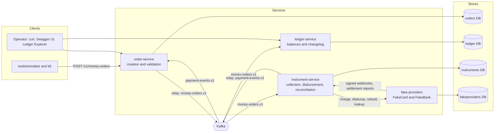
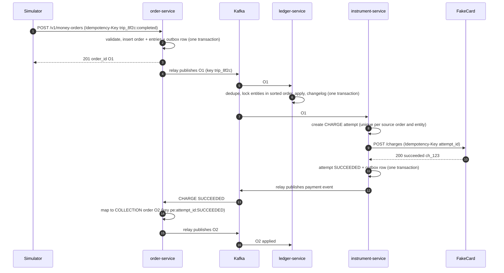
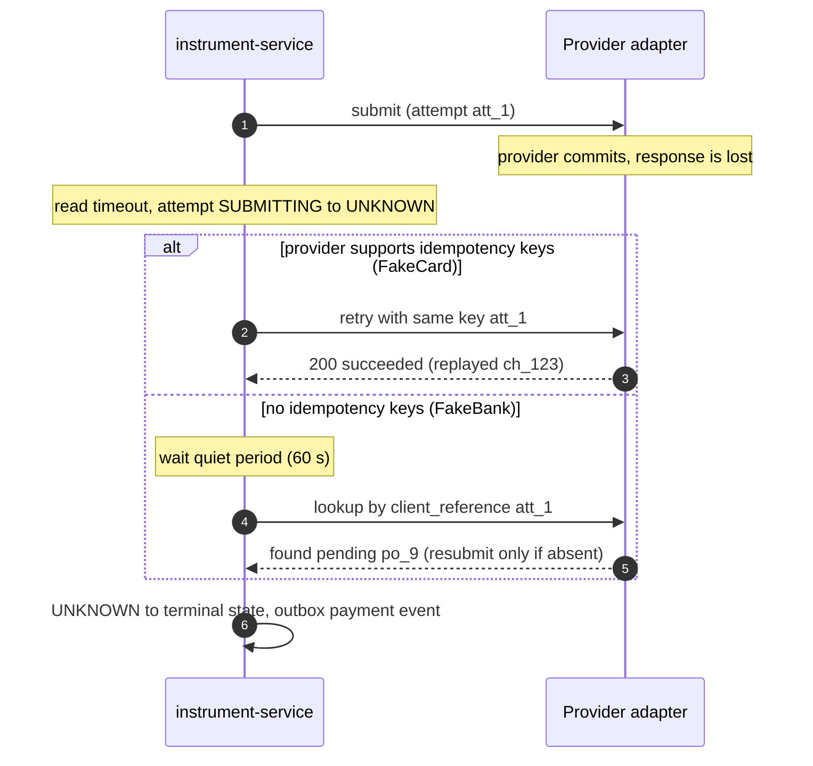
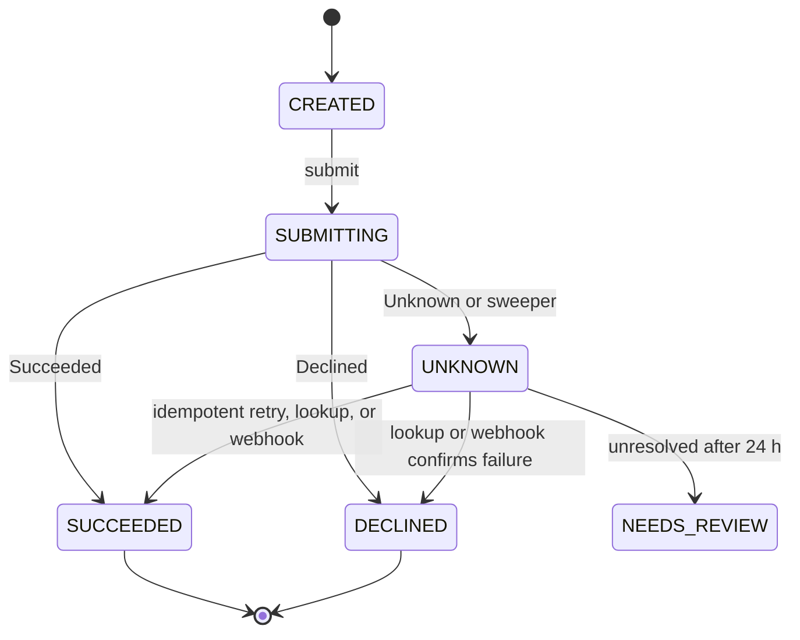
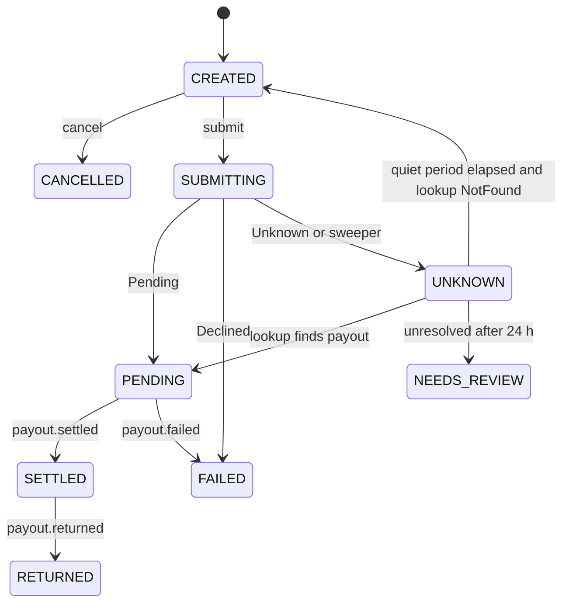

# ZeroSum Ledger — MVP Engineering Report

> **Document type:** Planning and research report (output of Prompt 01 — MVP Engineering Report).
> **Canonical path:** `docs/zerosum_ledger_mvp_plan.md`
> **Version:** 1.2 · **Date:** 2026-09-15 · **Status:** Planning. No implementation exists and no paid service has been used.
> **Freshness warning:** Versions and prices were checked on 2026-09-15. They will drift, so re-verify them before you depend on them.
>
> **Document pack:** This master is part of the implementation document pack indexed in [docs/README.md](README.md). It owns product intent, supported scope, baseline requirements, acceptance targets and the original schedule. Step documents (`docs/step_NN_*.md`) own the implementation decisions, contracts and evidence introduced during execution. See the [source-of-truth rules](README.md#source-of-truth).
>
> **Revision 1.1:** cost is no longer a decision driver, and part of the contingency is pre-allocated. See [§0.2](#constraint-updates).
>
> **Revision 1.2:** contract, evidence and schedule clarifications found while decomposing the plan into step documents. See [§0.3](#decomposition-clarifications).

**How to read this report**

| Label | Meaning |
|---|---|
| **FACT** | Sourced from a primary document. The citation sits next to the claim. |
| **CLAIM** | A number a vendor or author reports about their own system. Nobody else has verified it. |
| **ASSUMPTION** | Filled in because the input was missing. Listed in [Assumptions](#assumptions). |
| **ESTIMATE** | Derived by arithmetic in this report. The formula is shown. |
| **TARGET** | A goal to hit. It is not a measurement. |
| **MEASURED** | Nothing is measured yet. Measured results will live in `docs/results/`. |
| **PROPOSED** | An interface or schema designed in this report. It is not an existing library API. |

---

<a id="summary"></a>
## 0. Executive summary

**What it is.** ZeroSum Ledger is a reference implementation of a payments ledger. Its design follows the principles Uber published on 2026-08-06 in its retrospective on ten years of its payments platform ([Uber, 2026](https://www.uber.com/us/en/blog/ubers-payments-platform/)):

- **Immutable money orders.** An order is never edited. Adjustments are written as new orders.
- **Zero-sum validation before write.** Each order's entries must sum to zero.
- **Three data models.** Money order, ledger with account balances, and entity changelog.
- **Stateless services connected through Kafka.**

The project adds a pluggable payment-instrument interface (`charge`, `disburse`, `refund`) with two fake providers whose semantics deliberately differ. It also adds a fault-injection and benchmark harness. That harness produces the evidence behind every claim the project makes.

**Why build it.** This is a learning and portfolio project. It is not a startup. A company that needs a ledger should buy or adopt one ([§2](#landscape)). The value here is:

1. Working through the hard parts yourself: uncertain provider outcomes, duplicate delivery, hot accounts, and reconciliation.
2. Publishing reproducible, measured evidence that you can discuss in depth in an interview.

**Recommended architecture**

- **Language and framework:** Java 25 (LTS) with Spring Boot 4.1.x.
- **Services:** four — `order-service`, `ledger-service`, `instrument-service`, `fake-providers`.
- **Data:** PostgreSQL 18, with one database per service.
- **Messaging:** Apache Kafka 4.3 (KRaft), fed by a polling transactional outbox. Consumers are idempotent.
- **Observability:** OpenTelemetry into a single `grafana/otel-lgtm` container.
- **Runtime:** Docker Compose. CI runs on GitHub Actions.

**Effort (ESTIMATE):** 170 engineering hours plus 30 hours of contingency, 200 hours in total. That is 10 weeks at the assumed 20 hours per week.

**Operating cost**

| Setup | Monthly cost | Notes |
|---|---|---|
| Local plus recorded demo | $0 | |
| Always-on demo VM | about $10.59 | Hetzner CX33 + IPv4, excluding VAT |
| Managed AWS variant | about $186 | ESTIMATE, prices checked 2026-09-15 |

See [§7](#cost). Since v1.1, cost is informational only and is not a decision driver ([§0.2](#constraint-updates)).

**Biggest uncertainty:** whether the fault-injection harness really exercises the failure modes the design claims to prevent. If ablated variants don't fail, a "0 violations" result proves nothing. Close behind is hot-entity lock contention. Arithmetic predicts a ceiling of about 200–330 orders/s for per-order locking on a laptop, so batched apply will probably be needed ([§6](#performance)).

**First milestone (Gate G1, end of week 3):** the ledger core runs on PostgreSQL and meets four conditions:

- The database enforces immutability and zero-sum checks.
- Seeded generative tests pass over the worked example and 10,000 random orders.
- A concurrency test (32 threads, 30% duplicates) ends with every invariant holding.
- Spike SP1's lock-contention measurement is recorded.

---

<a id="assumptions"></a>
## 0.1 Inputs and assumptions

The project brief left most inputs open. Each assumption below is labeled and paired with its impact if wrong.

| # | Input | Provided? | Assumption used | Impact if wrong |
|---|---|---|---|---|
| A1 | Project idea | Yes | Zero-sum immutable payments ledger on Uber's model, plus a pluggable instrument interface with two fake providers. | — |
| A2 | Goal | Yes | Learning and a portfolio piece you can present on a résumé. Correctness and depth come before breadth. | — |
| A3 | Builder skills | Partly: a reference résumé was supplied | Skills similar to that reference: Java/Spring Boot, Python, Kafka, PostgreSQL, Redis, Docker/Kubernetes, Prometheus/Grafana/OpenTelemetry, REST/gRPC. | Little Kafka or Spring experience adds about 15–25 h to Steps 03–05. |
| A4 | Team and hours | No | Solo builder, 20 h/week. | At 12 h/week, use the [minimum cut](#minimum-cut) or stretch to about 16 weeks. |
| A5 | Timeline | No | 10 weeks. | See A4. |
| A6 | Budget | No | $0 for development. Up to $25/month optional for a hosted demo. | None; the default plan costs $0. |
| A7 | Hardware | Measured on this machine | 10 CPU cores, 24 GiB RAM, Docker Compose v5.5.1, JDK 26 installed locally. The project pins Java 25 through a Gradle toolchain. | Under 16 GB RAM, the observability container moves to Grafana Cloud's free tier. |
| A8 | Existing code | No | Greenfield. | — |
| A9 | Required tech | Implied by the brief | Kafka and microservices, because the Uber blueprint uses them and the résumé goal rewards them. | A monolith would be simpler; see [§1.5](#where-existing-wins). |
| A10 | Money | No | No real money, cards or bank accounts. Fake providers only. No PCI DSS or KYC scope. | Real providers would need a compliance review. That is out of scope. |
| A11 | Currencies | No | Multi-currency data model with zero-sum checked per currency. No FX conversion. Demo uses USD, plus JPY (0 decimals) and KWD (3 decimals) in tests. | FX is deferred. |
| A12 | Biggest concerns | No | Correctness under failure, credible evidence, scope control, and time. | — |

**What Uber disclosed versus what this report designs (FACT).** Uber's 2026 post describes principles and data models. It does **not** disclose any of the following:

- Field-level schemas
- Kafka topics, partitioning or retry semantics
- Idempotency mechanisms
- Reconciliation or failure-recovery procedures

Everything in this report beyond the cited principles is our own design. None of it should be presented as "how Uber does it".

<a id="constraint-updates"></a>
## 0.2 Constraint updates after v1.0

| Date | Change | Source | Rationale | Impact |
|---|---|---|---|---|
| 2026-09-15 | **Cost is not a decision driver.** The project is open source, runs locally, and exists to showcase the builder's skills on a résumé. | User direction given when Prompt 02 was requested | There is no budget to optimize, and the default plan already costs $0. | §7 stays as informational reference only, and step documents contain no cost-tracking tasks. §7.6 spending controls apply only if the optional S5 hosted demo is pursued. S5 remains optional and is decided at S09 on showcase value, not cost. No change to architecture, scope, acceptance targets or step hours. |
| 2026-09-15 | **Unassigned work made explicit.** | Prompt 02 decomposition | §8.1 lists the W1–W6 scenario catalog without assigning it to a step, and §9.3 folds release tagging into W10 contingency. | 4 h of the 30 h contingency are pre-allocated: S05 W1–W4 scenario files and runner (2 h), S06 W5–W6 scenario files (1 h), S09 release execution (1 h). **26 h of contingency remain unallocated.** Step hours are unchanged. |

<a id="decomposition-clarifications"></a>
## 0.3 Decomposition review clarifications (v1.2)

Writing the step documents exposed gaps and inconsistencies in v1.1. Each is resolved below, and the affected sections are edited in place with a "v1.2" marker. The detailed values belong to the named owner (step register decision IDs; see [docs/README.md](README.md#source-of-truth)). None of these changes alters scope, architecture direction or acceptance thresholds.

**Contracts**

| # | Gap in v1.1 | Resolution | Detail owner |
|---|---|---|---|
| C1 | The same JSON example served as both the API request and the event; how the `Idempotency-Key` header relates to `source.idempotency_key` was undefined. | The request omits server-set fields; the header supplies the key; the event is the stored order ([§5.3](#money-order-contract)). | D03-2 (request), D01-8 (event) |
| C2 | "Same `order_group_id`" was marked as database-enforced, but the DDL only has a foreign key. | Existence is enforced by the foreign key; the same-group check runs in the application inside the insert transaction. | D03-1 |
| C3 | An order header committed without entries passed the zero-sum trigger. | The deferred trigger is also attached to `money_orders` ([§5.7](#schemas)). | D03-1 |
| C4 | Repeated entity/account/currency lines within one order were unspecified. | Allowed; each line is applied separately. | D01-5 |
| C5 | The mapper couldn't tell a payout failure before acceptance from one after it; REFUND_FAILED had no mapping; `event_id` used "terminal status" for non-terminal events. | Explicit event types, including `PAYOUT_REJECTED` and `REFUND_FAILED` (no order); `event_id = <attempt_id>:<event_type>` ([§5.4](#event-contracts), [§5.5](#event-to-order)). | D01-8, D03-6, D05-5 |
| C6 | Settlement events had no currency, group or partition-key rule. | One settlement event per (provider, report, currency); its `event_id` is also its `order_group_id` and key. | D01-8, D06-3 |
| C7 | `source.system` for mapper-created orders was undefined. | `instrument-service`, with `event_id` as the idempotency key. | D03-4, D03-6 |
| C8 | Only ledger-service had a quarantine table, its key was `order_id`, and undecodable records couldn't be quarantined. | Each consuming service quarantines in its own database, under a surrogate key with a nullable `order_id`. | D02-9, D03-1, D05-4, D04-4 |
| C9 | No home for the shared auth module; token auth wasn't wired into ledger-service; 401/403 not listed. | `libs/auth` ([§5.1](#repo-structure)); S03 wires it into order-service and ledger-service, S05 into instrument-service; 401/403 on authenticated endpoints. | D03-4, D00-2 |
| C10 | The relay-only publishing ArchUnit rule conflicted with Spring's dead-letter recoverer and the A2 seam. | The rule covers application code; framework DLQ publishing and the A2 seam inside `libs/outbox` are exempt. | D03-5, D04-4, D08-3 |
| C11 | A single trace through the outbox needs trace context captured when the row is written. | The outbox `headers` column carries W3C trace context from write time. | D03-5, D04-2 |
| C12 | Payout freshness summed stage ages with no timestamp basis. | Outbox ages come from `created_at`; the ledger age comes from the Kafka record timestamp of the oldest unapplied record. | D04-5, D05-7 |
| C13 | The ledger invariants endpoint referred to "settlement cycles", which ledger-service doesn't know about. | It reports non-zero clearing balances; the verifier judges age and break matching (I9). | D02-8, D06-5 |
| C14 | The admin quarantine-retry endpoint had no owner. | Deferred. The runbook documents a manual re-publish procedure instead. | D04-4 (runbook step) |
| C15 | Explorer "entity search" had no API behind it. | Exact-ID lookup; search is deferred. | D09-4 |
| C16 | Generators shared by tests and `tools/simulator` had no home; S01's ArchUnit "module boundaries" rules can only be written after S03/S05; the JSON Schema validator wasn't named. | `libs/money` test fixtures; S01 covers the `libs/money` rules, S03 the outbox rule, S05 the provider rule; the validator library is pinned in ADR-0002. | D01-10, D01-11, D00-1 |
| C17 | The ledger DDL had nowhere to keep the source idempotency key (M6(a)) and required Kafka positions that S02's test driver doesn't have. | `applied_orders` stores `source_system` and `idempotency_key`; the Kafka position columns are nullable. | D02-1 |
| C18 | Updating quarantine `resolved_at` conflicted with append-only enforcement, and the owner of the quarantine write was unclear. | Quarantine tables are operational, not append-only. The apply engine writes quarantine rows; S04 owns DLQ publishing and the poison-message policy. | D02-9, D04-4 |
| C19 | The global `statement_timeout` was shorter than the P4 target for the invariants endpoint. | Operational reads set a longer per-transaction limit. | D02-8 |
| C20 | Outbox rows were written only for terminal states, but `PAYOUT_ACCEPTED` is emitted on the non-terminal `PENDING` transition. | An outbox row is written for every transition that emits a payment event ([§5.7](#schemas)). | D05-5 |
| C21 | Webhooks arriving *ahead* of the current state (a return while `PENDING`) had no rule. | Record the event, resolve the true state by lookup, then apply the intermediate transitions in order ([§5.10](#state-machines)). | D05-5 |
| C22 | The attempt uniqueness key lacked currency. | `UNIQUE (kind, source_order_id, entity_id, currency)`. | D05-4 |
| C23 | FakeCard refund idempotency was unstated; settlement-report features were listed with S05 but built in S06. | FakeCard honors idempotency keys on refunds too. S05 defines the settlement interface method and knob extension point; S06 builds the generator and discrepancy knobs. | D05-2, D06-1 |
| C24 | Attempts stuck in `CREATED` (crash before submission, or a kill switch off) had no recovery path. | A sweeper resubmits old `CREATED` attempts once the relevant switch is enabled. | D05-8 |
| C25 | With only a surrogate key, redelivery after a crash could quarantine the same record twice. | Quarantine tables record the Kafka topic, partition and offset, which are unique together; callers without Kafka leave them null. | D02-9, D04-4 |

**Evidence**

| # | Gap in v1.1 | Resolution | Detail owner |
|---|---|---|---|
| E1 | I9 (clearing = 0) contradicted F10's injected settlement-report discrepancies. | SETTLEMENT orders book reported totals; a clearing residual must equal the signed sum of open reconciliation breaks plus in-flight amounts ([§8.3](#invariants), [§5.5](#event-to-order)). | D06-2, D06-5 |
| E2 | I12's "injected fault log" was undefined. | fake-providers records every injected fault (type, target, time, seed) and exposes it through its admin API. | D05-2, D06-1 |
| E3 | Quiesce ignored unresolved attempts and pending webhook redeliveries; no scheduler triggered reconciliation cycles. | Quiesce waits for both, reconciliation runs on a scheduler, and a run that doesn't quiesce within the recorded maximum wait is classified *not quiesced*, never a pass. | D06-4, D06-5, D08-4 |
| E4 | Run counts: "20 per (variant, fault) cell" vs "6 variants × 20". | A0 gets 20 runs per fault; each ablation gets 20 runs split evenly across its targeted faults. Total unchanged. | D08-6 |
| E5 | Which validity threshold applies was unclear. | ≥ 50% by default; "≥ 1 in 20" only for crash-timing-dependent cells named in the run plan before the first evidence run. | D08-6 |
| E6 | B0 ran under F12, which has no fare-split bug injection. | B0 runs F12 plus A4's bug injection. | D08-1, D08-6 |
| E7 | A3 ("new attempt with a new key") collided with the attempt uniqueness constraint. | A3 resubmits the same attempt with a fresh provider idempotency key. | D08-3, D05-5 |
| E8 | A4 couldn't produce I2 violations while the ledger re-checks zero-sum. | A4 also disables the ledger re-check. | D08-3, D02-3 |
| E9 | F3's "breakpoint probability hook" had no owner. | Added by S08-T02 as a seam in instrument-service via change request on D05-5. | D08-2 |
| E10 | Audit-study condition B was described as a "mutable balance table", which no build produces. | Condition B restricts participants' *access*: only current balances and logs; the changelog, orders and Explorer are withheld. | D09-5 |
| E11 | G1's proceed clause omitted the generative and stress tests named in the summary, and M6(c) needs order-service. | The G1 clause lists them; M6(c) is verified in S04's end-to-end tests. | S02 |

**Schedule and operations**

| # | Gap in v1.1 | Resolution | Detail owner |
|---|---|---|---|
| O1 | SP3's 2 h timebox vs G0 "fails after 4 h". | 2 h timebox plus up to 2 h of contingency before the fallback. | D00-7 |
| O2 | G0 timing: "at completion" vs Day 2. | G0 is evaluated after S00-T07 (Day 2). | S00 |
| O3 | Role model: "a role per service" vs M2(a)'s owner and application roles. | Each service gets an owner role and an application role; plus a read-only verifier role. | D00-4 |
| O4 | GHCR publishing, the tag migration test (no previous release exists for v1.0.0) and the pre-tag secret scan had no owner. | Images publish on tags only; the tag workflow (version images, fresh-install migration test for v1.0.0, secret scan) belongs to S09-T07, which grows from 1 h to 2 h of pre-allocated contingency. | D09-9 |
| O5 | A hard checklist item required the `demo-public` profile even when S5 isn't pursued; the restore drill had no hours. | The profile item is hard only if S5 is pursued; the restore drill (S09-C02) takes about 1 h of contingency, before tagging, only with S5. | D09-10 |
| O6 | M1(d) said O1–O7 while the checklist said O1–O8; M14(a) said laptop while S09 said clean machine or CI. | O1–O7 plus the O8 variant; M14 evidence is a timed fresh clone on the reference laptop, with CI as supporting evidence. | D01-9, D09-1 |
| O7 | Audit-study facilitation time wasn't budgeted. | About 5–6 h of builder time, drawn from unallocated contingency when the sessions run. | D09-5 |
| O8 | S06's gate label differed between the schedule and the README. | S06 has no gate; "M11; I6–I9 checks available" is a completion checkpoint. | — |
| O9 | M12(c) requires a DLQ alert, and some alert signals had no metric: lag in seconds, oldest `UNKNOWN` age, paused listener, pending payouts. | Alert rows and gauges added ([§6.4](#instrumentation), [§10.5](#monitoring)). | D07-1, D07-3 |
| O10 | The perf matrix needs ≈ 7 h of machine time, not ≈ 4 h, and SP4's "measured alternatives" exceeded its timebox. | Machine-time estimate corrected ([§9.6](#waiting-time)). SP4 measures the chosen option fully and marks the others *Not run* if the timebox ends. | D07-5, D07-6 |
| O11 | Dashboards: 3 in M12(b) vs 4 in §10.5. | Flow, invariants and providers are required; platform is optional. | D07-2 |
| O12 | `pg_stat_statements` and a stats-reading role weren't provisioned. | S00 enables the extension in the PostgreSQL configuration and grants monitoring access to a stats role. | D00-3, D00-4 |
| O13 | §7.2 said S07 measures the storage coefficient. | Dropped under the v1.1 cost constraint. | — |

---

<a id="product-definition"></a>
## 1. Product definition and value

<a id="problem"></a>
### 1.1 The concrete problem

A marketplace moves money among several parties for every transaction:

- A rider pays.
- A driver earns.
- The platform keeps a commission.
- A card processor collects the money and settles it days later, minus fees.
- A bank rail pays the driver, and the payout can bounce back days after that.

Every step can fail partway through, time out with an unknown outcome, arrive twice, or arrive out of order. Fares change after the fact.

The common naive design keeps a mutable `balance` column per user. Whichever service handles an event updates that column, then calls a payment provider. This design produces four characteristic failures:

- **Double charges.** A timeout is retried as if it were a failure.
- **Money collected but never recorded.** The process crashes between the provider call and the database write.
- **Unexplainable balances.** History is overwritten, so nobody can answer "why is this driver's balance $17.60?"
- **Silent drift.** Nothing proves that total debits equal total credits, so the books quietly diverge.

<a id="users"></a>
### 1.2 Who experiences it, and who the "buyer" is

| Role | Pain | Relevance to this project |
|---|---|---|
| Payments platform engineers at a marketplace | Correctness incidents, on-call pages, audit requests | Hypothetical primary user. The project models their system. |
| Finance and operations analysts | Reconciling processor settlements; explaining balances | Hypothetical user of the changelog, reconciliation and break reports. |
| Drivers and riders | Missing payouts, double charges | Indirect beneficiaries in the simulation. |
| **Hiring managers and interviewers (actual audience)** | Need evidence of distributed-systems and domain depth beyond tutorials | The realistic "buyer". They judge the repository, results and design docs, and they probe claims in interviews. |
| **The builder** | Wants deep, hands-on learning | Primary actual user. |

<a id="smallest-product"></a>
### 1.3 Smallest useful product

The smallest useful product is a single-command local system that does six things:

1. Processes six realistic money workflows (below) through immutable, zero-sum money orders.
2. Maintains per-entity account balances and an append-only entity changelog that can rebuild any balance from inception.
3. Moves money through a pluggable `PaymentInstrument` interface backed by two simulated providers with realistic failures.
4. Runs a seeded fault-injection and benchmark harness. It produces a results report comparing the full design against ablated variants.
5. Exposes traces, metrics and invariant dashboards.
6. Ships with docs a reviewer can follow in 10 minutes.

<a id="workflows"></a>
### 1.4 Workflows: today versus with ZeroSum

"Today" means the naive design from §1.1, which is common in early-stage systems. Money amounts are integer minor units: `2500` means $25.00.

**W1 — Trip completed, rider charged, driver owed, commission booked**

- **Today:** the trip service charges the card synchronously, then updates the driver and platform balance columns. A crash between those two steps loses the record. A retry after a timeout can charge the rider twice.
- **With ZeroSum:** a COMMERCE money order O1 is written first. It records that the rider owes 2500, the driver is owed 2000 and platform revenue is 500, and it sums to zero. A charge attempt with a stable attempt ID calls FakeCard. The confirmed capture then becomes a COLLECTION order O2. Every step is durable before the next begins, and every step can be retried safely.

**W2 — Fare adjusted after capture (partial refund)**

- **Today:** the fare row and balances are overwritten, and history is lost. A refund is issued separately. The driver's share may never be corrected.
- **With ZeroSum:** an adjustment order O3 references O1 and records the fare change (−300 split −240 driver / −60 platform). The collection policy issues a refund attempt, and its success becomes order O4. Nothing is edited.

**W3 — Driver payout, settlement, then a late bank return**

- **Today:** the payout is marked "paid" as soon as the bank API accepts it. A return days later (for example ACH R01, insufficient funds) is handled manually. The driver's balance is wrong in the meantime.
- **With ZeroSum:** acceptance moves money from the driver's payable into the payout-clearing account (O5). Settlement clears it (O7). A return re-credits the driver in a new order (O8). A non-zero clearing account shows money in flight at a glance.

**W4 — Provider timeout with unknown outcome**

- **Today:** the timeout is treated as a failure and retried, which double-charges. Or it is treated as a success, which books phantom revenue.
- **With ZeroSum:** the attempt enters `UNKNOWN`. It is resolved by an idempotent retry (FakeCard supports idempotency keys) or by lookup before any resubmission (FakeBank does not). No money order is written until the outcome is known. Attempts stuck in `UNKNOWN` raise an alert.

**W5 — Audit question: "Why is driver D1's balance what it is?"**

- **Today:** grep logs across services and hope the overwritten rows can be reconstructed.
- **With ZeroSum:** `GET /v1/entities/driver:D1/changelog` lists every balance change with its money order and source idempotency key. `POST /v1/entities/driver:D1/verify` replays the changelog and verifies the hash chain.

**W6 — Processor settlement reconciliation**

- **Today:** export the processor's CSV and match it to internal rows in a spreadsheet.
- **With ZeroSum:** the reconciler matches each FakeCard settlement line to a charge or refund attempt. It books a SETTLEMENT order (net cash plus processing fee) and records typed breaks such as `MISSING_IN_LEDGER` or `AMOUNT_MISMATCH`.

<a id="where-it-helps"></a>
### 1.5 Where it helps, and where existing methods remain better

**Hypothesized benefits** (tested in [§8](#testing)):

- **Accuracy:** zero invariant violations and zero duplicate charges under injected faults.
- **Audit effort:** answering balance questions is faster than with log forensics.
- **Change effort:** adding a provider requires no changes to the core.

<a id="where-existing-wins"></a>
**Where simpler or existing methods remain better** (our judgment, grounded in the cited facts):

- **Low volume, one team.** A single service with a double-entry table in PostgreSQL delivers the same correctness in one local transaction. It has lower latency and far less operational burden. Kafka and service boundaries earn their cost only with independent teams, independent scaling, or the Uber-scale fan-out this project imitates for learning.
- **User-in-session payments.** When a user waits on "Confirm", an asynchronous pipeline adds latency. Uber itself uses its Cadence workflow engine "to support synchronous payments without compromising the async backbone" ([Uber, 2026](https://www.uber.com/us/en/blog/ubers-payments-platform/)). This MVP does not build that path.
- **Real companies.** Buying Modern Treasury Ledgers or Fragment, or adopting TigerBeetle, Formance or Blnk, beats building a ledger from scratch ([§2](#landscape)).
- **Small merchants.** A processor dashboard (Stripe or Adyen) is enough for reconciliation.

<a id="facts-vs-hypotheses"></a>
### 1.6 Facts versus hypotheses

| Statement | Type | Evidence or test |
|---|---|---|
| Uber writes adjustments as additional money orders and never edits an order. | FACT | [Uber, 2026](https://www.uber.com/us/en/blog/ubers-payments-platform/) |
| Uber runs "pre-commit validations" that entries sum to zero. | FACT | same |
| Uber solved hot-entity contention with a "serialized batch-write mechanism", reporting a "10x increase in throughput". | CLAIM | same; related detail in [Uber, 2026-03](https://www.uber.com/us/en/blog/high-throughput-processing/) |
| Kafka exactly-once semantics do not extend to external databases without cooperation from those systems. | FACT | [Kafka 4.3 design docs](https://kafka.apache.org/43/design/design/) |
| **H1:** The full design produces 0 invariant violations and 0 duplicate charges under the fault matrix, while each ablated variant produces its predicted failure. | HYPOTHESIS | [§8.5](#ablation) |
| **H2:** Per-order row locking on hot entities caps throughput near 200–330 orders/s on the dev laptop, and batched apply raises it at least 5×. | HYPOTHESIS | SP1/SP4, [§6](#performance) |
| **H3:** The changelog cuts time to answer audit questions by at least 50% versus logs. Directional only, n=5. | HYPOTHESIS | [§8.7](#human-eval) |
| **H4:** A peer can add a third provider adapter in ≤ 4 h with 0 changes to core modules. | HYPOTHESIS | [§8.7](#human-eval) |
| **H5:** The project yields résumé bullets that are specific, measured and defensible in interviews. | HYPOTHESIS | Release checklist ([§12](#release-checklist)) |

<a id="portfolio-value"></a>
### 1.7 Portfolio value: skills to evidence

| Skill area (as emphasized in the reference résumé) | Evidence this project produces | Artifact |
|---|---|---|
| Distributed systems and Kafka | Transactional outbox, idempotent consumers, DLQ and quarantine, partition keys, lag metrics | Code, ADRs, chaos results |
| PostgreSQL internals | Deferred constraint triggers, append-only enforcement, sorted row locks, `SKIP LOCKED`, hot-entity batching | Migrations, SP1/SP4 reports |
| Payments domain | Double-entry chart of accounts, state machines, uncertain outcomes, returns, reconciliation | Contracts, worked example, reconciliation report |
| Reliability engineering | Fault matrix, ablation experiment, rule-of-three confidence bounds | `docs/results/chaos-*.md` |
| Performance | Open-model load tests, stage latency budgets, bottleneck analysis | `docs/results/perf-*.md`, Grafana screenshots |
| Observability | Traces across HTTP → outbox → Kafka → DB; invariant dashboards and alerts | Dashboards JSON, trace screenshots |
| API design | Idempotency keys (aligned with IETF draft semantics), RFC 9457 problem details, OpenAPI | `openapi/*.yaml` |

**Résumé bullet templates.** Fill the ⟨placeholders⟩ **only** from `docs/results/`. Present this as a personal project, never as production traffic.

- "Built a zero-sum, double-entry payments ledger (Java 25, Spring Boot, Kafka, PostgreSQL). It uses immutable money orders, a hash-chained entity changelog and a transactional outbox, and recorded 0 invariant violations across ⟨N⟩ fault-injected runs (⟨M⟩ simulated trips), while ablated variants produced ⟨X⟩ duplicate charges."
- "Diagnosed hot-entity row-lock contention capping ledger throughput at ⟨A⟩ orders/s. Implemented serialized batch apply, raising sustained throughput to ⟨B⟩ orders/s at p95 order-to-balance latency of ⟨C⟩ ms."
- "Designed a pluggable payment-instrument interface (charge/disburse/refund) over two simulated providers with divergent semantics: idempotent vs non-idempotent, synchronous vs asynchronous with late returns. Resolved ⟨U⟩ timeout-induced unknown outcomes with zero double charges."
- "Automated settlement reconciliation and cross-store verification, detecting ⟨K⟩/⟨K⟩ injected discrepancies."

---

<a id="landscape"></a>
## 2. Current landscape and feasibility

All sources below were checked on 2026-09-15.

<a id="uber-facts"></a>
### 2.1 What Uber actually published

**The 2026 retrospective** ([Uber, 2026-08-06](https://www.uber.com/us/en/blog/ubers-payments-platform/)). Authors: N. Sheth, M. Kelshikar, D. K. Singh, R. Jana, W. Raza.

- **History (FACT).** The platform ("Gulfstream") was bootstrapped in 2016 as microservices. Many of those services "still run in production".
- **Money order (FACT).** "A series of debits and credits between the entities involved in the real-world commerce transaction."
  - Immutability: "an order once written can't be changed in any shape or form."
  - Adjustments: "We write additional money orders to capture the adjustment."
- **Zero-sum (FACT).** "All entries in any money order sum to zero." Enforced by "pre-commit validations" before writing, together with double-entry bookkeeping.
- **Data models (FACT).**
  - Money order.
  - Ledger: "a real-world entity with 1 or more accounts, each account holding a balance."
  - Entity changelog: "complete audit trail and the ability to recreate an entity's ledger since inception."
- **Services (FACT).** "Independent, stateless microservices, each owning a discrete unit of the money movement lifecycle":
  - Stages: creation, processing, collection, disbursement.
  - Transport: Apache Kafka as the bus.
  - User-in-session flows run on Cadence.
- **Storage evolution (FACT).**
  - Started on sharded MySQL.
  - Ledger balances then moved to DynamoDB: one row per entity, about 1 KB, with zero-balance sub-accounts pruned.
  - Today: LedgerStore, described as "purpose-built for auditability and tamper-evident record-keeping."
- **Hot entities (CLAIM).** Frequent updates to the same ledger row hurt serialized write performance. A "specialized, serialized batch-write mechanism" gave a "10x increase in throughput."
- **Instrument abstraction (FACT).** A "payment integration interface with APIs such as charge, disburse, refund". The core platform has "no instrument-specific logic."
- **Upstream zero-sum (FACT).** "Entity Fares" enforce zero-sum "at the point of computation."
- **Scale (CLAIM).** Ledger balances for "more than 1.2 billion entities"; money movement of "nearly 2x gross bookings".
- **Not disclosed:** schemas, topics, partitioning, idempotency, reconciliation, failure handling, latency.

**Earlier Uber posts** (all figures CLAIM):

- [2018 — Next-Gen Payments Platform](https://www.uber.com/us/en/blog/payments-platform/): "asynchronous stream processing of immutable orders" with "exactly-once payment processing by the means of idempotency and strong consistency."
- [2020 — Money Movements with Strong Data Consistency](https://www.uber.com/us/en/blog/money-scale-strong-data/): deterministic unique IDs; an "entity change log's version number per user"; validation jobs every 24 hours.
- [2024 — LedgerStore indexes](https://www.uber.com/blog/how-ledgerstore-supports-trillions-of-indexes/): strongly consistent indexes use two-phase commit. "Over 2 trillion unique indexes" with no inconsistency detected.
- [2026-03 — High Throughput Payment Account Processing](https://www.uber.com/us/en/blog/high-throughput-processing/): the legacy path handled "3-4 update operations per second" per account. The fix batches operations in a "250 millisecond window" with "one read and one write per batch", and processors compete for batches with optimistic locking. **This is the direct model for our hot-entity spike (SP4).**

<a id="industry-designs"></a>
### 2.2 Other published ledger designs

| Source | Key idea we adopt | Type |
|---|---|---|
| [Stripe Ledger (2024-02-16)](https://stripe.dev/blog/ledger-stripe-system-for-tracking-and-validating-money-movement) | Model money as balances in accounts. Healthy state: "terminal (nonclearing) reservoirs are full, and intermediate (clearing) pipes are empty". A non-zero clearing account means a missing, late or wrong transaction. Published transactions "cannot be deleted or modified". | FACT (design); CLAIM ("five billion events" daily) |
| [Square Books (2019-10-16)](https://developer.squareup.com/blog/books-an-immutable-double-entry-accounting-database-service/) | Append-only journal and book entries; balances cached on entries; versions per book only increase; corrections are offsetting entries. | FACT (design) |
| [Airbnb Orpheus (2019-04-16)](https://medium.com/airbnb-engineering/avoiding-double-payments-in-a-distributed-payments-system-2981f6b070bb) | Pre-RPC / RPC / Post-RPC phases, with no network calls inside local transactions. 5XX is retryable and 4XX is not. Lease expiry is longer than the RPC timeout. Idempotency data is read only from the primary. | FACT (design); CLAIM ("five nines") |
| [Modern Treasury — immutability (2021)](https://www.moderntreasury.com/journal/enforcing-immutability-in-your-double-entry-ledger), [statuses docs](https://docs.moderntreasury.com/ledgers/docs/transaction-status-and-balances) | Posted transactions are immutable; undo means a reversing transaction; pending, posted and available balances are separate. | FACT |
| [Modern Treasury — concurrency docs](https://docs.moderntreasury.com/ledgers/docs/handle-concurrency) | `lock_version` optimistic locking. For hot accounts: "don't write the Ledger Entries with balance or lock_version conditions". Hot-account balances are applied asynchronously "within 60 seconds". | FACT |
| [Modern Treasury — How to Scale a Ledger VI](https://www.moderntreasury.com/journal/how-to-scale-a-ledger-part-vi) | Idempotency keys kept 24 h; current balance updated atomically in the same transaction; drift monitoring between cached balances and entries. | FACT (design) |
| [TigerBeetle OLTP concepts](https://docs.tigerbeetle.com/concepts/oltp/) | "Row locks on hot accounts" can "bring the system's performance to a crawl". Batching is the remedy. | FACT (design); CLAIM (1M TPS design goal) |

<a id="products"></a>
### 2.3 Products and open-source ledgers

| Product | License / latest release | Model highlights | Independent evidence |
|---|---|---|---|
| **TigerBeetle** | Apache-2.0; **0.17.9 (2026-07-06)** ([releases](https://github.com/tigerbeetle/tigerbeetle/releases)) | 128-byte accounts and transfers. A transfer has exactly one debit account and one credit account, so multi-leg orders need `linked` chains. Two-phase pending/post/void with timeouts. Client-generated `id` is the idempotency key. Balance flags such as `debits_must_not_exceed_credits`. Batches of up to 8,189 transfers ([docs](https://docs.tigerbeetle.com/reference/transfer/)). | **INDEP:** [Jepsen analysis](https://jepsen.io/analyses/tigerbeetle-0.16.11) of 0.16.11–0.16.30 (2025-06-06): "consistent with … Strong Serializability" from 0.16.26; all issues addressed by 0.16.45 except indefinite retries. The 0.17.x line is not independently verified. Homepage "100K-500K TPS" is CLAIM. |
| **Formance Ledger** | MIT; **v2.4.12 (2026-07-24)**; v3.0.0-beta.3 prerelease ([repo](https://github.com/formancehq/ledger)) | Atomic multi-posting transactions on PostgreSQL; Numscript DSL; `Idempotency-Key` header. Production support only through a Kubernetes operator. | None found |
| **Blnk** | Apache-2.0; **v0.15.4 (2026-09-04)** ([repo](https://github.com/blnkfinance/blnk)) | Go + Postgres + Redis. Immutable transactions; unique `reference` provides idempotency; inflight (two-phase) transactions with partial commit and expiry; reconciliation matching rules. | None found |
| **Modern Treasury Ledgers** | Closed, managed; pricing not public | Multi-entry transactions ("credits will always equal debits" per currency); pending/posted/archived; `lock_version`; idempotency on all POSTs ([docs](https://docs.moderntreasury.com/docs/ledgers-guarantees)) | None found |
| **Fragment** | Closed; Free tier 1,000 entries/month; Startup $2,500/month + $0.01 per entry ([pricing](https://fragment.dev/pricing)) | GraphQL; chart of accounts as code; `ik` idempotency key | None found |
| **pgledger** | MIT; **v0.7.0 (2025-12-03)** ([repo](https://github.com/pgr0ss/pgledger)) | Pure PostgreSQL functions; sorts account IDs before `FOR UPDATE` "to prevent deadlocks"; no idempotency key; no pending transfers | CLAIM: "10,636.8 transfers/second" at low contention on an M3 MacBook Air ([author benchmark](https://pgrs.net/2025/05/16/pgledger-in-postgresql-is-fast/)). Useful sanity reference for our Postgres numbers. |
| **Hyperswitch** | Apache-2.0; **v1.126.0 (2026-08-24)** ([repo](https://github.com/juspay/hyperswitch)) | Rust payments orchestrator; `ConnectorIntegration` trait; built-in dummy connector | CLAIM: "100+" processors |

<a id="standards"></a>
### 2.4 Semantics and standards we borrow

**Idempotency keys**

- **Stripe** ([docs](https://docs.stripe.com/api/idempotent_requests)):
  - Keys up to 255 characters.
  - The first result is saved, "including `500` errors".
  - Keys can be pruned after 24 hours.
  - A key reused with different parameters is an error.
  - Validation failures and concurrent conflicts are not saved.
- **IETF draft** `draft-ietf-httpapi-idempotency-key-header-07` ([datatracker](https://datatracker.ietf.org/doc/draft-ietf-httpapi-idempotency-key-header/)):
  - Status codes: 400 when the key is missing, 422 when a key is reused with a different payload, 409 when a request with that key is still in progress.
  - The draft **expired on 2026-04-18 and is not an RFC**. We adopt its status codes as a convention only.
- **Brandur Leach** ([2017](https://brandur.org/idempotency-keys)): atomic phases between foreign state mutations, plus recovery points.

**Uncertain outcomes.** Stripe advises: "Treat requests that return `500` errors as indeterminate" ([docs](https://docs.stripe.com/error-low-level)). Our `UNKNOWN` state models exactly this.

**Provider state models**

- **PaymentIntent** ([lifecycle](https://docs.stripe.com/payments/paymentintents/lifecycle)): moves through `processing` to `succeeded` or `canceled`.
- **Refund** ([object](https://docs.stripe.com/api/refunds/object)):
  - Statuses: `pending`, `succeeded`, `failed`, `canceled`.
  - Total refunds cannot exceed the charge.
- **Payout** ([object](https://docs.stripe.com/api/payouts/object)): "Some payouts that fail might initially show as `paid`, then change to `failed`". Our FakeBank models `SETTLED → RETURNED` for this reason.

**Webhooks** ([Stripe](https://docs.stripe.com/webhooks))

- Endpoints "might occasionally receive the same event more than once".
- "Stripe doesn't guarantee the delivery of events in the order that they're generated".
- Signature timestamp tolerance defaults to 5 minutes.

**ACH returns**

- Standard returns such as R01 (insufficient funds) come within 2 banking days. Unauthorized consumer returns can take up to 60 calendar days.
- Sourcing: this comes from **secondary sources** ([Plaid](https://plaid.com/resources/ach/ach-return/), [Modern Treasury](https://www.moderntreasury.com/learn/ach-return-code-reference)). The Nacha Operating Rules themselves are paywalled.
- FakeBank's return delays are simulation parameters inspired by these windows. They are not a compliance model.

**Money representation**

- **ISO 4217** List One ([SIX, published 2026-01-01](https://www.six-group.com/dam/download/financial-information/data-center/iso-currrency/lists/list-one.xml)):
  - 17 currencies have 0 minor-unit digits (e.g., JPY, KRW).
  - 7 have 3 digits (BHD, IQD, JOD, KWD, LYD, OMR, TND).
- **Providers can differ from ISO.** Stripe treats MGA as zero-decimal and requires ISK and UGX as two-decimal amounts ending in `00` ([docs](https://docs.stripe.com/currencies)).
- **Decision:** the ledger stores `long` minor units per ISO. Each provider adapter owns its own minor-unit mapping.

**Outbox and idempotent consumer** ([microservices.io outbox](https://microservices.io/patterns/data/transactional-outbox.html), [idempotent consumer](https://microservices.io/patterns/communication-style/idempotent-consumer.html))

- Messages are sent "if and only if the database transaction commits".
- The relay "might publish a message more than once", so consumers record processed message IDs in the same transaction.

<a id="platform-limits"></a>
### 2.5 Platform limitations that shape the design

- **Kafka EOS does not cover Postgres (FACT).** "Kafka guarantees at-least-once delivery by default"; exactly-once to "other destination systems generally requires cooperation with such systems" ([Kafka 4.3 design](https://kafka.apache.org/43/design/design/)).
  - Consequence: we need an outbox plus idempotent consumers. Kafka transactions alone are not enough.
- **KIP-848 is opt-in (FACT).** The new consumer group protocol is GA in Kafka 4.0, but `group.protocol` still defaults to `classic` ([consumer configs](https://kafka.apache.org/43/configuration/consumer-configs/)). We set `group.protocol=consumer` explicitly.
- **Idempotent producer defaults can be silently disabled (FACT).** `enable.idempotence=true` and `acks=all` are the defaults, but idempotence is silently disabled when conflicting settings are present and it wasn't set explicitly ([producer configs](https://kafka.apache.org/43/configuration/producer-configs/)). We set it explicitly.
- **PostgreSQL locking and constraints (FACT).**
  - `SKIP LOCKED` "is not suitable for general purpose work, but can be used to avoid lock contention with multiple consumers accessing a queue-like table" ([SELECT](https://www.postgresql.org/docs/current/sql-select.html)). We use it for the outbox only, never for balances.
  - Deadlocks are best avoided by acquiring locks "in a consistent order" ([explicit locking](https://www.postgresql.org/docs/current/explicit-locking.html)).
  - Constraint triggers must be `AFTER ROW` and can be `DEFERRABLE INITIALLY DEFERRED` ([CREATE TRIGGER](https://www.postgresql.org/docs/current/sql-createtrigger.html)). This enables a commit-time zero-sum check.
- **jqwik license clause (FACT).** jqwik 1.10.x is in "pure maintenance mode". Since 1.10 it includes an "Anti-AI Usage Clause" discouraging use with AI coding agents, and it targets JUnit Platform 1.x while Spring Boot 4.1 manages JUnit 6 ([repo](https://github.com/jqwik-team/jqwik)).
  - Decision: because this project plans to use coding agents, **we do not use jqwik**. Generative tests are plain JUnit 6 with seeded `java.util.random.RandomGenerator` loops that print the seed on failure.
- **Liquibase license (FACT).** Liquibase is now licensed FSL-1.1-ALv2 ([repo](https://github.com/liquibase/liquibase)). Flyway stays Apache-2.0 and is managed by Spring Boot, so we use Flyway.

<a id="build-buy"></a>
### 2.6 Build, buy, integrate, or defer

| Component | Decision | Rationale |
|---|---|---|
| Money order model, zero-sum validation, chart of accounts | **Build** | This is the core learning objective. |
| Ledger apply, balances, entity changelog, hash chain | **Build** | Same. Adopting TigerBeetle or Formance would hide exactly the internals being demonstrated. |
| Idempotency keys, outbox relay, idempotent consumers | **Build** | Small, well specified, and high signal to reviewers. |
| `PaymentInstrument` interface, attempt state machines, two fake providers | **Build** | No lightweight, deterministic, embeddable Java fake exists. Stripe test mode needs an account, and Hyperswitch's dummy connector lives inside a large Rust stack. |
| Reconciliation and cross-store verifier | **Build** | Evidence generator. |
| PostgreSQL, Kafka, Spring Boot, Flyway, Testcontainers, Toxiproxy, k6, OpenTelemetry/Grafana | **Integrate** | Commodity infrastructure. |
| A real ledger database or PSP | **Buy** in a real company | Out of scope for learning. Mentioned in the design docs as the production answer. |
| Debezium CDC, schema registry, Protobuf/Avro, Kubernetes/Helm, Temporal/Cadence | **Defer** | Each adds infrastructure without adding to the learning objective. Upgrade triggers are listed in [§10](#deployment-operations). |
| Stripe test-mode adapter (third provider); TigerBeetle as an alternative ledger backend with benchmark | **Defer** (post-MVP stretch) | Both would validate the abstractions against real systems. |

<a id="gap"></a>
### 2.7 The unresolved gap (for this use case)

1. **Uber shares principles, not implementation.** Its post leaves out idempotency, Kafka semantics, reconciliation and failure handling.
2. **Open-source ledgers provide primitives, not the pipeline.** They offer accounts, transfers and two-phase commits. None of them show the end-to-end, multi-stage money-movement pipeline: provider uncertainty, payment-attempt lifecycles, Kafka redelivery through to ledger writes, and reconciliation, all backed by measured failure evidence.
3. **Our niche is a reproducible bridge from principles to failure-tested code.** It is an educational gap, not a market gap.

---

<a id="scope"></a>
## 3. Exact MVP scope and end deliverables

<a id="must-have"></a>
### 3.1 Must-have capabilities and acceptance criteria

| ID | Capability | Observable acceptance criteria |
|---|---|---|
| **M1** | Money and zero-sum model | (a) Across 10,000 seeded random orders, the validator accepts every order balanced per currency and rejects every unbalanced one. (b) JPY (0 digits) and KWD (3 digits) are validated against the configured ISO minor-unit table. (c) An ArchUnit rule fails the build if `float` or `double` appear in money packages; `BigDecimal` is allowed only in fee calculation with an explicit `RoundingMode.HALF_EVEN`. (d) Worked example O1–O7 ([§5.2](#worked-example)) validates exactly, and so does the O8 variant (v1.2). |
| **M2** | Immutable money-order store | (a) `UPDATE`, `DELETE` and `TRUNCATE` on order tables fail for both the application role and the owner role. (b) An unbalanced insert that bypasses application validation fails at `COMMIT` via the deferred constraint trigger. (c) `adjusts_order_id` must reference an existing order. |
| **M3** | Order API with idempotency keys | (a) Same key and same body → same response, one order, `Idempotent-Replayed: true`. (b) Same key, different body → 422 `idempotency_key_reused`. (c) 50 concurrent requests with one key → exactly one order row; the others get the replay or 409. (d) Missing key → 400. (e) Keys never expire, because the money-order row itself is the idempotency record. That is stronger than Stripe's 24 h window. |
| **M4** | Transactional outbox relay | (a) `kill -9` of order-service between commit and publish → the order is published within 5 s of restart. (b) No code path publishes to Kafka except the relay (ArchUnit rule). (c) Duplicate publishes after a relay crash are harmless downstream. |
| **M5** | Ledger apply (effectively-once) | (a) Publishing every order 3× yields balances identical to publishing once. (b) Per-entity changelog `seq` has no gaps. (c) The global per-currency sum of balances is 0 after every committed transaction. (d) For every account, balance = sum of its changelog deltas. |
| **M6** | Entity changelog audit | (a) The changelog API links each row to its money order and source idempotency key. (b) `verify` rebuilds balances from the changelog and matches stored balances. (c) Walking from W5's question to the source order takes ≤ 3 API calls. |
| **M7** | `PaymentInstrument` interface + FakeCard + FakeBank | (a) Both adapters pass one shared contract test suite for charge/disburse/refund/lookup/webhook parsing, skipping unsupported capabilities explicitly. (b) ArchUnit: no class outside `instrument.providers.<name>` imports provider packages. |
| **M8** | Attempt state machines and uncertain outcomes | (a) A table test covers every state × event pair; illegal transitions are rejected and logged. (b) With FakeCard at `timeout_after_commit_rate=0.2` over 10,000 charges, provider ground truth shows exactly one successful charge per attempt. (c) After quiesce, 0 attempts remain in `SUBMITTING` or `UNKNOWN` for more than 5 minutes. |
| **M9** | Signed webhooks | (a) Bad signatures and timestamps older than 300 s are rejected with 400. (b) At 30% duplicates plus 30% reordering, there are 0 duplicate money orders and final attempt states match provider truth. |
| **M10** | Payouts and returns | (a) At most one in-flight payout per (driver, currency), enforced by a unique partial index. (b) A returned payout re-credits the driver's payable through a new order. (c) A payout run refuses (409 `ledger_stale`) when ledger freshness exceeds 5 s. |
| **M11** | Reconciliation | (a) A FakeCard settlement report produces a SETTLEMENT order booking net cash and fees. (b) Injected discrepancies (missing line, off by 1 minor unit, duplicate line) each produce a typed break. (c) A0 chaos runs end with 0 unexplained breaks after 2 settlement cycles. |
| **M12** | Observability | (a) One trace spans API → outbox relay → Kafka → ledger apply. (b) Dashboards exist for flow, invariants and providers (a platform dashboard is optional, v1.2). (c) Alert rules fire in a test for: invariant ≠ 0, outbox age > 30 s, consumer lag > 10 s, DLQ > 0, `UNKNOWN` age > 5 min. |
| **M13** | Evidence harness | (a) A single command runs a named scenario for N seeded runs and writes JSON + Markdown to `docs/results/`. (b) Ablation variants A1–A4 produce their predicted failure class ([§8.5](#ablation)). (c) Results record hardware, versions, git SHA and seeds. |
| **M14** | Docs and demo | (a) Following the README, a fresh clone reaches a completed W1 scenario in ≤ 10 minutes on the reference laptop, timed from a fresh directory with the Docker image cache pruned; a CI e2e run is supporting evidence only (v1.2). (b) Architecture doc, ADRs and OpenAPI are published. (c) A 3–5 minute demo video exists. |

<a id="should-have"></a>
### 3.2 Should-have (cut first if behind schedule, in this order)

1. **S5 — Hosted demo VM.** Read-only public mode. Optional; since v1.1 it is decided at S09 on showcase value, not cost.
2. **S2 — Static Ledger Explorer page.** A single HTML file served by ledger-service.
3. **S1 — Hash-chained changelog.** Each changelog row stores `prev_hash` and `row_hash`; `verify` detects a tampered row.
4. **S3 — Batched ledger apply.** Becomes **must-have** if SP1 measures a per-order ceiling below the 500 orders/s gate.
5. **S4 — Hot-entity sharding** of platform and provider accounts. Conditional on SP4.

<a id="deferred"></a>
### 3.3 Deferred (post-MVP)

- Authorization holds and two-phase pending/posted balances (TigerBeetle- or Blnk-style)
- FX conversion
- Chargebacks and disputes
- Dunning for declined charges
- Instant payouts
- Protobuf/Avro and a schema registry
- Debezium CDC
- Kubernetes/Helm
- Synchronous in-session payments on a workflow engine
- Multi-tenant Ledger-as-a-Service
- Stripe test-mode adapter
- TigerBeetle backend comparison
- Table partitioning and archival
- Multi-region

<a id="non-goals"></a>
### 3.4 Explicit non-goals

- Real money
- PCI DSS scope
- KYC/AML
- Money-transmission licensing
- GAAP financial statements
- Tax
- Fraud detection
- Production SLAs
- A polished end-user UI

<a id="deliverables"></a>
### 3.5 End deliverables (what will exist at completion)

| Deliverable | Path (PROPOSED) |
|---|---|
| Money and contract libraries | `libs/money`, `libs/contracts` (JSON Schemas + golden examples), `libs/outbox` |
| Four services | `services/order-service`, `services/ledger-service`, `services/instrument-service`, `services/fake-providers` |
| Tools | `tools/simulator` (seeded trip generator), `tools/verifier` (cross-store invariants), `tools/chaos` (scenario runner scripts), `tools/k6` |
| Infrastructure | `docker-compose.yml`, `infra/postgres/init.sql`, `infra/grafana/dashboards/*.json`, `infra/alerts/*.yaml` |
| CI | `.github/workflows/ci.yml` (build, unit, integration, e2e), image publishing to GHCR |
| API specs | `openapi/order-service.yaml`, `openapi/ledger-service.yaml`, `openapi/instrument-service.yaml` |
| Documentation | `README.md`, `docs/zerosum_ledger_mvp_plan.md` (this file), `docs/architecture.md`, `docs/adr/NNNN-*.md`, `docs/runbook.md` |
| Evidence | `docs/results/sp1-*.md`, `perf-*.md`, `chaos-*.md`, `ablation-*.md`, `audit-study.md`, `integration-test.md` |
| Demo | Demo video link, Grafana screenshots, optional hosted URL |
| Release | Git tag `v1.0.0` with release notes |

<a id="mvp-vs-production"></a>
### 3.6 MVP versus production or enterprise requirements

| Concern | MVP | Production or enterprise (not built) |
|---|---|---|
| Kafka | Single broker, RF=1, no auth | ≥ 3 brokers, RF=3, `min.insync.replicas=2`, SASL/mTLS, per-topic ACLs |
| PostgreSQL | One instance, database per service, nightly dump | HA replicas, PITR backups, per-service instances, partitioning |
| Auth | Static bearer tokens per role; HMAC webhooks | OAuth2/OIDC, mTLS between services, secret rotation, audit logging |
| Money semantics | No holds, no FX, no disputes | Holds, FX, disputes, regulatory reporting |
| Operations | Local alerts, runbook | Paging, SLOs, incident process, DR drills |
| Compliance | None (fake data) | PCI DSS, SOC 2, data retention and privacy regimes |

---

<a id="architecture"></a>
## 4. Technology stack and architecture

<a id="stack"></a>
### 4.1 Stack decisions

All versions were checked on 2026-09-15. Pin the exact versions in Step 00. Prefer the versions Spring Boot manages over the latest upstream releases.

**Language, framework and data access**

| Concern | Choice | Why | Alternative considered |
|---|---|---|---|
| Language | **Java 25 LTS** | GA 2025-09-16, premier support to Sept 2030 ([Oracle roadmap](https://www.oracle.com/java/technologies/java-se-support-roadmap.html)). Virtual threads are final (JEP 444) and JEP 491 removed `synchronized` pinning ([JEP 491](https://openjdk.org/jeps/491)). Matches the fintech ecosystem and the skills profile. | Go: also on the reference résumé and lighter, but Spring Kafka's error handling and DLT tooling saves time. JDK 26/27 are not LTS. |
| Framework | **Spring Boot 4.1.x** (4.1.1, 2026-08-20) | 3.5.x OSS support ended 2026-06-30; 4.1.x OSS support runs to 2027-07-31 ([generations](https://api.spring.io/projects/spring-boot/generations)). Supports Java 17–26 ([requirements](https://docs.spring.io/spring-boot/system-requirements.html)). Manages spring-kafka 4.1.1, kafka-clients 4.2.1, Flyway 12.4.0, Testcontainers 2.0.5 and JUnit 6.0.3 ([managed versions](https://docs.spring.io/spring-boot/appendix/dependency-versions/coordinates.html)). | Quarkus or Micronaut: no material difference for this project. |
| Data access | **Spring `JdbcClient` + explicit SQL** | Row locking, lock ordering, batching and `SKIP LOCKED` must stay visible and reviewable. | JPA/Hibernate: rejected. Implicit flushes and hidden locking semantics are the wrong fit for a ledger. |

**Data and messaging**

| Concern | Choice | Why | Alternative considered |
|---|---|---|---|
| Database | **PostgreSQL 18** (18.6) | ACID, row locks, deferred constraint triggers, built-in `uuidv7()` ([UUID functions](https://www.postgresql.org/docs/current/functions-uuid.html)). EOL 2030-11-14 ([versioning](https://www.postgresql.org/support/versioning/)). | MySQL: viable. DynamoDB (Uber's choice): poor local emulation and adds cloud cost. TigerBeetle: replaces the thing being learned. |
| Messaging | **Apache Kafka 4.3.1**, KRaft, `apache/kafka:4.3.1` image ([quickstart](https://kafka.apache.org/quickstart)) | Matches Uber's bus. ZooKeeper-free since 4.0. Clients stay on Boot-managed 4.2.1; client–broker compatibility is confirmed in spike SP3. | Redpanda: Kafka-API compatible and simpler to run, but less canonical on a résumé. |
| Outbox | **Polling publisher** with `FOR UPDATE SKIP LOCKED` | "Works with any SQL database" and needs no Kafka Connect cluster ([polling publisher](https://microservices.io/patterns/data/polling-publisher.html)). | Debezium 3.6.2 Outbox Event Router: a conditional upgrade if SP2 shows polling can't meet the lag target. |
| Event format | **JSON** + JSON Schema files in `libs/contracts`, with explicit `schema` versions | Readable in Kafka tools; contract tests validate every produced message. | Protobuf/Avro + registry: deferred. |
| Migrations | **Flyway** (Boot-managed 12.4.0; needs `spring-boot-starter-flyway` in Boot 4) | Apache-2.0. Liquibase moved to FSL. | Liquibase. |

**Integration, testing and observability**

| Concern | Choice | Why | Alternative considered |
|---|---|---|---|
| Provider HTTP | Spring `RestClient` with explicit connect and read timeouts. Retries use Spring Framework 7 core `RetryTemplate`, with money-specific exception classification. | No new dependency ([resilience docs](https://docs.spring.io/spring-framework/reference/core/resilience.html)). | Resilience4j 2.4.0: add only if a circuit breaker becomes necessary. |
| Tests | JUnit 6, seeded generative tests (no jqwik; see [§2.5](#platform-limits)), Testcontainers 2.0.5 (`testcontainers-postgresql`, `-kafka`, `-toxiproxy`), ArchUnit, a JSON Schema validator (library and draft pinned in ADR-0002, v1.2), Toxiproxy 2.12.0 | Real databases and brokers in tests; network faults are scriptable. | WireMock 3.13.2 for adapter unit tests only if useful. |
| Load | **Grafana k6 v2.2.0** (AGPL-3.0, run locally), `constant-arrival-rate` open-model executor ([docs](https://grafana.com/docs/k6/latest/using-k6/scenarios/executors/constant-arrival-rate/)) | A single binary. The open model avoids coordinated omission. | Gatling 3.15.1 with the Java DSL. |
| Tracing | **OpenTelemetry Java agent v2.31.1** | Auto-instruments Kafka clients, Spring Kafka, JDBC and HikariCP, with producer header propagation on by default ([supported libraries](https://github.com/open-telemetry/opentelemetry-java-instrumentation/blob/main/docs/supported-libraries.md)). | `spring-boot-starter-opentelemetry` (Micrometer Observation). |
| Metrics | Micrometer with OTLP export to the collector. Custom histograms for stage latencies and invariants. | One pipeline into one backend. Verified in SP3. | `/actuator/prometheus` scraping. |
| Local observability backend | **`grafana/otel-lgtm`**: Collector, Prometheus, Tempo, Loki, Pyroscope and Grafana in one container. Apache-2.0. | "Intended for development, demo, and testing environments" ([repo](https://github.com/grafana/docker-otel-lgtm)), which is exactly this use. | Separate containers: more YAML, no added learning. |

**Build, CI and runtime**

| Concern | Choice | Why | Alternative considered |
|---|---|---|---|
| Build | Gradle (Kotlin DSL) multi-project, version catalog, Java toolchain pinned to 25 | Monorepo with shared libraries. | Maven: equally fine. |
| CI | GitHub Actions; public repository | Free on standard hosted runners for public repos ([billing](https://docs.github.com/en/billing/concepts/product-billing/github-actions)). Public-repo Linux runners have 4 vCPU / 16 GB RAM ([runners](https://docs.github.com/en/actions/reference/runners/github-hosted-runners)), enough for a Compose e2e job. | — |
| Runtime | Docker Compose (v5.5.1; the top-level `version:` key is obsolete) | Single command, reproducible. | Kubernetes/Helm: deferred. |

<a id="components"></a>
### 4.2 Components and responsibilities

The mapping follows Uber's lifecycle stages.

| Service | Uber stage | Owns (single writer) | Consumes | Produces |
|---|---|---|---|---|
| **order-service** | Creation | `orders` DB: money orders, entries, idempotency keys, outbox | HTTP commands; `payments.payment-events.v1` | `payments.money-orders.v1` |
| **ledger-service** | Processing | `ledger` DB: entities, accounts/balances, applied orders, entity changelog, quarantine | `payments.money-orders.v1` | Balance, changelog, freshness and invariant read APIs. It publishes no events in the MVP; a `ledger-updates` topic is deferred until a consumer exists. |
| **instrument-service** | Collection, disbursement, reconciliation | `instruments` DB: instruments, payment attempts, attempt transitions, provider events, collection groups, reconciliation runs and breaks, outbox | `payments.money-orders.v1`; provider webhooks; settlement reports | `payments.payment-events.v1`; provider API calls |
| **fake-providers** | External world (simulated) | `fakeproviders` DB: FakeCard charges and refunds, FakeBank payouts, fault configuration, ground truth | Adapter HTTP calls | Signed webhooks; settlement reports |

**Design rules**

1. Exactly one service writes each table.
2. Services never read each other's databases. The one exception is `tools/verifier`, a read-only offline tool.
3. Only order-service creates money orders. Other stages publish *facts* (payment events), and order-service turns them into orders through pure mapping rules ([§5.5](#event-to-order)). This keeps zero-sum validation in a single place, consistent with Uber's "pre-commit validations".
4. The core never contains provider-specific logic ([Uber, 2026](https://www.uber.com/us/en/blog/ubers-payments-platform/)).

<a id="diagram"></a>
### 4.3 Component diagram



<a id="data-flows"></a>
### 4.4 Critical data flows

**W1 — trip completion through capture**



**W4 — timeout with unknown outcome**



**Crash points and recovery**

| Crash point | Durable state | Recovery |
|---|---|---|
| After order commit, before publish | Outbox row unpublished | Relay publishes after restart |
| After Kafka publish, before outbox marked published | Duplicate message later | Consumers dedupe (`applied_orders`, unique attempt keys, unique order idempotency key) |
| Ledger transaction committed, offset not committed | Redelivery | `applied_orders` insert conflicts, so the order is skipped |
| Provider call sent, response lost | Attempt `SUBMITTING` | Sweeper moves it to `UNKNOWN`, then retry or lookup per capability |
| Webhook received twice or out of order | `provider_events` dedupe; state machine ignores non-advancing transitions | — |

<a id="trust-boundaries"></a>
### 4.5 Trust boundaries

| # | Boundary | Controls (MVP) |
|---|---|---|
| TB1 | Clients → order-service and ledger-service APIs | Bearer tokens per role (writer, reader, admin), compared in constant time. Bean Validation and schema limits. 64 KB body cap. Per-token rate limit on the public demo. |
| TB2 | Providers → webhook endpoints | HMAC-SHA256 over `timestamp.body`; 300 s tolerance; dedupe by provider event ID; handlers return 2xx only after the event is durably recorded. |
| TB3 | Services ↔ Kafka and PostgreSQL | Compose private network. Per service, an owner role (migrations) and an application role (runtime), with grants only on its own database, plus a read-only verifier role (v1.2). Append-only tables have `UPDATE`/`DELETE`/`TRUNCATE` revoked. Kafka has no auth (a documented MVP limitation). |
| TB4 | Fault-injection and admin endpoints | Admin token. Disabled entirely in the `demo-public` profile. The `chaos` profile refuses to start unless `ZS_ALLOW_CHAOS=true`. |
| TB5 | Operator tools (verifier) | Read-only database role. |

<a id="topology"></a>
### 4.6 Deployment topology (local and demo)

Memory limits are ASSUMPTIONS, sized for the 24 GiB reference laptop. Docker Desktop needs at least a 10 GB VM allocation.

| Container | Image | Memory limit | Exposed port |
|---|---|---|---|
| postgres | `postgres:18` | 1.5 GB | 5432 (local only) |
| kafka | `apache/kafka:4.3.1` | 1.5 GB (heap 1 GB) | 9092 (local only) |
| otel-lgtm | `grafana/otel-lgtm` | 2.0 GB | 3000 |
| order-service | built | 768 MB | 8081 |
| ledger-service | built | 768 MB | 8082 |
| instrument-service | built | 768 MB | 8083 |
| fake-providers | built | 512 MB | 8090 (internal) |
| toxiproxy | `ghcr.io/shopify/toxiproxy:2.12.0` | 64 MB | 8474 (chaos profile) |
| **Total** | | **7.88 GB** | |

k6 runs on the host, outside the limits, so it doesn't compete for container memory.

<a id="decisions"></a>
### 4.7 Key design decisions (ADR candidates)

| ADR | Decision | Consequence |
|---|---|---|
| 0003 | **Sign convention.** Debits are positive and credits negative; each order's entries sum to 0 per currency. Accounts declare a normal side for display. | Standard accounting identity; APIs present balances by normal side. |
| 0004 | **Balance-dependent policy lives outside the ledger.** Ledger apply rejects only structurally invalid orders (and quarantines them). Payout eligibility is checked by instrument-service against a freshness-checked balance, with one in-flight payout per driver. Driver balances may go negative (driver debt), which is realistic. | The ledger never partially rejects a valid order after publish. A known stale-read window is measured in chaos runs. |
| 0005 | **Pessimistic, sorted entity locks** (`READ COMMITTED` + `SELECT … FOR UPDATE ORDER BY entity_id`) for ledger apply. | Deterministic behavior; deadlocks avoided by ordering, with retries on `40P01`. Hot entities serialize, which SP1 quantifies. |
| 0006 | **Single writer of money orders** (order-service); other stages publish facts. | One validation point; one more hop of latency (budgeted in [§6](#performance)). |
| 0007 | **Partition key is `order_group_id`** (e.g., trip ID or payout ID). | All orders for one trip stay in order on one partition. Balance arithmetic is commutative, so correctness doesn't depend on cross-group ordering. |
| 0008 | **Polling outbox, one relay instance per service.** | Preserves per-key publish order. Scaling relays requires per-key ordering work (upgrade path: Debezium). |
| 0009 | **No PBT library.** Seeded generative JUnit tests. | Avoids jqwik's maintenance status and AI-usage clause. We lose automatic shrinking; failing seeds are logged for replay. |

<a id="spikes"></a>
### 4.8 Timeboxed technical spikes

| Spike | Step | Timebox | Question | Decision criterion |
|---|---|---|---|---|
| **SP1** | S02 | 4 h | What is per-order apply throughput when every order locks the `platform:main` entity? | Record orders/s and p95 apply time at 1, 4, 12 and 32 concurrent writers. If the ceiling is < 500 orders/s, S3 (batched apply) becomes must-have. |
| **SP2** | S04 | 3 h, conditional | Can the polling outbox hit p95 publish lag ≤ 150 ms at 500 orders/s? | Run only if the S04 measurement misses. Tune poll interval and batch size first. Adopt Debezium only if tuning fails and ≥ 8 h of contingency remain. |
| **SP3** | S00 | 2 h | Do Boot 4.1 + spring-kafka + kafka-clients 4.2.1 against a 4.3.1 broker + Flyway + Testcontainers 2 + the OTel agent (Kafka propagation) + Micrometer OTLP metrics all work together? | A hello-world passes: listener consumes, JDBC write, one trace spanning HTTP → Kafka → DB, metric visible in Grafana. On failure, drop OTLP metrics and scrape `/actuator/prometheus` instead, or pin to Boot 4.0.x. Decide within the timebox; up to 2 more hours may come from contingency before the G0 fallback (v1.2). |
| **SP4** | S07 | 3 h | Which hot-entity mitigation is best: (a) batched apply per poll (Uber-style serialized batch write), (b) sharding `platform:main` into N sub-entities, or (c) (a)+(b)? | Choose the simplest option that sustains 500 orders/s at p95 order-to-balance ≤ 1 s. Record the others as measured alternatives where the timebox allows; options not measured are recorded as *Not run* with the reason (v1.2). |

---

<a id="engineering-contracts"></a>
## 5. Engineering contracts

Everything in this section is **PROPOSED**: designed in this report, not taken from an existing library. Step documents own the final versions. Changes to these contracts need an ADR.

<a id="repo-structure"></a>
### 5.1 Repository structure

```text
zerosum-ledger/
├── README.md
├── docker-compose.yml
├── settings.gradle.kts · build.gradle.kts · gradle/libs.versions.toml
├── libs/
│   ├── money/          # Money, CurrencyRules, FeeCalculator, FareSplitter, ZeroSumValidator, ChartOfAccounts
│   ├── contracts/      # JSON Schemas, golden example payloads (O1–O8), schema test helpers
│   ├── outbox/         # Outbox table access + polling relay (used by order- and instrument-service)
│   └── auth/           # Bearer-token principals, role checks, principal → source_system (v1.2)
├── services/
│   ├── order-service/       # REST API, money-order store, payment-event → order mapper
│   ├── ledger-service/      # consumer, apply engine, changelog, read APIs, invariants, explorer.html
│   ├── instrument-service/  # PaymentInstrument + adapters, attempts, policies, webhooks, reconciler
│   └── fake-providers/      # FakeCard + FakeBank simulators, fault config, ground truth
├── tools/
│   ├── simulator/      # seeded trip/adjustment/payout generator (CLI)
│   ├── verifier/       # cross-store invariant checker (read-only DB roles)
│   ├── chaos/          # scenario scripts (compose kill/restart, toxiproxy toxics, fault profiles)
│   └── k6/             # load scripts
├── openapi/            # one spec per public service
├── infra/              # postgres init.sql, grafana dashboards, alert rules, otel config
└── docs/
    ├── zerosum_ledger_mvp_plan.md · architecture.md · runbook.md
    ├── adr/            # NNNN-title.md
    └── results/        # measured evidence only
```

**Module boundaries** (enforced with ArchUnit):

- `libs/money` depends on nothing except the JDK.
- `instrument.core` must not import `instrument.providers.*`.
- Only `libs/outbox` may call `KafkaTemplate.send` in application code. Spring's dead-letter recoverer and the A2 ablation seam inside `libs/outbox` are exempt (v1.2).

<a id="chart-of-accounts"></a>
### 5.2 Money, chart of accounts and the worked example

**Money**

```java
// PROPOSED
public record Money(long amountMinor, String currency) { /* ISO 4217 alpha-3; arithmetic uses Math.addExact */ }
```

- **Minor units.** Minor-unit digits come from a checked-in table generated from ISO 4217 List One (2026-01-01), not from `java.util.Currency`. JDK currency data can lag ISO amendments.
- **Overflow.** Amounts are capped at |10¹²| minor units per entry, and an order may have at most 50 entries. The largest possible per-order sum is 5×10¹³, far below `Long.MAX_VALUE` (≈9.22×10¹⁸).
- **Rounding.** All fee math uses `RoundingMode.HALF_EVEN` (banker's rounding).

**Sign convention (ADR-0003).** Every entry is `(entity, account, currency, amount)`:

- A debit is positive and a credit is negative.
- For each order and each currency, the entries sum to 0.
- APIs display each balance on its account's normal side.

| Entity kind | Entity ID example | Account code | Normal side | Meaning |
|---|---|---|---|---|
| rider | `rider:R1` | `receivable` | DEBIT | What the rider owes the platform. A credit balance means the platform owes the rider, e.g. a refund is due. |
| driver | `driver:D1` | `payable` | CREDIT | What the platform owes the driver. A debit balance means driver debt. |
| platform | `platform:main` | `revenue` | CREDIT | Commission earned |
| platform | `platform:main` | `cash` | DEBIT | Settled funds at the platform's bank |
| platform | `platform:main` | `processing_fees` | DEBIT | Provider fees (expense) |
| card provider | `provider:fakecard` | `clearing` | DEBIT | Captured funds awaiting settlement |
| bank provider | `provider:fakebank` | `payout_clearing` | CREDIT | Payouts accepted but not yet settled |

Following Stripe's model, clearing accounts should return to zero once money stops moving. A clearing account that stays non-zero is a signal of a missing, late or wrong transaction ([Stripe Ledger](https://stripe.dev/blog/ledger-stripe-system-for-tracking-and-validating-money-movement)).

<a id="worked-example"></a>
**Worked example (verified by script on 2026-09-15; becomes golden test data in `libs/contracts`)**

- **Trip:** fare $25.00, commission 20%, later adjusted to $22.00.
- **FakeCard fee schedule:** a *simulation parameter* of 290 bps + 30 minor units per capture, not refunded on refunds. It mirrors the *shape* of Stripe's US list price of 2.9% + 30¢ ([pricing](https://stripe.com/pricing)).
- **Fee on the 2500 capture:** 2500 × 0.029 = 72.5, which HALF_EVEN rounds to 72. Adding 30 gives **102**.

| Order | Type / reason | Entries (debit +, credit −) | Sum |
|---|---|---|---|
| O1 | COMMERCE / `trip.completed` | `rider:R1/receivable` +2500 · `driver:D1/payable` −2000 · `platform:main/revenue` −500 | 0 |
| O2 | COLLECTION / `charge.succeeded` | `provider:fakecard/clearing` +2500 · `rider:R1/receivable` −2500 | 0 |
| O3 | COMMERCE / `fare.adjusted` (adjusts O1) | `rider:R1/receivable` −300 · `driver:D1/payable` +240 · `platform:main/revenue` +60 | 0 |
| O4 | REFUND / `refund.succeeded` | `rider:R1/receivable` +300 · `provider:fakecard/clearing` −300 | 0 |
| O5 | DISBURSEMENT / `payout.accepted` | `driver:D1/payable` +1760 · `provider:fakebank/payout_clearing` −1760 | 0 |
| O6 | SETTLEMENT / `settlement.received` | `platform:main/cash` +2098 · `platform:main/processing_fees` +102 · `provider:fakecard/clearing` −2200 | 0 |
| O7 | DISBURSEMENT / `payout.settled` | `provider:fakebank/payout_clearing` +1760 · `platform:main/cash` −1760 | 0 |
| O8 *(variant)* | DISBURSEMENT / `payout.returned` R01 | `platform:main/cash` +1760 · `driver:D1/payable` −1760 | 0 |

**Balances after O1–O7**

| Account | Signed balance | Shown on normal side |
|---|---|---|
| `rider:R1/receivable` | 0 | 0 |
| `driver:D1/payable` | 0 | 0 |
| `provider:fakecard/clearing` | 0 | 0 |
| `provider:fakebank/payout_clearing` | 0 | 0 |
| `platform:main/revenue` | −440 | 440 credit |
| `platform:main/processing_fees` | +102 | 102 debit |
| `platform:main/cash` | +338 | 338 debit |

**Checks**

- **Global sum:** −440 + 102 + 338 = **0**.
- **Economic sense:** cash 338 = revenue 440 − fees 102.
- **O8 variant (payout returned):** cash becomes 2098 and the driver is owed 1760 again.

<a id="money-order-contract"></a>
### 5.3 Money-order contract

```json
{
  "schema": "zerosum.money_order.v1",
  "order_id": "01996a3e-8f10-7c2a-9a1e-3d5c7b2e4f01",
  "order_group_id": "trip_8f2c",
  "type": "COMMERCE",
  "reason": "trip.completed",
  "adjusts_order_id": null,
  "source": { "system": "trip-simulator", "idempotency_key": "trip_8f2c:completed" },
  "entries": [
    { "entity_id": "rider:R1",      "account": "receivable", "currency": "USD", "amount_minor": 2500 },
    { "entity_id": "driver:D1",     "account": "payable",    "currency": "USD", "amount_minor": -2000 },
    { "entity_id": "platform:main", "account": "revenue",    "currency": "USD", "amount_minor": -500 }
  ],
  "metadata": { "trip_id": "trip_8f2c", "commission_bps": 2000 },
  "effective_at": "2026-09-15T10:04:11.201Z",
  "created_at": "2026-09-15T10:04:11.219Z"
}
```

**Validation rules**

These run in order-service before the write. The database re-checks the rules marked †, and ledger-service re-checks the rules marked ‡ as defense in depth.

1. **Type.** `type` ∈ {`COMMERCE`, `COLLECTION`, `REFUND`, `DISBURSEMENT`, `SETTLEMENT`}. `reason` matches `^[a-z_]+\.[a-z_]+$`.
2. **Entries.** 2–50 entries. † Each `amount_minor` ≠ 0 and |amount| ≤ 10¹².
3. **Entity and account.** `entity_id` matches `^(rider|driver|platform|provider):[A-Za-z0-9_-]{1,64}$`. ‡ The `account` code is allowed for that entity kind per [§5.2](#chart-of-accounts).
4. **Currency.** `currency` is in the configured allow-list (USD, EUR, JPY and KWD for the MVP).
5. **Zero-sum.** †‡ For each currency, Σ amount_minor = 0.
6. **Adjustments.** When `adjusts_order_id` is set, it references an existing order (†, foreign key) in the same `order_group_id` (application check inside the insert transaction, v1.2).
7. **Source type.** COMMERCE orders come only from writer tokens. All other types come only from the internal payment-event mapper.
8. **Idempotency.** † (`source.system`, `source.idempotency_key`) is unique.
   - `source.system` is derived from the authenticated principal, never from the request body.
   - A `request_hash` (SHA-256 of the canonical request JSON) decides between a replay and a 422.
   - **Request vs stored order (v1.2).** The `Idempotency-Key` header supplies `source.idempotency_key`. The request body carries only `type`, `reason`, `order_group_id`, `adjusts_order_id`, `entries`, `metadata` and `effective_at`; a body containing `order_id`, `source` or `created_at` is rejected with 422. The published event is the stored order.
   - **Mapper-created orders (v1.2).** `source.system` is `instrument-service`, and `source.idempotency_key` is the payment event's `event_id`.
   - **Repeated lines (v1.2).** The same entity/account/currency may appear on more than one line of an order; each line is applied separately.
9. **Entity fares.** Callers must send explicit entity entries, and the service does **not** compute fare splits. This mirrors Uber's "Entity Fares", which enforce zero-sum "at the point of computation". `libs/money.FareSplitter` is the shared, tested helper the simulator uses.

<a id="event-contracts"></a>
### 5.4 Kafka topics and event contracts

| Topic | Key | Partitions (local) | Producer | Consumer groups | Retention |
|---|---|---|---|---|---|
| `payments.money-orders.v1` | `order_group_id` | 12 | order-service (outbox relay) | `ledger-apply` (ledger-service), `instrument-policy` (instrument-service) | 7 days |
| `payments.payment-events.v1` | `order_group_id` | 12 | instrument-service (outbox relay) | `order-mapper` (order-service) | 7 days |
| `<topic>.dlq` | original key | 3 | Spring `DeadLetterPublishingRecoverer` | operators and verifier | 30 days |

**Common settings**

- **Local cluster:** replication factor 1, since there is one broker.
- **Producers:** `enable.idempotence=true` and `acks=all`, both set explicitly.
- **Consumers:** `group.protocol=consumer`, `enable.auto.commit=false`, `isolation.level=read_committed` (harmless without producer transactions), `max.poll.records=500`.
- **Headers:** `schema`, `event_id` or `order_id`, plus the W3C `traceparent` header that the OTel agent adds.

**Payment event**

```json
{
  "schema": "zerosum.payment_event.v1",
  "event_id": "att_01996a3f…:SUCCEEDED",
  "event_type": "CHARGE_SUCCEEDED",
  "attempt_id": "01996a3f-…",
  "order_group_id": "trip_8f2c",
  "source_order_id": "01996a3e-…",
  "entity_id": "rider:R1",
  "provider": "fakecard",
  "provider_ref": "ch_123",
  "money": { "currency": "USD", "amount_minor": 2500 },
  "occurred_at": "2026-09-15T10:04:11.702Z"
}
```

- `event_id` is deterministic, `<attempt_id>:<event_type>` (v1.2; each event type occurs at most once per attempt), so a replayed transition produces the same ID.
- **Event types (v1.2):** `CHARGE_SUCCEEDED`, `CHARGE_DECLINED`, `REFUND_SUCCEEDED`, `REFUND_FAILED`, `PAYOUT_ACCEPTED`, `PAYOUT_REJECTED` (refused before acceptance), `PAYOUT_FAILED` (only after `PAYOUT_ACCEPTED`), `PAYOUT_SETTLED`, `PAYOUT_RETURNED`, `SETTLEMENT_RECEIVED`. Required fields per type are owned by D01-8.
- **Settlement events.** `event_type=SETTLEMENT_RECEIVED` carries `report_id`, `currency`, `gross_minor`, `fee_minor` and `net_minor` for **one currency**. It uses `event_id = settlement:<provider>:<report_id>:<currency>`, which is also its `order_group_id` and partition key, and has no `attempt_id` or `entity_id` (v1.2).

<a id="event-to-order"></a>
### 5.5 Payment-event to money-order mapping (pure function in order-service)

| Event type | Order type / reason | Entries | Idempotency key |
|---|---|---|---|
| `CHARGE_SUCCEEDED` | COLLECTION / `charge.succeeded` | `provider:<p>/clearing` +A · `rider/receivable` −A | `event_id` |
| `CHARGE_DECLINED` | *(no order)* | — (receivable stays; metric `charges_declined_total`) | — |
| `REFUND_SUCCEEDED` | REFUND / `refund.succeeded` | `rider/receivable` +A · `provider:<p>/clearing` −A | `event_id` |
| `REFUND_FAILED` *(v1.2)* | *(no order)* | — (rider credit stays; metric `refunds_failed_total`) | — |
| `PAYOUT_ACCEPTED` | DISBURSEMENT / `payout.accepted` | `driver/payable` +A · `provider:<b>/payout_clearing` −A | `event_id` |
| `PAYOUT_REJECTED` *(v1.2)* | *(no order)* | — (never accepted; payable unchanged) | — |
| `PAYOUT_FAILED` (after accepted) | DISBURSEMENT / `payout.failed` | `provider:<b>/payout_clearing` +A · `driver/payable` −A | `event_id` |
| `PAYOUT_SETTLED` | DISBURSEMENT / `payout.settled` | `provider:<b>/payout_clearing` +A · `platform:main/cash` −A | `event_id` |
| `PAYOUT_RETURNED` | DISBURSEMENT / `payout.returned` | `platform:main/cash` +A · `driver/payable` −A | `event_id` |
| `SETTLEMENT_RECEIVED` | SETTLEMENT / `settlement.received` | `platform:main/cash` +net · `platform:main/processing_fees` +fee · `provider:<p>/clearing` −gross | `event_id` |

`net + fee = gross` is validated before mapping. A mismatch sends the event to the DLQ with a quarantine record in order-service's own database (v1.2: every consuming service quarantines in its own database).

**Settlement with report discrepancies (v1.2).** A SETTLEMENT order books the report's totals as reported. Where the report disagrees with our attempts, the provider clearing account keeps a residual equal to the signed sum of the open reconciliation breaks. I9 checks exactly that.

<a id="policies"></a>
**Collection and payout policies (instrument-service)**

*On a COMMERCE order with a `rider:*/receivable` entry of delta `d`:*

- **`d > 0`:** create a CHARGE attempt for `d`. It is unique on (`kind`, `source_order_id`, `entity_id`), so redelivery can't create a second attempt.
- **`d < 0`:** create a REFUND attempt for `min(|d|, captured − refunded − refunds_in_flight)` for that `order_group_id`.
  - If the group's charge is still in flight, the refund waits in `CREATED` with `blocked_on_capture=true`.
  - If the charge was declined, no refund is created; the adjustment just reduces the rider's debt.
  - Any unrefundable remainder stays visible as rider credit.

*Payout run* (`POST /v1/payout-runs`, idempotent by key):

- **Eligibility.** A driver is eligible when all three hold:
  - the `payable` credit balance is ≥ the minimum payout (100 minor units by default);
  - the driver has no in-flight payout;
  - pipeline freshness is ≤ 5 s (M10).
- **Amount.** The payout amount is the credit balance read from the ledger API at that moment.
- **Known limitation.** A downward adjustment still in the pipeline can make the driver's balance negative after the payout. That is recorded as driver debt. Chaos runs measure how often it happens.

---

<a id="rest-apis"></a>
### 5.6 REST APIs

**Conventions**

- All endpoints are versioned under `/v1`.
- Errors use RFC 9457 `application/problem+json` with a stable `code` field.
- Every POST that creates money state requires `Idempotency-Key` (≤ 255 characters).
- Authenticated endpoints return 401 `unauthorized` without a valid token and 403 `forbidden` for the wrong role (v1.2).

| Service | Method and path | Role | Purpose | Key responses |
|---|---|---|---|---|
| order | `POST /v1/money-orders` | writer | Create a COMMERCE money order | 201 created · 200 replay (`Idempotent-Replayed: true`) · 400 `idempotency_key_missing` · 409 `idempotency_key_in_progress` (lock wait exceeded) · 422 `validation_failed` / `not_zero_sum` / `idempotency_key_reused` / `unknown_adjusted_order` |
| order | `GET /v1/money-orders/{order_id}` | reader | Fetch an order with its entries and source | 200 · 404 |
| order | `GET /v1/money-orders?group_id=…` | reader | List a group's orders (a trip's full history) | 200 |
| order | `GET /v1/outbox/stats` | reader | Unpublished count and oldest age, used for freshness | 200 |
| ledger | `GET /v1/entities/{entity_id}/balances` | reader | Balances on normal side plus `as_of_seq` | 200 · 404 |
| ledger | `GET /v1/entities/{entity_id}/changelog?after_seq=&limit=` | reader | Changelog page (≤ 500 rows) | 200 |
| ledger | `POST /v1/entities/{entity_id}/verify` | reader | Replay the changelog, compare balances, verify the hash chain | 200 `{consistent, rows_checked, first_bad_seq}` |
| ledger | `GET /v1/invariants` | reader | Global sum per currency, replay drift, quarantined count, non-zero clearing account balances (age and break matching are judged by the verifier, I9; v1.2) | 200 |
| ledger | `GET /v1/freshness` | reader | Consumer lag (records) and age of oldest unapplied record | 200 |
| ledger | `POST /v1/admin/quarantine/{quarantine_id}/retry` *(deferred, v1.2; the runbook documents a manual re-publish)* | admin | Re-run apply for a quarantined record after a fix | 202 · 409 |
| instrument | `PUT /v1/entities/{entity_id}/instrument` | writer | Register a fake instrument token (rider card or driver bank) | 200 |
| instrument | `POST /v1/payout-runs` | writer | Start a payout run | 201 · 200 replay · 409 `ledger_stale` |
| instrument | `GET /v1/payment-attempts/{attempt_id}` | reader | Attempt with its transition history | 200 · 404 |
| instrument | `POST /v1/payment-attempts/{attempt_id}/cancel` | admin | Cancel; only allowed from `CREATED` | 200 · 409 `not_cancellable` |
| instrument | `POST /v1/webhooks/{provider}` | HMAC | Receive a provider event | 200 · 400 `invalid_signature` |
| instrument | `POST /v1/reconciliation-runs` | admin | Reconcile `{provider, report_date}` | 201 · 200 replay |
| instrument | `GET /v1/reconciliation-runs/{id}/breaks` | reader | Typed breaks | 200 |

**Fake-provider APIs** (internal network only)

- **FakeCard**
  - `POST /fakecard/v1/charges` (honors `Idempotency-Key`)
  - `POST /fakecard/v1/refunds`
  - `GET /fakecard/v1/charges/{id}`
  - `GET /fakecard/v1/charges?client_reference=`
  - `GET /fakecard/v1/settlement-reports/{date}`
- **FakeBank**
  - `POST /fakebank/v1/payouts` (returns 202; no idempotency keys)
  - `GET /fakebank/v1/payouts?client_reference=`
- **Admin**
  - `PUT /admin/faults/{provider}`
  - `GET /admin/truth?entity_id=` (ground truth used by tests)

<a id="schemas"></a>
### 5.7 Database schemas (representative DDL)

**order-service (`orders` database)**

```sql
CREATE TABLE money_orders (
  order_id          uuid PRIMARY KEY DEFAULT uuidv7(),
  order_group_id    text NOT NULL,
  type              text NOT NULL CHECK (type IN ('COMMERCE','COLLECTION','REFUND','DISBURSEMENT','SETTLEMENT')),
  reason            text NOT NULL,
  adjusts_order_id  uuid REFERENCES money_orders(order_id),
  source_system     text NOT NULL,
  idempotency_key   text NOT NULL CHECK (length(idempotency_key) <= 255),
  request_hash      bytea NOT NULL,
  metadata          jsonb NOT NULL DEFAULT '{}',
  effective_at      timestamptz NOT NULL,
  created_at        timestamptz NOT NULL DEFAULT now(),
  UNIQUE (source_system, idempotency_key)
);
CREATE INDEX money_orders_group ON money_orders (order_group_id, created_at);

CREATE TABLE money_order_entries (
  order_id      uuid     NOT NULL REFERENCES money_orders(order_id),
  line_no       smallint NOT NULL,
  entity_id     text     NOT NULL,
  account_code  text     NOT NULL,
  currency      char(3)  NOT NULL,
  amount_minor  bigint   NOT NULL CHECK (amount_minor <> 0 AND abs(amount_minor) <= 1000000000000),
  PRIMARY KEY (order_id, line_no)
);

-- Commit-time zero-sum check. Constraint triggers must be AFTER ROW; DEFERRABLE INITIALLY DEFERRED runs at COMMIT.
CREATE FUNCTION assert_order_balanced() RETURNS trigger LANGUAGE plpgsql AS $$
BEGIN
  IF (SELECT count(*) FROM money_order_entries WHERE order_id = NEW.order_id) < 2
     OR EXISTS (SELECT 1 FROM money_order_entries WHERE order_id = NEW.order_id
                GROUP BY currency HAVING sum(amount_minor) <> 0) THEN
    RAISE EXCEPTION 'money order % is not zero-sum', NEW.order_id USING ERRCODE = '23514';
  END IF;
  RETURN NULL;
END $$;
-- ponytail: runs once per entry row (≤50); dedupe per order if profiling shows cost.
CREATE CONSTRAINT TRIGGER entries_zero_sum AFTER INSERT ON money_order_entries
  DEFERRABLE INITIALLY DEFERRED FOR EACH ROW EXECUTE FUNCTION assert_order_balanced();
-- v1.2: also check headers, so an order committed without entries fails at COMMIT.
CREATE CONSTRAINT TRIGGER orders_have_entries AFTER INSERT ON money_orders
  DEFERRABLE INITIALLY DEFERRED FOR EACH ROW EXECUTE FUNCTION assert_order_balanced();

-- Append-only enforcement: privileges for the app role, plus triggers that also stop the owner.
CREATE FUNCTION reject_mutation() RETURNS trigger LANGUAGE plpgsql AS $$
BEGIN RAISE EXCEPTION '% is append-only', TG_TABLE_NAME USING ERRCODE = '42501'; END $$;
CREATE TRIGGER money_orders_no_update  BEFORE UPDATE OR DELETE ON money_orders        FOR EACH ROW EXECUTE FUNCTION reject_mutation();
CREATE TRIGGER entries_no_update       BEFORE UPDATE OR DELETE ON money_order_entries FOR EACH ROW EXECUTE FUNCTION reject_mutation();
CREATE TRIGGER money_orders_no_trunc   BEFORE TRUNCATE ON money_orders        FOR EACH STATEMENT EXECUTE FUNCTION reject_mutation();
CREATE TRIGGER entries_no_trunc        BEFORE TRUNCATE ON money_order_entries FOR EACH STATEMENT EXECUTE FUNCTION reject_mutation();
REVOKE UPDATE, DELETE, TRUNCATE ON money_orders, money_order_entries FROM order_app;

-- Outbox (libs/outbox; same table shape in instrument-service)
CREATE TABLE outbox (
  id           bigint GENERATED ALWAYS AS IDENTITY PRIMARY KEY,
  topic        text  NOT NULL,
  message_key  text  NOT NULL,
  payload      jsonb NOT NULL,
  headers      jsonb NOT NULL DEFAULT '{}',   -- includes W3C trace context captured at write time (v1.2)
  created_at   timestamptz NOT NULL DEFAULT now(),
  published_at timestamptz
);
CREATE INDEX outbox_unpublished ON outbox (id) WHERE published_at IS NULL;
```

**ledger-service (`ledger` database)**

```sql
CREATE TABLE entities (
  entity_id  text PRIMARY KEY,
  kind       text NOT NULL CHECK (kind IN ('rider','driver','platform','provider')),
  last_seq   bigint NOT NULL DEFAULT 0,
  last_hash  bytea,                                   -- S1 hash chain head
  created_at timestamptz NOT NULL DEFAULT now()
);
CREATE TABLE accounts (
  entity_id     text NOT NULL REFERENCES entities(entity_id),
  account_code  text NOT NULL,
  currency      char(3) NOT NULL,
  normal_side   text NOT NULL CHECK (normal_side IN ('DEBIT','CREDIT')),
  balance_minor bigint NOT NULL DEFAULT 0,
  PRIMARY KEY (entity_id, account_code, currency)
);
CREATE TABLE applied_orders (
  order_id        uuid PRIMARY KEY,
  order_group_id  text NOT NULL,
  source_system   text NOT NULL,                      -- v1.2: M6(a) audit link to the source idempotency key
  idempotency_key text NOT NULL,
  kafka_partition int,                                -- v1.2: nullable for callers without Kafka (S02 test driver)
  kafka_offset    bigint,
  order_created_at timestamptz NOT NULL,              -- for order-to-apply latency
  applied_at      timestamptz NOT NULL DEFAULT clock_timestamp()
);
CREATE TABLE entity_changelog (                        -- append-only (same triggers + REVOKE as above)
  entity_id           text   NOT NULL,
  seq                 bigint NOT NULL,
  order_id            uuid   NOT NULL,
  account_code        text   NOT NULL,
  currency            char(3) NOT NULL,
  delta_minor         bigint NOT NULL,
  balance_after_minor bigint NOT NULL,
  prev_hash           bytea,
  row_hash            bytea  NOT NULL,
  recorded_at         timestamptz NOT NULL DEFAULT now(),
  PRIMARY KEY (entity_id, seq)
);
CREATE INDEX changelog_order ON entity_changelog (order_id);
CREATE TABLE quarantined_orders (                     -- v1.2: surrogate key, so undecodable records can be quarantined; operational table (not append-only): resolved_at is updated
  quarantine_id bigint GENERATED ALWAYS AS IDENTITY PRIMARY KEY, order_id uuid, payload bytea NOT NULL, error_code text NOT NULL,
  kafka_topic text, kafka_partition int, kafka_offset bigint, quarantined_at timestamptz NOT NULL DEFAULT now(), resolved_at timestamptz,
  UNIQUE (kafka_topic, kafka_partition, kafka_offset)   -- v1.2: redelivery after a crash cannot quarantine the same record twice
);
```

**instrument-service (`instruments` database)**

```sql
CREATE TABLE payment_attempts (
  attempt_id        uuid PRIMARY KEY DEFAULT uuidv7(),
  kind              text NOT NULL CHECK (kind IN ('CHARGE','REFUND','PAYOUT')),
  order_group_id    text NOT NULL,
  source_order_id   uuid,                 -- triggering COMMERCE order (charges/refunds)
  payout_run_id     uuid,
  entity_id         text NOT NULL,
  provider          text NOT NULL,
  instrument_token  text NOT NULL,
  currency          char(3) NOT NULL,
  amount_minor      bigint NOT NULL CHECK (amount_minor > 0),
  status            text NOT NULL,
  provider_ref      text,
  failure_code      text,
  blocked_on_capture boolean NOT NULL DEFAULT false,
  version           bigint NOT NULL DEFAULT 0,  -- optimistic transition guard
  next_check_at     timestamptz,
  created_at        timestamptz NOT NULL DEFAULT now(),
  updated_at        timestamptz NOT NULL DEFAULT now(),
  UNIQUE (kind, source_order_id, entity_id, currency)   -- v1.2: currency added for multi-currency orders
);
CREATE UNIQUE INDEX one_inflight_payout ON payment_attempts (entity_id, currency)
  WHERE kind = 'PAYOUT' AND status IN ('CREATED','SUBMITTING','PENDING','UNKNOWN');
CREATE INDEX attempts_due ON payment_attempts (next_check_at) WHERE status IN ('SUBMITTING','UNKNOWN');
CREATE TABLE attempt_transitions (       -- append-only history
  attempt_id uuid NOT NULL REFERENCES payment_attempts, seq int NOT NULL,
  from_status text, to_status text NOT NULL, cause text NOT NULL, at timestamptz NOT NULL DEFAULT now(),
  PRIMARY KEY (attempt_id, seq)
);
CREATE TABLE provider_events (
  provider text NOT NULL, provider_event_id text NOT NULL, payload jsonb NOT NULL,
  received_at timestamptz NOT NULL DEFAULT now(), PRIMARY KEY (provider, provider_event_id)
);
-- plus: instruments, payout_runs (unique idempotency key), reconciliation_runs, reconciliation_breaks, outbox
```

Every status transition runs `UPDATE … SET status=:to, version=version+1 WHERE attempt_id=:id AND version=:v AND status=:from`. It also inserts a transition row and, for every transition that emits a payment event ([§5.4](#event-contracts) event types, v1.2), an outbox row, all in one transaction. If zero rows update, a concurrent actor won, and the handler re-reads the attempt.

<a id="apply-algorithm"></a>
### 5.8 Ledger apply and outbox relay algorithms

```text
// PROPOSED pseudocode — ledger-service, one call per poll batch (batch size 1 = per-order mode for SP1)
applyBatch(records):
  valid, invalid = records.map(decode).partition(o -> structurallyValid(o))   // §5.3 rules ‡
  retry on SQLSTATE 40P01 (deadlock), 40001, 55P03 (lock_timeout), 08xxx (connection)
        with jittered exponential backoff 100 ms → 5 s, max 10 tries;
        after that: pause the listener container, raise alert (never skip money)
  BEGIN  -- READ COMMITTED; SET LOCAL lock_timeout = '2s'
    INSERT INTO quarantined_orders … invalid … ON CONFLICT DO NOTHING       // also published to DLQ
    fresh = INSERT INTO applied_orders(order_id, …) VALUES … valid …
            ON CONFLICT (order_id) DO NOTHING RETURNING order_id             // redeliveries drop out here
    orders = valid.filter(id in fresh)                     // keep Kafka offset order
    ents   = sorted(distinct entity_id over orders)
    INSERT INTO entities … ents (sorted) ON CONFLICT DO NOTHING
    INSERT INTO accounts … needed accounts (sorted) ON CONFLICT DO NOTHING
    SELECT entity_id, last_seq, last_hash FROM entities
      WHERE entity_id = ANY(:ents) ORDER BY entity_id FOR UPDATE            // lock order = deadlock avoidance
    SELECT … FROM accounts WHERE entity_id = ANY(:ents)                     // already serialized by entity locks
    for order in orders:
      for entry in order.entries:
        acct.balance = Math.addExact(acct.balance, entry.amount)
        ent.seq += 1
        row_hash = SHA-256(ent.last_hash ‖ canonical(entity, seq, order_id, account, currency, delta, balance_after))
        changelog += (…); ent.last_hash = row_hash
    batch UPDATE accounts; batch UPDATE entities; batch INSERT entity_changelog
  COMMIT
  acknowledge offsets for all records (Spring Kafka manual ack after commit)
```

```text
// PROPOSED pseudocode — libs/outbox relay (one instance per service; ponytail: single relay keeps per-key order, Debezium if relays must scale)
loop:
  BEGIN
    rows = SELECT id, topic, message_key, payload, headers FROM outbox
           WHERE published_at IS NULL ORDER BY id LIMIT 500 FOR UPDATE SKIP LOCKED
    send all rows (idempotent producer, acks=all); await all with 10 s timeout
    on any failure: ROLLBACK; backoff 100 ms → 5 s; continue
    UPDATE outbox SET published_at = now() WHERE id = ANY(:ids)
  COMMIT
  sleep 50 ms unless the batch was full
cleanup job (every 10 min): DELETE FROM outbox WHERE published_at < now() - interval '1 hour'
```

<a id="instrument-interface"></a>
### 5.9 Payment-instrument interface and fake providers

```java
// PROPOSED — designed in this report; not an existing library API.
public interface PaymentInstrument {
    ProviderId provider();
    Capabilities capabilities();
    SubmitResult charge(ChargeCommand command);       // collect from payer
    SubmitResult disburse(DisburseCommand command);   // pay out to payee
    SubmitResult refund(RefundCommand command);       // return collected funds
    LookupResult lookup(LookupQuery query);           // resolve UNKNOWN outcomes
    ProviderEvent parseWebhook(WebhookRequest request) throws InvalidSignatureException;
    SettlementReport settlementReport(LocalDate reportDate);
}

public record Capabilities(boolean charge, boolean disburse, boolean refund,
                           boolean idempotencyKeys, boolean settlementReports,
                           Duration safeResubmitQuietPeriod) {}

public record ChargeCommand(UUID attemptId, String instrumentToken, Money amount, Instant deadline) {}

public sealed interface SubmitResult {
    record Succeeded(String providerRef) implements SubmitResult {}
    record Pending(String providerRef)   implements SubmitResult {}   // accepted, final outcome via webhook
    record Declined(String code)         implements SubmitResult {}   // definitive, never retried
    record Unknown(String reason)        implements SubmitResult {}   // timeout, 5xx, reset after send
}

public sealed interface LookupResult {
    record Found(ProviderStatus status, String providerRef) implements LookupResult {}
    record NotFound() implements LookupResult {}
    record Unavailable(String reason) implements LookupResult {}
}
```

Calling an operation the adapter doesn't support throws `UnsupportedCapabilityException`. Core code checks `capabilities()` first. The shared contract test suite covers both adapters.

| Behavior | FakeCard | FakeBank |
|---|---|---|
| Operations | charge, refund, lookup, settlement report | disburse, lookup |
| Idempotency keys | **Yes**, for charges and refunds (v1.2): same key replays the stored result | **No**: `client_reference` is stored but duplicates are accepted by default |
| Response style | Synchronous final result | `202 Pending`; outcome via webhook |
| Outcomes | charge `succeeded` or `declined`; refund `succeeded` or `failed` | payout `pending` → `settled` or `failed`; `settled` → `returned` (R01/R02/R03) |
| Webhooks | `charge.succeeded`, `charge.declined`, `refund.succeeded`, `refund.failed` | `payout.settled`, `payout.failed`, `payout.returned` |
| Settlement | Report per simulated day: lines (gross, fee), totals (gross, fee, net). The interface method and knob-schema extension point are defined in S05; the report generator and discrepancy knobs are built in S06 (v1.2). | — |
| Magic tokens (inspired by [Stripe test cards](https://docs.stripe.com/testing)) | `tok_card_ok`, `tok_card_decline_insufficient_funds`, `tok_card_processing_error` | `tok_bank_ok`, `tok_bank_return_R01`, `tok_bank_fail_account_closed` |
| Fees (simulation) | 290 bps + 30 minor units per capture, HALF_EVEN; not refunded | none |

**Fault knobs** (`PUT /admin/faults/{provider}`; all simulation parameters)

- **Latency:** `latency_p50_ms`, `latency_p95_ms` (lognormal).
- **Failure rates:** `http_500_rate`, `reset_before_commit_rate`, `timeout_after_commit_rate` (the provider commits, then withholds the response past the client timeout).
- **Webhooks:** `webhook_duplicate_rate`, `webhook_reorder_rate`, `webhook_drop_rate`. A dropped webhook is redelivered on a compressed schedule of 1 s, 5 s, 30 s, 2 min and 10 min.
- **Returns and settlement:** `return_rate`, `simulated_banking_day_seconds`, `max_processing_delay_ms`.
- **Settlement report discrepancies:** `report_missing_line_rate`, `report_off_by_one_rate`, `report_duplicate_line_rate`.
- **Seeding:** every random choice is seeded (`seed` field) so runs are reproducible.

<a id="state-machines"></a>
### 5.10 Attempt state machines

**Charge and refund** (a refund uses `FAILED` in place of `DECLINED`)



**Payout**



**Transition rules**

- **Non-advancing events are ignored.** For example, `payout.settled` arriving after `RETURNED` is logged as `ignored_stale_event`, with no state change.
- **Events that arrive ahead of the current state (v1.2).** For example, `payout.returned` while the attempt is still `PENDING`: record the event, then resolve the attempt's true state with a provider lookup and apply the intermediate transitions in order. Never drop such an event.
- **Attempts left in `CREATED` (v1.2).** After a crash before submission, or while a kill switch is off, a sweeper resubmits `CREATED` attempts older than a threshold once the relevant switch is enabled.
- **Webhooks are recorded before they are applied.** Webhook-driven transitions insert into `provider_events` first, in the same transaction.
- **Resolution schedule for `UNKNOWN`.** Checks run at 1 s, 5 s, 30 s, 2 min and 10 min, then every 30 min until 24 h. After that the attempt moves to `NEEDS_REVIEW`, which raises an alert.
- **Resubmitting without idempotency keys (FakeBank).** Two conditions must both hold:
  1. At least `safeResubmitQuietPeriod` (60 s) has passed since submission.
  2. A lookup returns `NotFound`.
- **Residual risk.** A provider that processes a request more than 60 s after receiving it could still duplicate a payout. FakeBank's `max_processing_delay_ms` must stay below the quiet period, and the risk is documented in ADR-0010.

<a id="cross-cutting"></a>
### 5.11 Cross-cutting contracts

**Access and validation**

| Concern | Contract |
|---|---|
| Authentication | Static bearer tokens per role from environment variables (`ZS_WRITER_TOKENS=system:token,…`, `ZS_READER_TOKEN`, `ZS_ADMIN_TOKEN`), compared with `MessageDigest.isEqual`. Webhooks use HMAC-SHA256 over `t.body` with a 300 s tolerance. |
| Authorization | Role checks per endpoint ([§5.6](#rest-apis)). COMMERCE orders come only from writer principals. Other order types come only from the internal mapper. The `demo-public` profile disables writer tokens except for one rate-limited demo token. |
| Validation | Enforced at the trust boundaries (TB1, TB2) with Bean Validation plus [§5.3](#money-order-contract) rules. Bodies are capped at 64 KB. Unknown JSON fields are rejected on money endpoints. |

**Concurrency and failure handling**

| Concern | Contract |
|---|---|
| Concurrency | Ledger: sorted `FOR UPDATE` entity locks (ADR-0005). Attempts: optimistic `version` guard. Payouts: unique partial index. Idempotency: unique constraints, never check-then-insert. |
| Cancellation | HTTP client disconnects don't roll back a committed order, and a retry with the same key replays it. Attempt cancellation is allowed only from `CREATED`. Shutdown is graceful: listeners stop polling, finish the in-flight transaction and commit offsets, with a 30 s timeout. |
| Timeouts | FakeCard connect 500 ms / read 2 s. FakeBank connect 500 ms / read 5 s. DB `lock_timeout` 2 s, `statement_timeout` 5 s (operational reads such as invariants and verify set a longer per-transaction limit, v1.2). HikariCP `connectionTimeout` 2 s. Webhook handler ≤ 2 s. Sweeper threshold = read timeout + 10 s. |
| Retries | Outbox relay: indefinitely, with capped backoff. Ledger apply: transient SQLSTATEs only (see [§5.8](#apply-algorithm)). Poison messages go straight to DLQ plus quarantine. Provider calls: automatic retry only when `idempotencyKeys=true` and the failure is transport-level or 5xx, at most 3 tries; otherwise the attempt goes to `UNKNOWN` and follows the resolution schedule. Declines are never retried. |
| Idempotency | API: unique (`source_system`, `idempotency_key`) + `request_hash`. Consumers: `applied_orders`, unique attempt key, order idempotency key = `event_id`. Webhooks: `provider_events` primary key. Payout runs and reconciliation runs: unique keys. |
| Stale state | Read APIs return `as_of_seq`. Payout runs require pipeline freshness ≤ 5 s: order-service outbox oldest age plus ledger oldest unapplied age plus instrument outbox oldest age. Outbox ages are measured from `created_at`, and the ledger age from the Kafka record timestamp of the oldest unapplied record, so no stage is counted twice (v1.2). The ledger never serves balances from replicas (Airbnb's "primary only" lesson). |
| Recovery | Relays resume from the outbox. Sweepers resolve stuck attempts. The quarantine retry endpoint re-runs apply after a fix. `verify` rebuilds balances from the changelog. `tools/verifier` compares the order store, the ledger's `applied_orders` and provider ground truth after quiesce. |

---

<a id="performance"></a>
## 6. Performance and latency

All numbers in this section are **TARGETS or ESTIMATES**, not measurements.

- **Environment.** Warm steady state on the reference laptop (10 cores, 24 GiB RAM, Docker Desktop) unless stated otherwise. Docker Desktop on macOS adds VM disk and network overhead, so treat laptop numbers as the environment's own baseline, not as cloud numbers.
- **Durability stays on.** `fsync` and `synchronous_commit` are never disabled to improve a result.

<a id="perf-metrics"></a>
### 6.1 Metrics that matter

| ID | Metric | Who perceives it | Why it matters |
|---|---|---|---|
| **P1** | Command acknowledgement: `POST /v1/money-orders` → 201, client-observed | API caller (trip system) | Upstream systems block on it |
| **P2** | Order-to-balance freshness: order `created_at` → ledger `applied_at` | Ops/finance reading balances; the payout run's freshness check | Stale balances cause wrong payout amounts |
| **P3** | Collection overhead: COMMERCE order committed → COLLECTION order applied, **minus the simulated provider latency** | Rider/driver experience of "payment completed" | Separates our pipeline cost from provider latency |
| **P4** | Audit reads: balances, changelog pages, `verify` | Ops, the W5 audit workflow | Human task time |
| **T1** | Sustained throughput with bounded lag and zero invariant violations | Capacity planning | Exposes the hot-entity ceiling |

<a id="stage-budgets"></a>
### 6.2 Stage budgets

**How to read the budgets.** Stage p50s roughly add up. **p95s do not add**, so each stage p95 is an allocation, and the end-to-end p95 is always measured directly.

**P1 — command acknowledgement at 200 requests/s**

| Stage | p50 | p95 | Measured by |
|---|---|---|---|
| Client ↔ server transit (loopback/Docker bridge) | 0.2 ms | 1 ms | k6 `http_req_sending` + `http_req_receiving` |
| Auth, JSON parse, validation | 0.5 ms | 2 ms | OTel span `order.validate` |
| Insert order + entries + outbox, including COMMIT (fsync, deferred trigger) | 3 ms | 12 ms | OTel span `order.persist`; `pg_stat_statements` |
| Response serialization | 0.3 ms | 1 ms | Server timer minus the spans above |
| **Server total** | **≤ 6 ms** | **≤ 20 ms** | `http.server.requests` histogram |
| **Client total (TARGET)** | **≤ 10 ms** | **≤ 30 ms** (p99 ≤ 75 ms) | k6 `http_req_duration` |

**P2 — order-to-balance at 200 orders/s** (per-order apply)

| Stage | p50 | p95 | Measured by |
|---|---|---|---|
| Wait in outbox (poll interval 50 ms, batch ≤ 500) | 25 ms | 60 ms | `outbox_publish_lag_seconds` = `published_at − created_at` |
| Relay send, acks=all | 5 ms | 20 ms | Producer `request-latency-avg`; relay span |
| Broker → consumer fetch | 5 ms | 30 ms | Kafka record `CreateTime` → listener receive timestamp |
| Ledger apply transaction | 4 ms | 20 ms | `ledger_apply_seconds` histogram |
| Offset acknowledgement | 1 ms | 5 ms | Listener span |
| **Total (TARGET)** | **≤ 100 ms** (stage sum 40 ms) | **≤ 250 ms**; **gate ≤ 500 ms** | `order_to_apply_seconds` = `applied_orders.applied_at − order_created_at` |

**Sustained rates (gates).**

- **T1 at 500 orders/s for 10 minutes:**
  - P2 p95 ≤ 1 s;
  - consumer lag < 5 s at the end of the window;
  - zero invariant violations.
- **Stretch target:** 2,000 orders/s after SP4.

**P3 — collection overhead, excluding the simulated provider call**

| Stage | p50 | p95 |
|---|---|---|
| instrument-policy consumes O1, creates attempt (transaction) | 5 ms | 20 ms |
| Attempt success transition + outbox (transaction) | 5 ms | 20 ms |
| Instrument outbox relay wait + send | 30 ms | 80 ms |
| order-mapper consumes event, creates O2 (transaction) | 8 ms | 30 ms |
| Order outbox relay wait + send | 30 ms | 80 ms |
| Ledger consumes and applies O2 | 10 ms | 50 ms |
| **Total overhead (TARGET)** | **≤ 100 ms** (stage sum 88 ms) | **gate ≤ 750 ms** |

The provider latency itself is a simulation parameter (default p50 300 ms, p95 1.2 s). It is reported separately and never presented as real-world provider latency.

**P4 — audit reads (TARGETS)**

| Read | Target |
|---|---|
| Balances | p95 ≤ 20 ms |
| Changelog page (100 rows) | p95 ≤ 50 ms |
| `verify` over 10,000 changelog rows | ≤ 2 s |
| `GET /v1/invariants` over 1M changelog rows | ≤ 10 s (operational, not interactive) |

<a id="cold-warm"></a>
### 6.3 Cold start versus warm operation

| Phase | Target | Measured by |
|---|---|---|
| `docker compose up` → all health checks green | ≤ 120 s | Timestamped script output |
| First request after a service is healthy | Reported separately; not in warm percentiles | k6 first-iteration timings |
| Warm-up before any measured window | 2 minutes at the test rate | k6 scenario `startTime` |
| Consumer group join after restart | Recorded in chaos runs as recovery time (target ≤ 30 s to zero lag after restart) | Lag metric time series |

AOT/CDS startup optimizations are **deferred**. Startup speed isn't a user-facing metric here.

<a id="instrumentation"></a>
### 6.4 Instrumentation boundaries

- **Single clock.** All services run on one host in measured tests, so timestamps from different services share a clock. On multi-host deployments, NTP skew must be recorded before cross-service latencies are trusted.
- **Tracing.** The OTel Java agent covers HTTP server, JDBC, Kafka produce/consume (context propagated in headers) and Hikari. Custom spans:
  - `order.validate`, `order.persist`
  - `relay.batch`
  - `ledger.apply.batch` (attributes: batch size, entity count, lock wait ms)
  - `attempt.transition`, `provider.call`
- **Metrics.** Micrometer histograms with SLO buckets at 5, 10, 25, 50, 100, 250, 500, 1000 and 2500 ms:
  - Latency: `order_to_apply_seconds`, `outbox_publish_lag_seconds`, `ledger_apply_seconds`, `ledger_lock_wait_seconds`, `provider_call_seconds{provider,op,outcome}`.
  - Counts: `attempts_state_total{kind,status}`, `ledger_quarantined_total`, `invariant_violations{invariant}`.
  - Gauges: `outbox_oldest_unpublished_seconds`, `kafka_consumer_lag_records` (from client `records-lag-max`), plus (v1.2) `kafka_consumer_lag_seconds` (age of the oldest unconsumed record), `ledger_listener_paused`, `unknown_attempts_oldest_seconds` and `pending_payouts_oldest_seconds`.
- **Database.** `pg_stat_statements` is enabled. During load tests, a sampler records `pg_stat_activity` rows where `wait_event_type='Lock'` once per second.
- **JVM.** GC pause histogram and virtual/platform thread counts from Micrometer JVM metrics.
- **Result files.** Every perf run writes k6 summary JSON, Prometheus range-query exports for the window, hardware and version info, and the git SHA to `docs/results/`.

<a id="bottlenecks"></a>
### 6.5 Likely bottlenecks and optimization order

**1. Hot-entity row locks (predicted primary bottleneck).**

- **Which entities are hot:**
  - Every COMMERCE order locks `platform:main`.
  - Every COLLECTION and REFUND order locks `provider:fakecard`.
  - Payout orders lock `provider:fakebank` and `platform:main`.
- **Estimated ceiling with per-order locking:**
  - If the lock is held for about 3–5 ms (several JDBC round trips plus commit fsync), the ceiling is roughly 1000/5 to 1000/3, i.e. **200–333 orders/s**, no matter how many partitions there are.
  - Batched apply at 100 orders per 20 ms transaction would lift the ceiling to about **5,000 orders/s**.
- **Evidence and plan.**
  - Uber reports exactly this class of problem and a batch-write fix (CLAIM, [§2.1](#uber-facts)).
  - pgledger's author reports 7,558.9 transfers/s under high contention with in-database functions (CLAIM). That suggests fewer round trips can shorten lock hold times a lot.
  - SP1 measures the real ceiling. SP4 chooses the fix.
- **Mitigations, in order of preference:**
  1. Batched apply per poll.
  2. Moving apply into one PL/pgSQL call to cut round trips.
  3. Sharding `platform:main` into N sub-entities chosen by `hash(order_group_id) mod N`, aggregated for reporting.
  4. As in Modern Treasury's hot-account guidance ([§2.2](#industry-designs)): skip the running balance on hot system accounts and derive it asynchronously.
- **Most invasive last:** option 4 changes the invariant model and needs an ADR.

**2. Commit fsync per transaction.** Batching fixes this too. Never turn off `synchronous_commit`.

**3. Outbox poll interval and batch size.** Tune 50 ms / 500 first. Adopt Debezium (SP2) only if tuning can't meet the target.

**4. Connection pool sizing.**

- **Formula:** Hikari `maximumPoolSize` ≈ listener concurrency + HTTP concurrency.
- **Watch for:** oversizing just moves the wait to locks.

**5. JSON serialization and logging on hot paths.** Profile with Pyroscope, which ships in `otel-lgtm`, before changing anything.

**6. GC and heap.** Adjust only when pause histograms show it matters.

<a id="degraded"></a>
### 6.6 Degraded-network and dependency-failure behavior

| Condition | Behavior | User-visible effect | Alert |
|---|---|---|---|
| Kafka unavailable | order-service keeps accepting orders; the outbox grows; relays back off | P1 unaffected; P2 grows; payout runs refuse (`ledger_stale`) | `outbox_oldest_unpublished_seconds > 30` |
| PostgreSQL unavailable | Fail fast with 503 after Hikari `connectionTimeout` (2 s); nothing is accepted without a durable write | Callers retry with the same idempotency key | 5xx rate; DB health check |
| Provider slow (> read timeout) | Attempts go to `UNKNOWN` and follow the resolution schedule; no double submission for non-idempotent providers | Collection completes late | `unknown_attempts_oldest_seconds > 300` |
| Webhooks delayed or dropped | Lookup polling resolves `PENDING` payouts after 10 min (compressed time in the simulation) | Settlement appears late | Pending-age alert |
| Ledger consumer stuck on a transient error | Retries, then pauses; lag grows; no records skipped | Stale balances | Consumer lag > 10 s |
| Poison message | DLQ + quarantine; partition continues | One order's effect missing until fixed | `ledger_quarantined_total > 0` (page) |

---

<a id="cost"></a>
## 7. Cost and unit economics

> **v1.1 note:** This section is informational only. Cost is not a decision driver ([§0.2](#constraint-updates)), and nothing in the plan requires paid services.

<a id="prices"></a>
### 7.1 Verified vendor prices (checked 2026-09-15; USD, excluding tax)

AWS pricing pages render with JavaScript. The AWS figures below come from AWS's public price-list files, which feed those pages and were published 2026-09-10/11. Monthly figures assume 730 hours.

**Compute and single-VM hosting**

| Item | Price | Source |
|---|---|---|
| Hetzner CX33 (x86, 4 vCPU / 8 GB / 80 GB, 20 TB traffic; Germany/Finland) | $9.99/month (€8.49); applies to new orders since 2026-06-15 | [Hetzner price adjustment](https://docs.hetzner.com/general/infrastructure-and-availability/price-adjustment/) |
| Hetzner CAX21 (ARM, 4 vCPU / 8 GB / 80 GB) | $12.49/month (€10.49) | same |
| Hetzner primary IPv4 | $0.60/month (€0.50), excluding VAT | [Hetzner IPv4 pricing](https://docs.hetzner.com/general/infrastructure-and-availability/ipv4-pricing/) |
| AWS EC2 t4g.large (2 vCPU / 8 GiB), us-east-1 | $0.0672/h ≈ $49.06/month | [EC2 on-demand](https://aws.amazon.com/ec2/pricing/on-demand/) |
| AWS EBS gp3 | $0.08/GB-month | [EBS pricing](https://aws.amazon.com/ebs/pricing/) |
| AWS public IPv4 | $0.005/h ≈ $3.65/month | [VPC pricing](https://aws.amazon.com/vpc/pricing/) |
| AWS data transfer out | First 100 GB/month free (aggregate); then $0.09/GB | [EC2 on-demand](https://aws.amazon.com/ec2/pricing/on-demand/) |
| AWS Free plan (accounts created on or after 2025-07-15) | $100 credits + up to $100 for activities; the Free plan ends after 6 months or when credits run out | [AWS Free Tier](https://aws.amazon.com/free/) |
| DigitalOcean Basic Droplet 8 GB / 4 vCPU | $48.00/month | [DigitalOcean pricing](https://www.digitalocean.com/pricing/droplets) |
| Oracle Cloud Always Free Ampere A1 | 1,500 OCPU-hours + 9,000 GB-hours per month (Oracle states 2 OCPU / 12 GB); idle instances can be reclaimed | [Oracle Always Free](https://docs.oracle.com/en-us/iaas/Content/FreeTier/freetier_topic-Always_Free_Resources.htm) (limit-change date not verified) |

**Managed Kafka and PostgreSQL**

| Item | Price | Source |
|---|---|---|
| Amazon MSK provisioned kafka.t3.small | $0.0456/broker-hour; storage $0.10/GB-month | [MSK pricing](https://aws.amazon.com/msk/pricing/) |
| Amazon RDS PostgreSQL db.t4g.small Single-AZ | $0.032/h ≈ $23.36/month; gp3 $0.115/GB-month | [RDS PostgreSQL pricing](https://aws.amazon.com/rds/postgresql/pricing/) |
| Confluent Cloud Basic | First eCKU free, then $0.14/eCKU-hour; $0.05/GB in and out; storage $0.08/GB-month | [Confluent pricing](https://www.confluent.io/confluent-cloud/pricing/) |
| Aiven for Apache Kafka free tier | $0; 250 KiB/s; **5 topics × 2 partitions**; powers off when idle | [Aiven free tier](https://aiven.io/docs/products/kafka/free-tier/kafka-free-tier) |
| Upstash Kafka | Discontinued (announced 2024-09-06) | [Upstash blog](https://upstash.com/blog/workflow-kafka) |
| Neon Launch | $0.106/CU-hour; storage $0.35/GB-month | [Neon pricing](https://neon.com/pricing) |

**Observability, CI and domains**

| Item | Price | Source |
|---|---|---|
| Grafana Cloud Free | 10k active series; 50 GB logs; 50 GB traces; 14-day retention; 3 users | [Grafana pricing](https://grafana.com/pricing/) |
| GitHub Actions, public repos | Free on standard hosted runners | [Actions billing](https://docs.github.com/en/billing/concepts/product-billing/github-actions) |
| GitHub Container Registry | Storage and bandwidth "currently free" | [Packages billing](https://docs.github.com/en/billing/concepts/product-billing/github-packages) |
| `.dev` domain at Porkbun | $8.75 first year; $12.87 renewal | [Porkbun .dev](https://porkbun.com/tld/dev) |
| Let's Encrypt TLS | $0 | [Let's Encrypt](https://letsencrypt.org/about/) |

**Reference only (not used)**

| Item | Price | Source |
|---|---|---|
| Stripe US domestic cards | 2.9% + 30¢ per successful charge | [Stripe pricing](https://stripe.com/pricing) |
| Stripe ACH Direct Debit | 0.8%, capped at $5 | same |
| Stripe Instant Payouts | 1.5% (50¢ minimum) | same |

**Caveats.**

- Free tiers and credits are promotional and may change. None of the plans below depend on them lasting.
- The Aiven free tier's 5-topic limit is too small for our 2 topics + 2 DLQs plus internal topics, so it is excluded.

<a id="cost-formulas"></a>
### 7.2 Formulas (ESTIMATES; informational since v1.1, so no step measures the storage coefficient)

```text
Orders per trip           r   = 1 (COMMERCE) + 1 (COLLECTION) + 2·p_adj (adjustment + refund) + 3 / trips_per_payout
                              = 1 + 1 + 2·0.05 + 3/20 = 2.25
Attempts per successful payment a = (1 + p_retry) / (1 − p_decline) = 1.02 / 0.95 ≈ 1.074
DB growth per month       S   = trips · r · s_order,     s_order ≈ 3 KB all-in (rows + indexes + bloat allowance)
Kafka retained            K   = trips · m · s_msg · (retention_days / 30),  m ≈ 6 msgs/trip, s_msg ≈ 0.8 KB, 7-day retention
Monthly infra cost        C   = C_compute + C_ipv4 + C_storage + C_egress + C_managed + C_obs + C_domain/12
Cost per order            = C / (trips · r)
Cost per session (trip)   = C / trips
Cost per active user      = C / MAU
Cost per successful payment = C / payments_succeeded      (Stripe-style processors bill only successful charges;
                                                          our compute is spent on all a attempts)
```

**Where the storage coefficient comes from.** Measured row widths are replaced by `pg_total_relation_size` per 100k orders in S07. The planning coefficient is:

| Component | Approximate size per order |
|---|---|
| Order row + indexes | ~0.4 KB |
| Entries | ~0.4 KB |
| Ledger changelog rows with hashes + `applied_orders` | ~0.9 KB |
| Attempts / transitions / provider events | ~0.3 KB amortized |
| Subtotal | ~2 KB |
| Allowance for WAL, bloat and indexes (×1.5) | → **3 KB** |

<a id="cost-scenarios"></a>
### 7.3 Environment scenarios (monthly, USD, excluding VAT/tax)

**Low — local only plus recorded demo: $0.00**

- Development and all load/chaos testing on the laptop.
- Public GitHub repo, free CI.

**Typical — always-on demo VM: $10.59**

| Line item | Cost |
|---|---|
| Hetzner CX33 | $9.99 |
| IPv4 | $0.60 |
| Grafana Cloud | not needed; `otel-lgtm` fits within 8 GB with the demo stack |
| Optional `.dev` domain | $135.83 for year 1 in total (12 × $10.59 + $8.75); $139.95 in year 2 |

- Load and chaos testing still runs locally, so the fixed price doesn't change.
- The region is Germany or Finland, which is fine for a demo.

**Alternative typical — single AWS VM: $57.51**

| Line item | Cost |
|---|---|
| t4g.large | $49.06 |
| 60 GB gp3 | $4.80 |
| IPv4 | $3.65 |

- New-account credits of $100–$200 cover about **1.7–3.5 months**.
- The Free plan also ends at 6 months.

**Heavy — managed, AWS-native variant: $186.28**

| Component | Line items | Subtotal |
|---|---|---|
| MSK | 3 × kafka.t3.small ($99.86) + 30 GB storage ($3.00) | $102.86 |
| RDS | db.t4g.small Single-AZ ($23.36) + 50 GB gp3 ($5.75) | $29.11 |
| Service compute | t4g.large ($49.06) + 20 GB gp3 ($1.60) + IPv4 ($3.65) | $54.31 |
| Grafana Cloud | Free tier | $0 |
| **Total** | | **$186.28** |

- **Assumptions:** three brokers across AZs (MSK minimums not verified); egress under 100 GB/month.
- **Sizing is unverified.** Burstable instances can run out of CPU credits under sustained load, so treat this total as a lower bound until it is load-tested.
- **Cheaper managed Kafka.** Confluent Cloud Basic could replace MSK for pilot volume. At 100k trips/month, usage is ≈ 0.48 GB in and ≈ 0.8 GB out, about **$0.07/month** beyond the free first eCKU. That free eCKU is a vendor promotion that may not last.

<a id="volumes"></a>
### 7.4 Volume table (ESTIMATES, r = 2.25)

| Trips/month | Orders/month | DB growth/month | Kafka retained (7 days) | Avg orders/s | Peak (×10) orders/s |
|---|---|---|---|---|---|
| 10,000 (portfolio demo) | 22,500 | 0.07 GB | 0.01 GB | 0.01 | 0.1 |
| 100,000 (hypothetical pilot) | 225,000 | 0.68 GB | 0.11 GB | 0.09 | 0.9 |
| 1,000,000 | 2,250,000 | 6.75 GB | 1.12 GB | 0.87 | 8.7 |
| 10,000,000 (hypothetical growth) | 22,500,000 | 67.5 GB | 11.2 GB | 8.68 | 86.8 |

**Reading this table.**

- **Throughput.** Even the growth scenario's peak (≈ 87 orders/s) sits far below the 500 orders/s laptop gate. The throughput work is about learning and demonstrating hot-entity behavior, not about any realistic need of this hypothetical marketplace.
- **Storage.** Storage is the growth constraint: about 810 GB/year at 10M trips/month. That triggers partitioning and archival ([§10.6](#scaling-triggers)).

<a id="unit-economics"></a>
### 7.5 Unit economics

| Metric | Pilot: 100k trips/month on the $10.59 VM | Growth: 10M trips/month on the $186.28 managed stack |
|---|---|---|
| Cost per order | $0.000047 | $0.0000083 |
| Cost per trip (session) | $0.000106 | $0.0000186 |
| Cost per successful payment (95% capture success) | $0.000111 | $0.0000196 |
| Cost per monthly active user (pilot: 5k riders + 1k drivers, ASSUMPTION) | $0.0018 | — |
| Storage cost trajectory | Negligible | +67.5 GB/month × $0.115 → about +$7.76/month for every month of retained data ($93/month after 12 months) |

**The takeaway for the report.** Infrastructure cost is negligible next to processor fees.

- **Processor fee.** A $25.00 card trip at Stripe's list price costs $0.725 + $0.30 = **$1.025**.
- **Compute cost.** About $0.00002 per trip in the growth scenario, roughly 55,000× less than the fee.

In real payments economics, what matters is:

- Processor pricing.
- Declines and retries (a ≈ 1.074 attempts per success).
- Returns, chargebacks and reconciliation labor.

Compute cost is not the driver. This is a sourced-price-plus-assumption ESTIMATE, not a measurement.

<a id="spending-controls"></a>
### 7.6 Spending controls, quotas and reconciliation

- **Default to $0.** Nothing paid is required. Every paid resource is optional and tagged `project=zerosum`.
- **Budget alerts.** On any cloud account, set budget alerts at $15 and $50, and set a calendar reminder to delete trial resources before credits expire.
- **Public demo quotas** (`demo-public` profile):
  - Writes allowed only through one demo token.
  - Rate limit 5 requests/s per client IP.
  - Hard cap of 10,000 orders/day (returns 429).
  - Admin and fault endpoints disabled.
  - Nightly data reset.
- **Resource caps on the VM:**
  - Kafka `retention.bytes` = 1 GB per topic.
  - Postgres disk alert at 80%.
  - Docker log rotation (`max-size: 10m`, `max-file: 3`).
- **Load and chaos tests** run only against local environments, or against the VM with the admin token. They never run against third-party endpoints.
- **Usage measurement.**
  - Monthly: `orders_created_total`, `attempts_state_total{status="SUCCEEDED"}` and DB size give cost per order and per successful payment.
  - Reconciliation: compare the invoice with formula C in [§7.2](#cost-formulas). A difference above 20% triggers an investigation of egress, storage or forgotten resources.

---

<a id="testing"></a>
## 8. Testing and proof of benefit

The testing strategy has one principle: **assert actual money state, not API success.** A test passes only when all of the following are correct:

- Ledger balances
- Provider ground truth
- Attempt states
- Reconciliation breaks

<a id="demo-app"></a>
### 8.1 Demonstration application and environment

| Element | Build or reuse | Purpose |
|---|---|---|
| `tools/simulator` (build) | Seeded CLI. It generates riders, drivers and trips (fare distribution, 20% commission), adjustments (`p_adj` = 5%), payout runs, magic instrument tokens for declines and returns, and duplicate submissions. | Drives W1–W6 and all load and chaos runs |
| Scenario catalog (build) | `scenarios/w1-trip.json` … `w6-reconcile.json`, each with an **expected final state**: balances per account, provider truth, breaks | E2E assertions and the demo script |
| Ledger Explorer (build, S2) | A single `explorer.html` served by ledger-service. It shows entity lookup by exact ID (search deferred, v1.2), balances, the changelog, links to money orders and verify results. | W5 audit workflow, demo video |
| Swagger UI (reuse) | Generated from OpenAPI | API exploration |
| Grafana (reuse, `otel-lgtm`) | Flow, invariants and providers dashboards; traces in Tempo | Observability evidence |
| Baseline for comparison (build, via ablation flags) | Variant B0 ([§8.5](#ablation)) | Proof of benefit |

<a id="test-layers"></a>
### 8.2 Test layers

| Layer | Tooling | What is tested | Real or mock | Runs in |
|---|---|---|---|---|
| Unit | JUnit 6 | Money arithmetic and overflow; HALF_EVEN fees; FareSplitter; validator; state-machine transition table (every state × event); HMAC verification; event → order mapping (all rows of [§5.5](#event-to-order)) | Pure code | CI, every push |
| Seeded generative | JUnit 6 + `RandomGenerator` (seed printed on failure) | 10,000 random orders: validator correctness. Random sequences with duplicates and reordering applied through the apply engine: final balances match regardless of order or duplication, and every invariant holds. | Pure code / Testcontainers PG | CI |
| Database integration | Testcontainers PostgreSQL 18 | Append-only triggers and grants; deferred zero-sum trigger at COMMIT; unique idempotency; unique in-flight payout index; concurrency stress (32 threads × 20k orders, 30% duplicates): no lost updates and no unhandled deadlocks | Real PG | CI |
| Kafka integration | Testcontainers Kafka 4.3.1 + PG | Duplicate delivery (each record 3×); crash after DB commit before ack; poison message → DLQ + quarantine; transient DB error → retry, then pause; relay crash after send | Real Kafka + PG | CI |
| Contract | JSON Schema validator; shared provider contract test suite; ArchUnit | Every produced message validates against `libs/contracts`; both adapters pass the provider contract suite; module boundary rules | Adapters against the real fake-providers container | CI |
| End-to-end | Docker Compose in a GitHub Actions job (public-repo runner: 4 vCPU / 16 GB) | W1–W6 scenarios, asserting the expected final state and `tools/verifier` invariants | Full stack; fake providers only | CI (main branch, nightly) |
| Fault injection | `tools/chaos` + Toxiproxy + fault knobs | Fault matrix [§8.4](#fault-matrix) | Full stack | Local, scheduled |
| Load | k6 v2.2.0 open-model | [§8.6](#perf-tests) | Full stack | Local |
| Human evaluation | Scripted sessions | Audit tasks and developer integration ([§8.7](#human-eval)) | Real participants | Local |

**What we deliberately don't mock.**

- PostgreSQL and Kafka are never mocked in integration tests.
- Mocks (WireMock) are acceptable only for adapter unit tests of HTTP edge cases.

**No real payment providers.** None are used at any layer, which is a non-goal ([§3.4](#non-goals)).

<a id="invariants"></a>
### 8.3 Invariant catalog

`tools/verifier` checks these after every e2e scenario and after every chaos run once the system has quiesced. Quiesced means all of the following hold:

- Simulator stopped
- Outboxes empty
- Consumer lag = 0
- No attempts in `SUBMITTING` or `UNKNOWN`, and no pending webhook redeliveries (v1.2)
- 2 settlement cycles elapsed, with reconciliation runs triggered on a schedule (v1.2)
- A run that doesn't reach quiesce within the maximum wait recorded in the S08 run plan is classified *not quiesced*, never a pass (v1.2)

| ID | Invariant | Check |
|---|---|---|
| I1 | Every money order is zero-sum per currency | SQL on the orders DB |
| I2 | Global per-currency sum of ledger balances = 0 | SQL on the ledger DB |
| I3 | Every account balance = Σ its changelog deltas; `balance_after` is a correct running sum | SQL |
| I4 | Changelog `seq` is gapless per entity | SQL window function |
| I5 | Hash chain verifies for every entity (S1) | `verify` per entity |
| I6 | Set of order IDs in the orders DB = set of `applied_orders`, and 0 unresolved quarantine rows | Verifier set difference |
| I6b | Every ledger balance = Σ entries for that account across **all orders in the order store** | Cross-store sum; catches double-apply even if I3 holds |
| I7 | Provider ground truth ↔ attempts: each provider-side success maps to exactly one attempt, and no attempt claims success without a provider record | Verifier vs `/admin/truth` |
| I8 | Every terminal money-moving attempt has exactly one corresponding money order (`event_id` idempotency key) | Cross-store |
| I9 | After quiesce, each provider clearing account = in-flight amounts + signed sum of its open reconciliation breaks; 0 when nothing is in flight and there are no breaks (v1.2) | Ledger API + reconciliation API |
| I10 | 0 attempts in `SUBMITTING`/`UNKNOWN` older than 5 min; 0 `NEEDS_REVIEW` | Instruments DB |
| I11 | Per order group: refunded ≤ captured | Instruments DB |
| I12 | Reconciliation: 0 unexplained breaks; every injected report discrepancy produces its typed break | Reconciliation API vs injected fault log |
| R1 | *(reported, not a violation)* Count of drivers with debt caused by a payout racing an adjustment | Ledger API |

<a id="fault-matrix"></a>
### 8.4 Fault matrix

| ID | Fault | Injection | Expected behavior with the full design (A0) |
|---|---|---|---|
| F1 | order-service crash | `docker kill -s KILL` every 20–40 s (seeded) during load | Callers retry with the same keys; no lost or duplicate orders (I6) |
| F2 | ledger-service crash mid-batch | Kill during apply | Redelivery deduped; I3/I6b hold |
| F3 | instrument-service crash between provider call and state update | Kill with a breakpoint probability hook in the `chaos` profile | Sweeper → `UNKNOWN` → resolution; no duplicate charges (I7) |
| F4 | Kafka broker restart | `docker restart kafka` | Outbox backlog drains; no loss |
| F5 | PostgreSQL restart | `docker restart postgres` | 503s during the outage; retries succeed; invariants hold |
| F6 | Provider network latency and resets | Toxiproxy `latency` 3 s (above the read timeout) on 10% of the window; `reset_peer` | `UNKNOWN` handling; no duplicates |
| F7 | Provider commits but response is lost | FakeCard `timeout_after_commit_rate=0.2`, `http_500_rate=0.05` | Idempotent retry returns the original charge; I7 holds |
| F8 | Webhook chaos and bank returns | FakeBank duplicate 30%, reorder 30%, drop 10%; `return_rate=0.05` | No duplicate orders; RETURNED re-credits the driver (I8) |
| F9 | Database network degradation | Toxiproxy latency 200 ms ± 100 ms and timeout bursts on service → PG links | Retries and pauses; no skipped money |
| F10 | Settlement report discrepancies | Missing line 5%, off-by-one 5%, duplicate 5% | Typed breaks, 100% detection (I12) |
| F11 | Client duplicate submissions | Simulator resends 20% with the same key; 2% same key with a different body | Replays and 422s; one order per key |
| F12 | Storm | F1 + F3 + F7 + F8 together | All invariants hold |

<a id="ablation"></a>
### 8.5 Ablation experiment (proof of benefit)

**Why ablation.** The design combines several protections. To show what each one contributes, each protection is disabled on its own, then all of them together.

**How the ablation flags are guarded.** The flags exist only under the `chaos` Spring profile. Each service refuses to start with any ablation flag set unless `ZS_ALLOW_CHAOS=true`, and a startup log line lists the active ablations.

| Variant | Disabled protection | Targeted faults | Predicted failure |
|---|---|---|---|
| **A0** | none (full design) | F1–F12 | none |
| **A1** | Ledger consumer dedupe (`applied_orders` check skipped) | F2, F4 | Inflated balances: I6b violated |
| **A2** | Outbox; order-service dual-writes (commit, then direct Kafka send) | F1, F4 | Committed orders never applied: I6 violated |
| **A3** | `UNKNOWN` handling; a timeout triggers resubmission of the same attempt with a fresh provider idempotency key (v1.2) | F6, F7 | Duplicate provider charges: I7 violated |
| **A4** | Zero-sum validation (application, DB trigger and ledger re-check; v1.2); simulator injects 1% ±1-minor-unit fare-split bugs | F11 variant | Global sum ≠ 0: I1/I2 violated |
| **A5** *(optional)* | Webhook `provider_events` dedupe | F8 | **Predicted: no violation**, because the order-level idempotency key still catches duplicates. This demonstrates layered defense. |
| **B0** | A1 + A2 + A3 + A4 together (naive composite baseline) | F12 plus A4's fare-split bug injection (v1.2) | Multiple violation classes |

**Comparison metrics per variant:**

- Invariant violations by ID
- Duplicate charges and payouts (count and total minor units)
- Missing orders
- Unexplained balance drift (total absolute minor units)
- Recovery time to zero lag
- Stuck attempts

**Validity rule.** An ablation must produce its predicted failure class in **≥ 50% of its runs**. The weaker threshold, at least once across 20 runs, applies only to crash-timing-dependent cells named in the S08 run plan before the first evidence run (v1.2).

- **If it doesn't:** the harness isn't exercising that protection. **A0's "0 violations" claim for that protection is invalid** until the harness is fixed.
- **A5 is the exception.** It is expected to show no violation, and the report says so explicitly.

<a id="perf-tests"></a>
### 8.6 Performance tests

| Test | Load | Duration and repetitions | Records |
|---|---|---|---|
| SP1 lock study | Direct apply, batch size 1, 1/4/12/32 concurrent writers, all orders touch `platform:main` | 3 min each × 3 | orders/s, `ledger_apply_seconds` p50/p95, lock wait histogram |
| API ack (P1) | `constant-arrival-rate` 100, 200, 500, 1,000, 2,000 orders/s | 2 min warm-up + 10 min × 3 | p50/p95/p99, errors, CPU |
| Pipeline (P2, T1) | Same rates, with ledger apply measured | same | `order_to_apply_seconds`, lag trajectory, lock waits |
| Collection (P3) | 50/100/200 trips/s with FakeCard latency p50 300 ms / p95 1.2 s | 2 + 10 min × 3 | Overhead, excluding provider latency |
| Hot-entity mitigation (SP4) | Best pipeline rate, before and after each option | 2 + 10 min × 3 | Throughput, P2 p95 |
| Audit reads (P4) | 20 req/s mixed reads on entities with 10k and 100k changelog rows | 5 min × 3 | p95 |

**Max sustainable rate.** This is the highest rate where, across all 3 repetitions:

- Lag doesn't grow by more than 10% across the measurement window.
- The latency gates hold.

**Variance.** Report median-of-repetitions and the min–max range across repetitions.

<a id="human-eval"></a>
### 8.7 Human evaluation

**Audit-task study (tests H3; directional)**

- **Participants:** 5 volunteer peers (software engineers or CS graduate students) and 1 pilot participant (not counted).
- **Design:** within-subject, three conditions, which isolates the data model from the tooling:
  - **B — baseline:** participants may use only current balances (the accounts table) and service logs in Loki; the changelog, order store and Explorer are withheld (v1.2). Runs on the B0 build.
  - **D — data model only:** the ZeroSum changelog and orders queried with read-only SQL.
  - **E — data model + tooling:** Ledger Explorer and APIs.
- **Tasks:** 3 isomorphic tasks per condition, on different entities. For example:
  - "Why is driver D17's balance X?"
  - "Was rider R42 charged twice for trip T?"
  - "When and why did payout P return?"
- **Counterbalancing:** condition order across participants follows a Latin square. A 10-minute cap per task.
- **Metrics:** task success against ground truth, time on task, self-reported confidence (1–5), wrong-answer count.
- **Contribution analysis:** B→D is the data-model contribution; D→E is the tooling contribution.
- **Threshold for H3:** median time in E ≤ 50% of B, with success rate in E ≥ B.
- **Reporting:** with n = 5, results are **directional only**. Report individual data points and medians. Make no significance claims.
- **Ethics:** voluntary participation; no personal data recorded beyond anonymized IDs; participants can stop at any time.

**Developer integration test (tests H4)**

- **Setup:** 1–2 peers add a `FakeWallet` adapter (charge + refund, idempotent, synchronous), plus its fake endpoints, using only the repo docs.
- **Metrics:**
  - Wall-clock hours
  - Files changed outside `instrument.providers.fakewallet` and configuration
  - Contract suite result
  - Questions asked
- **Threshold:** ≤ 4 h, 0 core files changed, contract suite green.

<a id="sample-sizes"></a>
### 8.8 Sample sizes and statistical honesty

**Run counts**

- **Chaos runs:** A0 gets 20 runs per fault. Each ablation variant gets 20 runs, split evenly across its targeted faults (v1.2). Each run is 10,000 simulated trips.
  - A0 × F1–F12 = 240 runs (2.4M trips).
  - A1–A5 + B0 = 6 variants × 20 = 120 runs.
  - Total 360 runs.

**What "zero failures" means**

- **Per scenario.** If A0 shows 0 violations in n independent runs, the 95% upper confidence bound on the per-run failure probability is ≈ 3/n by the "rule of three". For n = 20 that is **≈ 15% per run** for that scenario. This is the honest claim, not "impossible".
- **Per trip.** 2.4M trips with 0 violations gives a naive per-trip bound of 3/2,400,000 ≈ 1.25×10⁻⁶. Faults are correlated in time, so trips aren't independent. The report states the per-run bound as primary and the per-trip figure only with that caveat.

**Machine time** (external waiting, not engineering hours)

- ≈ 3.5 min per run (100 s generation + ≤ 60 s quiesce + ≈ 30 s verify + restart).
- 360 runs ≈ **21 hours** unattended, spread over 2–3 nights.

<a id="go-no-go"></a>
### 8.9 Go/no-go thresholds

**Hard gates (block release and any related résumé claim)**

1. A0: **0 violations** of I1–I12 across all runs; **0** duplicate charges or payouts.
2. Every ablation passes its validity rule ([§8.5](#ablation)).
3. P1 client p95 ≤ 30 ms at 200 req/s; P2 p95 ≤ 500 ms at 200 orders/s; P3 overhead p95 ≤ 750 ms.
4. 100% detection of injected settlement discrepancies (I12).
5. All CI layers green on the release commit; the fresh-clone quickstart takes ≤ 10 minutes.

**Soft targets (report honestly whether met or missed)**

- T1: 500 orders/s sustained for 10 minutes (P2 p95 ≤ 1 s).
  - **If missed:** release anyway with the measured ceiling and bottleneck analysis, and **drop the throughput résumé bullet**.
- H3 audit-time reduction.
- H4 integration effort.
- Stretch: 2,000 orders/s.

<a id="test-failure-handling"></a>
### 8.10 Failure handling in the test program

**Flaky tests**

- **Money paths:** an intermittently failing test is treated as a product bug until root cause proves otherwise. It is never retried until it passes.
- **Non-money tests:** flaky tests may be quarantined with an issue link.

**Invariant violations**

- A violation in A0 stops feature work. Contingency hours go to root cause.
- The fix must add a regression test that reproduces the failing seed.

**Blocked evidence**

- If participants are unavailable, or machine time runs out, mark the result **"not run"** in `docs/results/`, with the reason.
- Nothing is estimated, extrapolated or fabricated.

---

<a id="implementation-plan"></a>
## 9. Step-by-step implementation plan

<a id="schedule-overview"></a>
### 9.1 Capacity and schedule overview

**Capacity (ASSUMPTION A4/A5):** 20 h/week × 10 weeks = 200 h.

**Plan:** 170 h of step work + 30 h of contingency (17.6%).

**v1.1:** 4 h of contingency are pre-allocated: scenario catalog 3 h (S05 2 h, S06 1 h) and release execution 1 h (S09). 26 h remain unallocated ([§0.2](#constraint-updates)).

**v1.2:** S09-T07 release execution grows from 1 h to 2 h because it now owns the tag CI workflow. Pre-allocated contingency is 5 h, and **25 h remain unallocated**. Audit-study facilitation (about 5–6 h of builder time across the sessions) is drawn from unallocated contingency when the sessions run ([§0.3](#decomposition-clarifications)).

- **Sequencing.** Steps run in sequence because the builder works solo.
- **Machine time.** Chaos and perf runs ([§8.8](#sample-sizes)) run unattended, overnight where possible.

| Step | Name | Hours | Depends on | Gate at completion |
|---|---|---|---|---|
| S00 | Foundations | 12 | — | G0 (after S00-T07, Day 2): SP3 stack compatibility decided |
| S01 | Domain model and contracts | 14 | S00 | M1 |
| S02 | Ledger core | 24 | S01 | **G1**: ledger invariants + SP1 |
| S03 | Order service and outbox | 22 | S01 (S02 for e2e) | M2–M4 |
| S04 | Kafka pipeline | 16 | S02, S03 | M5 end-to-end |
| S05 | Instruments and fake providers | 24 | S03, S04 | **G2**: W1–W4 e2e |
| S06 | Reconciliation and verifier | 12 | S05 | — (checkpoint: M11; I6–I9 checks available) |
| S07 | Observability and performance | 16 | S04–S06 | **G3**: perf baseline + SP4 decision |
| S08 | Fault injection and ablation | 16 | S05–S07 | **G4**: A0 zero violations, ablations valid |
| S09 | Demo, docs, release | 14 | S08 | **G5**: release checklist |
| — | Contingency | 30 | — | — |
| **Total** | | **200** | | |

<a id="first-two-days"></a>
### 9.2 The first two working days (5 h each)

**Day 1 — skeleton that builds and boots (S00)**

| # | Task | Time | Done when |
|---|---|---|---|
| 1 | Create the public GitHub repo `zerosum-ledger`: MIT license, `.gitignore`, README stub, `docs/adr/0001-record-architecture-decisions.md` | 0.5 h | Repo pushed |
| 2 | Gradle Kotlin DSL multi-project: `libs/{money,contracts,outbox}`, `services/{order,ledger,instrument}-service`, `services/fake-providers`, `tools/{simulator,verifier}`. Version catalog; Java 25 toolchain; Spring Boot 4.1.x BOM | 1.5 h | `./gradlew build` green, with empty Boot apps |
| 3 | `docker-compose.yml`: `postgres:18` (with `infra/postgres/init.sql` creating 4 databases and roles), `apache/kafka:4.3.1` KRaft single node, `grafana/otel-lgtm`; health checks; memory limits per [§4.6](#topology) | 1.5 h | `docker compose up -d` gives 3 healthy containers in ≤ 120 s |
| 4 | `.github/workflows/ci.yml`: JDK 25 setup, Gradle cache, `./gradlew build` | 1.0 h | CI green on push |
| 5 | ADR-0002 draft: stack and exact pinned versions (from [§4.1](#stack), rechecked that day) | 0.5 h | ADR committed |

**Day 1 exit:** a fresh clone builds, CI is green, and the infrastructure containers are healthy.

**Day 2 — prove the risky integrations, start the money library (S00 → S01)**

| # | Task | Time | Done when |
|---|---|---|---|
| 1 | **SP3 spike**, in a throwaway module: a Boot 4.1 app writes a row with `JdbcClient` + Flyway, publishes to Kafka, a listener consumes it, the OTel agent is attached and Micrometer OTLP metrics export | 2.0 h | One Tempo trace shows HTTP → Kafka → JDBC and one custom metric appears in Grafana. **Or** the fallback is chosen per [§4.8](#spikes) and recorded in ADR-0002. |
| 2 | Wire each service to its own database role with an empty `V1__baseline.sql`; confirm a role can't read another service's database | 1.5 h | 4 services boot against compose; the cross-database access test fails as intended |
| 3 | `docs/results/TEMPLATE.md` (hardware, versions, SHA, seeds, raw data links) and README quickstart skeleton | 0.5 h | Committed |
| 4 | S01 start: `Money` record, `Math.addExact` arithmetic, generated ISO 4217 minor-unit table from SIX List One, unit tests for USD/JPY/KWD | 1.0 h | Tests green |

**Day 2 exit:** every risky framework combination has been demonstrated (or the fallback decided), database ownership is enforced, and money primitives exist.

<a id="weekly-roadmap"></a>
### 9.3 Weekly roadmap (20 h/week)

| Week | Planned work (hours) | Cumulative | Gate / checkpoint |
|---|---|---|---|
| W1 | S00 (12) + S01 (8) | 20 | G0 (Day 2) |
| W2 | S01 (6) + S02 (14) | 40 | M1 done; SP1 run |
| W3 | S02 (10) + S03 (10) | 60 | **G1** (end of S02) |
| W4 | S03 (12) + S04 (8) | 80 | M2–M4 done |
| W5 | S04 (8) + S05 (12) | 100 | M5 end-to-end via Kafka |
| W6 | S05 (12) + S06 (8) | 120 | **G2**: W1–W4 e2e pass. Invite study participants (1–2 weeks' notice). |
| W7 | S06 (4) + S07 (16) | 140 | **G3**: perf baseline, SP4 decision |
| W8 | S08 (16) + contingency (4) | 160 | Chaos runs overnight (external); **G4** |
| W9 | S09 (14) + contingency (6) | 180 | Audit study, integration test, demo video |
| W10 | Contingency (20): fixes, reruns, optional S5 hosted demo (3 h if available) | 200 | **G5** release `v1.0.0` |

<a id="step-details"></a>
### 9.4 Step details

Each step's `docs/step_NN_*.md` (produced by Prompt 02) decomposes the tasks below further.

<a id="step-00"></a>
#### S00 — Foundations (12 h)

- **Objective:** a reproducible repository, infrastructure and CI skeleton, with the riskiest framework integrations proven.
- **Tasks:**
  - Day 1–2 items ([§9.2](#first-two-days)), 9 h.
  - OTel agent + `otel-lgtm` wiring in compose for all services, 2 h.
  - `.env.example` and a secrets handling note, 1 h.
- **Output:** repo, compose file, CI workflow, ADR-0001/0002, SP3 result.
- **Exit criteria:** fresh clone → healthy stack ≤ 10 min; CI ≤ 10 min; SP3 decision recorded.
- **Risks and decisions:**
  - **Risk:** incompatibility between Boot 4.1 and the agent or Kafka clients. **Fallback:** Prometheus scraping, or Boot 4.0.x.
  - **Decision:** Gradle vs Maven (default Gradle).

<a id="step-01"></a>
#### S01 — Domain model and contracts (14 h)

- **Objective:** executable definitions of money, accounts, zero-sum rules and event contracts.
- **Tasks (hours):**

| Task | Hours |
|---|---|
| `Money` + ISO minor-unit table | 3 |
| `FeeCalculator` (HALF_EVEN) + `FareSplitter` | 2 |
| `ZeroSumValidator` + `ChartOfAccounts` (entity kinds, allowed accounts, normal sides) | 2 |
| JSON Schemas (money order, payment event) + golden O1–O8 payloads + schema tests | 3 |
| Seeded generators + 10k-order validator test | 2 |
| ArchUnit rules (no float/double in money; `libs/money` depends only on the JDK). Outbox and provider boundary rules are added in S03/S05 (v1.2) | 1 |
| ADR-0003 sign convention | 1 |

- **Output:** `libs/money`, `libs/contracts`, ADR-0003.
- **Exit criteria:** M1 acceptance criteria; worked example sums verified in tests.
- **Risks:** ISO table vs JDK data mismatches. **Mitigation:** use the checked-in table only.

<a id="step-02"></a>
#### S02 — Ledger core (24 h)

- **Objective:** the apply engine, balances, changelog, invariants and verification on PostgreSQL. Kafka isn't involved yet.
- **Tasks (hours):**

| Task | Hours |
|---|---|
| Flyway migrations + append-only triggers + grants + role tests | 4 |
| Apply engine, batch-capable, batch size 1 by default | 6 |
| Balances and changelog read APIs | 3 |
| `GET /v1/invariants` + `verify` | 3 |
| S1 hash chain | 2 |
| Concurrency stress test (32 threads, 20k orders, 30% duplicates) | 2 |
| **SP1 spike** + `docs/results/sp1-lock-study.md` | 4 |

- **Dependencies:** S01 contracts.
- **Output:** a `ledger-service` that can apply orders from a test driver; SP1 report.
- **Exit criteria (G1):**
  - M5 (b)–(d) and M6 hold in integration tests.
  - Immutability tests pass.
  - The SP1 ceiling is recorded, and so is the resulting S3 must-have decision.
- **Risks and decisions:**
  - **Risk:** lock design flaws (deadlocks under mixed entity sets). **Mitigation:** sorted lock order and a 40P01 retry test.
  - **Decision:** entity-level vs account-level locks (default: entity).

<a id="step-03"></a>
#### S03 — Order service and outbox (22 h)

- **Objective:** a validated, idempotent, immutable money-order API with reliable publication.
- **Tasks (hours):**

| Task | Hours |
|---|---|
| API, validation and token authentication | 5 |
| Order store with idempotency semantics (replay, 422 mismatch, 409 lock timeout) | 4 |
| Deferred zero-sum trigger and immutability tests | 2 |
| `libs/outbox`: table, polling relay, cleanup, metrics | 5 |
| Payment-event → order mapper (pure function + tests) and its consumer | 4 |
| OpenAPI spec | 1 |
| `/v1/outbox/stats` | 1 |

- **Dependencies:** S01. The e2e test uses S02.
- **Output:** `order-service`, `libs/outbox`, `openapi/order-service.yaml`.
- **Exit criteria:** M2, M3 and M4 acceptance criteria, including the `kill -9` publish test.
- **Risks:** relay ordering when there are multiple instances. **Mitigation:** one instance per service, enforced in compose (ADR-0008).

<a id="step-04"></a>
#### S04 — Kafka pipeline (16 h)

- **Objective:** effectively-once order application through Kafka.
- **Tasks (hours):**

| Task | Hours |
|---|---|
| Topic provisioning via `NewTopic` beans | 1 |
| Batch listener with manual ack after commit | 3 |
| Error handling: transient retry → pause + alert; poison → DLQ + quarantine | 4 |
| `/v1/freshness` | 2 |
| Testcontainers e2e: API → Kafka → ledger, with duplicates 3× and crash-before-ack | 4 |
| Trace propagation check | 1 |
| Relay lag measurement (triggers conditional SP2 from contingency) | 1 |

- **Dependencies:** S02, S03.
- **Output:** end-to-end order flow.
- **Exit criteria:** M5 (a); P2 is measured informally in the test environment; the quarantine path is tested.
- **Risks:**
  - `group.protocol` misconfiguration.
  - Offsets acked before commit. **Mitigation:** a test that kills the process between commit and ack.

<a id="step-05"></a>
#### S05 — Instruments and fake providers (24 h)

- **Objective:** a provider-agnostic collection and disbursement lifecycle under realistic failure semantics.
- **Tasks (hours):**

| Task | Hours |
|---|---|
| `fake-providers` app: FakeCard, FakeBank, persistence, fault knobs, signed webhook sender, ground truth | 7 |
| `PaymentInstrument` + two adapters + shared provider contract suite | 5 |
| Attempts schema + state machines + full transition table tests | 4 |
| Collection policy consumer + payout run (with freshness check and in-flight uniqueness) | 4 |
| Webhook receiver: HMAC, dedupe | 2 |
| Sweepers and `UNKNOWN` resolver | 2 |

- **Dependencies:** S03 (mapper), S04 (topics).
- **Output:** `instrument-service`, `fake-providers`.
- **Exit criteria (G2):** M7–M10 acceptance criteria; W1–W4 e2e scenarios pass with verifier-lite checks (I7, I8, I10).
- **Risks and decisions:**
  - **Risk:** this is the largest step (schedule risk). **Mitigation:** the cut line inside S05 is the webhook reorder simulation (1 h). Keep duplicate delivery.
  - **Decision:** quiet period value for FakeBank resubmission (ADR-0010).

<a id="step-06"></a>
#### S06 — Reconciliation and verifier (12 h)

- **Objective:** settlement matching and cross-store evidence tooling.
- **Tasks (hours):**

| Task | Hours |
|---|---|
| FakeCard settlement report generator with discrepancy knobs | 2 |
| Reconciler matching + typed breaks + `SETTLEMENT_RECEIVED` event | 4 |
| Reconciliation API + metrics | 2 |
| `tools/verifier` implementing I1–I12 with JSON output | 4 |

- **Dependencies:** S05.
- **Output:** reconciliation runs, a breaks API, the verifier CLI.
- **Exit criteria:** M11; W5 and W6 e2e pass; the verifier passes on a clean run and fails on a hand-corrupted database copy.
- **Risks:** timing breaks that aren't real errors (a capture after the report cutoff). **Mitigation:** the "2 settlement cycles" rule.

<a id="step-07"></a>
#### S07 — Observability and performance (16 h)

- **Objective:** the system becomes observable, and its performance is measured and improved where it matters.
- **Tasks (hours):**

| Task | Hours |
|---|---|
| Custom spans and metrics per [§6.4](#instrumentation) | 3 |
| Grafana dashboards (flow, invariants, providers) + alert rules + alert firing test | 4 |
| k6 scripts + perf runner + results template | 3 |
| Perf runs + analysis | 3 |
| **SP4**: implement the chosen hot-entity mitigation and re-measure | 3 |

- **Dependencies:** S04–S06.
- **Output:** dashboards JSON, alert rules, `docs/results/perf-*.md`, updated ADR-0005.
- **Exit criteria (G3):** M12; P1/P2/P3 gates measured (pass, or a documented miss with the fix planned in contingency).
- **Risks:** noisy laptop measurements. **Mitigation:** close other apps, run 3 repetitions, report ranges.

<a id="step-08"></a>
#### S08 — Fault injection and ablation (16 h)

- **Objective:** evidence that the design prevents the failures it claims to prevent.
- **Tasks (hours):**

| Task | Hours |
|---|---|
| Simulator workloads, including duplicate submissions and fare-split bug injection | 3 |
| `tools/chaos` scripts for F1–F12 | 4 |
| Ablation flags with startup guard | 3 |
| Runner orchestration + JSON/Markdown results | 3 |
| Analysis and write-up `docs/results/chaos-*.md`, `ablation-*.md` | 3 |

- **External waiting:** ≈ 21 h of machine time.
- **Dependencies:** S05–S07.
- **Exit criteria (G4):** A0 zero violations; every ablation validity rule met; M13.
- **Risks:** real bugs discovered (expected and good). **Mitigation:** use contingency. Never weaken the invariant definitions to pass.

<a id="step-09"></a>
#### S09 — Demo, docs, release (14 h)

- **Objective:** make the work legible and verifiable to a reviewer in 10 minutes.
- **Tasks (hours):**

| Task | Hours |
|---|---|
| README quickstart + fresh-clone test on a clean machine or CI | 2 |
| `docs/architecture.md` + diagrams + ADR cleanup | 2 |
| S2 `explorer.html` | 4 |
| Audit study: prep, 5 sessions (participant time external), write-up | 3 |
| Developer integration test setup and write-up | 1 |
| 3–5 minute demo video | 2 |

- **Dependencies:** S08.
- **Output:** a release-ready repository, `v1.0.0` tag, results pages, a résumé bullets draft filled from results.
- **Exit criteria (G5):** the [release checklist](#release-checklist) is complete.
- **Risks:** participants unavailable. **Response:** mark "not run", and release anyway (H3/H4 are soft targets).

<a id="minimum-cut"></a>
### 9.5 Minimum cut (for 12 h/week or a > 25% overrun at G2)

**Budget:** 144 h over 12 weeks at 12 h/week (138 h of work + 6 h contingency). Everything else in the plan stays the same.

| Step | Full | Cut | What's removed |
|---|---|---|---|
| S00 | 12 | 12 | — |
| S01 | 14 | 12 | ArchUnit module rules deferred (money float rule kept) |
| S02 | 24 | 20 | Hash chain S1 dropped; stress test smaller |
| S03 | 22 | 20 | OpenAPI generated only |
| S04 | 16 | 14 | No SP2 |
| S05 | 24 | 22 | Webhook reorder simulation dropped |
| S06 | 12 | 8 | Reconciliation API polish dropped; **verifier kept** |
| S07 | 16 | 10 | One dashboard; perf at 3 rates; SP4 option (a) only |
| S08 | 16 | 14 | Faults F1, F3, F7, F8, F12 only; A1–A4 kept |
| S09 | 14 | 6 | README, architecture doc, demo video only; no explorer, study or integration test |
| **Total** | **170** | **138** | |

**What can never be cut:** the invariant verifier, the ablation experiment and the honest labeling of results. Without them, the project has no evidence.

<a id="waiting-time"></a>
### 9.6 Engineering time versus external waiting time

| Waiting item | Duration | Mitigation |
|---|---|---|
| Chaos runs (S08) | ≈ 21 h of machine time | Run overnight; write analysis scripts while waiting |
| Perf runs (S07) | ≈ 7 h of machine time (v1.2: P1/P2 ≈ 3 h, P3 ≈ 1.8 h, SP4 ≈ 0.6 h per option, P4 ≈ 0.5 h) | Two evenings; run rows in priority order and mark any row not reached *Not run* |
| CI e2e job | ≈ 10–15 min per run on main or nightly | Only nightly after S05 |
| Study participants | 1–2 weeks' scheduling lead | Invite in W6 |
| Optional hosted VM account verification | ≤ 1 day | Only if S5 is pursued |

No other external approvals, credentials or vendor dependencies exist.

---

<a id="deployment-operations"></a>
## 10. Deployment and operations

<a id="environments"></a>
### 10.1 Environments

| Environment | What it is | Configuration | Data |
|---|---|---|---|
| **Local** | Docker Compose on the dev laptop | Profile `local`, plus `chaos` when explicitly allowed (`ZS_ALLOW_CHAOS=true`); dev tokens from `.env` | Disposable; `docker compose down -v` resets it |
| **CI** | GitHub Actions: Testcontainers per test class; a nightly full-Compose e2e job on the public-repo runner (4 vCPU / 16 GB) | Profile `ci`; generated throwaway secrets | Ephemeral |
| **Staging** | **Not a separate environment.** The nightly CI e2e job is the pre-release gate: it runs the release images, W1–W6 scenarios and the verifier. | Same images and Compose file as the demo | Ephemeral |
| **Demo (production-like, optional S5)** | One Hetzner CX33 VM running Compose | Profile `demo-public`: read-mostly, rate-limited demo token, admin and fault endpoints disabled, nightly reset | Synthetic only |

**Why no persistent staging:** it would cost money and upkeep without adding evidence beyond what CI and the local fault harness already produce. This follows the YAGNI principle ("you aren't gonna need it").

**Demo VM memory.** The Compose stack budget (7.88 GB) doesn't fit safely in 8 GB, so the demo profile does two things:

- Drops `toxiproxy`.
- Replaces `otel-lgtm` with OTLP export to Grafana Cloud's free tier.

The demo stack is then about 5.8 GB.

<a id="secrets"></a>
### 10.2 Secrets management

**What the secrets are:**

- API tokens per role
- Webhook HMAC secrets
- PostgreSQL role passwords

No real payment credentials exist anywhere in the project.

**Local:**

- Secrets live in `.env`, which is git-ignored.
- `.env.example` holds placeholders only.
- Generate values with `openssl rand -hex 32`.

**Demo VM:**

- Secrets are stored as GitHub Actions environment secrets.
- The deploy job writes `/opt/zerosum/.env` over SSH, with mode `0600`, owned by the deploy user.

**Rotation:**

- The webhook verifier accepts `ZS_WEBHOOK_SECRETS=current,previous`, so the secret can rotate without downtime.
- Tokens rotate by changing the environment and restarting the service.

**Hygiene:**

- A log-redaction unit test ensures that tokens, `Authorization` headers and HMAC signatures never reach logs.
- A secret scan runs before every release tag.

<a id="cicd"></a>
### 10.3 CI/CD

| Trigger | Jobs | Target duration |
|---|---|---|
| Pull request / push | Build · unit · seeded generative · Testcontainers integration · contract · ArchUnit · schema validation of golden payloads | ≤ 10 min |
| Merge to `main` | All of the above (v1.2: images are published on tags only in the MVP) | ≤ 15 min |
| Nightly | Compose e2e (W1–W6) + `tools/verifier` on `main` images | ≤ 20 min |
| Tag `v*` | Images built and pushed to GHCR with the version tag; migration test (fresh install for v1.0.0, upgrade from the previous tag afterwards); secret scan; release notes; optional deploy to the demo VM. Owned by S09-T07 (v1.2). | ≤ 25 min |

**Deploy to the demo VM:**

1. `docker compose pull`.
2. `docker compose up -d`.
3. Wait up to 120 s for health checks and a smoke scenario (W1 with the demo token).
4. On failure, redeploy the previous tag automatically, keeping the database as is. Rollback is safe because migrations are additive only ([§10.4](#migrations)).

<a id="migrations"></a>
### 10.4 Migrations

**Mechanics:**

- Flyway runs per service at startup. Each service runs as a single instance in the MVP.
- Applied migrations are never edited, since Flyway checksums them.

**Expand/contract only.** In the MVP every migration is additive: new tables, and new nullable or defaulted columns.

**Append-only tables need extra care:**

- They can't be backfilled with `UPDATE`.
- New derived data goes in a new side table or is computed on read.
- A destructive change (a new table with a dual-read cut-over) needs an ADR, and none are planned for the MVP.

**Multi-instance future.** Run migrations as a separate one-shot job before rolling the service out.

<a id="monitoring"></a>
### 10.5 Monitoring, alerting and runbook

**Dashboards:**

1. **Money invariants:** I2 global sum per currency, quarantined orders, reconciliation breaks, non-zero clearing accounts, hash-chain failures.
2. **Flow:** order rate, apply rate, `order_to_apply_seconds`, outbox oldest age, consumer lag, DLQ counts.
3. **Providers:** call latency and outcome by provider and operation, attempts by state, `UNKNOWN` age, returns.
4. **Platform:** JVM, Hikari pool, PostgreSQL lock waits, disk.

| Alert | Condition | Severity | Runbook section |
|---|---|---|---|
| Invariant violation | Any `invariant_violations > 0` or I2 sum ≠ 0 | Critical | `runbook.md#invariant-violation` |
| Quarantine | `ledger_quarantined_total` increases | Critical | `#quarantine` |
| Outbox backlog | `outbox_oldest_unpublished_seconds > 30` for 2 min | High | `#outbox-backlog` |
| Consumer lag or paused | Lag > 10 s for 2 min, or listener paused | High | `#consumer-lag` |
| Unknown attempts | Oldest `UNKNOWN` > 5 min, or any `NEEDS_REVIEW` | High | `#unknown-attempts` |
| DLQ messages *(v1.2)* | Any DLQ topic receives a message | High | `#quarantine` |
| Pending payouts *(v1.2)* | Oldest `PENDING` payout older than the webhook redelivery window | Medium | `#unknown-attempts` |
| Reconciliation breaks | Unexplained breaks after 2 cycles | High | `#recon-breaks` |
| Disk | > 80% used | Medium | `#disk` |

**Runbook: invariant violation**

1. **Freeze outbound money movement:** set `ZS_PAYOUTS_ENABLED=false` and `ZS_COLLECTIONS_ENABLED=false`, then restart instrument-service.
2. **Diagnose:** run `tools/verifier`, and use `verify` to find the first bad `seq` per affected entity.
3. **Trace:** follow the bad row to its order and source event.
4. **Fix:** fix the code, then correct the books with **compensating money orders**. Never edit rows.
5. **Resume:** rerun the verifier, then unfreeze.
6. **Record:** write a post-incident note in `docs/results/`.

<a id="scaling-triggers"></a>
### 10.6 Resource sizing and scaling triggers

**Sizing assumptions:** see the container budget in [§4.6](#topology) (laptop) and the demo VM adjustment in [§10.1](#environments).

**No infrastructure is added without a trigger.**

| Trigger (measured) | Change | Owning decision |
|---|---|---|
| Consumer lag > 10 s at the required rate **after** batched apply and pool tuning | Shard hot entities (SP4 option b); raise partitions and listener concurrency | ADR-0005 |
| Outbox p95 publish lag > 150 ms at the required rate after tuning, or a need for more than one relay instance | Debezium CDC with the Outbox Event Router | ADR-0008 |
| Changelog > 100M rows, or DB disk > 70% | Native PostgreSQL partitioning by month; archive to object storage | New ADR |
| PostgreSQL CPU > 70% sustained 15 min at the required rate | Separate PostgreSQL instances per service | New ADR |
| Independent deploys or more than one instance per service needed | Kubernetes/Helm; leader election for relays and sweepers | New ADR |
| User-in-session payment confirmation requirement (< 1 s) | A synchronous orchestration path next to the async backbone (the Cadence role in Uber's post) | New ADR |
| **Any real money** | **Stop.** Compliance and security review, Kafka RF=3 with `min.insync.replicas=2`, PITR backups, authentication everywhere. | Out of MVP scope |

<a id="recovery"></a>
### 10.7 Failure recovery and backups

**Service crashes.** Handled by design ([§4.4](#data-flows)): outbox relays resume, consumers are idempotent and sweepers resolve attempts.

**Backups (demo VM):**

- A nightly `pg_dump` per database, kept for 7 days.
- **One restore drill** in W10: restore to a fresh VM or local stack, run the verifier, and record the measured RTO in `docs/results/restore-drill.md`.

**Ledger rebuild:**

- `verify` proves stored balances match the changelog.
- A full ledger rebuild from the order store needs a replay tool that republishes orders from the orders DB. Consumer idempotency makes that safe.
- It is **conditional work** (about 4 h from contingency) because Kafka retention is 7 days and published outbox rows are deleted after 1 hour.

**Known MVP data-loss window.** With a single broker (RF=1), losing the Kafka volume loses unconsumed messages that have already left the outbox. Recovery path: the replay tool above. Production would use RF=3.

<a id="release-procedure"></a>
### 10.8 Release and rollback procedure

1. The release checklist ([§12](#release-checklist)) is complete, and hard gates pass on the release commit.
2. Tag `vX.Y.Z` to trigger CI: version-tagged images, upgrade-migration test, release notes generated from ADRs and results.
3. Optional demo deploy, with automatic health-check rollback ([§10.3](#cicd)).
4. **Rollback:**
   - Redeploy the previous image tag. Additive migrations keep the old code compatible.
   - Never roll back by deleting data. Corrections to money state are always new orders.

---

<a id="risks"></a>
## 11. Risks and decision gates

<a id="risk-register"></a>
### 11.1 Risk register

**Technical risks**

| ID | Risk | Likelihood / impact | Mitigation | Experiment or measurement |
|---|---|---|---|---|
| R2 | Correctness bugs in concurrency, redelivery or uncertain outcomes | High / High | Unique constraints over checks; sorted locks; state-machine table tests; verifier | Invariant catalog I1–I12 in CI e2e and chaos runs |
| R3 | Hot-entity ceiling below the throughput target | High / Medium | Batched apply, fewer round trips, sharding (SP4) | SP1 lock study; perf matrix |
| R4 | Kafka, Docker or observability tooling eats learning time | Medium / Medium | Single broker; one `otel-lgtm` container; SP3 on Day 2 | > 6 h per week on infrastructure debugging for 2 weeks → simplify (e.g., Prometheus scraping, fewer dashboards) |
| R5 | Fake providers too idealized, so the evidence isn't credible | Medium / High | Semantics modeled on Stripe and ACH sources ([§2.4](#standards)); asymmetric capabilities; peer review of the fault list | Every fault knob is exercised by at least one scenario; ablation validity rule |
| R6 | Harness doesn't exercise the protections, so "0 violations" is meaningless | Medium / High | Ablation experiment with a validity rule | [§8.5](#ablation) |
| R8 | Framework churn: Boot 4.1, Java 25 agent support, jqwik incompatibility | Medium / Low | Versions pinned; SP3; no jqwik | CI on pinned versions; SP3 result |
| R9 | Noisy laptop measurements | High / Low | 3 repetitions, ranges, fixed seeds, recorded hardware | Variance reported in results |
| R10 | Public demo abuse or exposure | Low / Medium | `demo-public` profile, rate limits, no admin endpoints, synthetic data, nightly reset | Load test against the demo profile's limits (429 observed) |

**Scope, capacity and commercial risks**

| ID | Risk | Likelihood / impact | Mitigation | Experiment or measurement |
|---|---|---|---|---|
| R1 | Scope creep into "building a bank" (holds, FX, disputes) | High / High | Non-goals ([§3.4](#non-goals)); any scope addition needs an ADR with hours taken from contingency | Weekly actual vs planned hours; > 25% overrun at a gate → minimum cut |
| R7 | Résumé overclaiming exposed in interviews | Medium / High | Bullets only from `docs/results/`; "personal project" labeling; claims tied to hard gates | Release checklist honesty section |
| R11 | Capacity shortfall (solo, part-time) | Medium / High | 17.6% contingency; minimum cut ([§9.5](#minimum-cut)) | Cumulative hours at each gate |
| R12 | "Adoption" risk: reviewers never run or read the project | Medium / Medium | 10-minute quickstart, 3–5 min video, results summary at the top of the README | Fresh-clone timing test; peers' feedback in the integration test |
| R13 | Interface too Uber-specific, so a new provider is hard to add | Low / Medium | Capability flags; shared provider contract suite | H4 developer integration test |

<a id="decision-gates"></a>
### 11.2 Decision gates

Actions escalate from proceed, to narrow scope, to change architecture, to stop.

**G0 — Day 2 (SP3)**

- **Proceed if:** the stack spike passes.
- **Narrow scope if:** —
- **Change architecture if:** it still fails after the 2 h timebox plus up to 2 h of contingency (4 h in total): fall back to Prometheus scraping or Boot 4.0.x.
- **Stop or re-plan if:** —

**G1 — end of W3 (S02)**

- **Proceed if:** M5 (b)–(d) and M6 (a)–(b) pass; immutability enforced; generative and concurrency stress tests pass; SP1 recorded. M6 (c) is verified once order-service exists, in S04's end-to-end tests (v1.2).
- **Narrow scope if:** cumulative hours > 75 (planned 60): apply the minimum cut.
- **Change architecture if:** unresolvable deadlocks or seq gaps: switch to account-level optimistic `lock_version` (the Modern Treasury model) before starting Kafka work, with an ADR.
- **Stop or re-plan if:** —

**G2 — end of W6 (S05)**

- **Proceed if:** W1–W4 e2e pass; M7–M10 met.
- **Narrow scope if:** cumulative hours > 150 (planned 120): minimum cut; FakeBank without reorder simulation.
- **Change architecture if:** the mapping model (ADR-0006) causes unresolvable ordering issues: let instrument-service write orders through a shared validation library, recording the rationale and the downstream impact.
- **Stop or re-plan if:** actual hours > 2× plan, or capacity < 8 h/week for 3 consecutive weeks: pause and re-plan the schedule in this document, with rationale.

**G3 — end of W7 (S07)**

- **Proceed if:** P1, P2 and P3 gates are met.
- **Narrow scope if:** T1 missed after SP4: keep going, document the ceiling, drop the throughput bullet.
- **Change architecture if:** the P2 gate is missed because of relay lag and ≥ 8 h of contingency remain: SP2, then Debezium.
- **Stop or re-plan if:** —

**G4 — end of W8 (S08)**

- **Proceed if:** A0 has 0 violations and every ablation is valid.
- **Narrow scope if:** violations found: fix using contingency. If still unfixed by W10: release `v0.9` with known issues and remove the affected claims.
- **Change architecture if:** a violation is rooted in a design decision: revise the owning ADR and rerun the affected scenarios.
- **Stop or re-plan if:** the harness is invalid: no correctness claims until it is fixed.

**G5 — W10 (release)**

- **Proceed if:** the release checklist is complete: tag `v1.0.0`.
- **Narrow scope if:** only soft targets are missed: release with an honest report.
- **Change architecture if:** —
- **Stop or re-plan if:** any hard gate fails: no `v1.0.0`; publish `v0.9` with the results and a known-issues section.

---

<a id="release-checklist"></a>
## 12. Release checklist (definition of done)

Release `v1.0.0` only when every **hard** item is checked. Each item links to evidence in the repository.

**Functionality (hard)**
- [ ] M1–M14 acceptance criteria each map to a named passing test or a results file (traceability table in `docs/architecture.md`).
- [ ] W1–W6 e2e scenarios pass in the nightly CI job on the release commit, asserting expected final balances, provider truth and breaks.
- [ ] Worked example O1–O8 golden tests pass.

**Correctness evidence (hard)**
- [ ] `docs/results/chaos-*.md`: A0 × F1–F12, 20 runs each, 0 violations of I1–I12, 0 duplicate charges or payouts. Seeds, SHA and versions are recorded.
- [ ] `docs/results/ablation-*.md`: A1–A4 and B0 produce their predicted failure classes (validity rule met); the A5 outcome is reported.
- [ ] Rule-of-three confidence statements are worded as in [§8.8](#sample-sizes).
- [ ] 100% detection of injected settlement discrepancies.

**Performance evidence (hard gates; T1 soft)**
- [ ] `docs/results/sp1-lock-study.md` and `perf-*.md` contain P1/P2/P3 measurements at the gate rates, with 3 repetitions and ranges.
- [ ] P1 p95 ≤ 30 ms and P2 p95 ≤ 500 ms at 200/s; P3 overhead p95 ≤ 750 ms.
- [ ] T1 at 500/s: result reported (met, or measured ceiling with bottleneck analysis).

**Operations (hard)**
- [ ] Dashboards and alert rules are provisioned from the repo, and an alert-firing test is recorded.
- [ ] `docs/runbook.md` covers every alert in [§10.5](#monitoring).
- [ ] The migration test passes on tag (fresh install for v1.0.0; v1.2).
- [ ] Restore drill recorded, if the demo VM is used (S09-C02, about 1 h from contingency, before tagging; v1.2).

**Security and hygiene (hard)**
- [ ] No secrets in git (secret scan clean); `.env.example` has placeholders only.
- [ ] Webhook HMAC plus timestamp tolerance tests pass; the log-redaction test passes.
- [ ] The chaos startup guard is tested.
- [ ] *(hard only if S5 is pursued)* The `demo-public` profile disables admin and fault endpoints (test) (v1.2).
- [ ] License file present; third-party licenses respected (k6 and Grafana AGPL used as unmodified tools only; no jqwik).

**Documentation and demo (hard, except where noted)**
- [ ] A fresh clone reaches a completed W1 scenario in ≤ 10 minutes by following the README (timed, recorded).
- [ ] `docs/architecture.md`, ADRs 0001–0010, OpenAPI specs and this plan are updated to match the implementation.
- [ ] 3–5 minute demo video linked from the README.
- [ ] *(soft)* Ledger Explorer; hosted demo URL.
- [ ] *(soft)* `docs/results/audit-study.md` and `integration-test.md`, or "not run" with the reason.

**Honesty (hard)**
- [ ] Every number in the README and résumé bullets links to a results file. No unmeasured claim is phrased as measured.
- [ ] The project is described as a personal learning project using simulated providers. Uber is credited as the inspiration for the principles, and the implementation is not claimed to be Uber's.
- [ ] Limitations are listed: RF=1 Kafka, static tokens, no holds or FX or disputes, the payout/adjustment race (R1 metric), and the FakeBank quiet-period assumption.

---

<a id="sources"></a>
## Appendix A. Sources (all checked 2026-09-15)

**Uber**
- Uber, *Ten years of Uber's payments platform*, 2026-08-06 — https://www.uber.com/us/en/blog/ubers-payments-platform/
- Uber, *Building High Throughput Payment Account Processing*, 2026-03-05 — https://www.uber.com/us/en/blog/high-throughput-processing/
- Uber, *How LedgerStore Supports Trillions of Indexes*, 2024-04-04 — https://www.uber.com/blog/how-ledgerstore-supports-trillions-of-indexes/
- Uber, *Revolutionizing Money Movements at Scale with Strong Data Consistency*, 2020-10-02 — https://www.uber.com/us/en/blog/money-scale-strong-data/
- Uber, *Engineering Uber's Next-Gen Payments Platform*, 2018-12-05 — https://www.uber.com/us/en/blog/payments-platform/

**Other ledger designs**
- Stripe, *Ledger*, 2024-02-16 — https://stripe.dev/blog/ledger-stripe-system-for-tracking-and-validating-money-movement
- Square, *Books*, 2019-10-16 — https://developer.squareup.com/blog/books-an-immutable-double-entry-accounting-database-service/
- Airbnb, *Avoiding Double Payments*, 2019-04-16 — https://medium.com/airbnb-engineering/avoiding-double-payments-in-a-distributed-payments-system-2981f6b070bb
- Modern Treasury — https://www.moderntreasury.com/journal/enforcing-immutability-in-your-double-entry-ledger · https://www.moderntreasury.com/journal/how-to-scale-a-ledger-part-vi · https://docs.moderntreasury.com/ledgers/docs/handle-concurrency · https://docs.moderntreasury.com/ledgers/docs/transaction-status-and-balances · https://docs.moderntreasury.com/docs/ledgers-guarantees

**Ledger products**
- TigerBeetle — https://docs.tigerbeetle.com/reference/transfer/ · https://docs.tigerbeetle.com/concepts/oltp/ · https://github.com/tigerbeetle/tigerbeetle/releases · Jepsen: https://jepsen.io/analyses/tigerbeetle-0.16.11
- Formance — https://github.com/formancehq/ledger · Blnk — https://github.com/blnkfinance/blnk · pgledger — https://github.com/pgr0ss/pgledger , https://pgrs.net/2025/05/16/pgledger-in-postgresql-is-fast/ · Fragment — https://fragment.dev/pricing · Hyperswitch — https://github.com/juspay/hyperswitch

**Idempotency, payments semantics and money**
- Stripe docs — https://docs.stripe.com/api/idempotent_requests · https://docs.stripe.com/error-low-level · https://docs.stripe.com/payments/paymentintents/lifecycle · https://docs.stripe.com/api/refunds/object · https://docs.stripe.com/api/payouts/object · https://docs.stripe.com/webhooks · https://docs.stripe.com/testing · https://docs.stripe.com/currencies · https://stripe.com/pricing
- IETF Idempotency-Key draft 07 — https://datatracker.ietf.org/doc/draft-ietf-httpapi-idempotency-key-header/
- Brandur Leach, *Implementing Stripe-like Idempotency Keys in Postgres*, 2017 — https://brandur.org/idempotency-keys
- ACH returns (secondary) — https://plaid.com/resources/ach/ach-return/ · https://www.moderntreasury.com/learn/ach-return-code-reference
- ISO 4217 List One (SIX, published 2026-01-01) — https://www.six-group.com/dam/download/financial-information/data-center/iso-currrency/lists/list-one.xml
- microservices.io — https://microservices.io/patterns/data/transactional-outbox.html · https://microservices.io/patterns/communication-style/idempotent-consumer.html · https://microservices.io/patterns/data/polling-publisher.html

**Platform and tooling**
- Kafka — https://kafka.apache.org/43/design/design/ · https://kafka.apache.org/43/configuration/consumer-configs/ · https://kafka.apache.org/43/configuration/producer-configs/ · https://kafka.apache.org/quickstart · https://kafka.apache.org/community/downloads/
- PostgreSQL — https://www.postgresql.org/support/versioning/ · https://www.postgresql.org/docs/current/functions-uuid.html · https://www.postgresql.org/docs/current/explicit-locking.html · https://www.postgresql.org/docs/current/sql-select.html · https://www.postgresql.org/docs/current/sql-createtrigger.html · https://www.postgresql.org/docs/current/plpgsql-trigger.html
- Java — https://www.oracle.com/java/technologies/java-se-support-roadmap.html · https://openjdk.org/jeps/491
- Spring — https://api.spring.io/projects/spring-boot/generations · https://docs.spring.io/spring-boot/system-requirements.html · https://docs.spring.io/spring-boot/appendix/dependency-versions/coordinates.html · https://docs.spring.io/spring-framework/reference/core/resilience.html
- Testing and observability — https://github.com/jqwik-team/jqwik · https://github.com/liquibase/liquibase · https://github.com/flyway/flyway/releases · https://java.testcontainers.org/modules/kafka/ · https://github.com/Shopify/toxiproxy · https://github.com/grafana/k6/releases · https://grafana.com/docs/k6/latest/using-k6/scenarios/executors/constant-arrival-rate/ · https://github.com/open-telemetry/opentelemetry-java-instrumentation · https://github.com/grafana/docker-otel-lgtm
- GitHub — https://docs.github.com/en/billing/concepts/product-billing/github-actions · https://docs.github.com/en/actions/reference/runners/github-hosted-runners · https://docs.github.com/en/billing/concepts/product-billing/github-packages

**Pricing**
- https://docs.hetzner.com/general/infrastructure-and-availability/price-adjustment/ · https://docs.hetzner.com/general/infrastructure-and-availability/ipv4-pricing/ · https://aws.amazon.com/ec2/pricing/on-demand/ · https://aws.amazon.com/ebs/pricing/ · https://aws.amazon.com/vpc/pricing/ · https://aws.amazon.com/free/ · https://aws.amazon.com/msk/pricing/ · https://aws.amazon.com/rds/postgresql/pricing/ · https://www.digitalocean.com/pricing/droplets · https://docs.oracle.com/en-us/iaas/Content/FreeTier/freetier_topic-Always_Free_Resources.htm · https://www.confluent.io/confluent-cloud/pricing/ · https://aiven.io/docs/products/kafka/free-tier/kafka-free-tier · https://upstash.com/blog/workflow-kafka · https://neon.com/pricing · https://grafana.com/pricing/ · https://porkbun.com/tld/dev · https://letsencrypt.org/about/

**Sources that could not be verified or read directly:**
- Nacha Operating Rules (paywalled)
- Redpanda Serverless unit rates
- Aiven paid pricing table
- The exact date of Oracle's A1 limit change
- Cloudflare's official `.dev` price
- Whether JDK 27 was GA on 2026-09-15

None of these affect the recommendations.

<a id="glossary"></a>
## Appendix B. Glossary

**Accounting and ledger terms**

| Term | Meaning |
|---|---|
| Double-entry / zero-sum | Every money movement is recorded as entries whose debits equal credits. Here, signed amounts in an order sum to 0 per currency. |
| Normal side | Whether an account's balance naturally grows with debits (assets, expenses) or credits (liabilities, revenue). Used for display. |
| Clearing account | An intermediate account that holds money in flight (captured but not settled, payout sent but not settled). It should return to 0. |
| Money order | An immutable, zero-sum set of entries describing one real-world money event. |
| Entity changelog | Append-only record of every balance change per entity. It can rebuild balances from inception. |
| Hot entity / hot account | An entity touched by most transactions (e.g., the platform), whose row lock serializes writes. |
| Settlement / reconciliation break | A processor's deposit of collected funds, net of fees / a mismatch between provider records and ours. |
| ACH return (R01…) | A bank-network reversal of a transfer after it was sent, e.g. R01 insufficient funds. |
| HALF_EVEN | Banker's rounding: ties round to the even neighbor (72.5 → 72). |

**Distributed-systems terms**

| Term | Meaning |
|---|---|
| Idempotency key | A client-chosen identifier that makes retries of the same request produce one effect. |
| Transactional outbox | Writing outgoing messages to a table in the same database transaction as the state change, then relaying them to Kafka. |
| Idempotent consumer | A consumer that records processed message IDs in the same transaction as its effects, so redelivery is harmless. |
| DLQ / quarantine | A dead-letter topic for messages that can't be processed, plus a DB record that keeps them visible until resolved. |
| KRaft | Kafka's built-in consensus mode that replaced ZooKeeper (the only mode since Kafka 4.0). |

**Measurement terms**

| Term | Meaning |
|---|---|
| Open-model load test / coordinated omission | Load generated at a fixed arrival rate regardless of response times. It avoids hiding latency when the system slows down. |
| p50 / p95 / p99 | The latency below which 50% / 95% / 99% of requests fall. |
| Rule of three | If 0 events are seen in n independent trials, the 95% upper bound on the event probability is ≈ 3/n. |
| Ablation | Removing one component to measure its contribution. |

<a id="changelog"></a>
## Appendix C. Document change log

| Version | Date | Change | Impact on downstream steps |
|---|---|---|---|
| 1.3 | 2026-09-16 | **Minimum cut invoked** ([docs/scope-decisions.md](scope-decisions.md)). The build is a résumé portfolio piece, so §9.5's cut is applied as written, plus the human-evaluation study, the hosted demo VM, the SP4 spike and the Explorer page are deferred. Nothing already built is removed, and no acceptance criterion recorded as met is weakened. |
| 1.0 | 2026-09-15 | Initial report (Prompt 01) | Source document for Prompt 02 decomposition |
| 1.2 | 2026-09-15 | §0.3 decomposition review clarifications (contracts C1–C25, evidence E1–E11, schedule and operations O1–O13), edited in place with v1.2 markers | Step documents updated through their registers and change records; S09-T07 pre-allocation grows to 2 h (unallocated contingency 25 h). No change to scope, architecture direction or acceptance thresholds. |
| 1.1 | 2026-09-15 | Added the document-pack provenance note and §0.2 constraint updates (cost not a driver; 4 h of contingency pre-allocated for the scenario catalog and release execution) | README and all step documents reference v1.1. No change to scope, architecture, acceptance targets or step hours. |
